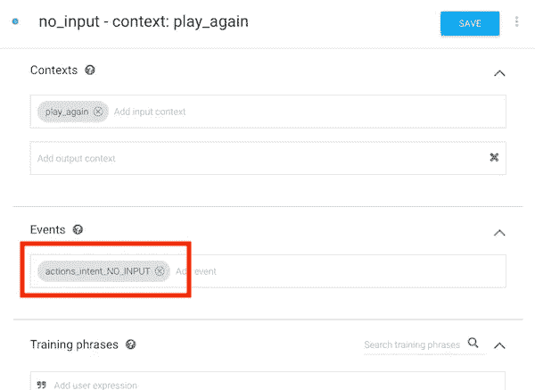

# 升级到 actions-on-google-nodejs 版本 2 的迁移点

> 原文：<https://medium.com/google-developer-experts/migration-points-for-upgrading-to-actions-on-google-nodejs-version-2-4640648ab8b5?source=collection_archive---------5----------------------->

在为 Google Assistant 开发应用时，actions-on-google-nodejs SDK 是一个难以替代的工具。Google 平台和 Dialogflow 上对动作的请求和响应的格式是 JSON。JSON 格式有许多属性。因此，我们很难用手来对待 JSON。actions-on-google-nodejs 是一个 JavaScript SDK，提供了许多便利的特性，我们可以编写必要的代码来轻松处理 Webhook 请求。大多数开发人员将使用这个 SDK。

实际上，当从初始版本(v1)升级到版本 2 (v2)时，如何使用 SDK 已经发生了很大的变化。如果你把你的应用的 SDK 版本改成 v2，你需要彻底地改变代码。

我有三个已经发布的应用程序。最后，我刚刚完成了向 v2 的迁移。我想为迁移提出一些观点。

# 将意向名称工艺路线更改为活动名称工艺路线

在 v1 中，策略是由包含在对话流的意图定义中的“动作名称”来决定您的实现的调用功能。也就是说，像下面的代码:

```
const App = require("actions-on-google").DialogflowApp;
const app = new App({request: req, response: res});const handleWelcome = app => {
  app.ask("Welcome to my app! ...");
};const actionMap = new Map();
actionMap.set("action_welcome", handleWelcome);
app.handleRequest(actionMap);
```

但是，在 v2 中,“动作名称”路由已经停止。然而，(可惜！)，引入了一种新的“意图名”路由机制。例如，像下面这样:

```
const { dialogflow } = require("actions-on-google");
const app = dialogflow({ debug: true });app.intent("Default Welcome Intent", conv => {
  conv.ask("Welcome to my app! ...");
});
```

[对我来说](https://github.com/actions-on-google/actions-on-google-nodejs/issues/108#issuecomment-387321310)的改动很难接受，但 spec 是 v2 中当前的。我把所有的处理函数都改成了`app.intent("...", conv => {...})`。

如果您为一些意图指定了一个动作名，并且您在目前的实现中实现了一个处理函数，那么您可以指定一个数组，该数组将意图名作为`app.intent()`函数的第一个参数，以避免编写重复的代码。

# 回复时更改函数调用

在 v1 中，我们使用`ask`和`tell`函数来响应回复。特别是，可能会有很多反馈说`tell`不直观。

```
// Return a reply
app.ask("...");/// Return a reply and end the conversation
app.tell("...");
```

在 v2 中，`ask`功能保持不变。但是，我们必须使用一个`close`函数来结束对话。此外，我们必须针对作为处理函数参数传递的 conv 对象调用这些函数。

```
app.intent("...", conv => {
  // Return a reply
  conv.ask("...");// Return a reply and end the conversation
  conv.close("...");
});
```

在`ask`功能上，出现另一个如下变化。

# 将静态重新提示更改为动态重新提示

重新提示是当用户在一段时间后没有说话时，从应用程序重新询问用户的功能。在 v1 中，有静态重新提示。用法非常简单。开发者可以创建一个数组，该数组中的消息作为函数的第二个参数重新询问用户。

```
const repromptMessages = [
    "Hello?",
    "Are you here?",
    ...
];app.ask("Please say something.", repromptMessages);
```

不幸的是，这个静态重新提示功能已经停止。也就是说，v2 没有这个特性。使用文件已经在[文件](https://developers.google.com/actions/assistant/reprompts)中删除。相反，我们必须使用[动态重新提示](https://developers.google.com/actions/assistant/reprompts#dynamic_reprompts)。例如，在对话流中，我们必须为重新提示创建一个新的意图。



然后，我们需要添加一个带有`app.intent()`函数的 handler 函数。

# 为异步流程返回一个承诺

在 v1 中，如果在被调用的 handler 函数中执行了某个异步进程，我们可以随时正常调用`app.ask()`，并返回响应。例如，我们可以编写下面的代码。

```
const request = require("request");const welcome = app => {
  request(..., (error, response, body) => {
    ...
    app.ask("...");
  });
};
```

在 v2 中，上面的代码不会正常执行。也就是说，我们将得到如下所示的错误消息。

```
Error: No response has been set. Is this being used in an async call that was not returned as a promise to the intent handler? at DialogflowConversation.response
```

如果我们想在异步通信后响应回复，我们需要返回一个 Promise 对象作为处理函数的结果值。例如，它的代码如下所示:

```
const request = require("request");app.input("welcome", conv => {
  return new Promise((resolve, reject) => {
    ...
    request(..., (error, response, body) => {
      ...
      if (error) {
        ...
        reject(...);
      } else {
        ...
        resolve(...);
      }
  }).then(result => {
    ...
    conv.ask(...);
  }).catch(error => {
    ...
    conv.close(...);
  });
});
```

在我的应用程序中，有外部通信(例如:API 调用)和对数据存储的访问。因此，我重写了所有目标代码，以返回一个 Promise 对象。

# 设置和删除上下文

到目前为止，我们只有`app.setContext()`函数来操作实现的处理函数中的上下文。例如，v1 中操作上下文的代码如下所示:

```
// Set a context (2nd argument is 1 or more）
app.setContext("CONTEXT_FOOBAR", 1);// Delete the context (need to specify 0 as the 2nd argument)
app.setContext("CONTEXT_FOOBAR", 0);
```

在 v2 中，定义了操作上下文的 API。

[类上下文值](https://actions-on-google.github.io/actions-on-google-nodejs/classes/dialogflow.contextvalues.html)

也就是说，操作上下文的代码类似于 v2 中的以下代码:

```
// Set a context
conv.contexts.set("CONTEXT_FOOBAR", 1);// Delete the context
conv.contexts.delete("CONTEXT_FOOBAR");
```

我认为这些 API 从 v1 到 v2 带来了更干净的规范。

# 结论

从 v1 到 v2 的变化，相对较大的结构变化发生了，虽然我只使用了我的应用程序的基本功能。对于使用 v1 助手函数的应用程序，代码可能会有更大的变化(改变为将必要的对象传递给`conv.ask()`函数的形式，而不是函数调用)。

如果你还在用 v1，我觉得还是早点迁移到 v2 比较好，参考上面的。