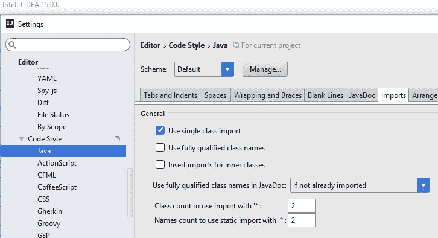

# Min vei til å bli en mer selvsikker utvikler

> 原文：<https://medium.com/compendium/min-vei-til-%C3%A5-bli-en-mer-selvsikker-utvikler-8f6f5c5edf94?source=collection_archive---------3----------------------->

# *Det er høst, og det er dagen hvor jeg skal møte begrepet Clean Code.*

Jeg sitter på jobb og ser på en del av kildekoden jeg jobber med. Der ser jeg litt innsjekket kode som ikke følger kodekonvensjonen jeg er vant til. Kodekonvensjonen jeg *alltid* hadde fulgt for det programmeringsspråket. Det hele handlet om spørsmålet *når skal man bruke *-import fremfor å liste opp alle spesifikke importene i Java* . Dvs. en ganske konkret greie, og noe det burde finnes et klart svar på.

Jeg hadde alltid innstillingene mine i IntelliJ til å tillate 99 importer før den automatisk endret seg til en *-import. Noe som innebar at jeg aldri brukte *-import. Dette var noe jeg hadde gjort på et tidspunkt, og vanen hadde satt seg uten at jeg hadde tatt stilling til om det var riktig eller galt. Det var før jeg denne høstkvelden tok det opp med en kollega og vi begynte å tenke og diskutere.

Jeg på min side hadde ingen gode argumenter for hvorfor ikke bruke *-import, og min kollega på sin side hadde ikke gjort seg opp en mening om temaet. Diskusjonen ble derfor ganske kort og vi kom ikke noen vei. Da kom jeg på en løsning for å finne ut av dette: slå det opp! Ikke på internett, men i en bok. Så turen gikk til biblioteket på kontoret på leten etter boken som kunne inneholde svaret.

Dette var dagen jeg skulle møte boken *Clean Code* av Robert Cecil Martin, bedre kjent som Onkel Bob. Boken er fra 2008, men i den fant vi et svar. Svaret var inntil 2 importer, flere enn det skal bli til *-import. Vi kjøpte argumentene i boken, og ble da enige om at vi gikk for det.

Skjermbilde av innstillingen i IntelliJ

Som utvikler tar man mange valg i løpet av en dag. Valg om hvilken kode man skal skrive, valg om hvor koden man skriver skal ligge, osv. Etter at jeg kom i nevnte situasjon, og leste boken, mener jeg at jeg er blitt en bedre utvikler. Hvorfor lurer du sikkert på.

Jeg er nå overbevist om at jeg er en bedre utvikler siden jeg nå er mer bevisst valgene jeg tar i løpet av arbeidsdagen min. Jeg revurderer ikke alle vanene mine, eller vurderer samme valg på nytt hver gang, men. Det er et men! Jeg revurderer noen av valgene mine, jeg er mer bevisst på at jeg tar valg hele tiden, og ikke minst snakker jeg med andre om deres valg. Når jeg revurderer valg, eller tar nye valg, søker jeg kunnskap fra andre, enten fra bøker, artikler, eller via prat med mine kollegaer, og ved hjelp av det, og min egen kunnskap, kommer jeg fram til en konklusjon jeg har grunnlag for.