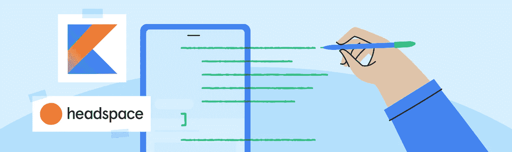

# 专注的架构:Headspace 的规模重构

> 原文：<https://medium.com/androiddevelopers/mindful-architecture-headspaces-refactor-to-scale-7da31df5670e?source=collection_archive---------2----------------------->

## **投资安卓卓越应用**

## 贡献者

*   谷歌开发者营销产品营销经理 Mauricio Vergara
*   Marialaura Garcia，谷歌开发营销副产品营销经理
*   马特·谢尔，[千蚁](https://twitter.com/thousandant)公司的总经理

# 行动纲要

**Headspace** 准备推出新的健康和健身功能，但他们的应用架构还没有准备好。他们花了八个月的时间重构模型-视图-视图模型架构，用 Kotlin 重写，将测试覆盖率从 15%提高到 80%。从 Q2 到 2020 年第四季度，改进的应用体验将 MAU 提高了 15%，评论得分从 3.5 提高到 4.7。要了解 Headspace 对 Android Excellence[的关注如何影响他们的业务，请在此](https://developer.android.com/quality)阅读随附的案例研究[。](https://developer.android.com/stories/apps/headspace-excellence?hl=en)

# 介绍

[Headspace](https://play.google.com/store/apps/details?id=com.getsomeheadspace.android&hl=en&gl=US) 开发了一款帮助数百万人每天冥想的应用程序，已经成长为正念领域的领导者。正念远远超出了冥想，它连接到一个人生活的方方面面。这个想法推动了 Headspace 发展的最新阶段。2019 年，他们决定扩展到冥想之外，并为他们的 Android 应用程序添加新的健身和健康功能。Headspace 意识到，他们需要一个由工程师和设计师组成的跨职能团队来实现新产品愿景，并为用户创造[卓越的应用体验。对公司来说，这是一个激动人心的新阶段:他们的设计团队通过创造新体验的原型和全新的设计开始了这个过程。](https://android-developers.googleblog.com/2021/08/working-towards-android-app-excellence.html)

有了设计在手，唯一阻止 Headspace 扩展应用程序和拓宽用户视野的是他们现有的 Android 软件架构。它的结构不太好，无法支持所有这些新功能。Headspace 的开发团队向他们的领导层证明，在现有代码的基础上进行构建需要比完全重写更长的时间。**在分享了愿景并让每个人都参与进来后，团队开始了集体旅程，编写新的 Android 应用程序，以追求应用程序的卓越**。

# 安卓重写

Headspace 的 Android 开发团队首先需要一种便捷的方式来标准化他们如何构建和实现功能。“在我们编写一行代码之前，我们的团队花了一周时间评估我们应用程序基础的一些重要实现选择，”head space 的 Android 开发人员 Aram Sheroyan 解释道；

> *“这是至关重要的前期工作，所以当我们真正开始构建时，我们都在同一页上。”*

该团队沉浸在谷歌关于 Android 开发和[应用架构](https://developer.android.com/jetpack/guide?gclid=Cj0KCQjw6s2IBhCnARIsAP8RfAj6I4mhRRdSqjYfPlvGET9S6mmRGJrc8Inkc-cCe1IVdTDEvlE3hFEaApHkEALw_wcB&gclsrc=aw.ds)的最新最佳实践的文献中，找到了一个他们都有信心达成一致的解决方案。谷歌推荐使用新的基础架构重构他们的应用程序:[模型-视图-视图-模型](https://developer.android.com/jetpack/guide?gclid=Cj0KCQjw6s2IBhCnARIsAP8RfAj6I4mhRRdSqjYfPlvGET9S6mmRGJrc8Inkc-cCe1IVdTDEvlE3hFEaApHkEALw_wcB&gclsrc=aw.ds)。MVVM 是一种得到广泛支持的软件模式，正逐步成为行业标准，因为它允许开发人员创建清晰的关注点分离，有助于简化应用程序的架构。“它允许我们很好地分离我们的视图逻辑。

以 MVVM 为基础架构，他们确定了 [Android 的 Jetpack](https://developer.android.com/jetpack) 库，包括用于依赖注入的 [Dagger](https://developer.android.com/training/dependency-injection/dagger-android) 和[handle](https://developer.android.com/training/dependency-injection/hilt-android)。新工具使样板代码变得更小、更容易构建，更不用说更可预测、更高效了。结合 MVVM，这些库为他们提供了如何实现新特性的更详细的理解。团队还能够提高在函数间传递参数的质量。该应用程序此前曾因 NullPointerException 错误和不正确的参数而崩溃。采用 safeArgs 库有助于消除传递参数时的错误。

在重写应用程序时，团队进一步确保**遵循存储库模式，以支持更清晰的关注点分离**。例如，他们决定每个存储库的本地数据源应该处理各自的逻辑，而不是用一个巨大的类来保存共享首选项中的数据。这种数据源的分离使团队能够在实时应用程序之外测试和再现业务代码以进行单元测试，而不必更改生产代码。**以这种方式分离关注点使得应用更加稳定，代码更加模块化**。

该团队还抓住机会**将他们的应用程序完全翻译成了** [**Kotlin**](https://developer.android.com/kotlin) **编程语言**，该语言提供了有用的助手函数、密封类和扩展函数。移除遗留代码并用纯 Kotlin 代码替换 Java 和 Kotlin 的混合代码，减少了应用程序的构建时间。新的架构也使得编写测试更加容易，并允许他们将测试覆盖率从大约 15%提高到 80%以上。这导致了更快的部署、更高质量的代码和更少的崩溃。

为了在应用的评论中捕捉新的用户体验，Headspace 实现了 [Google Play 应用内评论 API](https://developer.android.com/guide/playcore/in-app-review) 。新的 API 允许他们鼓励所有用户在应用内分享评论。这一实现将评论分数提高了 24%，而且——因为商店列表评论与 Google Play 上的可见性相关联——有助于吸引人们对该应用程序最近改进的关注。

# 实现卓越应用

重写花了八个月时间，随之而来的是对代码的新信心。现在代码库已经有了 80%以上的单元测试覆盖率，他们可以放心地开发和测试新的特性，而不是担心。**新架构使这一切成为可能，这要归功于其改进的逻辑分离和更可重用的代码，这使得规划和实施新功能变得更加容易**。

应用程序的构建时间显著减少，开发速度加快。**该团队对最佳实践和架构的新认识也减少了新开发人员入职时的摩擦，因为它现在基于 Android 行业标准**。他们可以在面试过程中更清楚地与潜在的候选人交流，因为他们现在有了一个共享的架构语言来讨论问题集和潜在的解决方案。

**随着速度的提高，功能的实施速度加快，留存率提高。**他们现在可以优化他们的追加销售流程，相对于发布该应用的其他平台，Android 付费用户数量增加了 20%。从 Q2 到 2020 年第四季度，新的应用体验和新的应用内评论 API 的实施相结合，使他们的评论得分从 3.5 星提高到 4.7 星！

> **总体而言，新的关注点** [**安卓应用的卓越表现**](https://developer.android.com/quality) **和收视率的提高为全球 MAU 带来了 15%的增长。**

这些仅仅是卓越应用所带来的巨大投资回报的一小部分。他们对质量的高度关注获得了全面的回报，使他们能够继续扩大用户群体，并为应用体验的未来发展奠定坚实的基础。

# **组建自己的团队**

如果你有兴趣让你的团队加入你自己的应用卓越之旅，请点击[链接](https://developer.android.com/stories/apps/headspace-excellence?hl=en)查看我们针对产品负责人和高管的精简案例研究。要了解一致、直观的应用程序用户体验如何促进您的业务发展，请访问 [App Excellence](https://developer.android.com/quality) 登录页面。