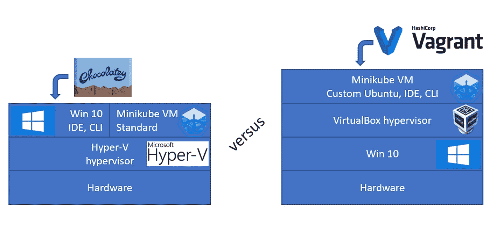
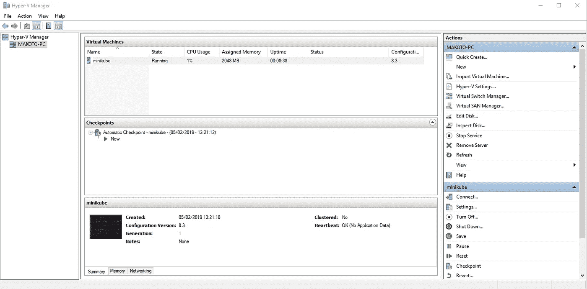
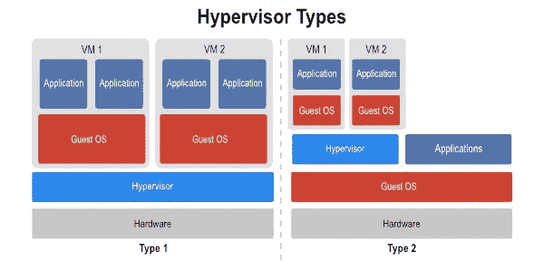
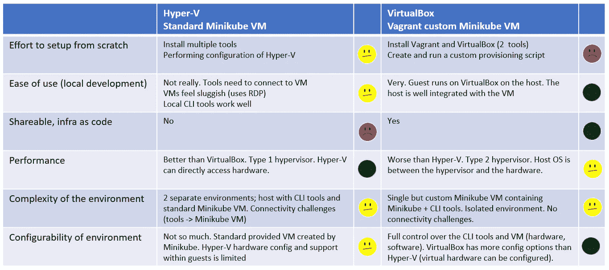

# Windows 上的 Minikube。Hyper-V 与流浪者/VirtualBox

> 原文：<https://medium.com/oracledevs/minikube-on-windows-hyper-v-vs-vagrant-virtualbox-f63e9d7c8240?source=collection_archive---------0----------------------->

Kubernetes 是一个在机器集群上运行和协调容器化应用程序的系统。Minikube 运行单节点 Kubernetes 集群，可以用于本地开发。在这篇博文中，我将根据我们创建的工作室的经验，比较在 Windows 上获得一个可工作的 Minikube 环境的两种不同方法。一个基于使用 vagger 和 VirtualBox(其中创建了一个 Ubuntu 环境),另一个使用 Hyper-V(以及在其上运行的现成的 Minikube Linux 发行版)。请注意，这篇博文中的许多内容都是个人观点。

# 为什么是 Minikube？

起初，我不相信使用 Minikube 会提供足够的环境来学习 Kubernetes。有几个原因让我决定选择 Minikube。

## 库伯内特分布的差异

当你为一个工作室或一个博客准备一些东西时，你的目的是让它适用于尽可能多的人。所提供的知识应该适用于不同的环境。当使用完整的 Kubernetes 发行版或 PaaS 解决方案时，只有一部分知识可以在不同的平台上重用。Minikube 发行版比 Kubernetes 发行版更具可比性(在本地运行或作为 PaaS 提供)。

**Kubernetes 分布差异显著**

我开始查看完整的 Kubernetes 发行版，比如 Canonical 提供的[发行版和 Oracle 提供的](https://www.ubuntu.com/kubernetes/install)[发行版。很快我就发现它们在很多方面有很大的不同，比如虚拟化技术(Ubuntu 的 LXC vs Oracle Linux 的 containerd)和安装程序(Ubuntu 的 invoke、snap、juju，Oracle Linux 的 lavager、shell 脚本)。此外，由此产生的环境在配置和预装内容方面也有所不同。](https://github.com/oracle/vagrant-boxes/tree/master/Kubernetes)

**PaaS Kubernetes 提供商提供不同的体验**

此外，大多数 PaaS 提供商提供不同的体验和工具。通常，PaaS 提供商拥有针对其环境的特定 CLI 工具和特定的 web 界面。大型平台即服务提供商有谷歌(GKE)、Azure (AKS)和亚马逊(EKS)，因此如果你需要专业化，选择其中一个可能是最安全的。Oracle 还有一个 PaaS Kubernetes 解决方案(OKE)。谷歌向 CNCF 捐赠了 Kubernetes，这可能是最先进的实现方式，但我不确定。在大多数云提供商那里，你可以做非托管的 Kubernetes(在 IaaS 上自己做)或者托管的(在 PaaS 上)。同样，选择在很大程度上取决于提供商。

## 资源少，易于安装

由于我的博客帖子的目标受众主要是开发人员，并且开发人员通常在自己的笔记本电脑上进行本地开发，因此安装的便利性和资源的使用非常重要。

# 使用 Hyper-V 在 Windows 上运行 Minikube

使用 Hyper-V 时，不能同时使用 VirtualBox (5.x)运行 VM；您需要做出选择，之后的切换需要重新启动 Windows。这样做的原因是，当 Hyper-V 运行时，Hyper-V 要求提供虚拟化所需的硬件资源，并在其上提供抽象。访问这些资源的唯一方式是通过 Hyper-V 界面。这也是为什么在 Hyper-V 之上运行的 Hyper-V 可以工作，而在 Hyper-V 之上的其他虚拟化技术经常成为问题的原因(除非它们实现了 Hyper-V 接口)。当 VirtualBox 运行时，VirtualBox 要求主机访问所需的资源，而不是 Hyper-V。当 Hyper-V 不在主机下运行时，主机可以提供这种访问。否则，主机(或多或少)只是一个运行在 Hyper-V 上的虚拟机，无法帮助 VirtualBox 满足其要求(类似于“问错了人”)。在 Windows 上开始使用 Minikube 需要使用几个工具和一些配置；

*   需要启用 Hyper-V 并安装 Hyper-V 管理器。Hyper-V 是 Windows 10 的一项现成功能。
*   [巧克力](https://chocolatey.org/)。Chocolatey 是一个用于 Windows 的软件包管理器，它消除了在 Windows 上安装和更新软件所需的手动步骤。Chocolatey 不需要安装 CLI 工具和 Minikube，但可以为您节省大量时间。我也可以推荐给更广泛的应用，而不仅仅是 Docker，Kubernetes，Minikube，Helm 等等。
*   Hyper-V 配置。您需要创建一个链接到网络适配器的虚拟交换机，该网络适配器为 Minikube 或 Docker Desktop Hyper-V 虚拟机获取可访问的 IP。请注意，当您的网络发生变化时(例如有线、无线)，您将需要选择不同的适配器。Hyper-V 有一个关于使用动态内存的错误，你需要禁用它。
*   [Docker 桌面](https://www.docker.com/products/docker-desktop)。Minikube 中运行的软件被打包成 Docker 容器。Minikube 安装创建了一个具有 Docker 注册表的虚拟机。您使用 Docker 将图像发布到注册中心。Docker 桌面包括 Docker 机器，允许您管理 Docker 主机。为了设置 Docker 访问 Minikube Hyper-V 虚拟机所需的环境，您可以使用 Minikube docker-env。
*   [Kubectl](https://kubernetes.io/docs/tasks/tools/install-kubectl/) 。这是 Kubernetes CLI。你会经常用到这个。
*   [当然是 Minikube](https://kubernetes.io/docs/tasks/tools/install-minikube/) 本身。通常也掌舵，但这超出了这篇文章的范围。

# 在 Ubuntu 中的 Minikube 在 VirtualBox 中使用流浪者

这个安装需要你用一个流浪文件来构建你自己的 Ubuntu 安装。对于此设置，您需要:

*   [VirtualBox](https://www.virtualbox.org/wiki/Downloads) 。这提供了虚拟化。
*   [流浪汉](https://www.vagrantup.com/)。这使得创建一个 VirtualBox 虚拟机并对其进行清理变得容易。travel 需要一个 travel file 和配置脚本。获取或编写这些可能看起来是最难的部分，但实际上很容易。你可以在这里和这里找到这样一个流浪档案[的例子。](https://github.com/AMIS-Services/sig-kubernetes/blob/master/SIG01/lab00-setup/InstallationMinikubeViaVagrantWorkShop.docx)

这不需要额外的工具，因为配置脚本将负责创建 Ubuntu VM 并安装所需的 CLI 工具，如 docker、kubectl、minikube。

不能在 VirtualBox 5.x 或更早版本中进行嵌套虚拟化。因此，您需要在 VirtualBox 机器中使用-VM-driver = none 运行 minikube 来启动 Minikube。此外，由于它是一个定制的 VM，您还需要手动启动 minikube 代理，以便为 API 和仪表板提供一致的端点(host:port)。在 VirtualBox 6 中，嵌套虚拟化是可能的，尽管这个特性还很年轻(在这里阅读更多)。这可能允许你在上面运行 VirtualBox，一个 Ubuntu 虚拟机，例如使用 KVM 作为 Minikube 虚拟机。这样，您就不用使用定制的 Minikube 环境，而是使用现成的环境，使环境更易于维护和升级。不过我还没有测试过这个。

这确实意味着 CLI 工具也将存在，并且需要在 VirtualBox 容器中构建 Docker 容器，或者需要使用共享文件夹，以便从 Windows 环境中获取 Docker 映像。您也许能够向主机公开这个环境并使用 Windows CLI 工具，但是我还没有尝试过，也不打算这样做。如果您想使用 Windows CLI 工具，使用 Hyper-V 解决方案会更容易。Docker Desktop 明确声明仅支持 Hyper-V，因此可能会有问题。

# 比较环境

为了比较不同的环境，观察不同的方面是有帮助的。

## 有多简单？

**安装**

Hyper-V 路径需要安装几个工具。一旦这样做了，它不需要太多的维护。VirtualBox/vagger 路径需要较少的工具(更快地启动和运行)，但是它需要为您创建一个环境的配置脚本。自己设置这些脚本可能需要一些时间(比 Hyper-V 环境安装要多)。一旦有了它们，整个环境的重建(Minikube + CLI 工具)就自动完成并被记录下来(基础设施作为代码)。你也可以使用提供的脚本，比如这里的和这里的来保存你的工作。

**环境**

使用 Hyper-V 路径时创建的环境需要本地 CLI 工具来访问 Hyper-V 上运行的 Minikube 虚拟机。Hyper-V 虚拟机和工具是分开的，需要作为两个独立的事物来管理。这些工具需要连接到虚拟机(Hyper-V 虚拟交换机配置),并且主机需要配置以允许这种连接。例如，当您将笔记本电脑的网络从无线改为有线时，这可能会导致问题。虽然这些连接性挑战可能是一种好处，因为当使用完整的 Kubernetes 时，您将需要配置并连接到一个类似的远程实例，并且您已经知道当您必须定期处理它时是如何工作的([频率降低了难度](https://martinfowler.com/bliki/FrequencyReducesDifficulty.html))。一个问题是你要不要定期处理。

当使用 VirtualBox 并拥有该 VirtualBox 中的所有内容时，连接不是问题，因为所有内容都位于同一台机器上；单一环境。此外，使用克隆和快照创建整个环境(工具、配置、运行 Minikube)的备份变得很容易。如果需要，可以快速重建和分发环境(例如，对于一个车间)。在 Hyper-V 上，你只能很容易地在 Minikube 机器上这样做，但是工具需要本地安装。

## CLI 工具位于何处？

**Hyper-V**

这些工具原生安装在 Windows 上。这很有用，因为如果您在 Windows 上使用开发环境，构建 Docker 容器并将其部署到 Kubernetes 可以在同一个环境中完成。工具的管理也是在 Windows 上完成的。使用 Chocolatey 时，这是相当容易的。对于大型开发团队来说，这往往会变成每个人自己的责任，这有一定的风险。在 Windows 上使用原生工具的好处是可以很容易地与安装在 Windows 上的其他工具(如 IDE)集成。

**虚拟人/流浪者**

这些工具安装在 VirtualBox 虚拟机中。如果您在 Windows 上开发，并且想要在 VM 中使用映像，您有两个选择；想办法把 VirtualBox VM 暴露给 Docker Desktop(虽然上面说只支持 Hyper-V)或者完全从 VirtualBox VM 开发。从 VirtualBox VM 进行开发有很多好处，例如环境隔离，并且您可以选择将开发环境作为代码进行管理，从而允许大型开发团队轻松进行更新。缺点是虚拟化环境/操作系统的开销。这种开销在 CPU、内存和磁盘使用中是显而易见的。

## 虚拟化

使用 Hyper-V 时，虚拟机在后台运行，可通过 Hyper-V 管理器进行管理。您可以使用 RDP 连接到它，也可以使用 docker-machine 从 CLI 管理机器。Minikube 在 Hyper-V 虚拟机中运行。

您可以使用 root 用户登录到该虚拟机。它在内部使用 docker-containerd 来运行容器。定制的 Minikube Linux 发行版是通过使用 [Buildroot](https://buildroot.org/) 创建的(尽管你不必在意)。它运行 kube-proxy 和单节点 Kubernetes 集群。Hyper-V 是第 1 类虚拟机管理程序。这意味着它直接在硬件上工作，中间没有操作系统层。主机操作系统也通过 Hyper-V 运行(安装 Hyper-V 实际上是将 Hyper-V 置于主机操作系统和硬件之间)。由于主机操作系统是父分区或根分区，即使主机也通过管理程序访问硬件，主机也不会有太多延迟。由于 Hyper-V 在许多事情上都依赖于根分区，因此对于 Hyper-V 是否真的是 1 型而不是 1+2 型还存在一些争论。

VirtualBox 是第二类管理程序。它依赖于主机操作系统来访问硬件。这意味着它更慢，因为在虚拟机和硬件之间有一个额外的层；主机操作系统。此外，由于它不能直接访问硬件，VirtualBox 需要提供一个由主机操作系统提供给客户的硬件抽象，并为此提供几个驱动程序。例如，您可以为来宾选择不同的网卡。Hyper-V 管理器管理在 Hyper-V 上运行的虚拟机，但不运行它们。为了显示虚拟机，使用了 RDP。VirtualBox 实际上运行虚拟机本身，根据我的经验，与 Hyper-V + Hyper-V manager 相比，VirtualBox 为开发人员提供了更无缝的体验(在主机/来宾和虚拟机管理程序/来宾之间)。使用 VirtualBox，虚拟机可以在主机上运行的 VirtualBox 上运行。借助 Hyper-V，虚拟机运行在主机运行的同一虚拟机管理程序上。

Hyper-V 和 VirtualBox 都提供半虚拟化驱动程序。这些驱动程序允许来宾以优化的方式访问虚拟机管理程序。

# 最后

## 摘要

总结见下表。当然很多东西都是个人观点。你的可能不同！

哪种设置最适合你取决于你的个人喜好。一般来说；如果你喜欢 Windows，就选 Hyper-V/Chocolatey，如果你喜欢 Linux，就选 VirtualBox/vagger。我没怎么用过苹果的产品，所以不能和上面的设置进行比较。我可以想象这将是类似的 Windows 设置。两种设置创建的 Minikube 环境在使用上是相当的。为了增加你的个人经验，从这两方面获得一些经验是很有用的。入门 Kubernetes 或者想在本地发展的时候，我绝对可以推荐 Minikube！当学习 Kubernetes，不要指望它是容易的。掌握它需要一些时间。如上所述，您获得的一些知识可能是特定于平台的，而不是普遍适用的。然而，Kubernetes 的基础是便携式的。

## 可供选择的事物

当然，还有许多值得研究的选择

*   使用 VirtualBox 6 嵌套虚拟化功能
*   使用 Minikube 创建标准的 VirtualBox Minikube 虚拟机。例如，参见[这里的](https://rominirani.com/tutorial-getting-started-with-kubernetes-on-your-windows-laptop-with-minikube-3269b54a226)。这样，您仍然可以使用 Windows CLI 工具，但不必管理自定义虚拟机。你可能会有连接问题工具/虚拟机，但由于 VirtualBox(在我的经验中)更容易配置(你不需要摆弄 Hyper-V 的内存错误，虚拟交换机)，这种设置可能会比 Hyper-V 更容易使用。
*   完全摆脱 Windows(或双引导或虚拟化),转而使用 Ubuntu 或其他开发者友好的发行版。这可能会使 Minikube 的工作变得更容易。您可以对 Minikube 主机使用 KVM，并在本地安装 CLI 工具。Linux 上的 Docker 也比 Windows 上的容易。

*原载于 2019 年 2 月 10 日*[*【javaoraclesoa.blogspot.com】*](https://javaoraclesoa.blogspot.com/2019/02/minikube-on-windows-hyper-v-vs.html)*。*