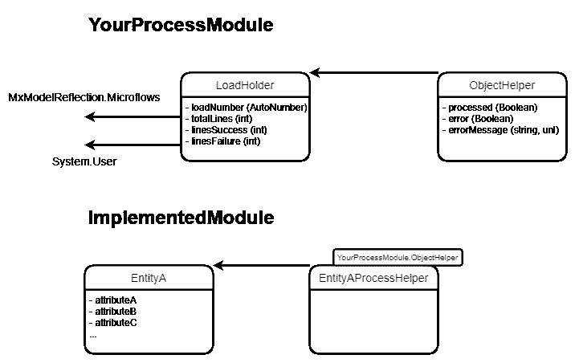

# 降低长时间运行流程的风险

> 原文：<https://medium.com/mendix/mitigating-the-risk-of-long-running-processes-9fcdf1cd04d6?source=collection_archive---------3----------------------->

# 我们都经历过。无论你多么小心谨慎，还是会有一些脏东西渗入到你的数据中，需要清理。或者您可能有一个长时间运行的流程，例如复杂的价格上涨或计算。然而，一个处理不当的小错误可能会导致整个流程回滚(并且会花费大量的处理时间！)

虽然在 Mendix 中有多种方法可以解决这个问题，但是降低整个长时间运行的流程失败风险的一种方法是以基于行(或基于对象)的调度方法运行流程。这可以通过为您的处理器创建一个单独的模块或将其构建到受影响的模块中来实现。如果您正在处理多个项目，这些项目都可以从中受益，那么推荐使用单独的模块方法，因为它有助于确保该功能可以在不同的项目和项目中的模块之间持续重用。本文将使用分离模块方法作为例子。

注意，本文假设您以前使用过 MxModelReflection 和 CommunityCommons 模块。因此，需要这些模块的一些功能可能不会深入讨论。这两个模块都可以在 Mendix 市场上免费获得。

## 为什么要使用预定流程方法？

当少数数据点可能导致错误时，计划流程方法是有益的——无论错误是否是预期的。“捕捉”这些错误可以帮助识别边缘情况数据点，并改进您的处理流程。

这种方法的一些好处包括:

*   *它减少了事务时间(不一定是总的事务时间，而是单个事务的时间，从而减少了可以回滚的项目)*
*   *它可以捕捉错误(取决于你的设置)并以一种有意义的方式显示它们，而无需回滚你之前完成的所有更改*
*   *如果需要，可以暂停加工*
*   *可以创建其他功能，如报告工具*

这种方法的一些缺点包括:

*   *总处理时间增加*
*   *读/写 IOPS 的增加*

[https://www.mendix.com/pricing](https://www.mendix.com/pricing/#pricingTable)

## **它是如何工作的？**

本节高度概括了如何实现计划流程。

使用下面的图片作为参考，**YourProcessModule**——包含处理功能的模块——其核心由两个主要实体组成:**装载器**和**对象助手**。LoadHolder 将包含执行处理所需的相关信息，如用户和微流，以及附加信息，如与之相关的行数。 **ObjectHelper** 将被用作一个**泛化**实体，该实体将充当需要处理的实体和 LoadHolder 之间的链接，并将包含诸如对象是否已经被处理之类的信息。

**ImplementedModule** 将包含要进行处理的实体。在这个场景中，它是 **EntityA** 。在 ImplementModule 中创建了一个新实体，**entityprocesshelper**，它是 **YourProcessModule 的**专门化**。对象助手**。EntityAProcessHelper 将链接到 EntityA，从而完成您要处理的实体和装载固定器之间的引用。

处理器的流程可以总结如下:

1.  按钮或预定事件创建 LoadHolder 和 EntityAProcessHelpers
2.  您的 ProcessModule 中的计划事件检查是否有任何具有未处理的 ObjectHelpers 的 LoadHolders。如果有，它开始使用与 LoadHolder 相关联的微流和用户来处理它。
3.  然后批量处理与装入容器相关联的 ObjectHelpers
4.  所有的处理都是通过使用与 LoadHolder 相关联的微流和一个 Java 动作来完成的，比如在 Mendix 的 CommunityCommons 模块中提供的 executeenverifiedmicrosflowauser 动作。
5.  如果 ObjectHelper 处理成功，它将被标记为已处理。否则，ObjectHelper 被标记为已处理但有错误。注意，对象助手的这种标记需要发生在处理微流中。

## **一些需要考虑的事情**

如前所述，这种方法只是减轻长时间运行的流程和数据修复风险的一种方式，实施这种方法可能会带来一些操作上的好处。然而，正如本叔叔所说，“权力越大，责任越大”。我们遇到的一些问题如下:

*   如果您想要添加暂停处理的功能，请确保在您想要运行流程时没有暂停它！如果你忘记了你的暂停处理，你可能会得到一个很长的提示。
*   使用日志来帮助跟踪您的进程的进展(它也有助于识别无限循环…哎呀…)
*   对于连续的过程(如周期性的、复杂的增加)，使用一种标记，如布尔值，以确保特定的实体不会被选择两次进行处理。您可以在处理中使用验证，但是，使用标记有助于减少不必要的处理
*   将您的处理批次保持在合理的规模。批量太小会导致不必要的开销。批量太大，会降低您的环境。我们发现一个最佳点是大约 500-1000 行。

## 阅读更多

 [## Mx 模型反映-市场指南| Mendix 文档

### Mx 模型反射模块允许您从应用程序中访问有关应用程序的域模型的信息。对于…

docs.mendix.com](https://docs.mendix.com/appstore/modules/model-reflection)  [## 社区公共函数库-市场指南| Mendix 文档

### Community Commons 函数库模块向您的应用程序添加了许多可重用的 Java 方法，这些方法可以被称为…

docs.mendix.com](https://docs.mendix.com/appstore/modules/community-commons-function-library)  [## 预定事件- Studio Pro 9 指南| Mendix 文档

### 通过调度事件，您可以让运行时在特定时刻执行微流。该事件也可以是…

docs.mendix.com](https://docs.mendix.com/refguide/scheduled-events)  [## 极限和偏移| Mendix

### 最近，我遇到了一个问题，我导入到我的应用程序中的数据没有得到更新，尽管我…

www.mendix.com](https://www.mendix.com/blog/limits-and-offsets/) 

*来自发布者-*

*如果你喜欢这篇文章，你可以在我们的* [*媒体页面*](https://medium.com/mendix) *或我们自己的* [*社区博客网站*](https://developers.mendix.com/community-blog/) *找到更多类似的文章。*

*希望入门的创客，可以注册一个* [*免费账号*](https://signup.mendix.com/link/signup/?source=direct) *，通过我们的* [*学苑*](https://academy.mendix.com/link/home) *即时获取学习。*

有兴趣更多地参与我们的社区吗？你可以加入我们的 [*Slack 社区频道*](https://join.slack.com/t/mendixcommunity/shared_invite/zt-hwhwkcxu-~59ywyjqHlUHXmrw5heqpQ) *或者想更多参与的人，看看加入我们的* [*遇见 ups*](https://developers.mendix.com/meetups/#meetupsNearYou) *。*