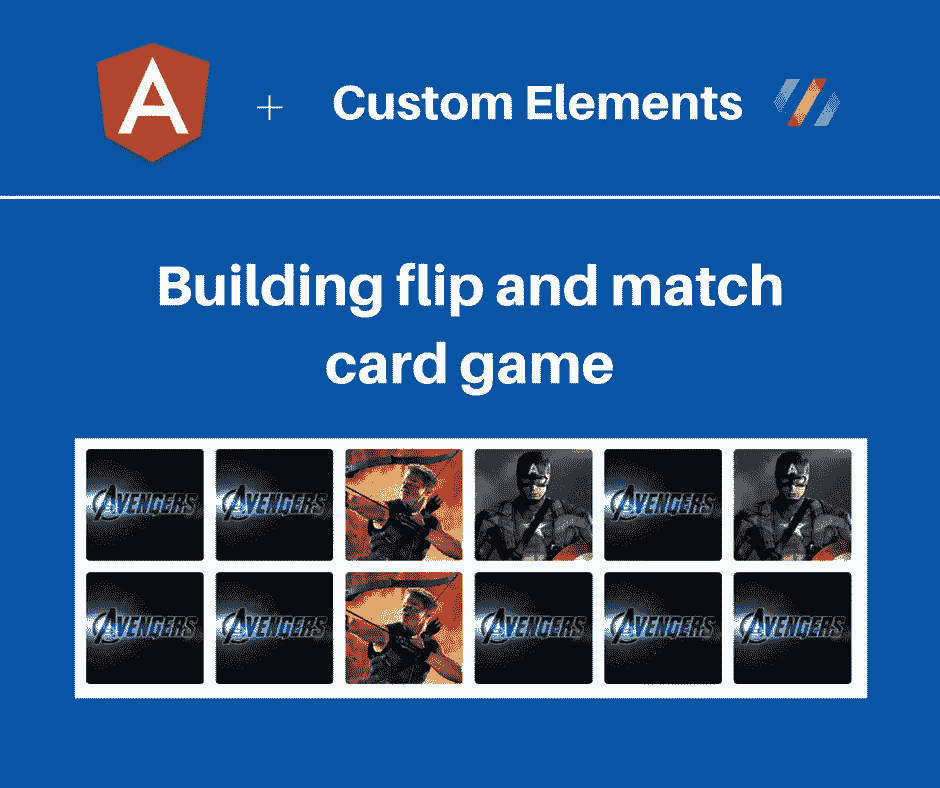
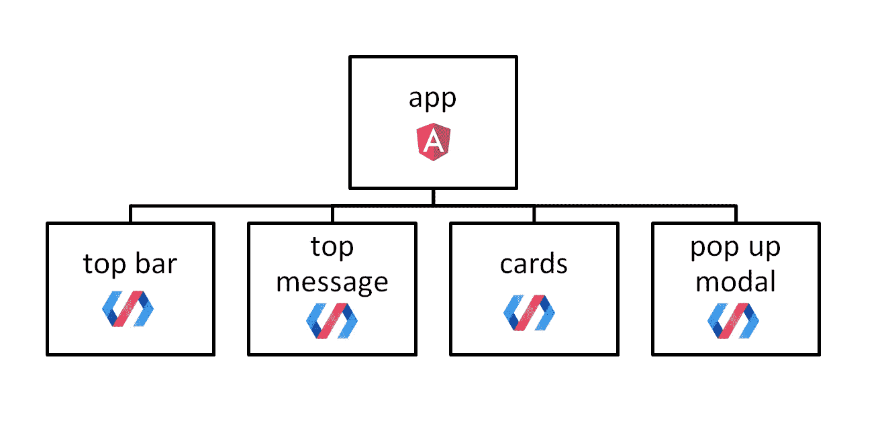
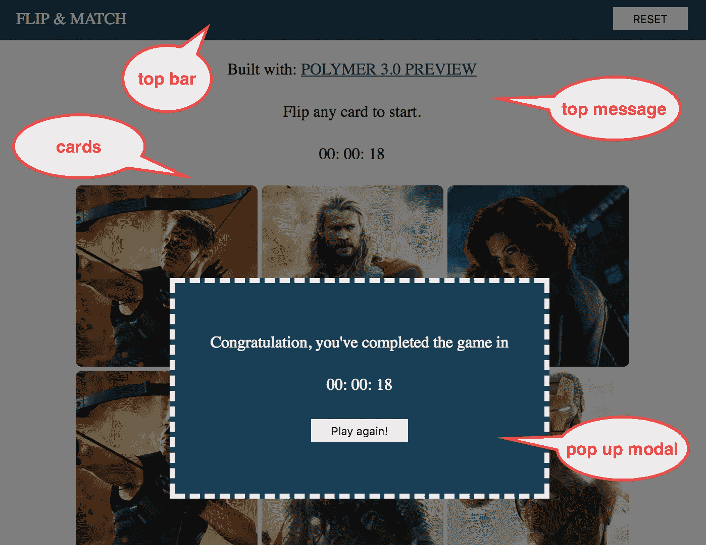
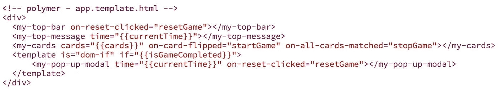
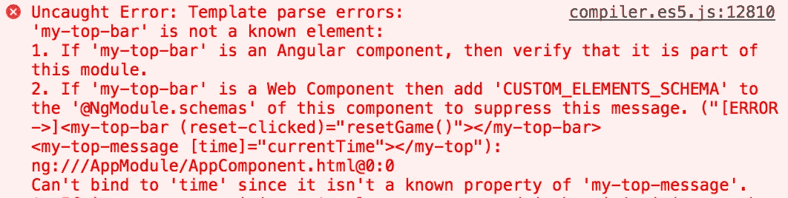
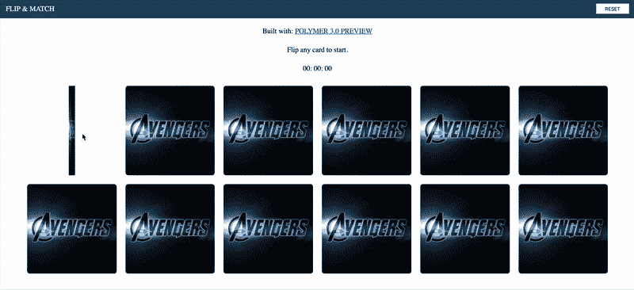

# 混搭:棱角+定制元素(聚合物)

> 原文：<https://medium.com/google-developer-experts/mix-and-match-angular-custom-elements-polymer-1aee0b3d63a1?source=collection_archive---------0----------------------->



在我之前的[post-Polymer 3.0 Preview-Building a mini card game](/@jecelynyeen/polymer-3-0-preview-building-a-mini-card-game-ce8948265fd6)中，我们使用 Polymer 3.0 Preview 为我们的迷你卡牌游戏创建自定义元素。

既然 Angular 与定制元素配合得很好(正如在[https://custom-elements-everywhere.com/](https://custom-elements-everywhere.com/)中提到的，100%测试通过)，让我们试着将它们混合在一起！

我也想借此机会向我的聚合物朋友们介绍牛逼的 Angular。:)

请注意:-

> **自定义元素≠聚合物**

自定义元素是 web 组件规范的一部分，它是一种创建您自己的自定义 HTML 的功能。它现在是，将来也会是浏览器的一部分。Polymer 是简化定制元素构建的工具之一。还有许多其他方式来编写自定义元素。更多解释在这里:[https://developer . Mozilla . org/en-US/docs/Web/Web _ Components/Custom _ Elements](https://developer.mozilla.org/en-US/docs/Web/Web_Components/Custom_Elements)。

以下是以下内容的链接:

*   演示:[https://ng-poly-game.netlify.com/](https://ng-poly-game.netlify.com/)
*   源代码:[https://github.com/chybie/ng-polymer-game](https://github.com/chybie/ng-polymer-game)

# 组件结构

让我们看看我们的组件结构:



我们将在 Angular 中创建一个新的`app component`，同时重用我们在之前的[帖子](/@jecelynyeen/polymer-3-0-preview-building-a-mini-card-game-ce8948265fd6)中用 Polymer 3.0 预览版创建的其他 4 个自定义元素(`my-top-bar`、`my-top-message`、`my-cards`、`my-pop-up-modal`)。

这是我们组件的概述。



# 设置项目

在 Angular 中设置项目就像 ABC 一样简单。

A.全局安装 CLI

```
// npm
npm install @angular/cli -g// or yarn
yarn global add @angular/cli
```

B.使用 CLI 创建新项目

```
ng new <your-project-name>
```

C.启动项目，在 [http://localhost:4200](http://localhost:4200) 看直播。

```
// npm
npm start// or yarn
yarn start
```

是的，就这么简单。Angular CLI 会为您完成所有的杂七杂八的任务(当然，找出并了解它到底做了什么总是好的，这样您会更加感激)。它类似于聚合物 CLI。爱所有的 CLI！❤

# 包括自定义元素

包含定制元素就像包含一个 Javascript 文件一样简单。

1.  创建一个`scripts`文件夹
2.  将我们的[自定义元素文件](https://github.com/chybie/ng-polymer-game/blob/master/src/scripts/my-custom-elements.js)包含在`scripts`文件夹中。

这个文件是从哪里来的？它来自我们之前的[帖子](/@jecelynyeen/polymer-3-0-preview-building-a-mini-card-game-ce8948265fd6)，是你运行`yarn run build`命令时生成的 JS 文件(在`dist folder`中，我们把它从`app.<random-hash>.js`重命名为`my-custom-elements.js`)。

*在实际生产环境中，应该将其部署为 npm 模块，并相应地使用`npm install`。

3.与上一篇[文章](/@jecelynyeen/polymer-3-0-preview-building-a-mini-card-game-ce8948265fd6)相同，您需要 polyfills，因为并非所有浏览器都完全支持自定义元素。我们将使用`webcomponents-loader.js`。安装此软件包:

```
// with npm
npm install @webcomponents/webcomponentsjs --save// or yarn
yarn add @webcomponents/webcomponentsjs
```

4.现在，我们的项目中有这两个文件。我们需要将这两个文件作为构建的一部分。有几种方法可以做到这一点。在 Angular 中，最快的方法是将这些文件路径包含在`.angular-cli.json`文件中，其`assets`属性如下:

```
"assets": [ "...", { 
    "glob": "webcomponents-loader.js", 
    "input": "../node_modules/@webcomponents/webcomponentsjs",     
    "output": "./scripts/" 
  },{ 
    "glob": "my-custom-elements.js", 
    "input": "./scripts", "output": "./scripts/" 
  }]
```

使用上面的代码行，Angular 将挑选这些文件，并在构建后输出到`scripts`文件夹。

5.将它们载入我们的`index.html`。添加这两行:

```
<!-- index.html --><script src="scripts/webcomponents-loader.js"></script><script src="scripts/my-custom-elements.js"></script>
```

酷，我们现在可以使用这些自定义元素了。让我们来看看我们的应用组件。

*但是，在生产中，应该创建一个文件(例如`vendor.ts`)来导入所有自定义元素，而不是将其包含在脚本标签中。

# 应用程序组件模板

来看看我们的`app.component.html`。代码如下:

与之前[帖子](/@jecelynyeen/polymer-3-0-preview-building-a-mini-card-game-ce8948265fd6)中的聚合物模板相比:



Polymer’s app template

没有很大的不同，对吗？

上面的 4 个 HTML 标签都是我们之前用 Polymer 创建的定制元素。让我们来思考一些重要的注意事项(特别是如果你来自聚合物)。

1.  在 Angular 中，我们称自定义元素为**组件**，因此，你会看到我将术语“自定义元素”和“组件”互换使用。
2.  在 Polymer 中，模板中的自定义事件必须以 **on-*** 开始。Angular 就不是这样了。例如，在聚合物中，我们将`reset-clicked`处理为`on-reset-clicked`。在 Angular 中，我们可以直接将它与`reset-clicked`绑定。我们使用括号进行角度事件绑定，例如`(reset-clicked)`。
3.  在聚合物事件处理程序中必须只有函数名，没有括号(如`resetGame`)。在 Angular 中，情况正好相反。必须是`resetGame()`。
4.  对于属性绑定，角度用户`[]`。例如，我们通过使用`[time]="currentTime"`将顶部消息组件的`time`(在 Angular 中我们称之为‘input ’)绑定到`currentTime`变量。
5.  条件语句在 Angular 中看起来更简单。看弹出的情态，有棱角的用`*ngIf`。你可能会觉得这里的`*`很奇怪。请允许我在这里进一步解释一下:

在 Polymer 中，你将需要为条件语句编写这样的长代码:

```
<template is="dom-if" if="...">
  <my-pop-up-modal ...></my-pop-up-modal>  
</template>
```

你绝对可以用 Angular 写类似的东西:

```
<ng-template [ngIf]="...">   
   <my-pop-up-modal ...></my-pop-up-modal>
</ng-template>
```

请放心，上面的语法是一个有效的角度条件语法，将完全按照预期工作。

然而，更好的是，Angular 给了你一个快捷方式`*ngIf`，它是一个`syntactic sugar`，所以你可以用不太复杂的语法达到同样的结果。

```
<my-pop-up-modal *ngIf="..."></my-pop-up-modal>
```

是不是很酷？Angular 在这里对*语法[提供了相当详细的解释。看看这个。](https://angular.io/guide/structural-directives#the-asterisk--prefix)

# 应用程序组件 TS

接下来，看看我们的组件代码:

代码逻辑和我之前帖子里的`app component`一模一样。只是复制粘贴过来。这里需要注意一些事情:

## 组件类

在 Polymer 中，`custom element`必须是一个类。我们通过扩展`PolymerElement`类来创建一个新元素。

在 Angular 中，一个组件也是一个类。但是，不需要从任何基类扩展，只需使用`@Component` class decorator 将其标记为 Angular component 即可。

*装饰工目前处于第二阶段 TC39[https://tc39.github.io/proposal-decorators/](https://tc39.github.io/proposal-decorators/)

## 模板、样式和名称

当在 Polymer 中定义模板时，你需要覆盖`template` getter，css 也存在于 template 中。自定义元素名称必须在**烤串盒**中。一个通过覆盖`is` getter 或者在`customElements.define`过程中赋值元素的名字。

在 Angular 中，模板可以是内嵌文件，也可以是外部文件。可以通过在`@Component`类装饰器、`template`或`templateUrl`属性中配置元数据对象来实现。在我们的例子中，我们使用外部模板。

Angular 中的组件名称可以是烤串盒`my-component`或骆驼盒`myComponent`。我们在元数据`selector`属性中定义名称。

角度组件中的样式既可以内嵌完成，也可以通过外部文件完成。您可以使用`styleUrls`和`styles`元数据属性进行配置。由于我们使用的是 Angular CLI，因此开箱即可支持 SCSS 和更少版本。

Angular CLI 还提供了一种通过运行`ng generate component <your-component-name>`来生成新组件简单方法。非常方便。

## 生命周期挂钩

聚合物有生命周期挂钩，Angular 也是。与聚合物最接近的生命周期`ready`是角形`ngOnInit`。点击阅读角度生命周期事件的完整列表[。](https://angular.io/guide/lifecycle-hooks)

很好。我们快到了。离开了最后一步。

# 允许自定义元素

现在刷新您的页面，您应该会看到一个空白页。看看控制台，你会得到一长串错误:



为什么？这是因为:

1.  `my-top-bar`不是角度组件，没有为其创建`@Component`类。
2.  然而，`my-top-bar`是我们拥有的一个定制元素。Angular 不知道这件事。因此，我们需要告诉 Angular“嘿，没关系，我知道我在做什么，我有一些您不知道的自定义元素，请停止向我抛出错误”)

打开您的`app.module.ts`文件，添加以下几行:

更多关于图式的解释在这里:[https://angular.io/api/core/NgModule#schemas](https://angular.io/api/core/NgModule#schemas)

# 玩吧！

太好了。再次刷新你的浏览器，一切都会变得很好。



就是这样。编码快乐！

以下是以下内容的链接:

*   演示:[https://ng-poly-game.netlify.com/](https://ng-poly-game.netlify.com/)
*   源代码:【https://github.com/chybie/ng-polymer-game 