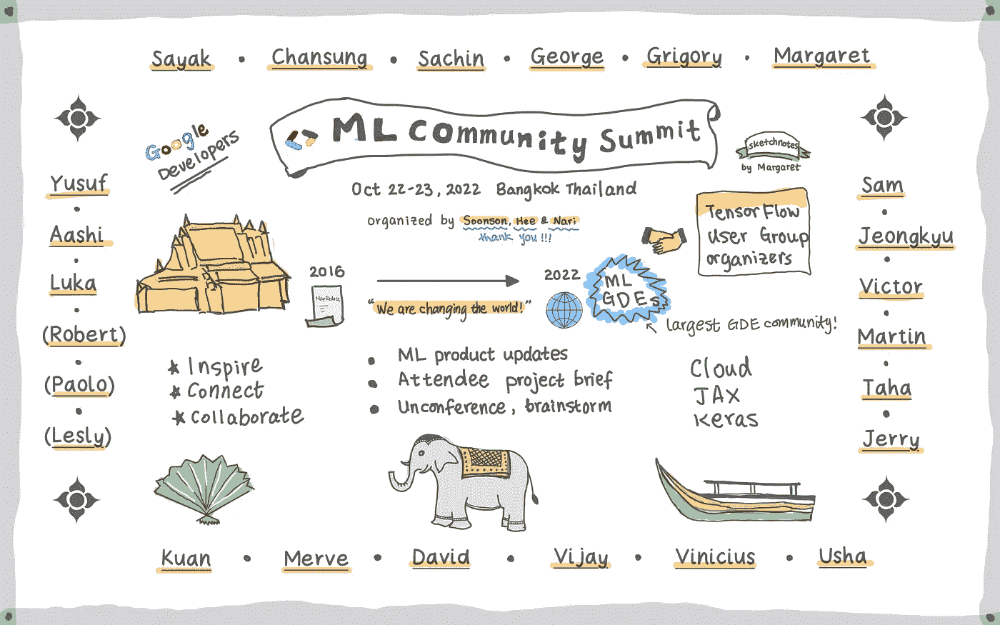
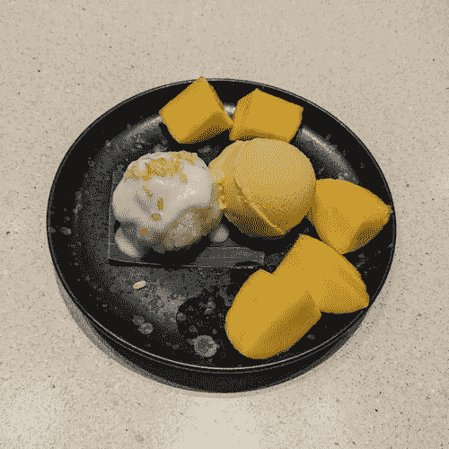
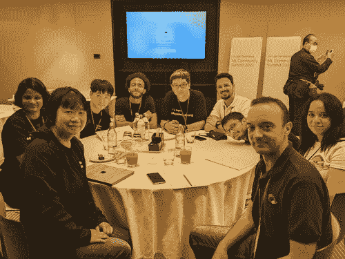
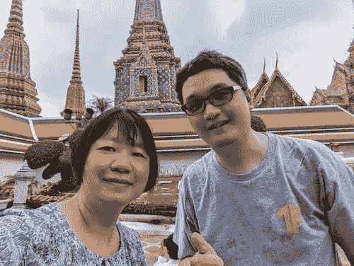

# ML 社区峰会 2022

> 原文：<https://medium.com/google-developer-experts/ml-community-summit-2022-4567dc63de71?source=collection_archive---------0----------------------->

## 鼓舞人心的经历

刚从 **Google 开发者 ML 社区峰会 2022** 回来。这是由来自谷歌全球 ML 开发者项目的[**soon son Kwon**](https://twitter.com/ksoonson)**和他的团队**[**Hee Jung**](https://twitter.com/heeya_ML)和 **Nari Yoon** 组织的一次盛会。我很荣幸被邀请到顶级 ML GDEs 和 TensorFlow Group 组织者中参加峰会。****

****在泰国曼谷的一次为期两天的活动中，我终于见到了与我合作多年但从未见过面的 ML GDEs。从屋顶晚餐到游船，我们有很多美好的回忆，这是一次很棒的亲密体验。我写了这个帖子来分享我的故事。****

********

****Image by author****

# ****第 0 天****

****下午，我和来自印度的曼梯·GDE 一起出去玩。这是我们多年来在多个项目上合作后第一次见面。我们去了芒果探戈，吃了最好吃的芒果糯米冰淇淋，一种很受欢迎的泰国甜点。****

********

****Mango sticky rice, image by author****

****我们中一些早到的人参加了晚上的峰会前晚宴。****

****Group dinner at Summit, image by author****

****晚饭后我们一起拍了一张集体照，这是峰会上许多集体照中的第一张。****

****Group photo of summit, image by Soonson Kwon****

# ****第一天****

****吃早餐时，我从抱抱脸遇见了曼梯·GDE[**默夫·诺扬**](https://twitter.com/mervenoyann) 。****

****Margaret & Merve, image by author****

****在峰会注册时，曼梯·GDE 的乔治·索罗斯给了我一份可爱的惊喜礼物，是他 10 岁的女儿克里斯蒂娜送的。她听说了峰会的事，给我画了一幅肖像让她爸爸带去。收到一份从希腊远道而来的礼物，我觉得很特别！****

****George gave Margaret a surprise gift, image by author****

****Sayak，乔治和我一起拍照。2020 年，我们合作的一个项目获得了[# TF community spot light award](https://twitter.com/TensorFlow/status/1351590466068783105)，现在我们终于见面了。****

****George, Margaret & Sayka, image by author****

****会议开始了。Soonson 在分享 ML 社区令人印象深刻的统计数据时给了我们一个程序更新。他还和我们分享了 ML GDEs 是如何开始的，并发展成为今天最大的 GDE 社区的历史！****

****Soonson Kwon presenting at the summit, image by author****

****我们每个人都得到了一份杰夫·迪安签名的 MapReduce 文件作为纪念品！****

****在云、JAX 和 TPU 的项目更新后，每个与会者(ML GDEs 和 TF 用户组组织者)做了 5 分钟的简报。听到每个人分享他们开源项目的成就和未来的想法真的很棒。****

****Victor Dibia presenting at the Summit, image by author****

****项目简报结束后，我们分成小组就各种 ML 产品进行头脑风暴。****

********

****Summit photo, image by author****

****在我做了自我介绍后，她告诉我她毕业于帕森斯设计学院，我目前在那里学习 3D 虚拟服装设计。****

****晚上我们一起坐车去吃饭。在公交车上，我喜欢和来自新加坡的 [**山姆·维特芬**](https://twitter.com/Sam_Witteveen) 以及来自湾区的 [**维克多·迪比娅**](https://twitter.com/vykthur) 聊天。我们聊了聊小工具、相机、视频录制、3D 建模和 JavaScript。山姆向我展示了他的数字人类产品，非常迷人。维克托和我以前见过面，在这次峰会期间，我们有机会更好地了解彼此。****

****我们吃了一顿可以看到曼谷河景的屋顶晚餐。沿河两岸的寺庙被美丽的橙色照亮了。****

****Roof top dinner group photo, image by author****

# ****第二天****

****我，Sayak 和 Merve 在寺庙里闲逛。****

****Margaret, Merve and Sayak, image by author****

****在旅游车上，我和来自台湾的曼梯·GDE·吴奇隆聊天。这是他第一次参加来自世界各地的与会者参加的社区会议。所以这对他来说是全新的。****

********

****Margaret and Jerry, image by author****

****我喜欢和杰瑞、默夫、马丁、萨克、萨姆和维克多一起乘船游览。当我们穿过河边的泰国房子时，非常平静，当地人和小孩向我们挥手打招呼。****

****Boat cruise, image by author****

****晚餐时，我和来自朝鲜的 GDE 特工朴成星取得了联系。我们聊了很多事情:从如何成功举办 GDG 活动到未来的 ML 项目合作想法。当他给我看他的 facebook 个人资料背景时，我非常感动，上面有我去年为 [TensorFlow 贡献者奖](http://goo.gle/3D3HP38)做的 [sketchnotes。](https://twitter.com/mervenoyann/status/1465379494156541952?s=20&t=A_WbtKQhHwBqcaF2DrW-AQ)****

****Margaret, Merve, George, Chansung and Sayak, image by author****

****晚上，[**Usha Rengaraju**](https://twitter.com/URengaraju)把我放错地方的电源板还给了我，我们终于有机会一对一的联系了。她非常热衷于使用 ML 来帮助自闭症患者，我们聊了聊成为 ML 社区的一员。****

****Margaret and Usha, image by author****

****感谢松森，熙和纳里组织了这样一个伟大的社区活动。我非常喜欢与 ML GDEs 和 TensorFlow 用户组组织者联系。多么鼓舞人心的亲密经历啊！****