# MLOps:GCP 的大图景

> 原文：<https://medium.com/google-developer-experts/mlops-big-picture-in-gcp-a637566d6ae8?source=collection_archive---------1----------------------->

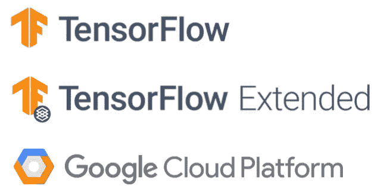

自著名理论家、实践家等以来，Twitter 已经成为各类人获取最新消息的最重要平台。在你的兴趣是不断张贴他们所发现的，建立的，和更多。

我相信我不是唯一一个每当遇到有趣的推文就转发的人。我告诉自己“好吧，这看起来很有趣，但是我现在不打算读它。让我把它放到我的 feed 里，这样我以后就可以阅读它了..”。但这从未发生过。

我已经决定构建一个小应用程序，每周推送包含所有转发推文的时事通讯。然而，如果我只是发送它们而不进行任何预处理，这与在 Twitter 应用程序中滚动没有任何区别。这就是机器学习可以通过以一种有意义的方式对推文进行分类来发挥巨大作用的地方。

# 概观

这个项目的名字是“个性化/策划的简讯服务”，但我不打算在这篇博文中做深入的解释。相反，我将提供一个关于什么是 MLOps(机器学习操作)以及如何在 GCP(谷歌云平台)环境中实现它的大图。

这篇博文将简要介绍以下组件。深入的解释有望在未来通过专门的额外博客文章发布。

*   **GCP Kubernetes 引擎:**管理底层硬件资源，并将适当的资源分配给适当的作业。
*   **GCP AI 平台(流水线):**通过保证某些作业应该在 Kubernetes 环境中预先运行来管理机器学习作业依赖性。
*   **tensor flow Extended(TFX/m lops):**一个高级框架，为 AI 平台管道和 Kubernetes 提供了一种便捷的编写作业规范的方式。
*   **GCP 人工智能平台(培训):**大规模分布式培训服务，具有高度灵活的可配置性。
*   **GCP AI 平台(预测):**具有统一端点和模型版本控制的可扩展模型服务。
*   **GCP 云存储:**一个文件系统服务，可以保存机器学习常用的文件(CSV、Parquet、TFRecord、…)
*   **GCP 云函数:**基于事件触发的一组逻辑。你可以监听云存储中数据的变化，并为新收集的数据触发运行机器学习管道。
*   **GCP 云构建/ GitHub 动作:**为新集成/合并的代码库提供单元测试和部署服务。机器学习流水线可以在新代码上运行，用于不同的数据预处理或建模。

这些组件可以组合在一起，为我的玩具项目构建一个完整的架构。这有点像图 1。如果你不明白每个组件是做什么的，你也不需要担心。我将对每一个进行简短的描述，你可以在读完这篇博文后回来检查它是否有意义。

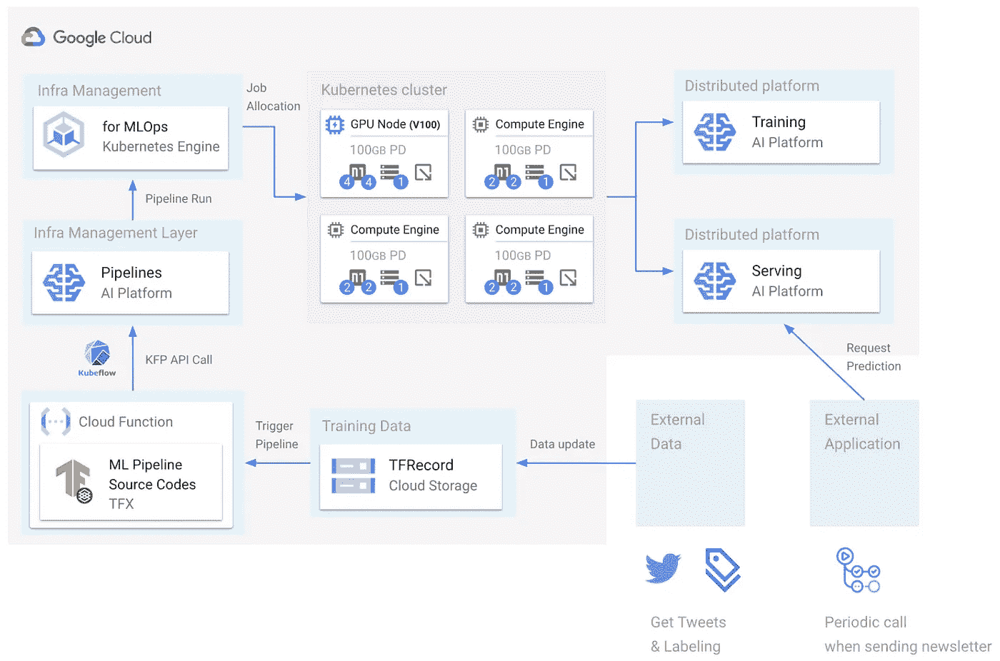

Fig1\. Overall Architecture

如果你只考虑应用程序部分,“策划简讯服务”听起来很容易，因为它只是简单地查询公共 API。然而，想象你是一个正在构建自己的 API 的人，并且 API 是建立在机器学习的能力之上的。

# 我们为什么需要机器学习操作？

这可以通过另一个问题更好地理解，“为什么我们需要为机器学习项目考虑不同的 CI/CD 管道？”

我相信这个问题最简单的答案就是“因为不管你愿不愿意，数据都会随着时间而改变”。事实上，我们不是主要的代理人，而是环境，环境会对数据进行更改，我们无法阻止这些更改的发生。所以我们总是要为这种情况做好准备是有道理的。否则，我们会因为缺乏责任感而受到批评。

作为开发人员，当数据发生变化时，我们必须处理两种常见的场景(假设我已经收集了全新的数据，并对它们进行了适当的标记)。

*   当前部署的模型相应地重新学习改变的数据。在这种情况下，系统监听数据改变事件，并运行整个机器学习流水线。
*   当前部署的模型无法达到预期的准确性，因此我们需要一个具有适当数据预处理的新模型。一个新的模型意味着代码基础已经改变。在这种情况下，系统应该对新的代码库进行单元测试，听取代码集成，并运行整个机器学习管道。

# 为什么是 GCP，为什么是云？

整个机器学习管道由多个组件组成。图 2 是在一篇流行的论文“[机器学习系统中隐藏的技术债务](https://papers.nips.cc/paper/2015/file/86df7dcfd896fcaf2674f757a2463eba-Paper.pdf)中介绍的，以强调建模只是整个管道的一小部分。

我不同意“ML 代码”的框的大小。在我看来，模特是一项艰苦的工作，我不认为有什么比其他的更重要。我只是想从一个角度来看图 2，当我们计划推出机器学习驱动的产品时，我们必须考虑多个部分。

问题是我们必须把几个部分联系在一起。如果你曾经经历过将不同的软件组件集成到一个完整的系统中，你可能知道这有多难。尤其是，构建基础架构非常困难，因为数据科学家或工程师通常不熟悉硬件、软件、操作系统等方面的高深知识。

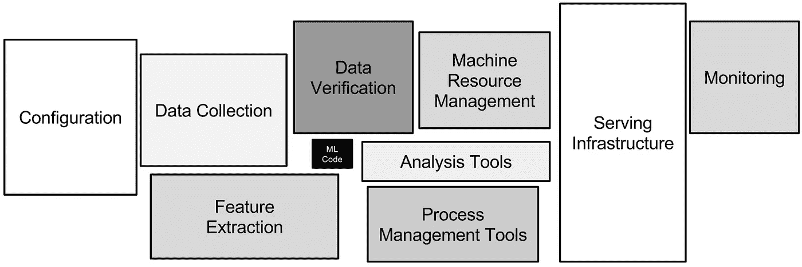

Fig2\. Components Consisting of Machine Learning as a Product

然而，基础设施同时也非常重要，因为一切都应该规模化运行。例如，当您拥有更多数据时，应该使用更多高性能 CPU 和高容量 ram。随着机器学习世界中最先进的(SOTA)模型越来越大，模型训练系统应该能够相应地扩展。您无法预测服务的用户数量何时会激增，因此服务系统也应该能够相应地扩展。

一次做好这些事情并不容易，即使你是一个开源天才。你必须花费大量的时间来建立这样的系统，而且必须不断地对其进行监控。在我看来，最好的选择是利用公共云服务，并在必要时(当您认为自己准备就绪时)逐渐从云环境迁移到本地环境。

就像其他云平台一样，你可以将谷歌云平台(GCP)视为你的机器学习产品的一体化解决方案。你仍然需要挂钩 GCP 提供的不同服务，但这要容易得多，因为它们都在同一个平台上。此外，它们不是开源项目，这意味着它们的大部分功能已被证明适用于大多数情况。

我选择使用 GCP，不是因为我是机器学习谷歌开发专家(ML GDE)，而是因为 GCP 是使用 TensorFlow、TensorFlow Extended 和谷歌发布的其他框架的最佳环境。在我看来，PyTorch 是建模的一个很好的选择，但是生态系统还没有成熟到支持 MLOps。

# 各 GCP 服务机构在 MLOps 中的作用

在本节中，我将采用自下而上的方法简要概述构成整个 MLOps 系统的每个 GCP 服务(如从基础设施到更高级别的服务)。深入的解释和动手实践将在以后的独立博文中涉及。

## 谷歌 Kubernetes 引擎

谷歌 Kubernetes 引擎(GKE)是一个完全托管在 GCP 的 Kubernetes。在这里，“全面管理”意味着您关心它是什么，而不是它在幕后如何工作。GKE 做的很简单。它通过将底层硬件资源分组到所谓的“节点池”中来管理它们。然后，GKE 挑选适合所请求作业的节点。例如，一个请求可能类似于“我需要一个 GPU”或“我需要一个超过 10G RAM 的节点”。

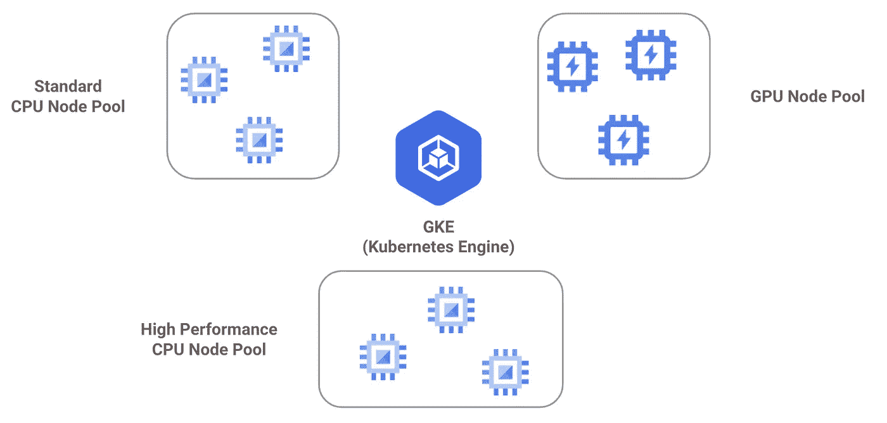

Fig3\. Google Kubernetes Engine

在原生 GKE 或 Kubernetes 环境中，您应该编写由元数据、标签、docker 图像、策略等组成的详细规范。全靠你自己。不过不要担心。当 GKE 与 TFX 和人工智能平台管道服务结合时，您不需要自己处理非常具体的请求和资源分配规则，我们将很快讨论这些内容。你可以把它们想象成一个高级包装器，以一种对机器学习特定管道有意义的方式来控制 GKE。

## AI 平台管道

如你所知，构成整个机器学习管道的作业依赖于其他作业。这意味着某些工作必须在下一个工作之前完成。比如在进行数据预处理之前先注入数据，在模型训练之前进行数据预处理等等。

一般来说，GKE 不关心顺序依赖。它只是出租可用资源来执行任何给定的作业。此外，在 GKE 上运行的作业是无状态的，这意味着应用程序本身不存储任何永久信息，因此管理附加存储以保存永久信息是程序员的职责。此外，附加存储对于机器学习管道是不够的，因为信息应该在不同的作业之间共享。

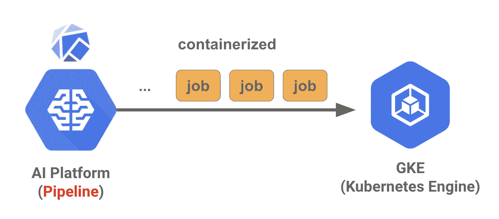

Fig4\. AI Platform (Pipeline)

Kubeflow 是这种复杂的依赖管理的拯救者。顾名思义，它管理给定作业的流程。您编写一些不同的代码部分，指定作业之间的依赖关系，然后 Kubeflow 将每个作业包装在一个容器中，并将它们传递给 GKE。信息共享在内部处理。

然而，Kubeflow 本身很难管理。我想整个团队或者至少一个人应该有一个专门的角色来安装、管理和监控它。幸运的是，GCP 还提供了 Kubeflow 的完全管理版本，这就是 AI 平台管道。有了 AI 平台管道，你不再需要关心这些麻烦。

## AI 平台笔记本

人工智能平台笔记本只是一个位于 GCP 的 Jupyter 实验室。关于人工智能平台笔记本，我唯一想提的是它可以很容易地与人工智能平台管道连接起来。这意味着你可以很容易地为 AI 平台管道编写代码，因为 notebook 是一个很好的交互环境。

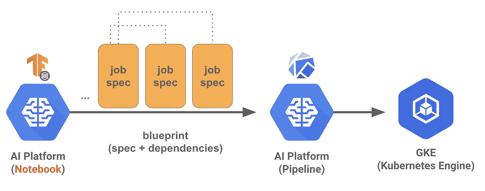

Fig5\. AI Platform (Notebook)

但是，你几乎肯定不想自己为 AI 平台管道写代码，因为你应该对 AI 平台管道的内部运行时环境有深刻的理解。你当然想越来越深，你可能最终要掌握库巴流。但是，如果你真正关心的是建立整个管道，然后在以后检查细节(就像你现在不顾一切地推出一个产品)，你就不会想在这上面花太多时间。

TensorFlow eXtended(TFX)是救星 TFX 只是一种定义工作规范的包装框架，可以很容易地扔给 AI 平台管道。这就像让你只关注你的业务逻辑，而把内部细节放在一边。

## 张量流扩展(TFX)

顾名思义，TFX 是 TensorFlow 的扩展。TensorFlow 是机器学习和深度学习的建模框架，与生产环境处理无关。TFX 与 TensorFlow 一起提供了许多插件，以使用 TensorFlow 编写的模型可以投入生产。

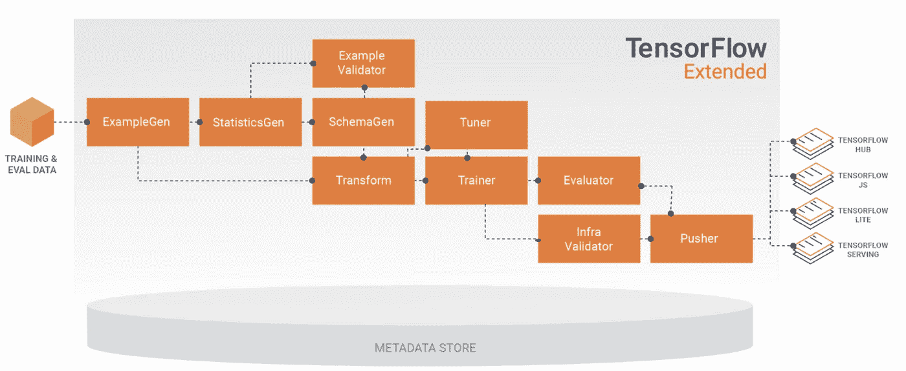

Fig6\. TensorFlow Extended

图 6 显示了标准 TFX 组件列表。举几个简单的例子，让我在下面列出其中的一些。

*   **ExampleGen:** 负责处理数据注入。数据可以来自本地文件系统(有各种格式，比如 Parquet、CSV、TFRecord 等等)、BigQuery、Google 云存储等等。
*   **转换:**建立一个数据转换图，该图稍后将被附加到模型图上。它可以让你避免训练/发球偏斜的问题。您可以简单地将 TensorFlow 库与 TensorFlow 变换(TFT)库一起使用。
*   **培训师:**就是定义和培训模型。在 TFX 的早期版本中，只允许基于 tf.estimator 的模型。然而，你也可以只写基于 tf.keras 的模型，这应该是你非常熟悉的。此外，您可以轻松地将该组件与 AI 平台培训服务相结合，以进行分布式模型培训。
*   **推送器:**是将被祝福的模特推到指定位置。这里的“被祝福”指的是通过给定的指标评估并与最新的模型进行比较而得到的最好的一个。此外，您可以轻松地将该组件与 AI 平台预测服务结合起来，如果这样做，您将成为一个模型版本管理系统和为模型服务的端点，只需少量的努力。

## 管道的首次启动

实际上，您不需要在笔记本环境中运行 TFX 管道。但是，如果是项目的初始阶段，建议这样做，因为您必须与 TFX、云服务、云环境进行大量的交互实验。

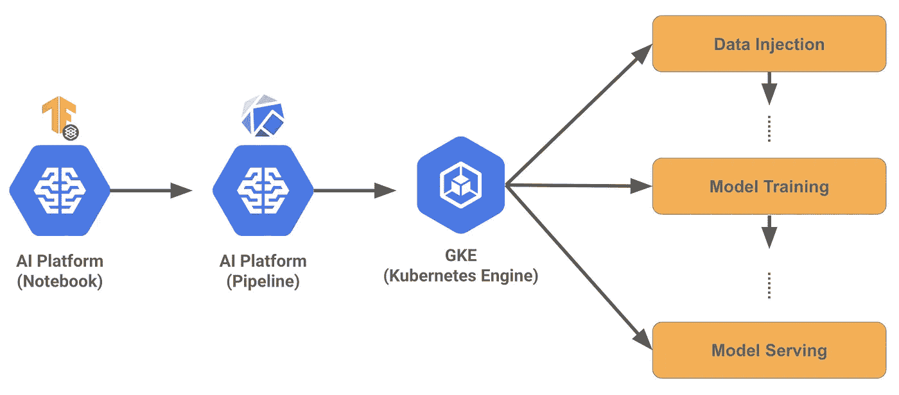

Fig7\. GKE Job Allocation

图 7 显示了运行 TFX 管道时会发生什么。作业规范扔给 AI 平台管道，然后 AI 平台管道把每个作业包装在一个容器里，传给 GKE，然后 GKE 在一个当前可用的资源里执行每个作业。如您所见，每个作业都保证按顺序运行。

## 人工智能平台训练/预测

GCP 提供的服务不仅仅是人工智能平台笔记本/管道和 GKE，还有一些专门用于数据预处理、模型训练、模型调整和模型预测的服务。您希望利用这些服务，因为它们具有可伸缩性和灵活的可配置性。此外，请注意，GKE 不知道超过一个图形处理器协作的分布式训练。

试想一下以下几种情况。

*   **您的数据越来越大:**您不断地收集更多的数据，相应地，您需要更多的计算资源来进行数据预处理。对于这种特殊的工作，需要高端 CPU 和大容量 ram 是正常的。
*   **您的模型和数据越来越大:**随着您收集的数据越来越多，您可以期望从当前模型中获得更多的信息。或者，由于 SOTA 车型最近发布得太频繁，您希望用更有前景的车型来取代现有车型。无论是哪种情况，在分布式有保障的环境中，你肯定需要更多的 GPU 甚至 TPU。
*   **终端用户的数量越来越多:**如果您有 100 个用户，那么只需一台服务器就足够了。最终用户的数量会增长到 10 万左右。如果是这样，一台服务器是不够的，但是您应该为您的模型配置更多的服务器，以适应不断增长的用户数量。

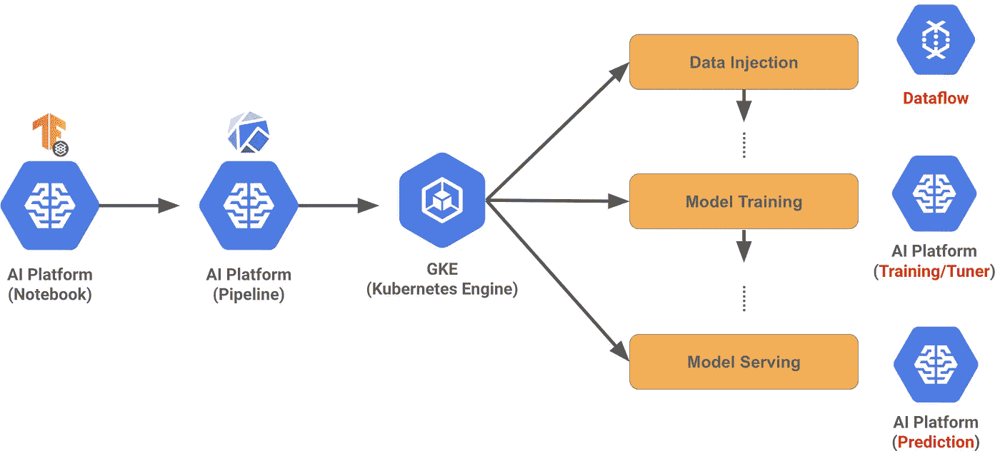

Fig8\. Dedicated GCP Services for Data Preprocessing, Model Training/Tuning, and Prediction

所列情况可以反方向走，所以关键是可扩展性，可扩展性来自于强大的基础设施。然而，基础设施很难配置和管理，因为你应该对硬件、系统程序、操作系统、Kubernetes 之类的软件基础设施、一般的机器学习等有扎实的了解。应该有一整个团队来做这件事。但是，如果你利用 GCP 提供的服务，这件事会非常容易。

列出的每种情况都可以映射到一个专用的 GCP 服务，您只需要对 TFX 配置做一点小小的更改。

*   你的数据变大:**数据流**
*   你的模型和数据变大: **AI 平台训练/调优**
*   终端用户数量变大: **AI 平台预测**

## 数据源

机器学习的数据可以以多种方式存储，但最常见的情况可能是使用文件系统(以多种不同的格式，如 CSV、Parquet、TFRecord 等)或 DBMS(数据库管理系统)。在 GCP，您可以将云存储服务用于正式情况，将 BigQuery 用于后一种情况。

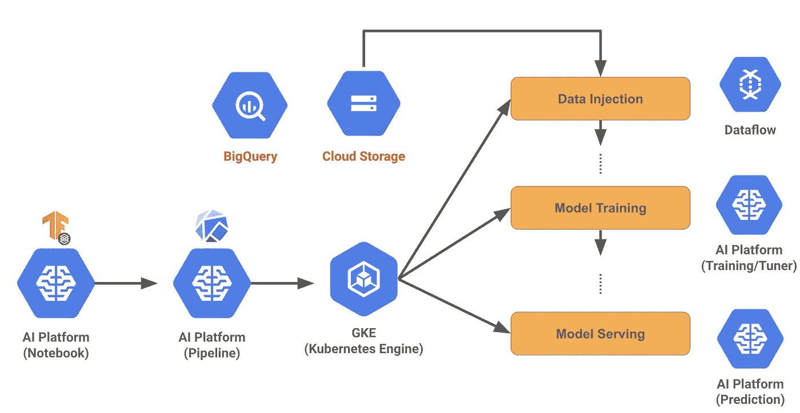

Fig9\. Data Storage Options

当然，他们两人都可以很容易地与 TFX 勾搭上。您只需要导入适当的包(对于文件系统是 ExampleGen，对于 BigQuery 是 BigQueryExampleGen)。还要注意，使用云存储服务，您可以免费获得数据版本控制。

## 云功能和云构建

现在，在这一点上，整个机器学习管道建立起来了。然而，有两个缺失的部分。我们不希望每次都通过打开笔记本来运行整个管道。相反，我们可能需要自动的方式来运行管道。

那么，在什么情况下我们希望自动运行管道呢？

*   当我们收集了更多的数据后
*   当我们编写更好的数据预处理策略或最近公布的 SOTA 模型时。

在前一种情况下，应该有某种东西能够监听数据版本的变化，并基于监听触发动作。在后一种情况下，您应该能够通过调用端点来运行管道。这和笔记本的处理过程是一样的，但是我们现在需要一种自动的方式。

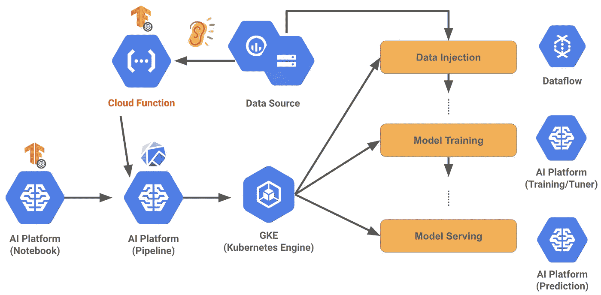

Fig10\. Cloud Function Listening to the Changes of Data Source and Launching the Pipeline

图 10 中的云功能是一种无服务器服务。这意味着它会在某个事件中醒来，并运行指定的代码。在 GCP 环境中，触发云功能的事件之一是云存储或 BigQuery 的变化。因此，通过简单地监听该事件，我们可以确定何时应该运行整个管道。

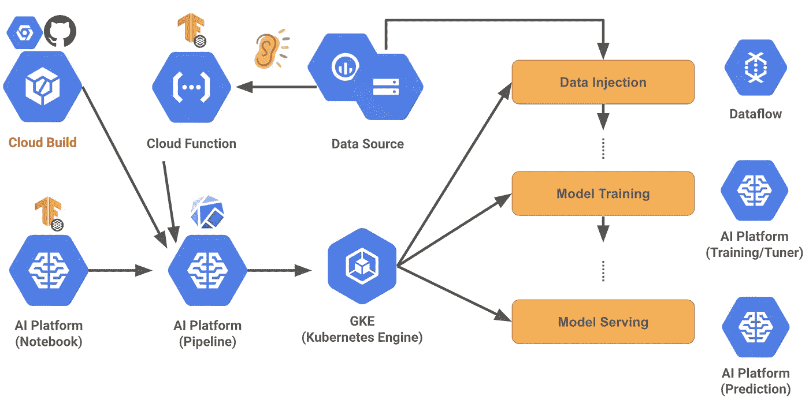

Fig11\. Cloud Build Building Source Code and Launch the Pipeline

图 11 中的云构建是当代码库中有变化时的源代码构建服务。您可以运行许多单元测试，当一切顺利时，可以部署和运行新的机器学习管道代码。当我们修改现有代码以支持不同的数据预处理策略、不同的模型，甚至不同的部署选项(如 TFJS 或 TensorFlow Lite)时，这是一个非常有用的特性。

# 摘要

我们已经看到哪些 GCP 服务可以构成整个端到端的机器学习管道系统。

软硬件基础设施由 **GKE** 和 **AI 平台管道**管理，传递给 AI 平台管道的作业规范可以用高层 **TFX** 框架编写。此外，可扩展数据预处理、分布式模型训练和可扩展模型服务可以由专用 GCP 服务来处理，这些服务是**数据流**、 **AI 平台训练**和 **AI 平台预测**。有许多存储选项，但我推荐使用**云存储**或 **BigQuery** 。当这些存储选项与**云功能**相结合时，可以检测到数据的变化，并且可以触发管道用新收集的数据重新训练模型。最后， **Cloud Build** 让你编写/修改新代码，并基于新集成的代码库触发管道。

然而，如果您仍然认为您必须自己构建一切，您可以将每个 GCP 服务映射到其他等价服务或开源项目。

# 我是谁？

我的名字叫朴成星，我是机器学习谷歌开发专家(ML GDE)之一。虽然我对机器学习的一切都感兴趣，但我今年(2021 年)的重点是 GCP 环境中的 MLOps。