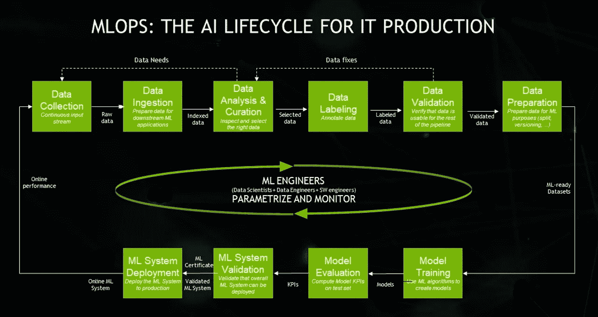
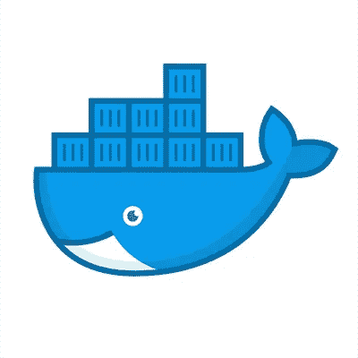
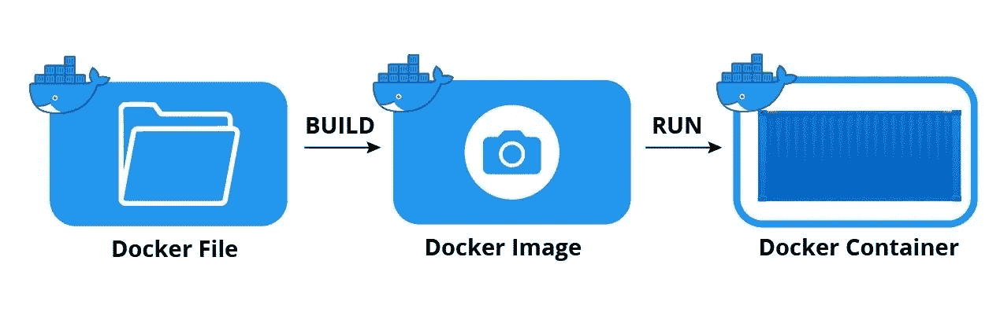
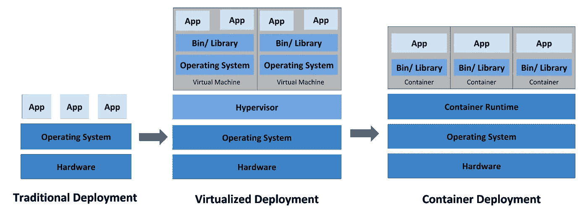

# MLOps——它是一个流行词吗？？？第一部分

> 原文：<https://medium.com/walmartglobaltech/mlops-is-it-a-buzzword-part-1-8573fe95290e?source=collection_archive---------0----------------------->


最近，围绕“MLOps”这个时髦词出现了许多文章。但它到底是什么？它是一个基于神经网络架构的艺术 的 ***开始，还是一个将神奇地解决许多不同问题的新 ***sklearn*** 包？让我们以这篇文章为契机，深入探讨一下。***

这将是一个由三部分组成的系列:

*   第 1 部分:MLOps、编排工具和理解 Kubeflow 管道的基础知识
*   第 2 部分:用示例介绍 Kubeflow 管道
*   第 3 部分:使用 Vertex AI (Managed Kubeflow)的端到端 ML 实现

**MLOps:**

MLOps 描述了一套结合机器学习、DevOps 和数据工程的实践，旨在可靠有效地在生产中部署和维护 ML 系统，使您的模型开发成为产品生态系统的一部分。



Image Source : [Nvidia Blog](https://blogs.nvidia.com/blog/2020/09/03/what-is-mlops/)

机器学习开发通常由一系列步骤(或 *DAG* )组成，这些步骤需要顺序或并行执行，以产生最终模型，该模型可通过端点提供服务或可用于批量预测。*所涉及的各个步骤在数据工程师、数据科学家和软件工程师之间存在依赖性，使得整个流程的再现性和可重复性成为一项繁琐的活动。此外，每个步骤中涉及的资源(计算/内存)有不同的要求，如果设置不当，可能会极大地影响您的数据科学预算。*

如果这看起来和你的组织所面临的问题相似，那么这篇文章就是为你准备的。

***MLOps 不是工具，*** 而是实践。它可以通过市场上可用的各种编排工具作为管道来实现，以使 ML 工作流过程成为更简化的活动。

*   阿帕奇气流
*   Kubeflow 管道(它使用 Argo 编排)
*   路易吉等。

在本文中，我将更详细地解释 Kubeflow 管道，但我想提醒您，就其支持而言，Airflow 相对成熟，并且与其他工具有很好的集成。此外，如果您的数据组织已经在使用 Airflow，那么扩展其功能会更容易。

**为什么选择 Kubeflow 管道:**

*   Kubeflow 管道允许人们建立可移植的、可扩展的机器学习工作流程。
*   ML 工作流中的每个步骤都有不同的系统要求(*数据提取/处理可能需要 Hadoop 集群，模型训练需要 CPU/GPU，模型服务需要高可用的 GPU/CPU 机器*)。理想的场景是在 Kubernetes 的基础上构建这个系统(由于不同的系统需求),并将各个步骤容器化。但这需要在 Kubernetes 上构建一个可扩展的系统的大量专业知识，这就是 Kubeflow pipelines 来拯救的地方(仅供参考，使用 Airflow Docker Operator 也可以做到这一点)。
*   此外，了解 Kubeflow 管道变得越来越重要，因为云提供商的托管管道( **Vertex AI** (GCP)和 **Sagemaker** (AWS))是建立在 Kubeflow 管道之上的

> (这里暂停一下。我将在第 2 部分提供 Kubeflow 管道的工作示例。从这里开始，更多的是了解 Kubeflow 管道所需的基础知识)

让我们解决一些关键概念，以便用基础知识打下更坚实的基础



Image Source : [Docker](https://pbs.twimg.com/profile_images/1273307847103635465/lfVWBmiW_400x400.png)

**Docker:**

Docker 是一个容器化平台，它以 Docker 容器的形式将您的应用程序及其所有依赖项打包在一起，以确保您的应用程序在任何环境下都能无缝工作。更简单地说，它将应用程序和基础设施的依赖关系封装在一起。(仅供参考，在 Kubeflow 管道中，每个组件代表一个容器)

**不带 Docker:**

假设您有一个基于 web 的应用程序，您想将其托管在一个服务器上。视其是否为 ***。基于. net*** 或者基于 Java*你可能需要在你的服务器上安装 IIS/tomcat 中的一个。它的版本需要在开发/测试和生产阶段是相似的，否则你将面临传统的问题，*

> *"T23 它在我的机器上有效，但在产品上无效"*

***同 Docker:***

*开发者将创建一个 tomcat/Windows IIS docker 映像(一个映像只不过是一个部署相同配置的多个容器的蓝图)，使用一个像 Ubuntu 这样的基础映像，它已经存在于 Docker Hub 中。现在，开发人员、测试人员和系统管理员可以使用这个映像来部署 tomcat 环境。容器就是这样解决问题的。*

***够描述！！！***

*让我们用例子来理解它*

**

*Image Source : [Docker Basics](https://lh3.googleusercontent.com/guEcIQ8rmHR0S29wqoqv9Vs_Qz5T8JWckynh5Z4_EVfZOLSpUyZ-w_fexPhZlgGC1T6mT0oJZScTky7co6yrDVyvY0gp_gxtOj1omsEyicTkdp9m1DmhGnVLFr1yVsev7AvHG2s)*

*这是一个使用 Python 的简单的 Flask 应用程序，一旦运行，它会给你一个返回“Hello World”的端点*

*下面是 **Dockerfile** ，它只是一组指令，告诉我们如何创建图像*

*   *`FROM`告诉 Docker 你的图像基于哪个图像(在例子中，Python 3.6)。*
*   *从当前目录到/app 文件夹的所有内容*
*   *`RUN`告诉 Docker 要执行哪些附加命令。*
*   *`CMD`告诉 Docker 在镜像加载时执行命令。*

***Docker Image** :创建容器的蓝图。图像是不可变的，从同一个图像创建的所有容器都是完全一样的*

***Docker 容器**:Docker 映像的运行实例。在我们的示例中，一旦 Docker 映像运行，就会产生一个带有端点的 Python 映像的运行实例(取决于您想要映射哪个端口)*

*您可以使用下面的命令`$ docker build -t firstapp .`构建 docker 映像*

*它为你建立了一个 Docker 图像，你可以用它来列出*

*`$ docker images`*

*现在，您可以运行 docker 映像来获得一个正在运行的实例。这里，我们将系统中的端口 5000 映射到 Docker 容器中的端口*

*`$ docker run -d -p 5000:5000 <docker_image_id>`*

*要列出系统中运行的容器，可以使用命令`docker ps -a`*

*实验完成后，首先停止容器，然后删除容器，最后删除映像，确保清理系统中的资源*

```
*docker stop <continaer_id> # stops the running container
docker rm <container_id> # removes the container
docker rmi <image_id> # removes the docker image*
```

> **好了足够多的容器，让我们对 Kubernetes 有一个简单的了解，然后结束这篇文章**

****来自官方文档:****

*Kubernetes 是一个可移植的、可扩展的开源平台，用于管理容器化的工作负载和服务，方便了声明式配置和自动化。它有一个庞大的、快速增长的生态系统。Kubernetes 的服务、支持和工具随处可见。*

****部署结束时间*** :*

**

*Image Source : [Kubernetes Going back in Time](https://d33wubrfki0l68.cloudfront.net/26a177ede4d7b032362289c6fccd448fc4a91174/eb693/images/docs/container_evolution.svg)*

*我们为什么需要 Kubernetes*

*容器是捆绑和运行应用程序的好方法。在生产环境中，您需要管理运行应用程序的容器，并确保没有停机。例如，如果一个容器关闭，另一个容器需要启动。如果这种行为由一个系统来处理不是更容易吗？*

*这就是 Kubernetes 来救援的地方！Kubernetes 为您提供了一个灵活运行分布式系统的框架。它负责应用程序的伸缩和故障转移，提供部署模式等等。例如，Kubernetes 可以轻松地为您的系统管理 canary 部署。*

> *在这里结束。我保证我的下一篇文章将减少描述，增加编码示例。感谢您花时间阅读本文！*

# *如果你喜欢这篇文章，请给👏！*

*参考资料:*

*[](https://www.docker.com/) [## 增强开发者的应用开发能力| Docker

### 了解 Docker 如何通过克服应用程序开发的复杂性来帮助开发人员实现他们的想法。

www.docker.com](https://www.docker.com/) [](https://kubernetes.io/) [## 生产级容器编排

### Kubernetes，也称为 K8s，是一个开源系统，用于自动部署、扩展和管理…

kubernetes.io](https://kubernetes.io/) [](https://jfrog.com/knowledge-base/a-beginners-guide-to-understanding-and-building-docker-images/) [## 理解和构建 Docker 图像的初学者指南

### 码头工人图像实用指南。它们如何工作，如何创造，如何优化，在哪里可以找到现成的…

jfrog.com](https://jfrog.com/knowledge-base/a-beginners-guide-to-understanding-and-building-docker-images/)*