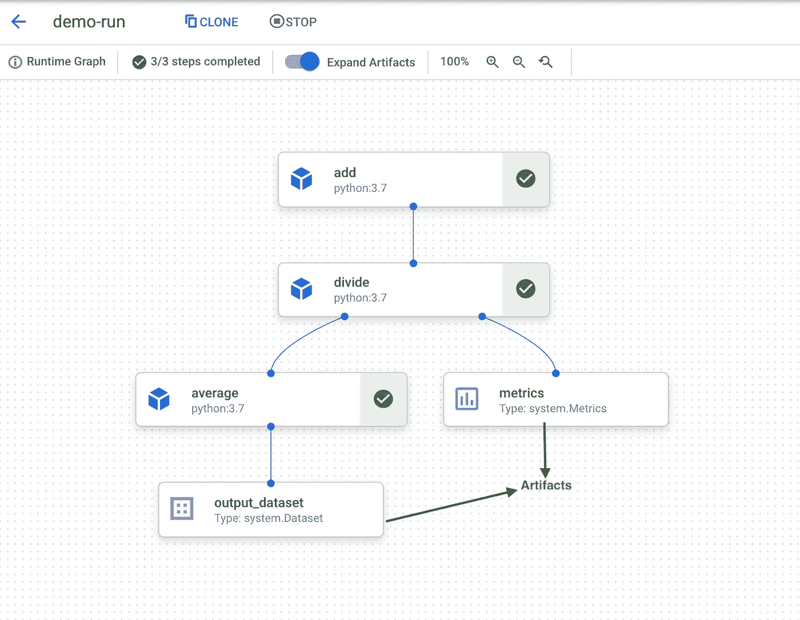

# MLOps——它是一个流行词吗？？？第二部分

> 原文：<https://medium.com/walmartglobaltech/mlops-is-it-a-buzzword-part-2-5a8436fb3020?source=collection_archive---------3----------------------->


Image : [CloudZone](https://cloudzone.io/wp-content/uploads/2021/05/kubeflow21.jpg)

本文是三篇系列文章的第二篇，旨在使用 GCP 的托管 Kubeflow 管道实现 MLOps。在[系列的第一部分](/walmartglobaltech/mlops-is-it-a-buzzword-part-1-8573fe95290e)中，我们学习了 MLOps、各种编排选项和 Docker/Kubernetes 的基础知识。

本文将更多地关注构建 *Kubeflow 管道，包括更多的编码示例。*

*它将涵盖 MLOps 的一些原则，包括:*

*   *可移植性/可扩展性*
*   *工件跟踪*
*   *重复性/再现性*

**Kubeflow 组件**


Image by Author

*管道组件*是执行特定功能的自包含代码集。它有名称、参数、返回值和主体。容器提供了便携性、可重复性和封装性。下面我将范围限制在基于 Python 的组件上，以便进一步解释。

组件代码包含执行 ML 工作流中特定步骤所需的逻辑(可能是使用 Spark 的*数据提取/处理*或使用 sklearn/TensorFlow 的*模型训练*)。它只是一个用 decorator `kfp.v2.dsl.component`注释的纯 Python 函数。该组件应遵循以下规则:

*   它不应该使用在函数定义之外声明的任何代码。
*   Import 语句必须添加到函数内部。
*   助手函数必须在这个函数中定义。

让我们从简单的 Python 组件的一个例子开始，它将两个数字相加并返回结果。

正如所观察到的，函数的所有参数和返回类型都必须有数据类型注释。它有助于支持输入/输出工件日志记录，这与 MLOps 的一个原则有关。

`@ component`将您的 python 函数转换为 Kubeflow 组件，它允许我们定义三个可选参数:

*   **base_image** :(可选)指定运行该函数的 Docker 容器图像。它也支持自定义图像。默认值是 Python 3.9 图像。
*   **输出组件文件**:(可选)将组件定义写入文件。您可以使用此文件与同事共享组件，或者在不同的管道中重用它。
*   **packages_to_install** :(可选)运行函数前要安装的版本化 Python 包列表。*建议创建一个定制映像，并预先安装所有需要的库。*

下面是示例输出组件文件，如果用文件名指定了可选参数，将会生成该文件。它可以跨管道共享和重用。这只不过是一个带有一组指令的 Dockerfile 文件。

使用下面的方法，可以从 yaml 组件中重新创建 *Python 组件*。

```
import kfp.components as comp
comp.load_component_from_file("add_component.yaml")
```

此外，使用这种方法，从 airflow 操作器迁移到 Kubeflow 组件相当简单。

```
comp.create_component_from_airflow_op()
```

让我们看一个稍微复杂一点的*组件*的例子。

该组件接受两个输入，并使用组件代码中定义的帮助函数使用 NumPy 包来计算商和余数。这个组件代码返回了两个输出，一个是使用 *NamedTuple* 显式定义的，另一个是使用工件类型的参数(*Output【Metrics】*)。

> 如果你的函数输出是原始类型，返回类型可以是*类型注释*为“float”、“str”、“None”等。如果您的组件返回多个输出，您可以用`[typing.NamedTuple](https://docs.python.org/3/library/typing.html#typing.NamedTuple)`类型提示注释您的函数，并使用`[collections.namedtuple](https://docs.python.org/3/library/collections.html#collections.namedtuple)`函数将您的函数的输出作为 tuple 的新子类返回。

**平均成分:**

这是我们管道中的最后一个组件，输出是类型为`dataset`的`artifacts`。工件代表大型或复杂的数据结构(`dataset`或`model`)。

**管道**


Image by Author

现在，组件已经准备好了，是时候构建管道了。

通过连接组件的输入/输出接口来创建管道。或者，您可以在管道任务上使用*之前/之后*方法。

组件输入和输出分为*参数*或*工件*(取决于它们的数据类型)，数据共享通过它们进行。

*   参数通过值传递到组件中，可以是以下任何类型:int、double、float、str 或 collections。它非常适合较小的数据(如果您想返回任何数字/字符串/字典或集合)。
*   工件表示大型或复杂的数据结构，如数据集或模型，并作为对文件路径的引用传递到组件中。
*   如果您有大量的字符串数据要传递给组件，比如一个 JSON 文件，那么将该输入或输出注释为一种类型的[工件](https://github.com/kubeflow/pipelines/blob/master/sdk/python/kfp/dsl/io_types.py)，比如[数据集](https://github.com/kubeflow/pipelines/blob/master/sdk/python/kfp/dsl/io_types.py)，让 Kubeflow 管道知道将其作为一个文件传递给组件。

> (如果你是从气流背景来的，可以和 *Xcom 推*和*拉*操作有关。)

**演示管道(** *虚拟示例* **)**

`kfp.dsl.pipeline`注释帮助你定义管道。它有三个参数名称、描述和 pipeline_root。前两个是不言自明的。管道根是指您的项目可以访问的 GCS 或 S3 中的存储位置。样品位置应为 `gs://my-project/your-folder/`。这是存储所有管道任务输出的位置。以下是该管道的虚拟流:

*   将两个数相加并返回结果。
*   通过将 add 组件的输出传递给 divide 组件，将 add 组件与 divide 组件连接起来。
*   使用分割任务的“after”方法连接下一个组件。

**编译并运行**

一旦定义了管道，就可以编译生成 yaml，直接上传到您的管道 UI，或者您可以使用`*kfp.client*`或`AIPlatformClient(GCP)`来触发您的管道。


Image by Author

这里是使用 GCP 顶点人工智能运行的演示管道。在这里，我们使用简单的 Python 函数和 Python 一样的基本图像，但是根据你的需要，你可以使用 Java/Scala 或任何其他语言和适当的图像来编码单个组件。输出工件在这个管道中突出显示，这个管道不是一个组件，而是来自特定组件的工件。



Image by Author

> 我会在这里结束。在下一篇文章中，我们将讨论一个端到端的 ML 工作流实现。

我希望这篇文章对你有用，如果有用的话，考虑至少鼓掌 50 次。👏 :)