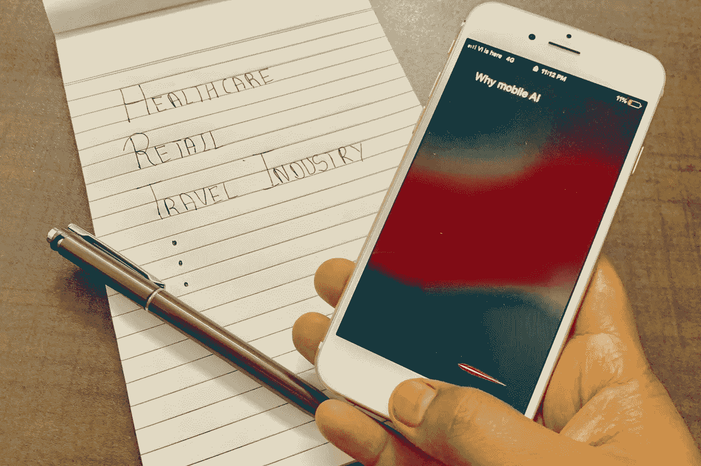

# 移动人工智能:全球市场影响和潜力

> 原文：<https://medium.com/globant/mobile-ai-global-market-impact-and-potential-1ec91c175e2?source=collection_archive---------1----------------------->

这是 [Mobile-AI](/@roy11manisha/mobile-ai-introduction-global-market-forecast-38d89eeef10f) 文章的第二部分，在这里我们将讨论一些在当前世界表现良好并且在不久的将来有巨大增长潜力的领域。

> 在[的第一篇文章](/@roy11manisha/mobile-ai-introduction-global-market-forecast-38d89eeef10f)中，我们讨论了什么是移动人工智能及其全球市场预测。

*   **医疗保健领域的移动人工智能**

人工智能和大数据正在彻底改变医疗和保健方法。“循证医学”是现代医学的支柱，将临床经验和患者价值与最佳可用研究信息相结合。移动设备的使用正在推动医疗保健交付模式向远程和患者生成模式的深刻转变。健康和健身应用是 app store 上最受欢迎的应用，消费者支出最高。移动医疗的按需访问模式可随时随地提供服务，为降低医疗成本、提高患者参与度和改善结果创造了前所未有的机会。移动医疗的优势对于管理慢性疾病(如高血压和糖尿病)非常有吸引力，在这些疾病中，处方治疗的有效性主要取决于患者的意愿和日常选择。

通过使用关于用户健康和身体活动的额外数据，有机会扩展健身应用的功能。此外，专家正在评估这些患者数据，以提供精确的个性化建议，这些建议无法从基于样本的研究中获得。如果开发和使用得当，人工智能将为决策提供潜力，不仅比人类更快，而且更准确，更少偏见。

大多数公司正在为医疗保健应用开发软件解决方案，这是人工智能医疗保健行业发展的关键因素。推动医疗保健行业市场增长的另一个主要因素是全球多家制药和生物技术公司以及终端消费者对该技术的消费。

我们有苹果的 HealthKit 和安卓的 Google Fit 来处理智能手机上的所有这些活动。HealthKit 实际上是一个工具包，帮助开发人员创建与标准健康应用程序(现代 iOS 设备的默认程序)和各种医疗设备和软件同步的活动跟踪器应用程序，旨在收集用户健身活动的数据(以及他或她的健康状况等)。Google Fit 平台类似于苹果的 HealthKit，旨在监控 Android 用户的身体活动和健康状况。在智能手机内置的可穿戴设备或传感器的帮助下，该服务会自动确定用户何时行走、跑步或骑自行车。总的来说，苹果在健康问题上更彻底，谷歌专注于标准的健康指标。此外，苹果提供了更全面、更详细的数据分析方法，谷歌提供了一套更简单、更灵活的工具。

*   **零售中的移动人工智能**

增强现实和人工智能是截然不同的技术，但它们可以一起使用来创造独特的体验。如果处理得当，人工智能和增强现实(AR)可以无缝合作，创造身临其境的移动体验。想想 Lenskart，它是首批引入虚拟眼镜试戴解决方案的手机应用之一。Lenskart 的 3D TRY ON 功能使用同上，使用移动相机和机器学习扫描我们的面部，为我们创建一个头像。使用机器学习，Ditto 为我们提供了有见地的建议和眼镜建议，以准确贴合面部。

> 来自[欧莱雅](http://www.loreal-paris.co.uk/trends-and-tutorials/inspire-me/288---makeup-genius-2)的一份新闻稿称，“你曾经想象过你可以在几分钟内试穿上百种妆容吗？巴黎欧莱雅的最新革命:虚拟现实化妆，让你将每一个造型和产品应用到你的形象中。微笑，改变你的表情，移动你的头——化妆就会随之而来！结果令人惊叹，就像你戴着它一样。”

欧莱雅已经在这一领域领先一步，推出了 Nail Genius 和 Makeup Genius 应用程序，提供旨在改善客户体验的数字功能。Genius 应用程序允许客户使用智能手机摄像头拍摄自己的照片，并将虚拟的欧莱雅产品(如口红和指甲油)应用到图像上。该应用背后的增强现实技术还允许客户转头从不同角度查看产品的外观。许多顾客在想象产品如何出现在他们自己的皮肤或指甲上时存在问题，并且使用样品可能并不总是令人满意的。该应用技术为用户提供了一种在做出购买决定之前虚拟测试欧莱雅产品的方式。

通过实施 Mobile-AI，零售商能够处理每个商店中部署的模型数量，从而降低供应链成本，同时帮助为客户提供最佳体验。众所周知，采用人工智能技术是零售商取得成功的关键。很明显，Lenskart 和欧莱雅与消费者一样，对虚拟和增强现实带来的机遇感到兴奋。这个新冠肺炎疫情是移动人工智能与零售领域的 AR 一起发展的最佳机会，因为人们预计将保持社交距离作为一种预防措施。零售商已经将业务重点放在数字平台上，以及除了虚拟审判室之外能够促进业务的东西。移动运输应用程序可以将人工智能与 AR 一起用于虚拟试衣间，客户可以虚拟地尝试他们的服装，因为大多数客户都避免在没有试用的情况下购物，这个虚拟试衣间肯定会解决他们的疑问，并帮助业务增长。

开发人员组合 AR 和 AI 模型的最常见方式是从场景中获取图像或音频，通过模型运行这些数据，并使用模型输出来触发场景中的效果。所有这一切都是通过融合来自多个传感器的数据而成为可能的，如摄像机、陀螺仪、加速度计、GPS 等。形成一个可以覆盖在物理世界上的数字世界。

*   **旅游行业的移动人工智能**

谷歌地图是旅游行业最可靠的导航服务之一。在人工智能和机器学习的帮助下，谷歌地图正在通过推荐即时交通警报、更快地访问位置，甚至探索以前不可能的未知位置来改善用户体验。现在有了移动人工智能，我们也可以在手机上享受这些服务。

谷歌地图的一个很好的例子是离线模式导航。准备进行公路旅行，但在到达目的地之前无法确认互联网连接？不用担心，现在你可以使用谷歌地图的离线功能，在开始旅行之前你可以下载感兴趣的地区，然后使用这些存储的数据作为你未来的参考。同样重要的是要注意，这些离线地图将在大约 15 天后过期，除非您连接到数据连接。如果您想让您的地图无限期离线，您需要做的就是转到离线地图设置并激活自动更新。这将确保您的离线地图在过期时不断更新。您甚至可以选择仅在使用 WiFi 时更新，确保当区域非常大时，您宝贵的移动千兆字节不会浪费掉。离线时，该应用程序不会拥有谷歌地图提供的一切。

访问离线谷歌地图的其他更短更快捷的方法是设置并启动路线导航，然后关闭手机互联网连接。现在你可以毫不费力地获得以上所有功能。在这里，一旦您的路线被配置，地图将保存数据，至少直到您到达目的地，或者直到您的设备上的地图被关闭。

在这里，Mobile-AI 用于分析和处理移动设备上存储的所有数据。分析之后，他们帮助用户获得预期的结果。这可以扩展到进一步的步骤，我们可以在运输和汽车行业使用这种服务。

业务可以扩展到支持离线功能，如自行车路线，步行方向，交通细节，车道导航，以及离线谷歌地图所缺少的所有东西。

# 结论

总之，虽然我们都希望很快找到一种疫苗来对抗这种新冠肺炎疫情病毒，但目前的情况正在为上述领域创造新的机会。移动人工智能更有潜力增长的其他领域包括物联网、语音辅助以及无屏幕应用功能、聊天机器人、认证和安全等等。整个世界已经数字化，难怪市场营销也在追随同样的趋势，但这只是移动人工智能漫长而激动人心的旅程的开始。这是一个调整和重新发明轮子来推动世界前进的机会。

然而，随着移动人工智能的不断发展，我们需要讨论这种干预对公民的政策和道德影响。虽然新冠肺炎是这次讨论的附带议题，但它强调了迫切需要一个强大的电子政务框架，以提供更好的公民服务，并为企业提供一个与政府互动的平台。

> 如果你喜欢这篇文章，请用掌声和评论来欣赏它。这真的会鼓励我多写！！！！