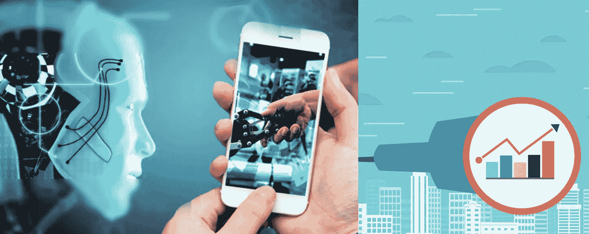

# 移动人工智能:介绍和全球市场预测

> 原文：<https://medium.com/globant/mobile-ai-introduction-global-market-forecast-38d89eeef10f?source=collection_archive---------2----------------------->

# 人工智能对移动来说是什么

人工智能(AI)可以有许多不同的定义，但用一个更简单的术语来说，人工智能被定义为机器执行人类智能过程的能力，例如推理、发现意义、归纳或从过去的经验中学习的能力。人工智能通过处理海量信息，使决策变得更快、更精确。通过移动人工智能，我们正在让我们的智能手机能够在不考虑互联网连接的情况下执行所有这些任务。早期的移动人工智能是基于云的和依赖于互联网的，但最新的智能手机正在拥有基于云的人工智能和内置人工智能。

基于人工智能的移动应用已经可以在医疗保健、零售、交通、公共安全、教育和娱乐领域看到。移动人工智能对人类与移动设备的交互产生了巨大影响，并极大地增强了客户体验。大数据和物联网(IoT)的收集为新的人工智能应用创造了一个完美的环境，它有可能成为经济增长的新引擎。

为了强化这一点，许多公司都推出了具有人工智能优化硬件的智能手机。华为的 Mate 系列、三星的 Galaxy、谷歌的 Pixel 手机和苹果的 iPhones 都有这种芯片，通常被称为神经引擎。也有很多人工智能支持的框架可用。谷歌的 Tensorflow & Keras 框架，苹果的 BrainCore & MLKit 就是其中的一些例子。近年来，智能手机中包含的人工智能功能只是放大和提升了它们的整体智能。但在基本层面上，人工智能就是模式识别。

例如，如果你经常开车上下班，那么一旦你启动汽车并将手机连接到车载蓝牙，你的智能手机可能会弹出一条随机消息，告诉你到家需要多长时间以及交通状况如何。在这里，你的手机正在观察你的常规行为，在处理收集到的数据后，它们会为你可能的下一步行动提供建议。

# 全球市场预测

手机使用的大幅增长和互联网的高度渗透是推动全球移动人工智能市场增长的主要因素。此外，移动应用程序开发商和设备制造商越来越多地采用人工智能来改善客户服务/体验，这是预计将在一定程度上支持全球市场增长的另一个因素。用于相机的低成本人工智能芯片的推出和移动设备中视觉应用的推出是未来几年可能支持市场增长的其他一些主要因素。

市场中的当前趋势、机会和增长前景可以通过以下市场调查来突出:

*   MarketWatch 预测，到 2023 年，全球人工智能市场将达到 250 亿美元，CAGR 为 48%，2024 年为 1910 亿美元，CAGR 为 37%。MarketsandMarkets 还预测，2025 年全球人工智能市场将从 2017 年的 160.6 亿美元达到 1906.1 亿美元，CAGR 为 36.62%。这一增长主要是由于全球范围内的新冠肺炎健康紧急情况，导致了新一轮的变革性技术，包括革命性的人工智能技术(例如，智能机器和机器人)，成为遏制疫情的可能解决方案。
*   2030 年，人工智能消费将影响 58%的 GDP 增长。据预测，到 2020 年，几乎 30%的公司将使用人工智能技术来提高他们的销售。
*   根据数据桥市场研究(DBMR)的报告，全球移动人工智能市场预计到 2025 年将从 2017 年的 51.4 亿美元达到 177.9 亿美元，并预计在 2018 年至 2025 年的预测期内以 28.43 %的 CAGR 增长。
*   到 2021 年，人工智能智能手机预计将增长到 38 亿部。人工智能应用处理器在智能手机中的渗透率越来越高，这将推动未来几年移动人工智能市场的增长。
*   Gartner 预测，到 2022 年底，80%的智能手机应用将配备人工智能。

所有这些分析和预测都是在新冠肺炎·疫情之前完成的，我们都知道它对当前市场增长的影响。考虑到这几点，这些预测也有可能受到影响。但是在疫情的情况下，除了移动技术之外，很少有行业表现良好。

请查看本文的第二部分,我们将讨论移动人工智能在哪些领域表现出色，在未来还有更大的发展潜力，并提供一些有趣的实时示例。

> *如果你喜欢这篇文章，请用掌声和评论来欣赏它。这真的会鼓励我多写！！！！*