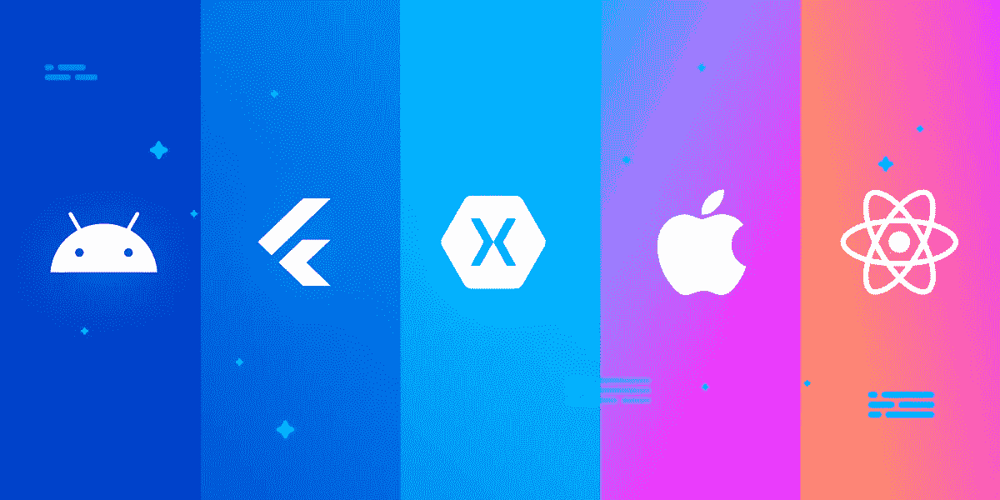
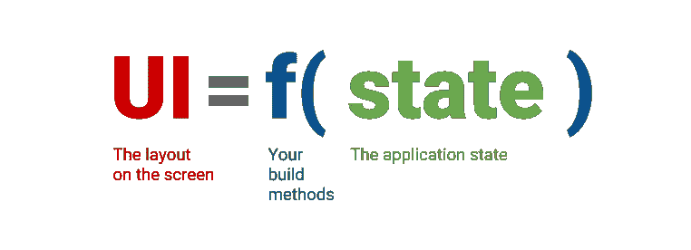

# 移动应用——声明式思维

> 原文：<https://medium.com/globant/mobile-apps-the-declarative-mindset-ce57cf09d46?source=collection_archive---------0----------------------->

读者你好！！

希望您能跟上新的和流行的框架集周围的所有讨论，以及围绕现有移动应用程序技术的更新公告。

随着移动应用程序开发技术栈在所有可能的方向上发展，从最近对 Swift 等原生技术的增强到 SwiftUI 的添加，到不同跨平台技术(如 Flutter、ReactNative 和 Xamarin)的 Jetpack Compose for Android 的引入，事情一直在变化、更新和发展。这就是我要分享的想法，我已经尝试了与不同的移动应用程序开发候选人的实践经验。



Source — Google Images

移动应用的构建方式再次发生了转变。现在，我们看到了从命令式 UI 框架到声明式 UI 框架的转变，其形式有 **SwiftUI** 、 **Jetpack Compose** 、 **ReactNative** 、 **Flutter** 和 **Xamarin MAUI。**

我们知道为 Android 和 iOS 编写移动应用程序的命令式编程风格。然而，新的声明式 UI 需要从一个新的不同的角度来考虑应用程序开发。在声明式框架中，状态的变化会触发 UI 的重建，这将消除一整类与状态相关的错误，并使推理更新变得更容易。您定义在给定时间内给定状态下的 UI 应该是什么样子，框架会使用合理的默认值和上下文来解决这个问题。



Source — Medium

> ***UI = f(状态)*** *，其中 f 代表构建方法。如果有东西改变了应用的状态，UI 会根据 f 和新的状态重绘。*

让我们来看看适用于移动应用程序的不同语言的一些示例。

**swift ui:**

```
import SwiftUI  // using the SwiftUI framework

struct ContentView : View {
    var body : some View {
        Text("Hello, world!")
            .padding()
    }
}
```

***飘起*** :

```
Widget build(BuildContext context) { //everything is a widget
    return Container(
      decoration: const BoxDecoration(color: Colors.white),
      child: const Center(
        child: Text(
          'Hello World',
          textDirection: TextDirection.ltr,
          style: TextStyle(
            fontSize: 32,
            color: Colors.black87,
          ),
        ),
      ),
    );
  }
```

***Xamarin*** :

```
using Xamarin.Forms.Markup;

public partial class SearchPage
{
    void Build() => Content = 
        new StackLayout { Children = {
            Header,
        }};Label Header => new Label { Text = "Hello world" };
}
```

它对开发人员社区以及各种规模和技能的团队有什么好处？

*嗯，这里有一个看的方法。随着所有的框架和技术都采用声明式的方式编写移动应用程序，拥有不同技能的人做出贡献变得非常容易。例如，如果一名 iOS 开发人员离开，需要有人暂时填补空缺，如果一名同样习惯于声明式编程风格的 Android 开发人员能够理解并做出贡献，即使他一生中从未编写过一行 Swift 代码。类似地，从事 Flutter 或 Xamarin 工作的人，已经习惯了声明式风格，可以很容易地介入。*

虽然目前这可能看起来有点模糊，但一旦移动应用程序从命令式编程转变为声明式编程，这听起来非常有前途。苹果和谷歌是移动应用程序开发的引领者，由于他们都在自己的声明式 UI 框架上做了很多工作，很明显他们想把事情推向那个方向，或者至少给开发者另一个可靠的选择。

有了相似的语言和构建 UI 的声明式方法，团队使用相同的架构就容易多了。对于像我这样有使用 Xamarin、Flutter 和现在同步 SwiftUI 经验的人来说，学习和尝试不同的技术很容易，因为代码结构很相似。

综上所述，我认为声明性思维模式会一直存在下去！无论你从事哪种技术，无论是原生 Android、iOS 还是跨平台，开发和适应这种更新的思维方式都将是至关重要的，并对未来有很大的帮助。