# 移动应用安全:最终移动应用分发的安全考虑

> 原文：<https://medium.com/walmartglobaltech/mobile-appsec-security-considerations-for-finalized-mobile-app-distributables-18bcb3e774b7?source=collection_archive---------8----------------------->

## 理解移动应用是客户端应用是很重要的。任何拥有最终包二进制/可安装包的人都可以轻松地从应用程序中逆向工程或提取数据。我们将探讨一些常见的风险，并演示攻击者如何利用不安全的编码实践。

Photo by [Lajos Szabo](https://unsplash.com/@lou_szabo?utm_source=medium&utm_medium=referral) on [Unsplash](https://unsplash.com?utm_source=medium&utm_medium=referral)

*发布后保护是指一旦您将应用程序发布到 AppStore、Google Play 或类似网站，攻击者就很难利用您的应用程序或攻击您的服务。与 web 应用程序不同，攻击者可以访问您的二进制文件，这可能会导致逆向工程、篡改和信息泄露。*

编写移动应用程序而不是依赖于 web 应用程序的目的是，更多的存储、功能和处理都在客户端执行。因此，与 web 应用程序相比，攻击者可以检查更多的数据和功能，而 web 应用程序的大多数处理都在服务器上进行，大多数应用程序只进行最少的存储或本地处理。因此，您不能再依赖服务器端的保护，必须更加关注代码质量和数据暴露。即使你的代码是复杂的，混乱的，缩小的，等等。熟练的攻击者能够对您的应用程序进行逆向工程。除了能够跟踪代码级流程，攻击者还可以搜索嵌入的元数据或其他有用的字符串，如密码或其他秘密。逆向工程还可能揭示不为公众所知的未使用或废弃的功能。

**小心**——你必须确保你有一个精心制作的构建管道，让你的代码为生产做好准备。通过最小化最终二进制文件中的功能和数据，您减少了黑客和欺诈者的攻击面。

**小心** —您的信息安全团队必须时刻警惕假冒应用、冒名顶替者或篡改的发行版。通过了解逆向工程、篡改和暴露不必要的数据和功能的风险，您可以帮助减少恶意应用程序的数量。

# 什么会出错？

每当您向用户提供二进制文件时，攻击者都有机会对应用程序进行逆向工程，以发现数据或非法修补恶意功能。

虽然 Google Play 和苹果的 AppStore 采用安全的方法来部署您的应用程序，但攻击者仍然可以获得对您的二进制文件和先前版本的二进制文件的位级访问权限，以便对您的应用程序进行逆向工程或执行其他分析。虽然您无法阻止对二进制文件的分析，但是您可以通过仔细规划来降低风险。

## *考虑一下欺诈者和攻击者使用的一些策略*:

就 Android 而言，Google Play 有第三方替代产品。虽然有些规模很大并受到监控，但其他一些是欺诈性的和恶意的。例如，有人可以在博客上推广你的应用程序的“特殊版本”,然后提供“侧装”应用程序的说明；这将允许他们绕过任何审查程序或官方 Google Play 服务的其他用户安全好处。黑客不是制作一个功能有限的假应用程序，而是对你真正的官方应用程序进行逆向工程和修补。他们的修改可能包括添加对新个人数据的请求，然后通过他们的服务器获取这些数据，或者他们可能只是添加数据和交易的中间人渗透。

攻击者可以对二进制文件执行逆向工程、字符串分析和[其他分析。攻击者可能会找到对已被注释掉但未脱机的不推荐使用的 API 的调用，并滥用此功能。攻击者还可能找到嵌入的元数据、注释或其他信息来攻击应用程序的服务器端组件。](https://android.jlelse.eu/getting-inside-apk-files-21dbd01529d4)

# 防御考虑

确保您已经清楚地定义了构建环境和单独的配置设置，并对其进行了清楚的定义、实施和检查。例如，您可以在测试环境中启用调试或关闭双因素身份验证。如果你用“开发环境”设置向公众发布应用程序更新，它会降低你的应用程序的安全性。与你可以通过更新服务器向所有用户推出新版本的 web 应用不同，一些用户**可能会选择跳过升级，并可能在很长一段时间内留下一个易受攻击的版本**。

一个生产中的 app 应该是**硬化，最小化**。仅包括*最小*数量的功能和数据。在部署之前删除未使用和不必要的代码。当应用程序反转时，未使用的函数/方法通常仍然可用，即使它们从未被调用。一个常见的错误是在应用程序中硬编码生产和 UAT 信息，然后使用分支逻辑(if/else)来选择正确的信息。由于攻击者可以获得完整的源代码、执行逆向工程或最少的调试流程，因此关于非生产环境的详细信息可能会暴露给攻击者。您的构建过程应该去掉所有的注释和不需要的信息，尤其是如果您使用的是非本机应用程序开发平台，如 Apache Cordova 或 React Native。

相对于在服务器上执行的功能，在**客户端执行的功能要保守一些。例如，当您必须包含第三方 API 的开发者密钥时，通过您的服务器代理请求通常比让您的移动客户端直接联系第三方 API 更好。**

最后，您不能阻止逆向分析，但是您可以通过利用混淆和反逆向工程技术使它变得更加困难。然而，一个熟练的攻击者仍然能够跟踪您的应用程序，并且一些技术可能不会显著增加提取硬编码字符串的难度。

# 逆向工程演练示例

## 演练概述

为了展示黑客和其他对手可以轻松地对您的移动应用程序进行逆向工程，我们创建了一个非常简单的存根应用程序。

应用程序在其当前状态下没有做太多事情；它只是加载一个带有消息的主屏幕。然而，在这个应用程序中，有许多信息隐藏在表面之下，可以通过逆向工程很容易地提取出来。

在这个演示中，我们将向您展示攻击者如何使用简单免费的工具来提取许多开发人员认为安全和受保护的有用信息。

*让我们浏览一下这个应用程序的一些关键源代码。*

## 基本活动布局(activity_main.xml)

文件的活动布局包含我们的应用程序的 UI 布局。你可以在下面的截图中看到，我们唯一的 UI 功能是一个静态内容的文本字段，上面写着“你能找到我的秘密吗？”。该应用程序没有按钮或任何其他 UI 功能。

The main activity (i.e., end user UI view) for the application (activity_main.xml)

## 主要活动(`MainActivity.java`)

这是应用程序启动时运行的主要活动。目前，在这个应用程序中还没有什么进展。我们可以看到，看起来应用程序最终会调用一些远程 API 或服务，关键变量`apiKey`被硬编码在应用程序的第 8 行。

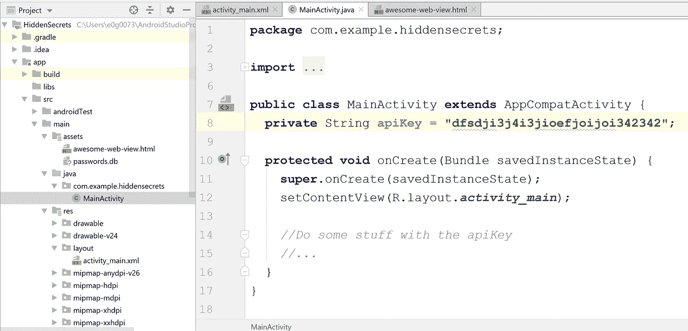

The “main” method for the Android application, loads the Activity defined in **activity_main.xml** (MainActivity.java)

## HTML 资产(awesome-web-view.html)

在这个 web 应用程序中，除了编写一些本机代码，开发人员还计划使用 WebView 做一些工作，以便这些工作可以由他团队中的 JavaScript 专家来执行。暂时只有一个小票根。注意这个文件中第 4 行的注释。在第 5 行，我们可以看到一个硬编码的`apiKey`，它也用在我们上面的`MainActivity.java`文件中。看起来远程内容将使用从第 7 行开始的代码获取。

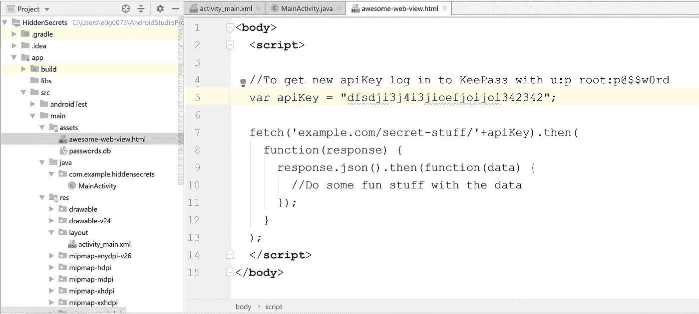

An HTML file in our assets folder that has a comment and a hardcoded API key (awesome-web-view.html)

## SQLite 资产(passwords.db)

在上面的截图中，你可能已经注意到了`assets`文件夹中的另一个文件(`/app/src/main/assets`)。这是一个 SQLite 数据库，碰巧在其中一列中存储了一些密码。看起来除了联系一些使用 API 密钥的 web 服务，该应用程序还需要使用一些用户名和密码组合进行身份验证。以下是该数据库的内容:

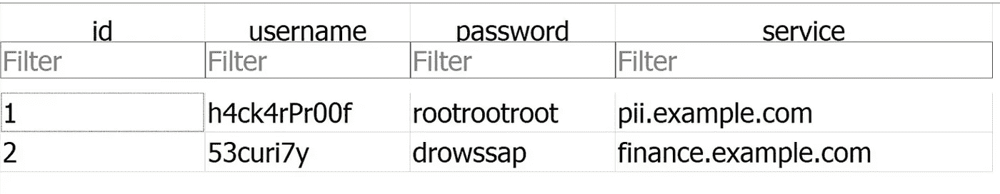

A GUI view of the schema an data contents in the passwords.db file.

# 逆向工程演练

## 如何打开和探索现有的*。apk

现在，我们已经从开发者的角度看到了应用程序目前的样子，我们将探索黑客或其他对手如何轻松地对我们的应用程序进行逆向工程，并提取变量和资产。

为了执行逆向工程分析，我们将使用一个简单的基于 GUI 的开源工具，称为 [JADX](https://github.com/skylot/jadx) 。JADX 使得打开一个`*.apk`文件和查看源代码变得简单。JADX 获取 Dalvik 字节码，并将其转换回可读的 JAVA 代码。在许多情况下，输出的 JAVA 将与我们的原始源代码完全相同，这使得跟踪和检查文件变得非常容易。

要使用 JADX，只需加载 JAVA app / platform 可执行文件，然后打开文件即可。攻击者可以从 Google Play 这样的在线应用程序市场获得你的应用程序的`*.apk`,或者可以使用备份工具导出本地安装在移动设备上的`*.apk`。查看[这篇文章展示了获得应用程序*的许多简单方法。apk 文件](https://techwiser.com/extract-apk-android/)。类似的技术也适用于其他平台。

下面是 JADX 加载时的截图:

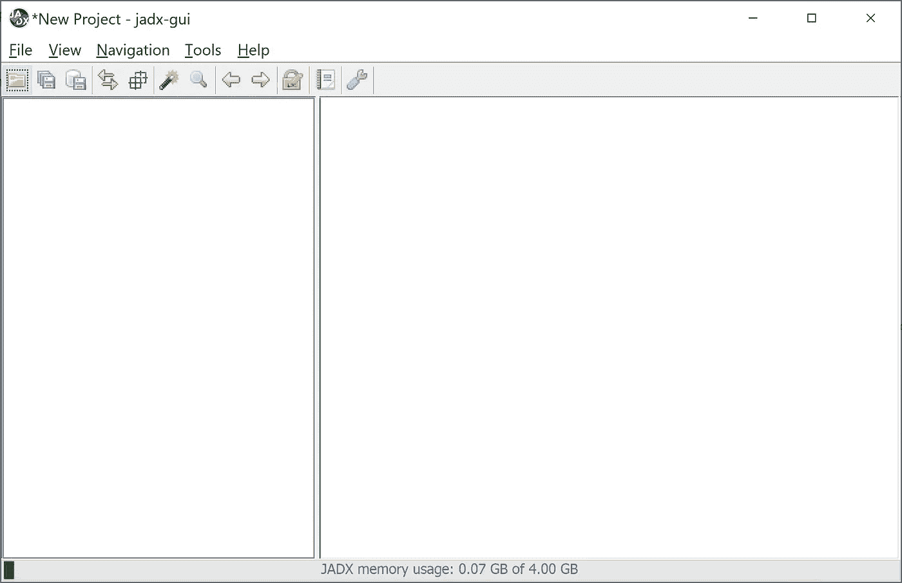

Screenshot of JADX tool before your load any APK file.

打开并开始探索`*.apk`文件是多么简单:

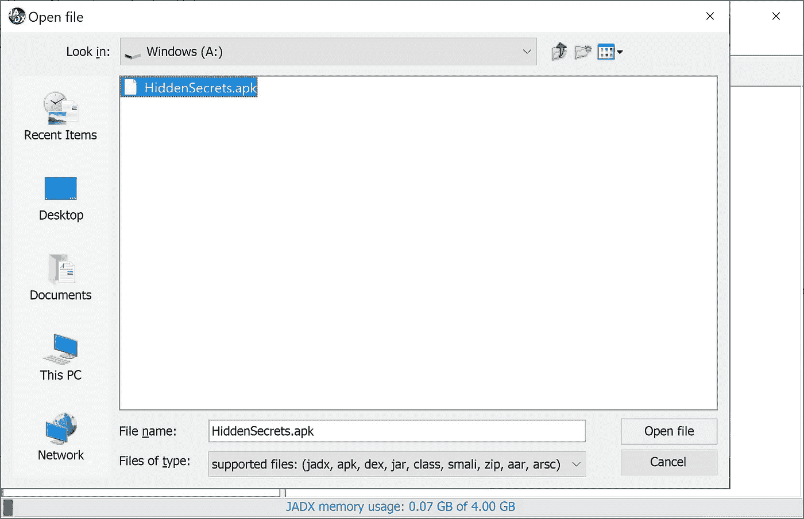

That’s it, no magic — just use a standard file open dialog and you can be a reverse engineer (JADX File open dialog)

如果存在混淆或其他反逆向工程技术，还有其他逆向技术和工具可以提供帮助。记住，默默无闻*不是安全*。

## 逆向工程分析的截屏

下面的视频展示了用上面的对话框打开文件后，使用 JADX 浏览文件内容是多么容易。JADX 在源代码树中显示各种文件的方式与我们在使用像 Android Studio 这样的 IDE 时所期望的方式非常相似。观看视频，然后考虑以下几点。

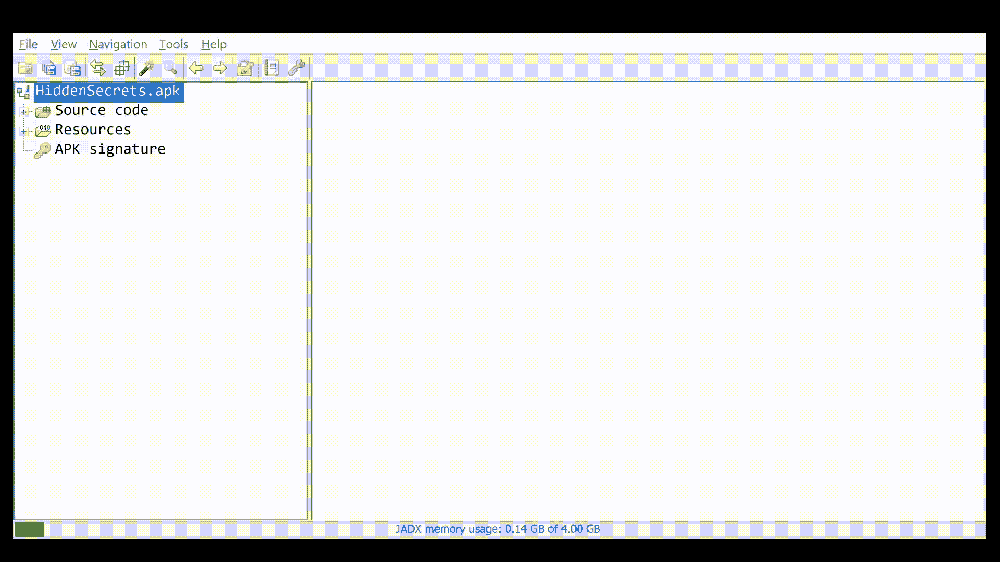

Screencast of reverse engineering with JADX and finding hardcoded secrets in the APK.

为了开始我们的分析，我们将应用程序文件树导航到`com.example.hiddensecrets` ( *隐藏的秘密*是我们应用程序的名称)。在这棵树下，我们可以看到可用的文件和关键变量。最直接的事情应该是，硬编码的`apiKey`就在那里，任何人都可以看到和窃取；没有特别的迷惑或魔法。在逆向工程中，硬编码的字符串几乎总是可用的。

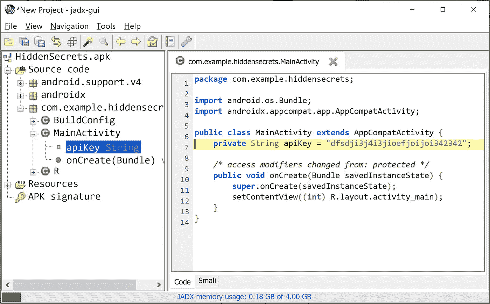

Screenshot showing that the API Key is easily discoverable in JADX inside the MainActivity

应用程序本身并没有太多变化，所以下一个合乎逻辑的地方是应用程序的资源。在参考资料下面，我们看到一些常见的文件，如`AndroidManifest.xml`，但是还有一个`assets`文件夹，它保存了用于我们的 WebView 的 HTML 文件以及我们计划分析的 SQLite 数据库。

同样，在 HTML 文件中，我们的硬编码`apiKey`很容易被访问，并且可能被攻击者窃取，以获得对服务和数据的未授权访问。此外，您会注意到在第 4 行 JavaScript 注释是可见的。当 Android Studio 构建应用程序时，它通常会删除 Java 文件中的注释，**，但不会对其他文件类型执行类似的分析和注释删除**。这意味着你嵌入在 HTML、JavaScript 或文件元数据中的任何评论都将被任何能够获得你的应用`*.apk`副本的人访问。

最后，在 JADX 中，我们还可以看到嵌入在 SQLite 数据库中的明文数据，`passwords.db`。

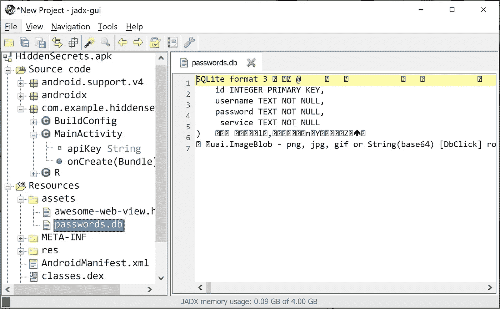

Using JADX to view the passwords.db file inside the APK

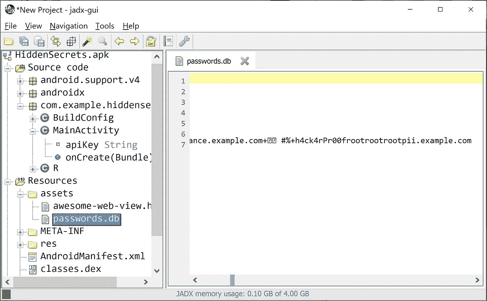

Scrolling to the right inside password.db, the SQLite file can easily be viewed and plaintext data extracted.

使用 JADX 这样的工具在数据库或非明文文件中滚动可能有点困难；然而，JADX 并不是在我们的`*.apk`中分析资产的唯一方法。

一个`*.apk`实际上只是一个类似 zip 文件的容器。这意味着我们可以使用一个通用的解压缩操作，然后我们可以看到所有的源 Dalvik 文件和非 Java 资产。在下面的截图中，你可以看到解压`*.apk`后，我们可以导航到 assets 文件夹，文件将在那里供我们打开。

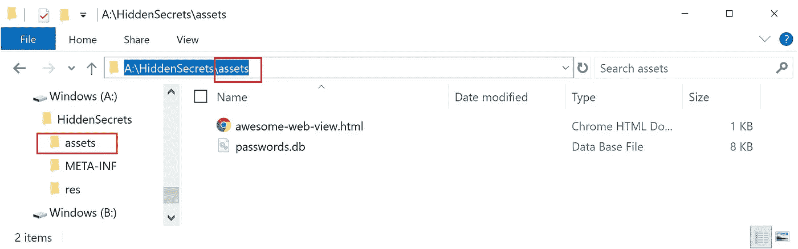

Viewing the unzipped APK file in Windows Explorer

既然我们已经解压缩了资产，我们可以使用任何我们想要的工具来分析它们。我们不需要特殊的黑客工具来分析 SQLite 文件。我们可以使用一个通用的工具，例如 [DB Browser for SQLite](https://sqlitebrowser.org/) 来轻松浏览这个数据库的内容。使用这个免费的浏览器工具，攻击者可以轻松地处理数据，查看数据库结构，并做更多的事情。查看下面的截图和视频，看看攻击者在解压缩`*.apk`后访问这些高度敏感的数据是多么容易:

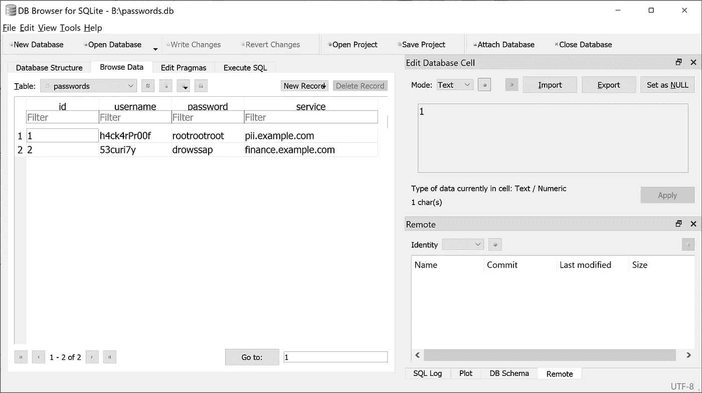

Screenshot showing how the passwords.db file was recovered using DB Browser For SQLite

您可以观看此视频，了解完整的打开过程:

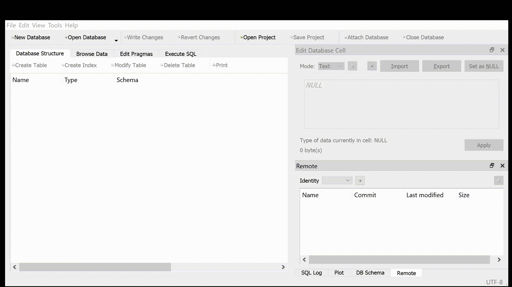

Screencast of opening the passwords.db file in DB Browser for SQLite

## 演练外卖

只要攻击者能够访问二进制文件或其他资产，就有可能进行逆向工程。虽然存在混淆和其他可能的技术，但是也存在这些技术被击败的可能性。作为开发者，你必须假设任何数据、算法等。将会找到并分析客户端可执行文件/二进制文件中的。虽然执行本地处理和存储通常是有意义的，但在服务器上执行操作和存储通常更安全，因为攻击者无法像查看客户端可执行文件那样轻易地看到服务器上运行的源代码。

在我们的演示中，我们使用了一个非常简单的工具；然而，有一个更先进的逆向工程工具免费或以很低的成本提供的完整生态系统，可以用于进行深度分析，而不管您的平台或其他保护。

# 包裹

说到移动应用，重要的是要记住客户端可分发的任何东西都可以被访问。切记*难以挖通*并不等同于*无法挖通*。在构建你的移动应用程序时，你必须确保客户端的所有东西在交付之前都被清理干净——注释、未使用的函数和字符串都是现成的。您暴露的客户端越少，您就越安全。

想了解更多关于 AppSec 的信息吗？查看我在 Medium 上的其他文章。如果你喜欢这篇文章，别忘了按 50 次拍手按钮👏和分享🎁在社交媒体上与朋友分享。欢迎在下面评论你的想法和问题。

阅读更多埃里克·H·戈德曼的文章:

*   [移动应用安全:了解不当的移动平台使用和客户端代码质量](/walmartglobaltech/mobile-appsec-understanding-improper-mobile-platform-usage-and-client-code-quality-589124ed39b0)
*   [3 AppSec 的教训*多云有肉丸的机会*](/walmartglobaltech/3-appsec-lessons-from-cloud-with-a-chance-of-meatballs-ad59aa69f99e)
*   [开发者需要停止害怕信息安全黑手党](/@erichgoldman/developers-need-to-stop-fearing-the-infosec-mafia-f61f4b8b8ba5)
*   [利用您作为技术产品/项目经理的角色来提高应用程序的安全性](/walmartglobaltech/leveraging-your-role-as-technical-product-project-manager-to-improve-application-security-d554f25c2dba)

*OWASP 移动 Top 10 (2016)本文涉及的主题:* [*M8:代码篡改*](https://owasp.org/www-project-mobile-top-10/2016-risks/m8-code-tampering) *，* [*M9:逆向工程*](https://owasp.org/www-project-mobile-top-10/2016-risks/m9-reverse-engineering) *，* [*M10:无关功能*](https://owasp.org/www-project-mobile-top-10/2016-risks/m10-extraneous-functionality)