# 移动应用安全:理解不恰当的移动平台使用和客户端代码质量

> 原文：<https://medium.com/walmartglobaltech/mobile-appsec-understanding-improper-mobile-platform-usage-and-client-code-quality-589124ed39b0?source=collection_archive---------3----------------------->

Photo by [Misael Moreno](https://unsplash.com/@moreno303?utm_source=medium&utm_medium=referral) on [Unsplash](https://unsplash.com?utm_source=medium&utm_medium=referral)

# 介绍

现代移动应用程序开发允许开发人员向用户提供丰富且响应迅速的体验。当使用像 Android 和 iOS 这样的操作系统时，对硬件和服务的访问是精简的，并且相当标准化。这使得快速开发可靠地使用诸如将任务/数据移交给其他应用程序和服务之类的功能的应用程序变得容易。

虽然这些特性的平台 SDK 都有很好的文档记录，但是所有开发人员都必须了解某些安全权衡和要避免的某些模式。**简单的东西**(或在 Google / StackOverflow 上容易找到的)**，并不总是健壮或安全的**。同时，应用于 web 和其他框架的相同安全编码概念仍然适用于移动应用程序的客户端和服务器端部分。

在开发移动应用程序时，您应该了解能够提供所需功能的内置库和特性，而不是依赖于自定义代码或不必要的第三方库。此外，应该避免一些*方便的*和*推荐的*实践，以确保您的代码是安全的，并维护您的隐私。并不是所有的默认和流行模式都是最好或最安全的选择。

# 了解风险

移动应用程序经常与各种硬件、系统服务和其他应用程序进行交互。您应该小心地使用这些功能，并且只在绝对必要时使用，以减少误用的可能性。

例如，如果攻击者发现您的应用程序中存在缺陷或漏洞，您为您的应用程序请求的任何权限都可能被攻击者使用。记住任何 app 二进制都是可以逆向工程的；攻击者总是有能力了解您的客户端应用程序的内部工作方式。

你必须永远记住，与在更受限制的沙箱中运行的 web 应用程序不同，你的移动应用程序可能拥有**完整的操作系统和文件系统访问权限**。这在编码和设计应用程序时引入了一些额外的考虑。

## *系统功能*

让我们首先考虑一些与用户生成的图像相关的问题。例如，您正在开发一个移动应用程序，其屏幕提供了详细的个人和财务数据…

*   当你的应用程序转到后台时，通常会缓存一个屏幕截图，以备用户想要在应用程序之间切换时使用。
*   此外，用户可以随时拍摄屏幕截图，默认情况下，该截图存储在操作系统上的主映像存储位置，其他应用程序、同步服务等可以访问该位置。

然而，有一些[技术可以解决你的应用程序中的截屏](https://betterprogramming.pub/how-to-prevent-screen-capture-at-ios-14-1f01173c31c0)和[整理背景/应用程序切换的截屏](https://stackoverflow.com/a/7520307/689554)(如果使用 MDM ，则[设置](https://developer.apple.com/documentation/devicemanagement/restrictions) `[allowScreenShot = false](https://developer.apple.com/documentation/devicemanagement/restrictions)` [)。此外，当您的应用程序创建或存储图像时，您应该确定是否要限制对应用程序沙盒的访问或允许任何其他应用程序读取该应用程序。在](https://developer.apple.com/documentation/devicemanagement/restrictions) [iOS 开发者文档](https://developer.apple.com/library/archive/qa/qa1838/_index.html)中了解更多关于 iOS 上此类功能的信息。

## 应用程序间数据共享

另一个可能引入风险的领域是应用程序间的数据共享。例如，Android 中的`intents`功能允许你请求另一个应用程序处理一些活动或进程。*您的应用程序*可能处理意向，也可能发送意向。当处理意图时，数据**不能被隐式信任**，因为发送应用程序可能是恶意的或者容易被利用。当向*其他应用*发出请求时，你应该总是尝试使用明确的意图，而不是隐含的意图；否则，您无法确定哪个服务将处理意图，以及它们会对数据做什么。

## 不知道？不需要？不要用！

一般来说，误用一个平台特性，或者没有正确理解平台特性的风险和缺省值，会使您的应用程序面临误用和数据泄漏的风险。此外，您决不能信任来自用户、文件系统或其他应用程序的任何数据/输入。没有内置的保证，系统也不总是设计为安全第一的配置。就像在 web 应用程序上一样，您必须确保遵循主动和先发制人的安全编码实践。

# 国防概述

保护您的移动应用需要持续的安全承诺。移动操作系统发展非常迅速。您必须确定您希望支持旧的和过时的硬件多长时间，这些硬件可能无法利用更现代和更安全的功能:在与尽可能多的用户兼容和要求使用旧的和不安全的 API 和进程之间有一个权衡。与此同时，随着新功能的出现和您对更安全模式的了解，您必须保持应用程序的更新和发展。在使用任何新功能之前，或者在重新访问旧代码时，请务必查看当前平台文档，了解您的应用中使用的功能。

以下是一些需要记住的一般原则:

*   不要使用某项功能，除非它确实是必要的，并且满足了必要的业务需求
*   在处理输入时，尽量减少任何权限并遵循安全的编码实践
*   尽量减少敏感或有风险的客户端数据和处理；你总是在你自己的服务器上有更多的控制权
*   请注意您的应用程序将数据、日志和任何其他输出导出/保存到何处——考虑其他应用程序在同步、备份等情况下何时何地可以访问这些数据。
*   使用非本机代码或`WebViews`需要了解移动安全问题、操作系统级安全以及网络应用安全问题

## 关于客户端代码质量的一个注释

传统的应用程序安全概念和 web 安全概念在移动应用程序上仍然很重要。

请注意以下事项:

*   如果你的应用依赖于本地或远程数据库，SQL 注入仍然是可能的，而你的本地 SQLite 数据库很可能**对于机密/敏感/高风险数据来说不够安全**
*   如果你的应用不是本地的或者使用了`WebViews`，跨站点脚本(XSS)仍然是一个问题，可能会影响你应用的其他部分
*   如果您使用过时的第三方库或具有已知漏洞的第三方库，您的应用程序也将容易受到攻击

遵循良好的安全编码实践:

*   最小化对用户和可用客户端可用的数据和功能的访问
*   [安全地失败](https://en.wikipedia.org/wiki/Fail-safe#Fail_safe_and_fail_secure)并预期你的应用程序将接收到错误的输入、意图、文件等。
*   实践良好的发布管理，并确保生产和非生产环境和配置之间的适当分离
*   保持所有的依赖关系是最新的，删除不必要的和无关的功能——有时你需要自己重写一个模块或者去掉一些功能

# 平台使用不当安全演示

## 演示应用概述

为了展示黑客如何滥用平台功能来利用应用程序中的缺陷所带来的影响，我们创建了一个名为`DeepLinkXSSDemo`的故意易受攻击的应用程序。这个应用程序非常简单:

*   它为任何以“http://example.com/hello”开头的链接注册一个 URL 处理程序
*   它需要一个“http://example . com/hello/[Name]”格式的 URL，其中[Name]应该是“John”、“Ratish”或“Jan”
*   然后解析该名称值并将其附加到一个 URL，该 URL 用于在 WebView 中启动本地嵌入的 HTML 文件
*   然后，应用程序使用网络视图在屏幕上显示“你好，[姓名]”

## 演示—代码演练

**在** `**AndroidManifest.XML**` **:** 中注册意图为了允许应用程序拦截对 URL 的请求，我们必须在*清单文件中请求适当的权限，*然后为我们期望的*活动*注册意图，该活动将在遇到 URL 时启动。从第 27 行开始，我们在`AndroidManifest.xml`的第 20 行显示的`LoadDeepLink`活动中注册了“http://example.com/hello”。

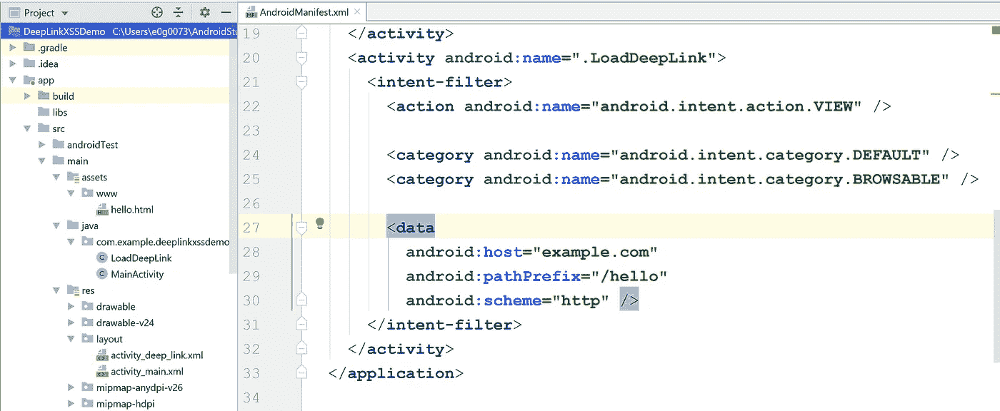

Manifest Showing Deep Link Intent Handler (`AndroidManifest.xml`)

**在活动布局中创建 WebView:**我们的应用程序的接口包括简单地声明一个 WebView，我们可以稍后在实际的活动代码中引用它。我们在`activity_deep_link.xml`的第 10 行指定 ID

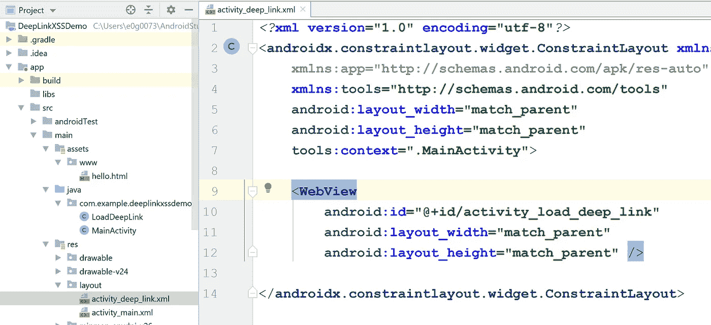

Activity Layout Showing WebView (activity_deep_link.xml)

**连接 WebView 的活动代码:**我们在下面的 JAVA 代码(`LoadDeepLink.java`)中通过引用第 22 行的`WebView`(在上面的布局中创建)来实例化`WebView`。然后我们配置一些设置，对我们来说最重要的是在`LoadDeepLink.java`的第 26 行，在这里我们**启用 JavaScript** 。这款应用的开发人员不愿意用 JAVA/Kotlin 进行处理，而是更喜欢使用他们的 JavaScript 技能，并尽量减少原生开发的工作量。

从`LoadDeepLink.java`的第 31 行开始，我们处理我们在上面的清单文件中注册的意图。第 34 行允许我们提取触发意图的 URL 的最后一部分，在我们的例子中应该是[ `Name` ]值。

最后，在第 36 行，我们获取[ `Name` ]值，并将其作为 URL/GET 参数附加到本地 HTML 文件，我们将使用该文件在 WebView 中呈现输出。

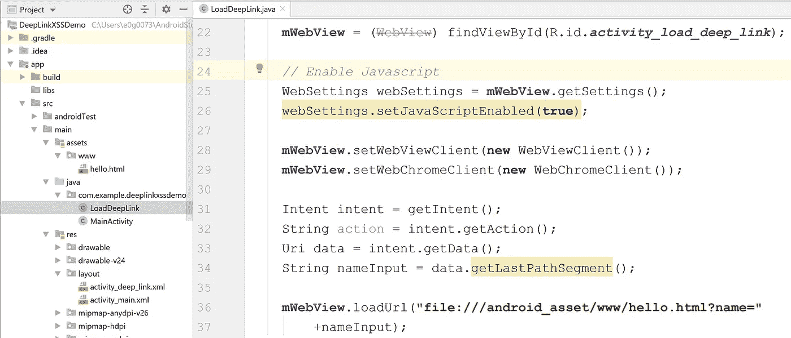

Activity Java Code (LoadDeepLink.java)

***注意* — Android Studio 警告我们不良想法:**你可能已经注意到在上面的截图中，`LoadDeepLink.java`的第 26 行被高亮显示，尽管它不是活动行。当你将鼠标放在这条线上时(见下面的截图)，Android Studio 会警告你启用 JavaScript 是危险的…我们会证明他们是对的😊

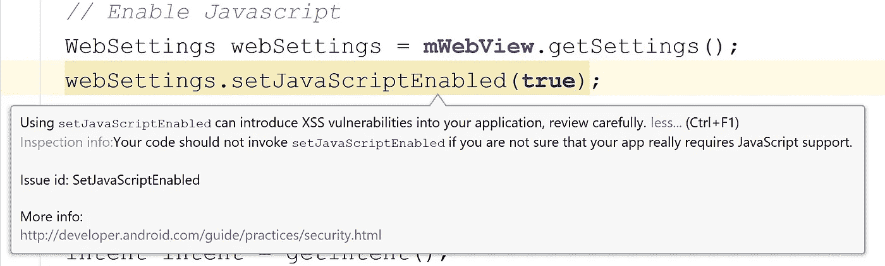

Detail of security issue when you mouseover “setJavaScriptEnabled(true)” in LoadDeepLink.java

**WebView 中的 HTML 代码:**现在，让我们看看提取[ `Name` ]值并将其显示为应用程序一部分的 HTML 和 JavaScript。

在`hello.html`的第 3 行，我们声明了一个 id 为`showName`的 span，初始值被设置为“朋友”。从第 4 行开始的脚本标记用于从我们在上面声明的“`LoadDeepLink.java`”中的意图(该文件中的第 36 行)获得传递给`WebView`的 URL/GET 参数。

`hello.html`的第 10 行用于提取"`name`"值，然后第 12 行用传递的任何输入覆盖" Friend "的现有值。

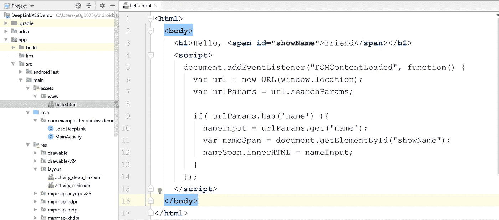

HTML file loaded into the WebView with JavaScript Processing (hello.html)

## 有什么问题？

从安全角度来看，这个小程序实际上有许多问题和糟糕的设计选择。

最大的问题是，不可信的输入被接受，并且在被消费之前没有被验证/净化。**意向处理中并不存在默认保护你的“魔法”。虽然应用程序是*期待*一个`name`，但是在应用程序的 Java 或 JavaScript 部分对输入值没有限制或控制。这意味着攻击者可以在类似“example . com/hello/[`Name`]”URL 的链接的[`Name`]字段中手工创建恶意有效负载，然后将其注入 WebView。在接下来的几节中，我们将演示一些利用。**

在继续进行漏洞利用演示之前，这里有一些其他问题/意见:

*   首先，没有必要依赖 WebView，最好限制你在应用中使用的不同编程语言和库的数量，以降低复杂性
*   `WebView`实际上已经被否决了，从安全的角度来看还有更好的选择，但是这是人们在很多网络教程中看到的。如果它有效，许多开发人员不会进一步质疑它😦。

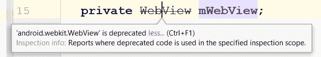

Screenshot showing that Android Studio tells you WebView is deprecated

*   启用 JavaScript 是有风险的，有可能不需要首先使用 JavaScript 就可以实现这一特殊功能
*   `mWebView.setWebChromeClient()`函数支持**甚至更多不必要的功能**，比如允许 JavaScript 警告；您应该只启用您**实际需要的功能，**以便最小化攻击面(参见`LoadDeepLink.java`中的第 29 行)(从 [this StackOverflow 帖子](https://stackoverflow.com/a/2835694)中了解有关此设置的更多信息)
*   在 WebView 中加载的实际 HTML 代码中(“`hello.html`”)，第 12 行的[ `Name` ]值是使用`nameSpan.innerHTML`设置的，因为预期值只是纯文本，而**不是** HTML，`*.textContent`或`*.innerText`函数可能更合适([在 MDN](https://developer.mozilla.org/en-US/docs/Web/API/Node/textContent#Differences_from_innerText) 上阅读关于这两种方法的更多信息)

# 演示—开发演练

## 按预期使用应用程序(无攻击)

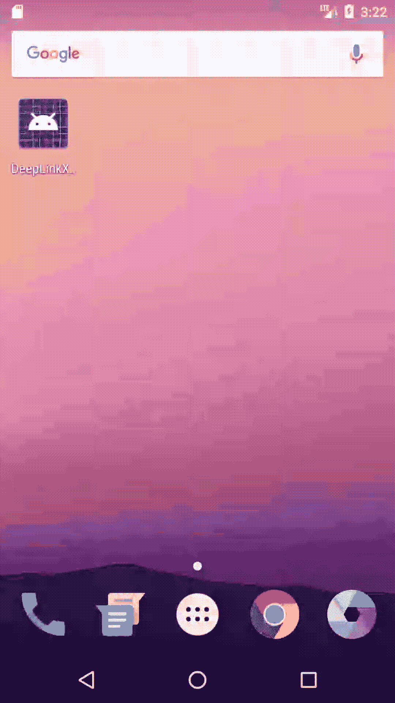

Demo: App running normally with no attack

首先，让我们按照最初的意图运行应用程序:

当我们第一次安装和运行应用程序时，我们会看到“主”活动屏幕，它只显示“应用程序已启动”,这只是一个占位符，用于启动，没有 URL 处理程序触发的意图。

我们退出应用程序。使用主屏幕上的谷歌栏，我们输入以下地址:

" example.com/hello/John "

Android 注意到我们的应用程序有一个注册的处理程序，它提示我们要么在我们的应用程序中打开，要么在另一个应用程序中打开。我们选择我们的应用程序来处理 URL，我们看到“你好，约翰”正如预期的那样。

## 基本通知攻击

第一次攻击将是一个非常简单的概念验证。我们将通过传递恶意 HTML 字符串来触发跨站脚本(XSS)攻击。

在这种情况下，在`<script />`标签中传递一些 JavaScript 将不起作用。但是，我们可以滥用 HTML 元素内置的`onError`属性。

我们简单地注入一个带有无效`src`值的``标签，这将触发我们定义 JavaScript 攻击的`onerror`条件。

下面是原始 html 代码的样子，这是我们在初始攻击时设置的[`Name`]值:

Raw code for Basic Notification Attack

为了将此漏洞利用代码附加到 URL，我们必须首先对内容进行 URL 编码，结果如下:

Attack code from above, in URL encoded format

最后，我们将上述 URL 编码的漏洞利用有效负载附加到“example.com/hello/”的基本 URL，如下所示:

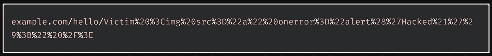

URL encoded exploit code appended to the URL

让我们看看当我们运行这个攻击时会发生什么:

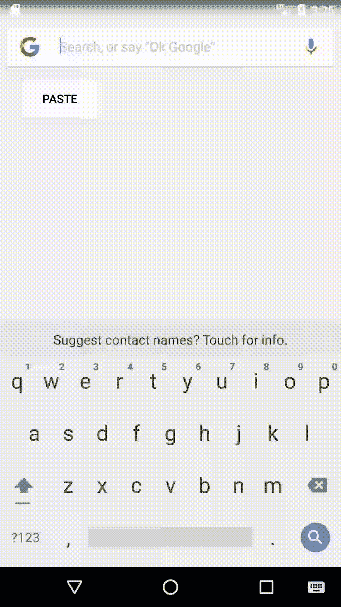

Demo: Basic Notification (JavaScript Alert) type attack from unvalidated JavaScript

## 诱骗用户访问我们选择攻击的链接

对于一个简单的 PoC 来说，显示和警告弹出窗口是很有趣的，但是我们想向您展示这个漏洞是如何被用在其他方面的。也许您修复这个应用程序的第一个想法是简单地禁用 JavaScript，然而，“`hello.html`”文件仍然允许任意 HTML 被添加到 WebView。

例如，我们可以简单地放下一个`<a />`链接元素，并试图欺骗用户点击它。下面是我们可以使用的漏洞有效载荷:

Exploit Code: A “name”=Victim, plus HTML code with a link

同样，我们需要首先对它进行 URL 编码，然后我们可以像上一个例子一样将它传递给我们的应用程序。请看下面的实际操作:

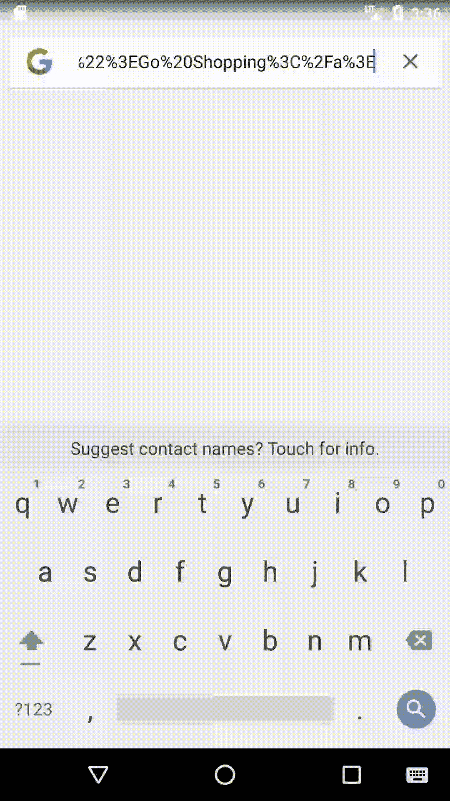

Video Demo showing how we can inject a link of our choosing onto a page. Would still require user to click the link.

## 自动重定向到我们选择的链接

然而，由于 JavaScript ***启用了*** ，我们可以简单地将用户重定向到我们控制下的恶意页面，而不是简单地希望他们点击我们的链接。从攻击者的角度来看，这意味着我们可以保持较小的有效负载，并且可以随时在我们自己的服务器上轻松更新我们的恶意代码。

这段代码使用了我们在警告弹出窗口中使用的相同的`onError`技巧，除了这次我们会自动将用户重定向到我们控制的另一个页面。

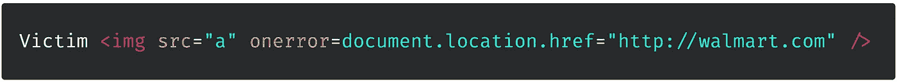

同样，这段代码必须是 URL 编码的，然后可以放在我们意图处理的 URL 中的[`Name`]位置。请观看下面的视频，了解这种攻击的实际效果。

*请注意，攻击者无法从我们的应用程序中复制 HTML 代码并伪造内部网页。由于顶部有* ***无地址栏*** *，用户没有办法知道自己上的是真的还是假的网站。*

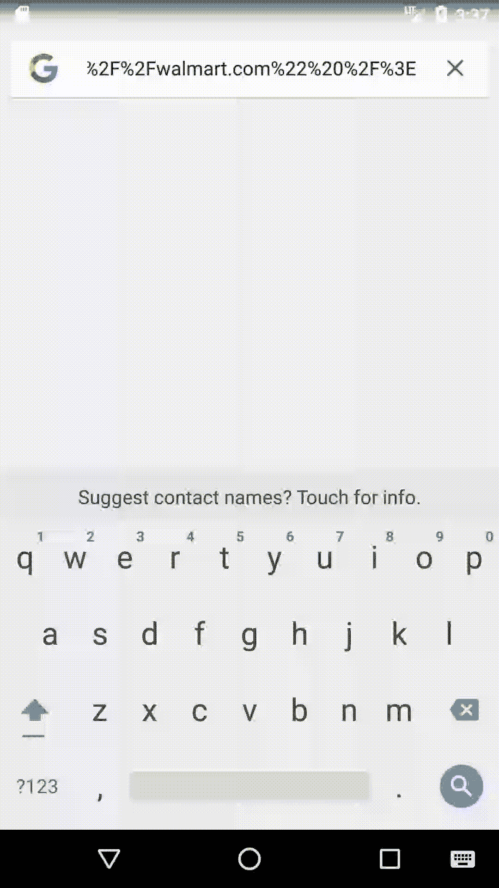

Demo showing automatic redirect to attacker chosen web page.

# 演示—总结

本演示中有几个要点:

*   始终了解您在移动客户端应用程序中使用的类和功能；了解所有选项和默认…*TL；博士* **看文档！**
*   在使用您找到的第一个示例代码或最简单的方法之前，请从性能、可维护性和安全性的角度选择最合适的方法。向您的安全团队寻求帮助
*   总是验证和净化输入，无论是来自用户、数据库还是其他地方

## 包裹

如您所见，即使是一个小应用程序，在保护您的移动应用程序时也需要考虑很多问题。在一个新的平台上编码之前，花时间阅读并理解所有的功能。许多人从 web 开发转向移动应用程序开发，可以轻松地开始制作简单的应用程序；然而，“让它工作”和编写干净的、可维护的、安全的代码有很大的区别。

投资于应用程序安全培训，并阅读您的平台的安全文档。每当你学习一种方法或技术时，花些时间研究安全性。您可以从搜索开始，比如“如何使用特性 X 来保护？”

想了解更多关于 AppSec 的信息吗？查看我在 Medium 上的其他文章。如果你喜欢这篇文章，别忘了按 50 次拍手按钮👏和分享🎁在社交媒体上与朋友分享。欢迎在下面评论你的想法和问题。

阅读更多由[埃里克·H·戈德曼](/@erichgoldman):

*   [3 AppSec 教训*多云有机会肉丸*](/walmartglobaltech/3-appsec-lessons-from-cloud-with-a-chance-of-meatballs-ad59aa69f99e)
*   [开发者需要停止害怕信息安全黑手党](/@erichgoldman/developers-need-to-stop-fearing-the-infosec-mafia-f61f4b8b8ba5)
*   [利用您作为技术产品/项目经理的角色来提高应用程序安全性](/walmartglobaltech/leveraging-your-role-as-technical-product-project-manager-to-improve-application-security-d554f25c2dba)

*OWASP Mobile Top 10 (2016)本文涵盖的主题:* [M1:平台使用不当](https://owasp.org/www-project-mobile-top-10/2016-risks/m1-improper-platform-usage)， [M7:客户端代码质量](https://owasp.org/www-project-mobile-top-10/2016-risks/m7-client-code-quality)