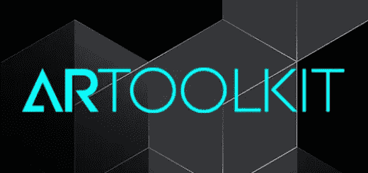
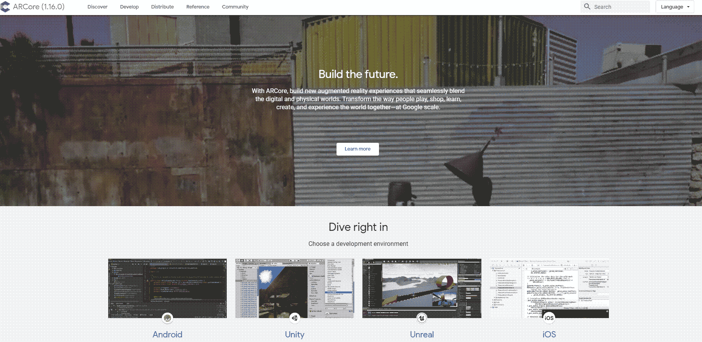
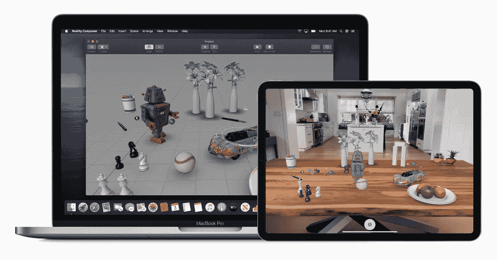
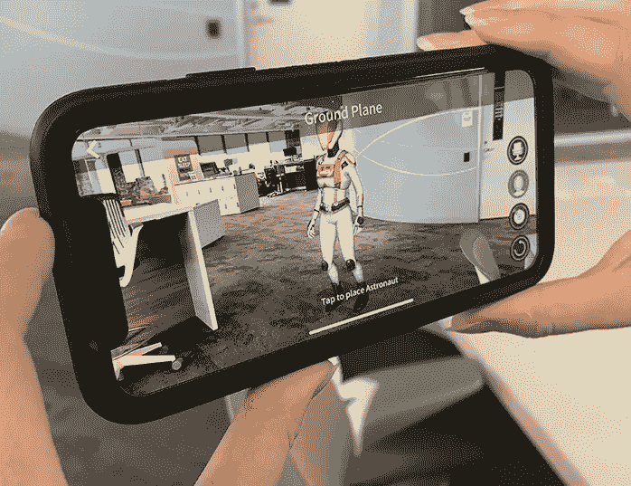
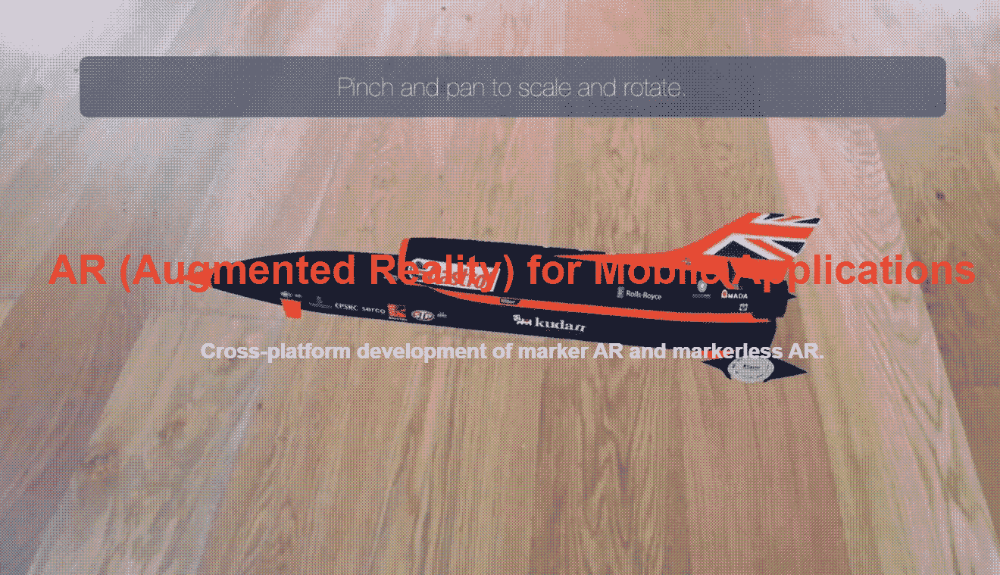
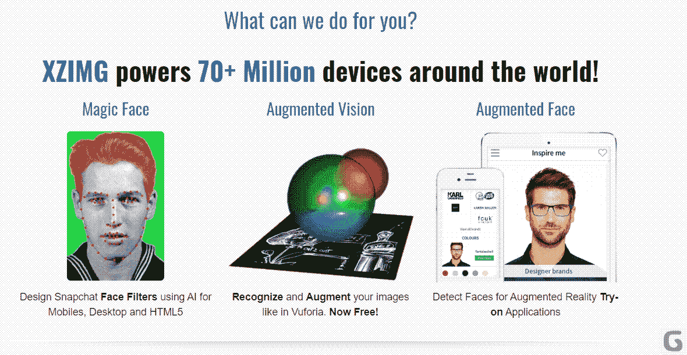
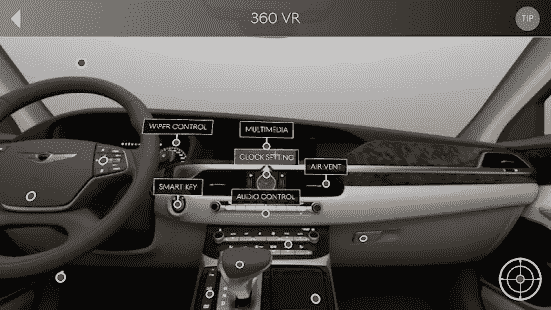

# 移动 AR 应用开发工具包[2020 年更新]

> 原文：<https://medium.com/quick-code/mobile-ar-app-development-toolkit-updated-for-2020-71708633e0b6?source=collection_archive---------0----------------------->

Freepik

术语增强现实(AR)指的是在我们体验现实世界时以数字方式增强现实世界的实践。AR 有时会与虚拟现实(VR)混淆，但二者之间有着重要的区别。

VR 致力于创造一种身临其境的、模拟的体验，这种体验可以基于物理世界建模，也可以基于开发者的异想天开来创建一个完全虚拟的环境。AR 为用户提供了建立在物理世界基础上的增强体验。它通过向现有的自然世界添加图形、触觉反馈和声音来实现这一点。

[AR 的历史可以追溯到 1968 年](https://learn.g2.com/history-of-augmented-reality)，当时诞生了第一台头盔显示器。从那时起，这项技术已经被用于许多方面，以增加用户的经验时，与现实世界的事件互动。

体育迷所熟悉的一个例子是足球比赛中重叠的黄线，其指示球队需要到达何处以获得第一下。将移动设备用作增强现实平台以及 Pokemon Go 等应用程序最近变得越来越流行。

# AR 技术的发展

AR 最初推出时，由于实施所需的硬件和软件组件的成本，它的使用仅限于公司和学术环境。随着移动技术的普及，面向更广泛受众的增强现实应用的开发日益增多。

受此影响，大公司和小初创公司的增强现实移动应用开发都出现了增长。VR 和 AR 技术的[全球总市场预计将在 2020 年达到 188 亿美元。此外，到 2023 年 AR 应用的市场规模预计将增长到 700 亿美元以上。](https://www.statista.com/statistics/591181/global-augmented-virtual-reality-market-size/)

增强现实将出现在教育、娱乐、医疗保健和购物等领域，这只是这项技术融入日常生活的几个方面。

# 开发 AR 应用程序

AR 应用程序可以根据它们与物理世界的交互方式分为两种通用类型。在开始创建新的 AR 应用程序之前，开发团队需要决定他们希望构建哪种程序。

*   **基于标记的**增强现实工具和应用利用便携式设备上的摄像头进行图像识别。数字信息与应用程序识别的模式或标记相关，这也会影响 AR 元素的定位。
*   **基于位置的** AR 应用使用 GPS 和数字罗盘等位置探测器来确定你的位置并创建增强现实物体。这种类型的 AR 应用程序可以用于为用户提供方向，或者基于对象的物理位置来呈现对象。Pokemon Go 就是一个基于位置的 AR 应用的例子。

一旦你确定了你有兴趣创建哪种类型的应用程序，你将需要选择一个增强现实 SDK(软件开发工具包)。在做出选择时，请记住以下几点。

# 选择满足您需求的最佳 AR SDK

当选择将用于您的应用程序的增强现实开发工具包时，应考虑几个因素。

*   **支持的平台** —确保 SDK 支持您的应用所针对的平台。如果你正在为 iPhones 开发应用程序，Android 增强现实 SDK 将无法工作。为此，你需要一个 iOS 增强现实 SDK。许多 AR 开发工具支持多种平台，允许开发人员创建更普遍有用的应用程序。
*   **许可类型** —免费 SDK 可用，但通常功能有限。如果你认真对待你的开发工作，商业增强现实开发工具可能是你所需要的。
*   **智能眼镜和 Unity 支持** —一个高质量的 AR SDK 应该为智能眼镜和流行的 Unity 跨平台游戏引擎提供支持。
*   **云或本地识别** —由于移动设备的容量有限，如果您的应用程序需要许多使用云的标记和存储功能，则云识别非常重要。如果只使用最少的标记，本地识别就足够了，因为它们将被存储在用户的设备上。
*   **3D 跟踪** —如果您的应用程序需要将 3D 对象识别为标记的能力，那么 AR 开发套件需要支持对这些元素的跟踪。
*   **地理定位** —如果你正在创建一个基于位置的 AR 应用，那么地理定位支持是必不可少的。
*   **同步定位和绘图(SLAM)** — SLAM 通常用于无法使用 GPS 的室内导航。它绘制用户的环境地图，并跟踪他们的运动。

# 最好的增强现实工具

这里有一些最好的增强现实应用开发工具和增强现实 API 的快速概述。这种增强现实 SDK 比较应该有助于在选择合适的产品时缩小范围。

*   **工具套件**

这个免费的开源 AR 引擎允许您使用 C/C++语言为 Windows、Linux、Android、macOS 和 iOS 平台进行开发。它具有 GPS 和指南针集成，同步跟踪，单或双摄像头支持，以及自动检测。

[ARToolKit](https://github.com/artoolkitx)

*   **谷歌 ARCore**

谷歌发布了这款开源 AR SDK，允许开发者与 Android、iOS、Unity 和 Unreal 系统一起工作。该工具包提供了高级运动跟踪、光线估计和环境理解功能，为开发人员提供了广泛的创造力来构建他们的 AR 应用。

[ARCore](https://developers.google.com/ar)

*   **苹果 ARKit**

这是一个专门为 iOS 开发应用程序的非商业产品。通过使用 C++/C/Swift 语言，您可以通过相机和计算机视觉跟踪自然环境，检测水平物体，并自动测量照明。

[ARToolkit](https://developer.apple.com/augmented-reality/)

*   **武弗里亚**

这款 AR 软件有免费版和商业版。它支持 Android、iOS、UWP 和 Unity，并提供了一个 C++/Java/Objective-C++/的 API。Net 通过对 Unity 引擎的扩展。它的一些功能包括图像识别、目标跟踪、扫描对象和创建虚拟按钮。

[Vutoria](https://developer.vuforia.com/)

*   **苦胆**

另一个有免费和商业选项的 SDK，这个工具支持 Unity、Android 和 iOS 平台的开发。C/C++语言用于实现图像识别、元素映射和跟踪环境中的自然特征。它有效地利用了存储空间，非常适合移动 AR 应用。

[Kudan](https://www.xlsoft.com/en/products/kudan/index.html)

*   **EasyAR**

该工具可作为免费的基本 SDK 或提供扩展功能的付费专业版使用。它具有 SLAM 功能、3D 跟踪和屏幕录制。您可以使用云或本地识别，并在您的应用程序中执行无限制的识别查询。该 SDK 支持 Android、iOS、UWP、Windows、Mac 和 Unity Editor。

[EasyAR](https://www.easyar.com/)

*   **维基百科**

这个使用 C++/Java 编程语言的商业 SDK 支持多种平台。你可以为谷歌眼镜、Android、iOS 和 Titanium 平台进行开发。该工具包提供地理定位功能、本地和云识别、即时和扩展跟踪，以及显示没有标记的虚拟对象的能力。

[AR car tracking app for Nissan LEAF with Wikitude](https://www.wikitude.com/showcase/ar-car-tracking-nissan-leaf/)

**XZIMG**

这里是另一个 SDK，有免费和商业两个版本。它支持使用 C/C++/Swift 语言进行编程的 Android、iOS 和 Windows 开发。它与 Unity 插件一起工作，可以执行简单的图像识别。

Xzimg

*   **Maxst**

该 SDK 使开发人员能够为 Android、iOS、Windows、智能眼镜、Unity 和 macOS 构建应用程序。它支持 SLAM 和 3D 识别，并包括一个物理引擎效果，以增加创造力。2D SDK 也可用于不需要 3D 功能的项目。

[Genesis Virtual Guide App by Maxst](http://maxst.com/#/en/casestudies/virtualguide)

# 包扎

如您所见，开发团队可以使用许多 AR SDK 选项。我们讨论的许多解决方案都有免费版本，可以用来感受一下这个工具，看看它是否符合您的需求。

随着对 AR 应用的兴趣越来越大，该领域为开发团队提供了无限的机会，可以创建下一个 Pokemon Go 或一个以前没有想到的应用程序，成为移动设备上的下一个热门。这些工具包为这些开发工作提供了基础。