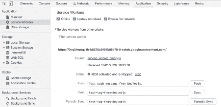

# 移动优先:服务人员入门

> 原文：<https://medium.com/walmartglobaltech/mobile-first-an-introduction-to-service-workers-61da5cb5780c?source=collection_archive---------0----------------------->

(Source: [https://www.toyteam.co.uk/](https://www.toyteam.co.uk/))

**什么是渐进式网络应用？**

从历史上看，本地应用因其对设备功能(如地理定位、推送通知、后台更新等)的访问和控制而被归类为更有能力。但通常本地应用的覆盖范围有点有限。

为了使用本机应用程序，用户必须明确安装应用程序，该应用程序会占用用户设备的内存空间，大多数用户都不习惯这样做，尤其是对于他们偶尔使用的应用程序。用户经常求助于基于 web 的替代方案，但是使用 web 应用程序是以功能减少为代价的。

托管和维护 web 应用程序通常比维护本地应用程序更昂贵，但对于本地应用程序开发来说，处理不同的操作系统也是一项开发开销。

这对开发人员和最终用户都造成了双重打击。如果我们能够利用本地应用程序的丰富功能和网络应用程序的外延，会怎么样？现在，这就是渐进式网络应用的用武之地。渐进式 web 应用程序本质上是轻量级的 web 应用程序，模拟了本地应用程序的行为。你一定想知道他们是怎么做到的。这就是网络工作者介入的原因。

网络工作者已经存在一段时间了。Web 工作者通过执行各种各样的后台任务，如网络拦截、缓存和缓存管理、推送消息等，来促进 JavaScript 中的并行编程。

**什么是服务人员？**

服务工作者本质上是一个 web 工作者，它作为独立于网页的后台进程运行，以满足不需要网页或用户交互的功能。

(Source: local system)

简而言之，服务工作者是针对专用应用程序注册的事件驱动的 web 工作者实现。由于服务工作器运行在工作器上下文中，因此它是非阻塞的，并且运行在与运行应用程序的主 JavaScript 线程不同的线程中。

实例化后，应用程序可以通过其代码中指定的事件处理程序与服务人员进行交互，反之亦然。这主要是由像 *postMessage()* 这样的 API 来完成的，这些 API 将数据作为' ***消息*** *'* 事件发送。这个' ***消息*** *'* 事件可以作为 navigator.serviceWorker 对象的一部分来捕获。

**为什么是服务工作者？**

随着服务人员模仿本地应用程序的行为，他们在开发渐进式网络应用程序方面越来越受欢迎。服务人员为渐进式 web 应用程序开发提供的一些广泛使用的功能如下:

**离线访问:**服务工作者可以通过使用[缓存 API](https://developer.mozilla.org/en-US/docs/Web/API/Cache) 缓存静态文件来提供离线访问，缓存 API 可以维护请求/响应对的缓存实例。尽管浏览器缓存存储有固定的配额，因此在生产环境中使用[缓存 API](https://developer.mozilla.org/en-US/docs/Web/API/Cache) 时，必须有足够的清除方案。通常 [Fetch API](https://developer.mozilla.org/en-US/docs/Web/API/Fetch_API) 和**[Cache API](https://developer.mozilla.org/en-US/docs/Web/API/Cache)**配合使用，方便离线访问。****

******后台同步:**停机期间为应用程序提供服务可以通过离线访问来解决，但如果基于用户操作，需要将一些数据发送到服务器，该怎么办？****

****该问题的解决方案在于向服务工作者请求一次性同步，然后在服务工作者中监听“同步”事件。它是这样工作的:****

******推送通知:**使用[推送 API](https://developer.mozilla.org/en-US/docs/Web/API/Push_API) ，服务人员可以监听服务器推送的消息/事件。基于消息的性质，服务工作者可以更新他们的本地状态或者将消息传递给用户。由于服务工作者独立于主 JavaScript 线程，因此不依赖于为生成推送通知而打开的浏览器。****

****下一步是什么？****

****现在我们知道服务工作者是强大的 web 开发工具，现代渐进式 web 应用程序可以极大地利用服务工作者来执行预测预取、跳出率管理、报价相关的推荐、支付请求等。由于这是一个介绍性的概述，更多关于使用、生命周期、最佳实践和案例研究的细节将会跟随其后。****