# 移动独立聚光灯第一集:摘下它

> 原文：<https://medium.com/google-developer-experts/mobile-indie-spotlight-episode-1-pluck-it-a50faa281033?source=collection_archive---------8----------------------->

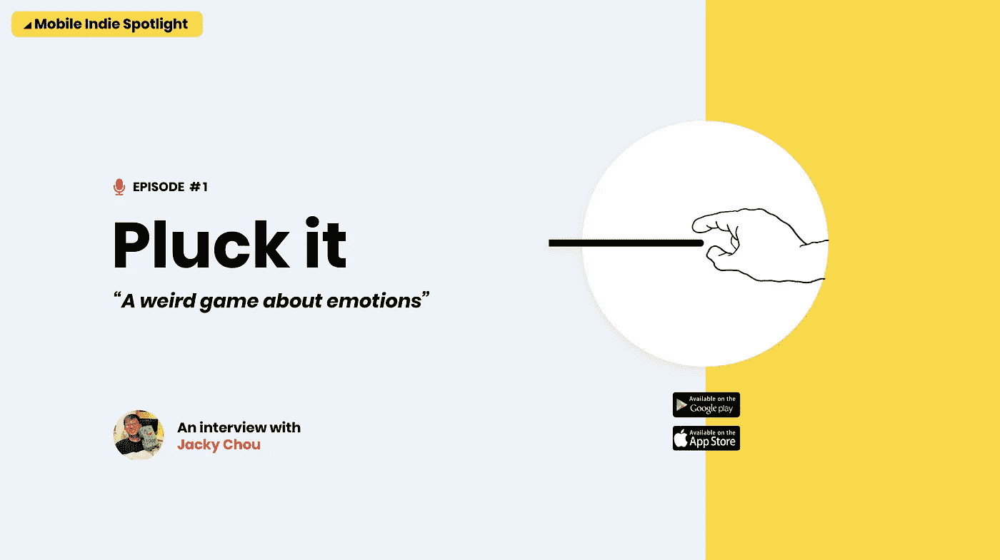

今天，我们将推出移动独立聚焦，我们将在这里采访来自世界各地的移动独立开发者，努力让他们的故事被听到，并与他人分享他们的知识和经验。

在这些采访中，我们将围绕产品和游戏设计、游戏化技术、a/b 测试、盈利策略、本地化、应用商店优化、社交机制、用户获取和其他有用的技术进行讨论，这些技术可以帮助移动应用发行商在不同的应用商店设计和发布更好的移动应用。

# 采摘它——一个关于情感的奇怪游戏

在这个博客的第一次采访中，我们有幸邀请到了来自香港的独立开发者 Jacky Chou 和他的应用 Pluck It。在 [AppStore](https://itunes.apple.com/us/app/pluck-it-hairs-and-emotions/id1377729521?mt=8) 和 [Google Play](https://play.google.com/store/apps/details?id=com.feelinggame.hair) 上都可以买到。这是一个关于奇怪的拔毛之旅的游戏。在这个过程中，用户在拔毛时会体验到各种各样的情绪。可能是你玩过的最诡异的游戏。

该应用是自助发布的，在不到 4 个月的时间里，在 AppStore 上的下载量超过了 100 万次。它最近也在 Google Play 上推出了。让我们看看背后的故事。

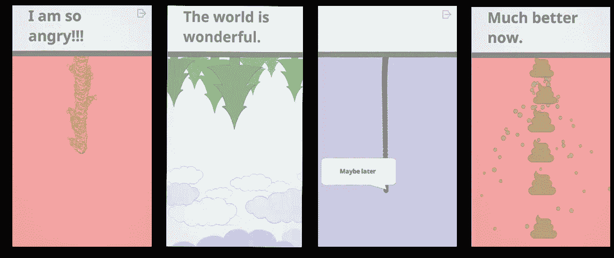

Pluck It exposes a set of different emotions

🎙Jacky，你能分享一些关于你的话吗？

你好，Andreas，我是一名独立开发者，目前在香港工作，我在澳门出生和长大。我从 9 岁开始玩电子游戏，制作游戏是我的梦想。我在美国学习计算机科学，在香港学习游戏设计。之后，我在一家香港游戏公司做全职程序员。一年后，为了有更多的自由创作游戏，我辞去了工作，成为了一名独立开发者。为了谋生，我同时做一些自由职业。

摘下它，是我第一个作为独立游戏正式发行的游戏。是我自己开发出版的。它是用最小的预算制作的，专注于制作一些新的和独特的东西，同时对人们有意义，而不需要在 It 的业务方面付出太多努力。

**🎙What 拔毛背后的故事是什么？**

有趣的是，当我思考的时候，我有一个拔下巴上的头发的小习惯。有一天，我只是觉得根据这种拔毛手势制作一个有机械的游戏会很有趣很酷。我做了一个初步的原型，把这种交互放到屏幕上。我开始思考如何围绕这一点创造一个游戏。每个关卡描述了一种不同的情绪(愤怒、快乐、悲伤、好奇和许多其他情绪)，游戏的设计和开发灵感来自我的日常生活。

游戏背后的核心主题和动机受到了游戏制作人 Jenova Chen 和的极大启发。Jenova Chen 谈到了如何创建有意义的游戏，这些游戏不仅有趣，还能帮助人们联系在一起，并在情感上保持积极。乔纳森·布洛讨论了制作一个对人类有意义的游戏的意识，并试图制作人们不会后悔玩的游戏。

# 一些统计数据

该应用程序是在 6 个月内开发的。3 个月用于编程，3 个月用于改进、翻译和熟悉 Google Play 和 AppStore 的物流和程序以发布应用程序。

*   Pluck 于 7 月中旬在 AppStore 和 10 月中旬在 Google Play 上发布。
*   在 AppStore 上，该应用的下载量超过 100 万次，用户来自 130 多个地区。
*   75%的安装来自 3 个国家:30%来自美国，40%来自中国，5%来自韩国。
*   这是一个免费的游戏。该应用有一个捐赠区，用户可以通过应用内购买(IAP)进行捐赠。0.5%的用户支付 3 种 IAP 选项中的一种。
*   该应用程序有一个 7 天的保留周期
*   该应用程序在用户评级和评论中获得了很高的分数

Pluck 已经在不同的比赛中得到认可，迄今为止已经获得了多个奖项，包括[腾讯创新游戏奖铜奖](http://gameinstitute.qq.com/innovativegames/prize)、[独立奖决赛东欧](http://www.indieprize.org/serbia2018/index.html)和[Indie play 2018-中国独立游戏奖](https://www.g-cores.com/articles/102283)

该应用程序由 [Unity](https://unity3d.com/) 开发，使用 [Unity Analytics](https://unity.com/solutions/analytics) 。对于图形，使用了 [Vectr](https://vectr.com/) (一款矢量艺术开源软件)，而游戏中的字体则是从[谷歌字体](https://fonts.google.com/)的开源目录中检索而来。

使用的图形是极简和简单的。当一些事情看起来简单时，它通常会给人们增加一层意义，并引发他们的思考。它想让人们思考他们的情感。

游戏里的声音是通过 Jacky 室友的录音笔用 Jacky 的声音录下来的。其他一些音效是从网络上的不同网站上免费找到并使用的，比如[免费音效网站](https://freesound.org/)。

# 早期访问和反馈

在开发游戏时，Jacky 最初使用了一个测试组，主要由玩游戏的朋友和家人组成，并在早期提供有用的反馈，特别是围绕游戏的控制机制。

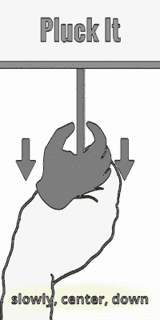

User is trained within the game on how the mechanics work

**🎙Jacky 我们看到你使用了一个入门教程和几个关卡中的提示试图向用户解释游戏的概念。那有什么帮助？**

入职辅导非常重要。游戏的机制和控制非常独特，很可能玩家以前没有经历过类似的事情。我试图创建一个入门教程，指导用户更快地熟悉控制，这样他就可以继续玩游戏了。

在早期的测试中，大多数人(大约 10 人中有 9 人)没有得到控制。随着大量教程的引入，大多数玩家(大约 10 个中的 8 个)理解了游戏的控制，而没有明确地告诉他们。

让人们在早期玩这个游戏是非常重要的，因为它可以改变你设计游戏的方式。

Pluck it 的早期版本没有使用任何文本。超过 19%的人在第一层离开。随着文本的引入，我设法将这个百分比降低到 15%以下。在这个过程中，加入了语音和图像，让人们理解游戏。

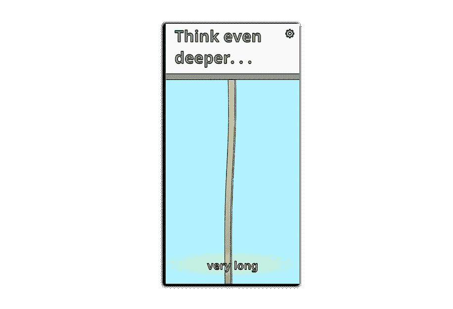

Text during the gameplay helped user stay and play the game

现在 60%的用户，玩到游戏中级。看起来，如果他们明白了，他们会继续下去，继续这个故事。

# 货币化战略

这款游戏的设计没有任何盈利策略。重点是提供一个创造性的游戏，并在这个过程中进行实验。

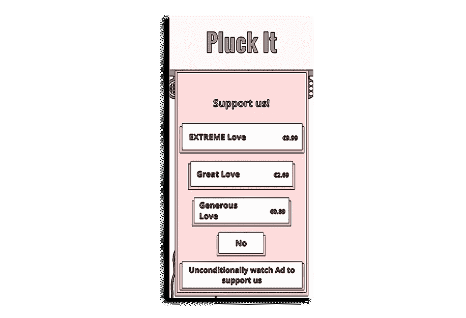

Donations page

游戏中有一个捐赠区，有 3 个不同的 IAP 选项。人们捐款，这有助于未来游戏的创作。0.99 美元(慷慨的爱)是最受欢迎的选项，迄今为止约有 0.5%的用户捐赠了。最近推出了一个观看广告的选项(也是以捐赠的形式),使用了 Unity Ads 的奖励视频，但现在分享任何数据还为时过早。

另一个可以在不久的将来实现的盈利策略是，当用户停留在某个级别时，可以选择采取有回报的广告行为来换取提示。

# 本土化

目前游戏中的文本提供了 19 种不同的语言。大部分的翻译都使用了名为[localized direct](https://localizedirect.com/)的在线翻译服务，而其他一些语言则由一些朋友帮忙翻译。实际上，游戏的大部分成本都花在了本地化上。

**🎙Did 游戏的本地化有助于收购吗？**

这确实有所帮助，特别是在韩国和日本等地区，这款应用开始变得流行，并被 Youtube 流媒体播放。

# 营销和用户获取

**🎙Did:你在获取新用户的营销方面花费了预算吗？**

不，这款应用的所有用户都是通过有机增长获得的。我自己在 Instagram、脸书页面、Discord、微博和其他社交渠道推广这款游戏。

However due to the “weirdness” of the nature of the game and the funny and innovative gameplay, it got the attention of AppStore and of several popular Youtube game streamers including [ファミ通 App](https://www.youtube.com/channel/UCcxj8uiQUeSfMHLy_Sk8FhA), [lonniedos](https://www.youtube.com/watch?v=9FnlH30mR-U&feature=youtu.be), [Drop Rate](https://www.youtube.com/watch?v=UQv2ZpFVHwQ), [蠢蠢](https://www.youtube.com/watch?v=wsANYEELiNw) and [KittyKat Gaming](https://www.youtube.com/watch?v=Tcd4vRH9g8A) channels.

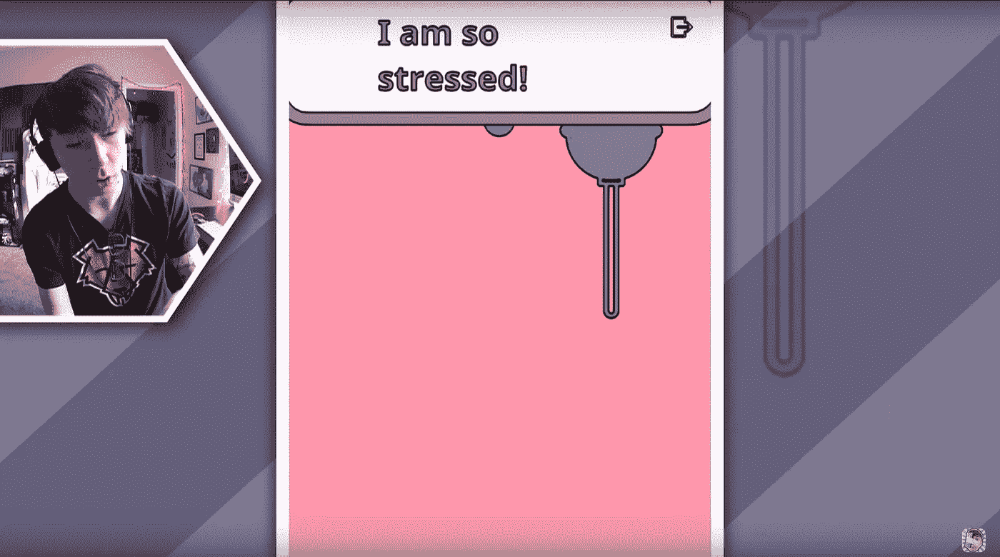

Pluck It as seen on lonniedos Youtube channel

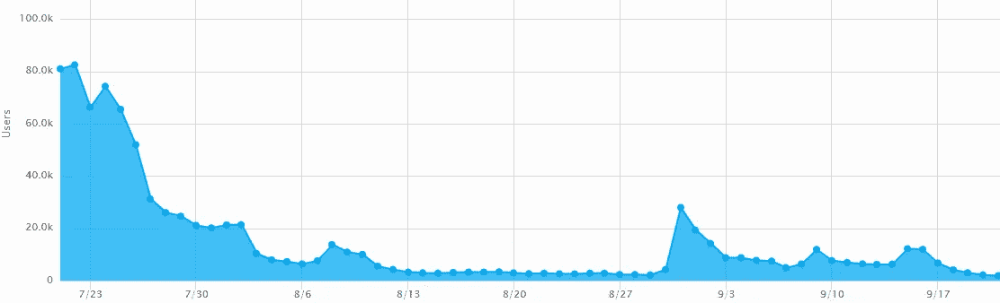

Impact on new users when app got featured on AppStore or when played by streamers

在流行的 Youtube 频道上进行直播对游戏的收购帮助很大，因此 Google Play 版本可能会遵循类似的策略。

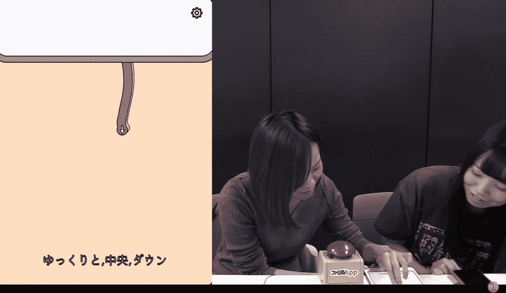

Pluck it on [ファミ通 App](https://www.youtube.com/channel/UCcxj8uiQUeSfMHLy_Sk8FhA) Youtube channel

在 AppStore 上，该应用程序在许多不同的地区都有特色！

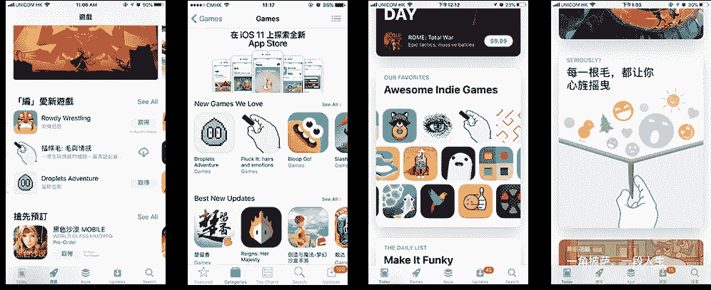

Pluck It as featured on AppStore

# 社会机制

游戏中有两个位置，用户可以用来与朋友分享他们的经历。一个在每一关完成后，另一个在主菜单中。第一个已经被证明非常有效，而后者似乎不是一个广泛使用的选择。

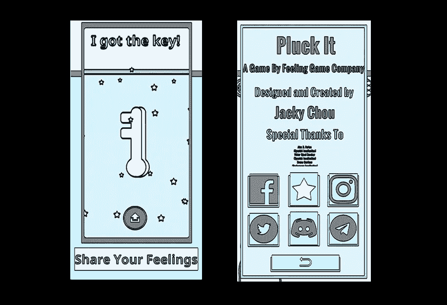

**🎙During 游戏玩法，在每一关之间，用户会被提示几分钟来分享他们通过每一关的成功。你为什么采用这种方法？**

在测试游戏的早期阶段，人们认为这是一个令人讨厌的功能。然而我坚持要留着它。我想鼓励人们思考自己的感受，并与他人分享。它也是玩家在不同关卡之间的自然停顿，是游戏设计的一部分。

根据分析，12%的玩家点击和分享，有助于获得游戏。

# 用户评论和反馈

这款应用已经获得了很多评级和评论，尤其是在 AppStore 上，虽然其中一些很有趣，但其他一些确实有助于收集可操作的反馈以改进游戏。

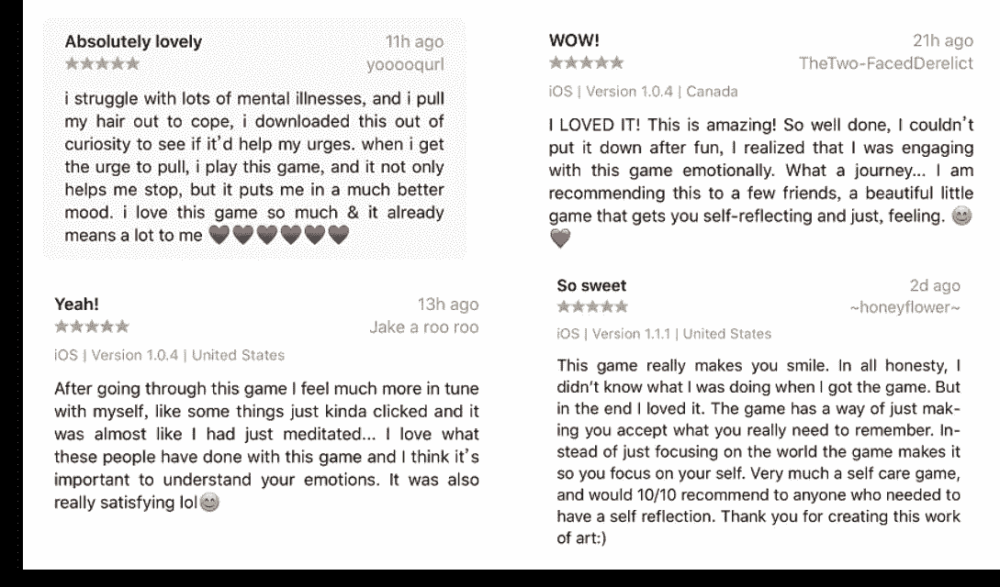

User ratings and feedback on AppStore

**🎙How 你对待用户评分和评论吗？**

从我从玩家那里读到的评论和反馈中，我意识到他们对游戏的概念有非常不同的理解和非常不同的感受。一些玩家认为游戏实际上让他们更多地思考自己的情绪状态，而另一些玩家在玩一些关卡时感到鼓舞。其他人只是有很多快乐，或者只是随着每一关的临近而开怀大笑。

我试着回应所有的评论，尤其是负面的。通过商店用户评论的反馈，增加了更多关于游戏初始用户介绍的指导。同样的事情也发生在决定选择关闭振动的时候。我试图通过不断监测用户的意见来改进应用程序。

# A/B 测试

**🎙What 你在游戏开发期间有没有进行 A/B 测试？**

在最初测试阶段的游戏开发迭代中(在朋友的帮助下)，我 A/B 测试了一些机制，比如用户在屏幕上拖动头发的速度，但通过这些测试获得的最重要的发现是等级的顺序。

我很早就意识到，等级的顺序似乎会影响用户对应用的看法。结果是，入门级需要有一些快乐或中性的情绪，他们应该更放松和有趣，而不是咄咄逼人。这有助于用户进一步坚持使用这款应用。

# 出版

该应用程序目前在 Google Play 和 AppStore 上都可以使用。

**🎙How 从 AppStore 迁移到 Google Play 有什么不同或困难吗？**

这与其说是两家商店的差异，不如说是为各种 Android 设备调整游戏。有这么多不同类型的 Android 设备。我必须调整和测试很多东西，这需要时间。移动到 Android 的一些挑战是调整触觉反馈、振动、长宽比和屏幕密度。在调整游戏控制方面也投入了很多努力。我必须让用户的体验尽可能的流畅。

另一方面，因为这款游戏在 Mainland China 很受欢迎，我想在全球不同的商店同时发布《啄食》安卓版。然而，向几家商店发布需要时间来理解流程，并且需要做大量的工作。

全球有很多 Android 市场，需要花时间去了解所有的市场，了解需要做什么。我名单上的一些商店是 [OPPO 市场](https://www.oppomobile.com/)、[阿里巴巴分销渠道](https://open.uc.cn/)、 [Vivo app](https://developer.vivo.com.cn/doc/products/pc/index.html#firstPage) 市场和[安智 app](http://www.anzhi.com/) 市场。此外，为不同的商店(例如 IAP)理解和实现不同的 SDK 也是流程中的额外开销。

# 后续步骤

下一个是🎙What？

我会继续做更多的游戏。我现在大部分时间都在制作游戏，而且大部分时间都在和其他开发者合作。拔毛是完成了，但是还会在几个展览中呈现。这是我的第一场比赛，已经是一件大事了，所以我真的很兴奋。我没想到会有这么多人喜欢它。我用它交了很多新朋友，也遇到了很多有着同样热情的出版商和独立开发者。

> 我想鼓励全球其他独立开发者，即使在 2018 年，即使预算很低，只有一个人，你仍然可以制作一款对人们有意义的游戏，并有很多人玩它。做你爱做的事！