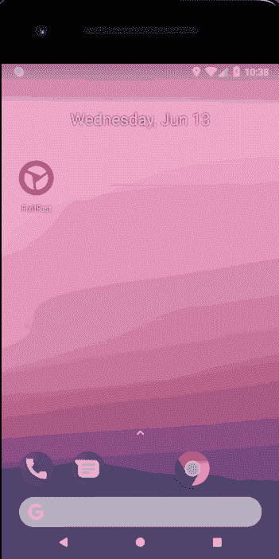

# Oracle JET 中的移动通知

> 原文：<https://medium.com/oracledevs/mobile-notifications-in-oracle-jet-5896a3da1729?source=collection_archive---------3----------------------->

我一直在研究通知在 Android 中是如何工作的(很快也会在 iOS 应用程序中使用)。

为了开始我的实验，我一直使用 Oracle JET toolkit，因为它提供了一个混合应用程序:FixItFast 演示。

为了设置场景，我不是一个手机应用程序开发者。事实上这是我的第一次经历。随之而来的是一些混乱和误解。然而，通过所有这些努力、理解和研究，我终于有了一些值得注意的东西。

Notification received in Android

# 在活动

我打算写一系列的帖子来说明我到底是如何走到这一步的，但是出于本文的目的，我将展示一个 GIF，展示实际上是如何工作的:

Oracle JET application receiving and processing notification

# 我不明白你上面展示的是什么

啊！没关系。你可能不是唯一一个这样做的人，所以让我们看看这向我们展示了什么。

上面的 GIF 展示了部署在 Windows 中运行的 Pixel 2 模拟器上的 Oracle JET 演示应用程序。

我已经扩展了移动应用程序，以 1)通过 PhoneGap 插件获得令牌 2)将令牌发送到我的服务器，3)监听通知。

当应用程序第一次加载时，上面的步骤 1 和 2 开始运行。然后，我简单地将一个可观察变量设置为“这里将会看到通知！”。这个可观察值只是一个“巧妙的变量”,我已经把它放在了闪屏上。

当第 3 步发生时，我处理通知点击，并将同样的可观察对象设置到通知标题，从而证明我可以处理点击。

这就是你在最后看到的红色部分——包含日期/时间的通知标题(JavaScript`new Date()`函数调用)。

# 我解决了什么？

## 体系结构

要做到这一点，你需要一个可以托管 HTTPS 服务器的地方。这是因为你需要主机<something>来接收电话注册令牌。这个主机通过这个注册令牌向注册的电话发送通知。</something>

这是最难克服和理解的事情之一。

1.  应用程序加载和 PhoneGap 插件已激活
2.  移动应用程序中的 Javascript 代码运行以获取通知令牌
3.  应用程序向您的服务器发送通知令牌(需要 SSL，否则请求不成功)
4.  服务器代码存储它，并可以在任何时候推送通知。我从我的主机通过 FCM (Firebase Cloud Messaging)通过本地 AJAX 调用向令牌发送通知。此通知包含标题、正文、右侧图像和通知频道。
5.  手机收到通知，并显示它。如果有频道设置，则通知显示在“最前面”,否则会弹出到“阴影”中

## Android 通知渠道

奥利奥以后的安卓版本都需要“通知通道”。如果没有这一点，你的信息和重要的通知将不会显示在设备的锁定屏幕上，甚至在应用程序处于后台时从顶部下降(如上所示)。

发生的情况是你的通知总是被放到“阴影”中(用户通常用手指/拇指下拉的下拉区域)。

## 处理通知

这对移动开发者来说并不新鲜，但对我来说却是一件大事。我的意思是，如果你不能处理被点击的通知，那它还有什么意义呢？

因此，在“劫持”FixItFast 闪屏的帮助下，我演示的是接收通知标题和背景信息

## 通知包含图像

通知右侧包含一个图像(不要与下面详述的应用程序图标相混淆)。

该图像由通知本身控制(因此由我的服务器控制),并指向 web 上的图像。

## 通知应用程序图标和颜色

这是最后要解决的事情。您可以控制显示在通知左侧的图标。此图标与手机顶部栏中显示的图标相同。请注意，这个图标实际上就像一个“遮罩”，您可以决定通过该遮罩显示什么颜色(png 包含一个透明区域)。

使用图标，您可以改变颜色。在上图中，您可以看到我选择了红色来“穿透”通知中的 Oracle JET 图像。这也改变了显示应用程序名称的文本:“FixItFast”。

# 摘要

虽然这里没有什么新东西，但是在 Oracle JET 中很少有与**MCS 无关的通知信息。我能理解，因为 Oracle JET 是一个企业产品。然而，对于任何喜欢用 JET 做项目的人来说，我已经证明了你可以用 FCM 自己做这件事。**

编码快乐！