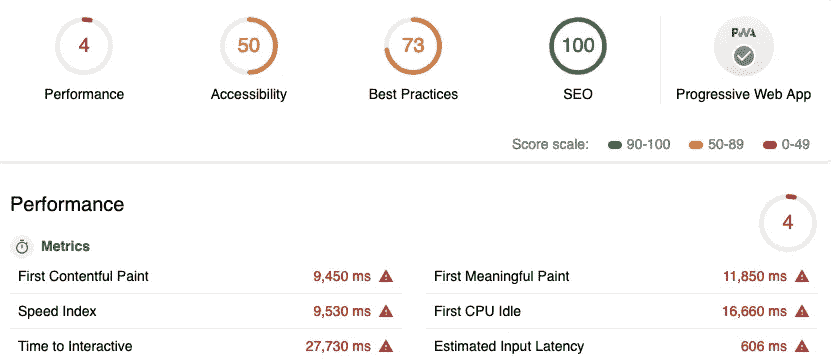
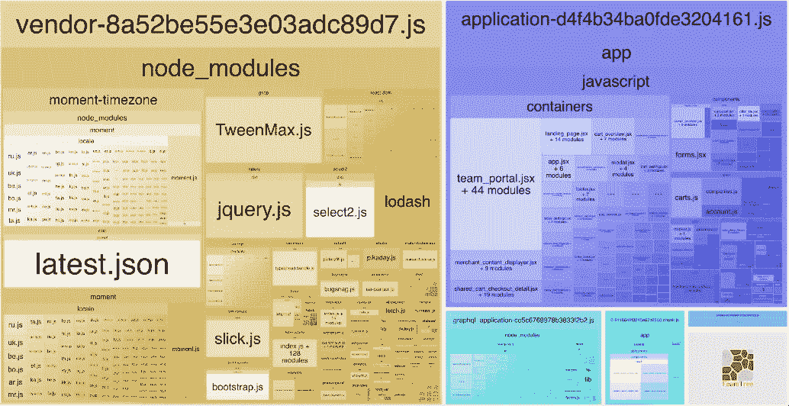
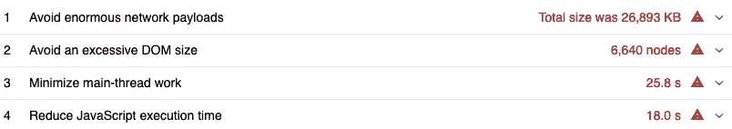
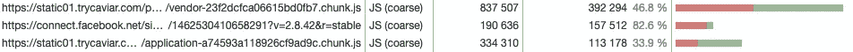
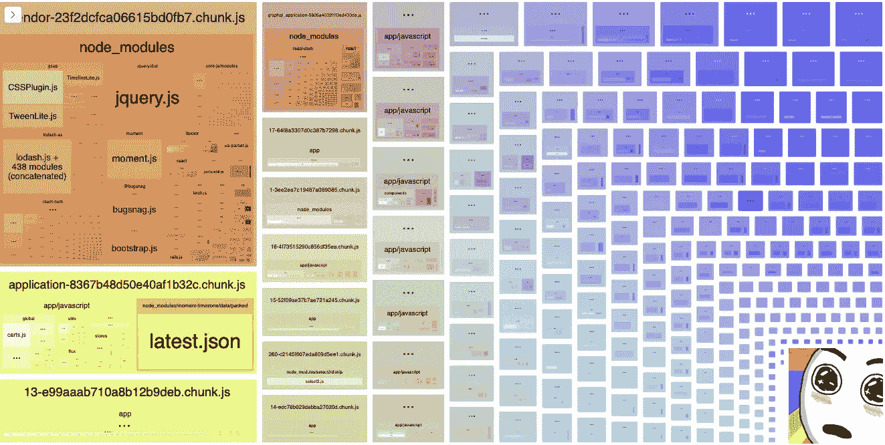
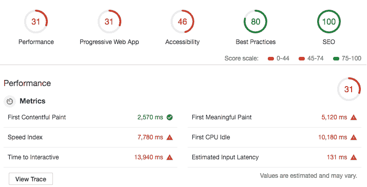

# Caviar 的移动网络性能

> 原文：<https://medium.com/square-corner-blog/mobile-web-performance-caviar-1a57da0cc233?source=collection_archive---------2----------------------->


> 注意，我们已经行动了！如果您想继续了解 Square 的最新技术内容，请访问我们的新家[https://developer.squareup.com/blog](https://developer.squareup.com/blog)

纵观任何电子商务网站，页面加载时间与转化率直接相关。面对一个加载时间超过 3 秒的页面， [53%的用户离开](https://www.thinkwithgoogle.com/marketing-resources/data-measurement/mobile-page-speed-new-industry-benchmarks/)，也许再也不会回来。[加载时间延迟 1 秒会导致转化率下降 7%，页面浏览量下降 11%，客户满意度下降 16%。](http://loadstorm.com/2014/04/infographic-web-performance-impacts-conversion-rates/)在 SEO 方面，页面速度慢也会影响索引算法，这会降低抓取效率，导致被索引的页面减少。

对于手机用户来说，网速慢更加痛苦。随着越来越多的消费者转向移动优先体验，我们需要优化速度，而不需要极速的互联网甚至 4G 速度。通常，这方面的改进意味着更好、更有效地管理您的请求和您加载的内容。

随着我们今年向新市场扩张，这种移动第一视角是 Caviar[的首要考虑。在我们采用这种方法的过程中，我们开始注意到在移动网络上尝试新功能似乎要花费异常长的时间。我们意识到我们的移动网络体验远非理想，因为 Caviar 网站最初是为桌面构建的。从开发人员的角度来看，从桌面到移动的转变并不是一个干净的转变，因为我们自然有更多的资源用于 web，而不太可能测试移动。](https://trycaviar.com)

我们绘制了用户关键路径上的核心网页，并决定专注于起点:我们的主页。这是大多数 trycaviar.com 访问者开始浏览的页面，也是我们访问量最大的页面之一。我们使用 [Google Lighthouse](https://developers.google.com/web/tools/lighthouse/) 来审计我们的主页，作为基线和完全披露——这并不好看。



Our initial Lighthouse audit.

# 设置指标

在 Caviar，我们的堆栈包括与 [Webpack](https://webpack.js.org/) 捆绑在一起的 React/Rails，这是一个通常与 React 结合使用的构建工具。Webpack 是一个模块捆绑器，它从指定的入口点开始构建一个依赖图，并抛出一个包供浏览器加载。它主要用于 JavaScript，但也能够管理任何类型的前端资产，包括 HTML/CSS 甚至图像，并且最终负责我们最终完成的大量 JavaScript 工作。我们结合这个使用的一个整洁的工具是 [Webpack Bundle Analyzer](https://github.com/webpack-contrib/webpack-bundle-analyzer) ，它允许我们看到我们正在拉入的依赖项的内容和位置，以及它相对于其他的占用了多少空间。后来，这帮助我们识别重复的依赖项，并在需要时将依赖项分割成更小的块来动态导入，而不是一次性加载。



This allowed us to quickly visualize what was going in to our bundles.

我们很早就得出结论，任何快速的胜利都不会带来明显的改善，因为我们的感官无法察觉微秒的变化。幸运的是，有各种各样的页面性能跟踪工具供我们使用。在整个工作中，衡量我们成功的第一步是构建必要的基础设施来跟踪我们的进展并确定我们的痛点。

我们需要一种简单、系统的方式来运行 Lighthouse CLI，以便它准确地跟踪我们的进度。因此，我们将其纳入了 CI 渠道。我们发现 Lighthouse 的分数会随着我们运行它的计算机的不同而不同，所以这减少了差异的数量，因为它总是在我们的构建机器上运行。我们开始密切监视我们的 JavaScript，并安装了 [bundlesize](https://github.com/siddharthkp/bundlesize) 包来更好地跟踪我们的应用程序和供应商包的大小。基于此，我们添加了一个“预算”测试，以确保我们的捆绑包在指定的数量内。这些变化使我们能够基于每次提交跟踪我们的指标，并确定新功能或代码变化如何影响我们的性能分数，同时保持相同的保真度。这并不意味着它会阻止任何部署，因为我们可以通过更新测试来简单地增加预算规模，而是提高性能影响的清晰度，并让我们明确确认我们(或不)接受它。为了增加可见性，我们记录了浏览器性能对象在每个页面加载上的时间，可以通过`window.performance`访问，这样我们就可以使用数据可视化工具来查看我们的进度。

既然我们已经有了必要的基础设施来跟踪我们的进展，我们就可以更好地可视化代码变更的性能影响。



Lighthouse suggestions based on our audit.

# DOM 节点和图像优化

通过 Lighthouse 的建议和我们的分析工具，我们开始确定我们可以在哪里以及如何产生最大的影响。Caviar 是一个图像密集型网站，所以我们推断图像加载的优化可以通过规模的力量带来巨大的性能提升。我们发现，在某些情况下，我们将 3000 x 2000 像素以上的图像渲染到一个 260 x 100 像素的小空间中！在 Caviar，我们重视高质量的图像，但可以说，这是不必要的，并且对我们的性能产生了负面影响，图像质量的收益很小。

我们通过一个名为 [Thumbor](https://github.com/thumbor/thumbor) 的图像服务运行我们的图像，并用一个以 WebP 格式加载响应图像的包装器替换所有图像。这确保了我们的移动用户不会加载不必要的大图像，并保证了我们上传的图像之间的一致性，这一点非常重要，因为我们今年将为我们的餐厅合作伙伴推出自助服务。这使得我们的第一个内容丰富的绘画指标从 9.45 秒提高到 3.5 秒，比 T2 快了将近 6 秒！


Can you see the difference? Neither can we.

随着图像加载势头的充分发挥，我们继续仔细审查我们的请求。我们做了一些小的改动，比如将 png 精灵转换成 SVG，这样它们就可以内联加载，而不是执行另一个网络请求。我们做了很大的用户界面改变，比如重新思考页面上的内容。我们的主页曾经在登陆时加载所有的餐馆。在限制了我们在初始页面加载中呈现的 DOM 节点的数量并要求用户点击 CTA 来加载其余的之后，我们将交互速度提高了 **4 秒**。由于这个页面上的动态信息量，它几乎总是有大量的 DOM 节点，但是我们在初始加载时为一个访问量最大的页面减少了将近 50%的节点。

这些对我们来说都是立竿见影的效果，但不幸的是，这也是我们通过*专注于限制网络请求所能达到的极限。现在是解决 JavaScript 代码执行时间的时候了。*

# 缩减和分块捆绑包

无论用什么标准来衡量，我们都是从巨大的包开始的。在使用 Webpack Bundle Analyzer 提供的可视化工具作为指导机制，查看了最大的包列表之后，我们划掉了那些我们绝对不能删除的包，比如 React，不幸的是还有 jQuery。剩下的最大的违规者是 moment 和 lodash，它们都很大，因此是 npm 最依赖的两个软件包。我们发现我们实际上同时加载了时刻和时刻时区。Moment-timezone 覆盖了我们所有的用例，所以我们能够删除 Moment。默认情况下，Webpack 包括 moment/moment-timezone 的所有区域设置文件。因为我们没有使用它们中的大部分，所以我们删除了所有带有`IgnorePlugin`的语言环境文件，只通过自定义配置文件加载了我们需要的文件。在类似的字符串中，lodash (CommonJS)被替换为 lodash-es，它被导出为 es 模块，并且是树摇动的。

我们已经通过`CommonsChunkPlugin`使用 Webpack 将 JavaScript 代码捆绑成应用程序和供应商捆绑包。简而言之，这允许浏览器缓存供应商包，这样，如果只是应用程序发生变化，客户端就不需要再次加载供应商文件。由于页面会发出更多的请求，对于初次访问者来说，开销会稍微大一些。客户端级缓存减轻了经常性访问者的成本，他们应该会看到页面加载速度的下降。

对于我们提供的其余包，我们使用 Chrome DevTool 的代码覆盖面板进行了审计，以找出页面上使用了多少 JavaScript。不足为奇的是，其中很大一部分被加载和未使用。



Disclosure: This was after the improvements we made so just imagine it being much worse!

当时，我们还在 Webpack 3 上，代码分割受到了`CommonsChunkPlugin`的限制。该插件只允许应用程序分块，由于其父子分块方法，有时会导致加载比必要更多的代码。Webpack 4 已经废弃了这个插件，现在正在使用一个更有效的`optimization.SplitChunks`插件，它也可以处理供应商分裂。代码分割使用动态导入加载代码，这样用户只下载他们正在查看的网站部分所需的代码。

```
// Application
import('./Modal').then(({default: Modal }) => {
  this.openComponent(Modal);
})// Vendor
import('package').then(({ default: Package }) => {
  Package.doStuff();
})
```

这个语法自动告诉 Webpack 在此时开始代码分割，并创建一个单独的块。代码分割允许我们削减我们在每个页面上提供的基础包，并在必要时动态加载其余的包。



So many colors and chunks!

我们现在使用`react-loadable`动态加载组件，而不是直接挂载单个组件。然而，当我们使用 HTTP/1.1 时，由于请求数量增加带来的开销，性能上的改进微乎其微。在迁移到 HTTP/2 之后，我们开始看到一个巨大的变化，这要归功于它复用并行请求/响应的能力。这使我们能够快速减少主线程上的初始 JavaScript 执行时间，而无需大量的重构工作，并导致我们的 Lighthouse 分数的实质性提高。

几天后，我们的预算测试实际上发现了一个代码变更，这使得我们的应用程序包超出了限制！我们能够查看过去的提交，并跟踪由于我们的 Webpack 升级中对 babel 的更改而导致的捆绑包大小的大幅增加。在本练习结束时，我们大幅缩减了基础包的大小:

```
vendor.js: 436kb → 233kb
application.js: 186kb → 46kb
```

# 决赛成绩

概括一下:

*   调整大小/压缩成 WebP 格式和使用响应图像减少了我们第一次内容丰富的绘画 6 秒。
*   限制 DOM 节点将我们的交互时间减少了 4 秒。
*   通过优化我们的软件包使用，我们的供应商捆绑包减少了约 145kb。
*   代码分割和在 HTTP/2 上动态导入包和组件累计减少了我们的基本包大小超过 50%,这进一步减少了我们的 TTI 10 秒，并将其降低到大约 13 秒。



In the green!

# 下一步是什么

有了合适的基础设施和我们在过去一个季度所做的代码改进，我们有信心继续提高我们的移动网络性能。当我们处理下一个性能前沿时，我们会牢记这一点:jQuery、fluxxor 和 CSS 形式的遗留代码。下次见！