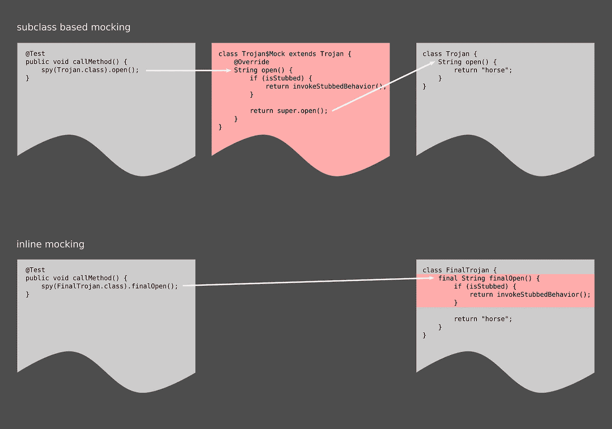
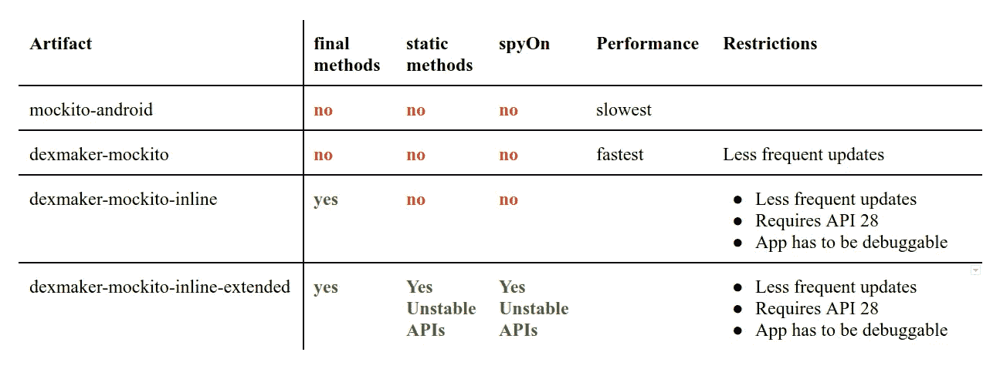

# 在 Android 设备上模拟 final 和 static 方法

> 原文：<https://medium.com/androiddevelopers/mock-final-and-static-methods-on-android-devices-b383da1363ad?source=collection_archive---------6----------------------->

Photo by [Steven Lewis](https://unsplash.com/photos/dmHnXJ-5ilQ?utm_source=unsplash&utm_medium=referral&utm_content=creditCopyText)

## *TL；博士:*

使用 Android P，开发人员可以模仿 final 类和 stub final 和 static 方法。这将允许测试直接针对以前不可检测的类运行。

## 关于莫奇托

[Mockito](http://site.mockito.org/) 是一个流行的 Java 模仿库。开发人员可以使用它来拦截方法调用，并用其他行为替换它们:

这种方法行为替换被称为“存根方法”。

此外，Mockito 方法`[spy](https://static.javadoc.io/org.mockito/mockito-core/2.19.1/org/mockito/Mockito.html#spy-T-)`创建原始对象的可清除克隆。间谍对象的字段是原始字段的副本，并且间谍对象的方法可以被存根化:

使用 Mockito 的插件系统，可以替换 Mockito 的某些组件。例如[*mock ITO-android*](https://repo.spring.io/jcenter/org/mockito/mockito-android/)*和*[*dexmaker-mock ITO*](https://bintray.com/linkedin/maven/dexmaker-mockito)*用一个能够生成在 Android 设备上工作的模拟的组件替换常规的模拟生成组件。让我们使用“Mockito 变体”这个术语来讨论替换了组件的 Mockito 库。***

***所有变体都支持相同的 API，即`[mock](https://static.javadoc.io/org.mockito/mockito-core/2.19.1/org/mockito/Mockito.html#when-T-)`、`[spy](https://static.javadoc.io/org.mockito/mockito-core/2.19.1/org/mockito/Mockito.html#spy-T-)`、`[when](https://static.javadoc.io/org.mockito/mockito-core/2.19.1/org/mockito/Mockito.html#when-T-)`、`[verify](https://static.javadoc.io/org.mockito/mockito-core/2.19.1/org/mockito/Mockito.html#verify-T-)`等。***

## ***Stubbing 最终方法***

***常规的 Mockito 模仿和间谍是模仿类的子类。所有拦截代码都存在于覆盖原始方法的方法中。因此，最初只能清除非最终实例方法。***

***从 Mockito 2.1.0 开始，Mockito 变体 [*mockito-inline*](https://repo.spring.io/jcenter/org/mockito/mockito-inline/) 也允许开发者存根最终方法:***

**由于最终方法不能被覆盖，*的模拟生成代码 mockito-inline* 会修改被模拟类的字节码，并将拦截代码直接内联到原始方法中。**

****

***mockito-inline* 实现了对基于 Java 字节码的运行时的存根最终方法的支持。Android 运行时使用 [Dalvik 字节码](https://source.android.com/devices/tech/dalvik/dalvik-bytecode)，因此该变体不适用于 Android。**

**Mockito 变种[*dexmaker-mock ITO-inline*](https://bintray.com/linkedin/maven/dexmaker-mockito-inline)可以通过使用 Android P 中增加的改进的 [JVMTI](https://en.wikipedia.org/wiki/Java_Virtual_Machine_Tools_Interface) 功能，将方法调用拦截代码内联到原类的 Dalvik 字节码中。**

**JVMTI 是应用程序和运行时之间的接口。它允许对当前应用程序进行深度自省和操作。目前，该应用程序需要标记为[Android:debuggeable](https://developer.android.com/guide/topics/manifest/application-element#debug)才能使用 JVMTI。因此*dexmaker-mock ITO-inline*要求将应用程序标记为可调试。**

**在 Android P 之前，JVMTI 支持不足以满足 T21 的需求。因此，新的模拟功能至少需要 Android P。**

## **Android 特有的增强功能**

**用于最终方法的相同字节码修改可用于允许开发人员存根静态方法。Mockito API [还没有提供 stub 静态方法的接口](https://github.com/mockito/mockito/issues/1013)，因此需要添加新的接口。**

**与常规的实例存根化最大的区别是没有自然的地方来重置静态方法的存根化。为了定义范围，mock ITO variant[*dexmaker-mock ITO-inline-extended*](https://bintray.com/linkedin/maven/dexmaker-mockito-inline-extended)扩展了 [Mockito sessions](https://static.javadoc.io/org.mockito/mockito-core/2.7.6/org/mockito/MockitoSession.html) 来定义嘲讽的范围。*dexmaker-mockito-inline-extended*是 dex maker-mock ITO-inline 的扩展，因此适用相同的限制。**

**在 Android 中，某些对象是由系统创建的。因此，拦截此类对象的创建并不容易。这类物体中最突出的可能是[活动](https://developer.android.com/reference/android/app/Activity)物体。**

**为了解决这个问题*, dexmaker-mock ITO-inline-extended*添加了将现有对象转换为间谍的方法`[spyOn](https://moltmann.github.io/dexmaker/com/android/dx/mockito/inline/extended/ExtendedMockito.html#spyOn-java.lang.Object-)`。**

**关于新增功能的完整描述可在 [github](https://moltmann.github.io/dexmaker/com/android/dx/mockito/inline/extended/ExtendedMockito.html) 上找到。**

## **基于 Dalvik 字节码的运行时的 Mockito 变体比较**

****

## **端到端示例**

** [## 应用

### dex maker-mock ITO-inline-extended-Examples-dex maker-mock ITO-inline-extended 的示例

github.com](https://github.com/moltmann/dexmaker-mockito-inline-extended-examples/blob/master/app/src/main/java/priv/moltmann/locationlogger/LocationLogger.java)  [## 试验

### dex maker-mock ITO-inline-extended-Examples-dex maker-mock ITO-inline-extended 的示例

github.com](https://github.com/moltmann/dexmaker-mockito-inline-extended-examples/blob/master/app/src/androidTest/java/priv/moltmann/locationlogger/PermissionGrantLocationLoggerTest.java)**