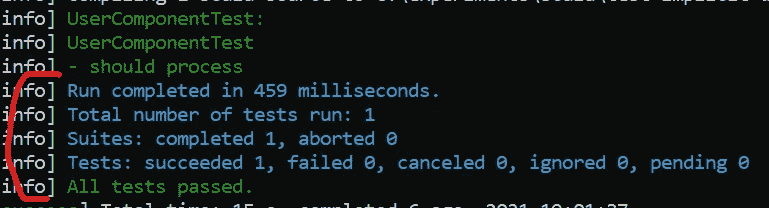
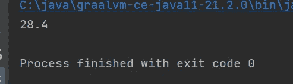

# Scala 中特征与自身类型的模拟合成

> 原文：<https://medium.com/globant/mocking-a-trait-composition-in-scala-d52c5305b8c9?source=collection_archive---------0----------------------->


Scala 的 ***特性*** 是一个强大的建模工具，它们让我们实现“复合胜于继承”，从而在面向对象设计中实现更大的灵活性。然而，在一些情况下，在单元测试中模仿这样的组合类是困难的，甚至是不可能的。让我们来看看其中的一种情况:具有*自身类型*的特质构成。

# 自身类型

通过使用自类型，我们可以在我们创建的特征中实施依赖约束，这表明任何混合了我们的特征*的类也必须混合我们指定为自类型*的特征。例如:

```
trait OurTrait { this: ASelfTypeTrait =>
  def doThisAndThat() = …
}// Wrong: must extend also ASelfTypeTrait
class OurCustomClass extends OurTrait {
...
}// OK
class OurCustomClass extends OurTrait with ASelfTypeTrait {
}
```

好了，现在让我们进入正题。

# 我们的案子

让我们假设我们的代码库包含这样一个特征:

```
trait BaseTrait {

  val optMultiplier: Option[Int]
  val *multiplier* = optMultiplier.getOrElse(0)

  def multiplyIt(v: Float): Float = v * *multiplier* def squareIt(v: Float): Float = v * v

}
```

而且它还包含了另一个以上面那个为自型的特质:

```
trait IntermediateTrait { this: BaseTrait =>

  def oneTenth(v: Float): Float = v / 10

}
```

我们的代码库还包含另外两个特征，每一个都定义了独立的方法集，以实现关注点的分离:

```
trait FirstUpperTrait extends IntermediateTrait { this: BaseTrait =>

  def squarePolinomial(v: Float): Float =
    squareIt(v) + multiplyIt(v)

}trait SecondUpperTrait
  extends IntermediateTrait { this: BaseTrait =>

  def quarterIt(v: Float): Float = v / 4

}
```

现在我们创建一个组件作为前面特征的组合:

```
class MyComponentImpl(
  override val optMultiplier: Option[Int] = *Some*(3)
) extends BaseTrait
  with IntermediateTrait
  with FirstUpperTrait
  with SecondUpperTrait
```

该组件包含了我们剩余代码中所需的所有基本操作，并确保 **optMultiplier** 仅初始化 ***一次*** 。这个例子看起来很琐碎，但是想象一下这不仅仅是一个 ***选项【Int】***而是一个数据库连接或者其他一些只需要初始化一次的昂贵资源。

最后，我们有一个消费者组件(姑且称之为 ***用户组件*** )，它恰好依赖于由***FirstUpperTrait***定义的操作:

```
class UserComponent(val cmp: FirstUpperTrait) {

  private val *Value* = 4

  def process(): Float =
    cmp.squarePolinomial(*Value*) + cmp.oneTenth(*Value*) 
```

我们遵循最佳实践，因此我们将为***user component***创建一个单元测试。我们将使用 ***ScalaTest*** 对其进行编码:

```
class UserComponentTest extends AnyFlatSpec with MockFactory {

  *behavior* of "UserComponentTest"

  *it* should "process" in {
    val myCmp = mock[FirstUpperTrait]

    (myCmp.squarePolinomial _).expects(4).returns(28.0F)
    (myCmp.oneTenth _).expects(4).returns(0.4F)

    val userComponent = new UserComponent(myCmp)

    val result = userComponent.process()

    assertResult(result)(28.4F)
  }

}
```

然后我们尝试编译并启动它…哎呀！发生了什么事？

```
illegal inheritance;
 self-type delegation.test.FirstUpperTrait does not conform to delegation.test.FirstUpperTrait’s selftype delegation.test.FirstUpperTrait with delegation.test.BaseTrait
 val myCmp = mock[FirstUpperTrait]
```

这意味着我们试图创建的 mock 是一个扩展了***FirstUpperTrait***的新类，同样，它也应该扩展其自身类型( ***BaseTrait*** )。这使得我们的***user component***基本上不可测试。

# 解决办法

首先，我们将创建一个新的 trait AbstractFirstUpperTrait，它将声明由***user component***使用的所有操作:

```
trait AbstractFirstUpperTrait {

  def squarePolinomial(v: Float): Float
  def oneTenth(v: Float): Float
}
```

其次，我们让 FirstUpperTrait 也扩展这个新特征:

```
trait FirstUpperTrait extends AbstractFirstUpperTrait
  with IntermediateTrait { this: BaseTrait =>

  def squarePolinomial(v: Float): Float =
    squareIt(v) + multiplyIt(v)

}
```

第三，我们将更改 UserComponent，使其依赖于***abstractfirstoppertrait***而不是***firstoppertrait***:

```
class UserComponent(val cmp: AbstractFirstUpperTrait) {

  private val *Value* = 4

  def process(): Float =
    cmp.squarePolinomial(*Value*) + cmp.oneTenth(*Value*)

}
```

然后，作为最后一步，我们将只修改单元测试中的一行代码:

```
val myCmp = mock[AbstractFirstUpperTrait]
```

现在让我们再次尝试构建和启动:



好吧，成功了！

现在，这是否意味着 ***UserComponent*** 和 ***MyComponentImpl*** 将一起工作？是的，会的。让我们看看使用这两个类的示例主程序:

```
object Main extends App {

  class MyComponentImpl(override val optMultiplier: Option[Int] = *Some*(3))
    extends BaseTrait
    with IntermediateTrait
    with FirstUpperTrait
    with SecondUpperTrait

  val *myCmp* = new MyComponentImpl()
  val *userCmp* = new UserComponent(*myCmp*)

  *println*(*userCmp*.process())
}
```

如果我运行它(为了简单起见，从我的 ide 内部运行):



与单元测试中的结果相同。

# 结论

在本文中，我们介绍了一个示例案例，其中一个类由于使用自身类型来约束依赖关系而变得不可测试，还有一个解决方案对依赖关系进行建模，使其变得可测试。