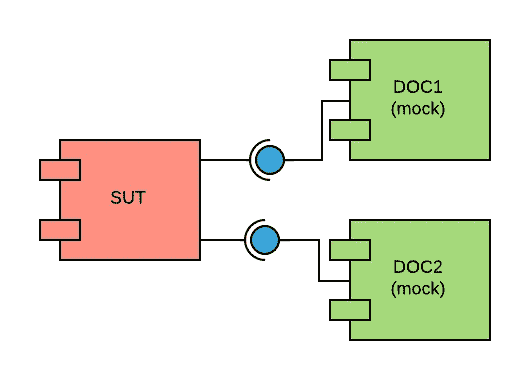

# 嘲笑不是火箭科学:基础

> 原文：<https://blog.kotlin-academy.com/mocking-is-not-rocket-science-basics-ae55d0aadf2b?source=collection_archive---------2----------------------->

模仿是一种使测试代码可读和可维护的技术。在接下来的三篇文章中，我将展示[mock](http://mockk.io)库的基础、特性和古怪之处。这是一个新的开源库( [github repository](https://github.com/oleksiyp/mockk) )，致力于让 Kotlin 中的嘲讽变得更好。


> 本文使用的技巧是**戳**，而不是**嘲讽**。这是两个相似但经常混淆的术语。点击阅读更多相关信息[。](https://martinfowler.com/articles/mocksArentStubs.html#TheDifferenceBetweenMocksAndStubs)

使用 stubs 或 mocks 的主要目的是将测试一个组件(称为被测系统)与它们依赖的组件隔离开来。

> 被测系统(SUT)是指被测试是否正常工作的系统。
> 
> 依赖组件(DOC)，是合作者，是 SUT 履行其职责所需的组件

基本思想是将 SUT 连接到模拟组件，而不是依赖组件。



Visualization of System Under Test with two mocked Depended On Component

或者在科特林:

```
**class** Dependency1(**val value1**: Int)
**class** Dependency2(**val value2**: String)

**class** SystemUnderTest(
        **val dependency1**: Dependency1,
        **val dependency2**: Dependency2
)
```

例如，现在我们想给 SUT 增加以下功能:

```
**fun** calculate() = 
        **dependency1**.**value1** + **dependency2**.**value2**.*toInt*()
```

并测试它:

```
@Test
**fun** calculateAddsValues() {
    **val** doc1 = *mockk*<Dependency1>()
    **val** doc2= *mockk*<Dependency2>()

    *every* **{** doc1.**value1 }** returns 5
    *every* **{** doc2.**value2 }** returns **"6"

    val** sut = SystemUnderTest(doc1, doc2)

    *assertEquals*(11, sut.calculate())
}
```

让我解释每一行。

```
**val** doc1 = *mockk*<Dependency1>()
```

创建一个类型为`Dependency1`的模拟对象。此对象是 SUT 的第一个依赖组件的替换。

```
**val** doc2= *mockk*<Dependency2>()
```

基本相同，只是针对`Dependency2` DOC。

```
*every* **{** doc1.**value1 }** returns 5
```

为`value1`属性的 getter 提供预期的行为。这意味着我们期望当 getter 被调用时，返回值是`5`。

```
*every* **{** doc2.**value2 }** returns **"6"**
```

同样适用于`doc2`属地。我们期望`value2` 返回字符串`“6”`。

```
**val** sut = SystemUnderTest(doc1, doc2)
```

用我们的模拟文件初始化 SUT。

```
*assertEquals*(11, sut.calculate())
```

在执行`calculate`功能时，被模拟的组件被调用，预期的行为被执行。之后，我们验证执行具有依赖关系的函数的结果是正确的。

基本上就是这样。我们用 mock 替换了依赖关系。

这为什么有价值？在这个简化的例子中，这一点并不明显。毕竟，仅仅提供依赖组件也会考验我们的 SUT:

```
@Test
**fun** calculateAddsValues() {
    **val** doc1 = Dependency1(5)
    **val** doc2 = Dependency2(**"6"**)

    **val** sut = SystemUnderTest(doc1, doc2)

    *assertEquals*(11, sut.calculate())
}
```

这是真的。当依赖组件依赖于复杂配置和其他组件时，好处就会显现。通常情况下就是这样。一切都是有线的，需要其他依赖。


这是最基本的。下一篇文章将介绍如何设置依赖于组件的预期行为和行为验证。

下一篇文章:

[](/mocking-is-not-rocket-science-expected-behavior-and-behavior-verification-3862dd0e0f03) [## 嘲讽不是火箭科学:预期行为和行为验证

### 在上一篇文章中，我描述了嘲讽的基础。现在让我来概述一下 MockK 的基本特性。

blog.kotlin-academy.com](/mocking-is-not-rocket-science-expected-behavior-and-behavior-verification-3862dd0e0f03) 

**拍手**说“谢谢”并帮助他人找到这篇文章。

[](https://kt.academy/article)

关于用 MockK 进行单元测试的下一篇文章将在下周发表。不要错过它。订阅出版物和作者频道。

[](http://eepurl.com/diMmGv)