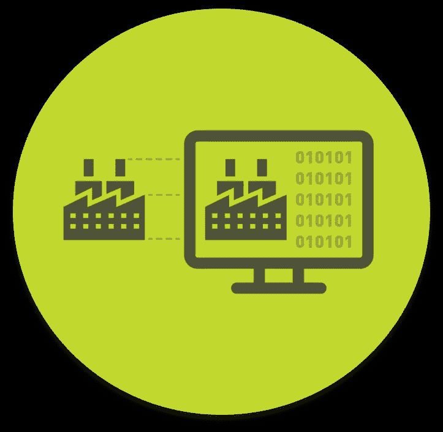
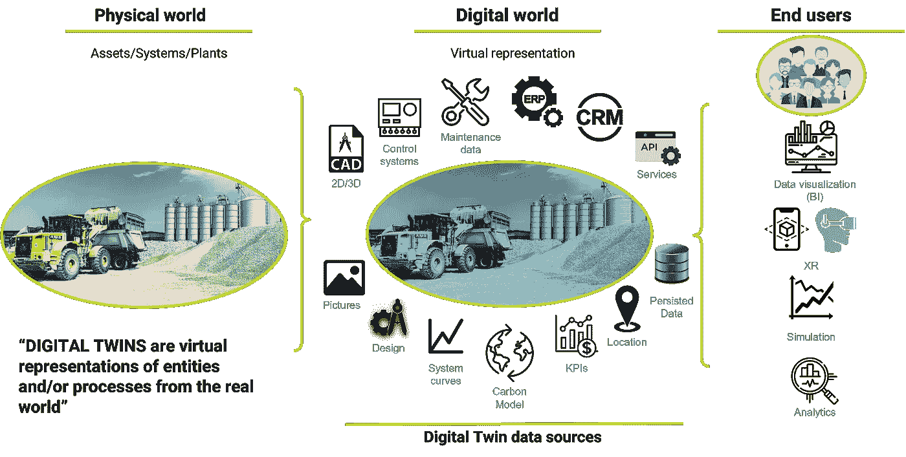
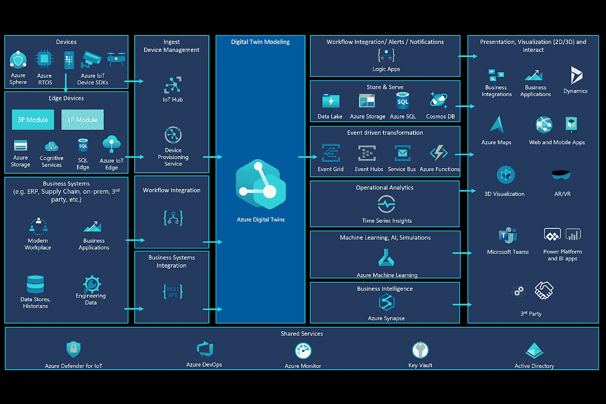
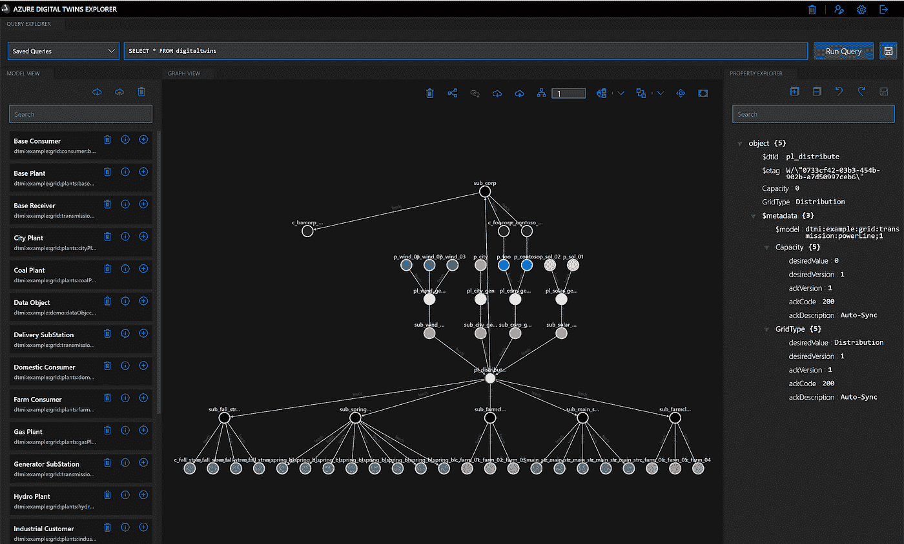
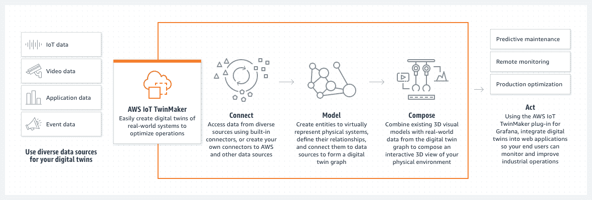
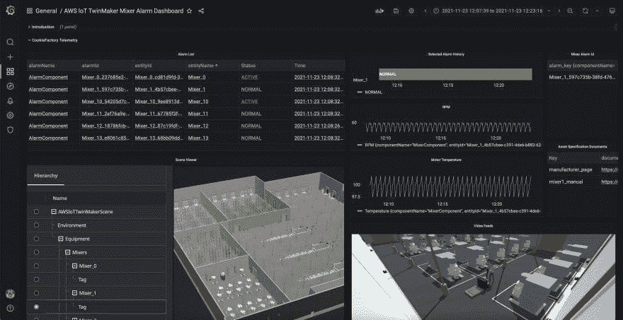
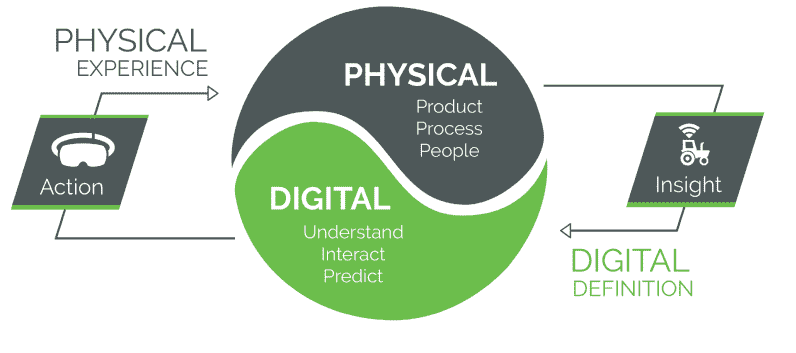
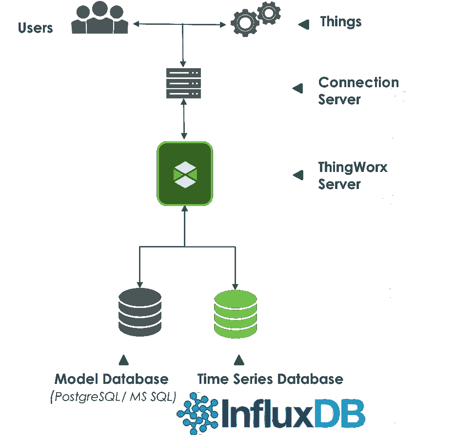
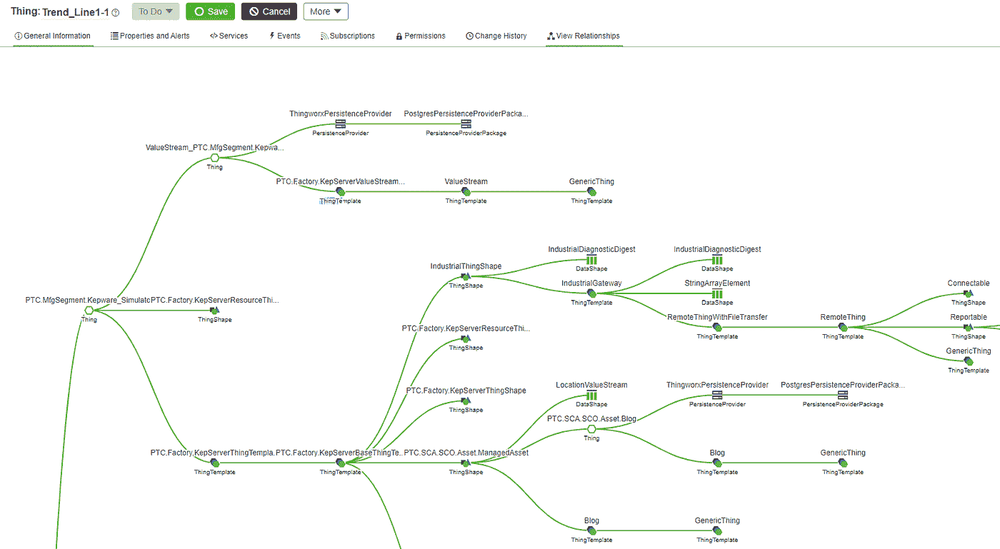

# 模拟数字双胞胎

> 原文：<https://medium.com/globant/modeling-digital-twins-8b758dc4b4d6?source=collection_archive---------0----------------------->

## 有价值的虚拟表现的关键要素

[数字双胞胎是真实世界中实体或过程的虚拟表现](https://www.digitaltwinconsortium.org/initiatives/the-definition-of-a-digital-twin.htm)。本文将解释对数字双胞胎建模的重要性，这是实现您的实体/过程的有价值的虚拟表示的关键要素。对实现基于数字双胞胎的解决方案及其建模策略的三种备选方案进行了高度概述。

# 模拟数字双胞胎

可用资源和数据源的建模实现了实体/过程的数字世界中的虚拟表示。通常，我们可以将这些资源分为两类:虚拟实体/进程和真实实体/进程。

*   虚拟实体/过程包括设计数据，通常是物理事物的 2D 或 3D 模型。关于实体/流程应该如何理想地执行和处理/应用程序数据的模拟数据，基本上是您的实体通过应用程序流的行为，例如，在诸如 ERP 的业务应用程序中是非常常见的。
*   真实的实体/过程主要包括由传感器、控制系统和实体的用户交互提供的实时数据。历史数据通常由时间序列数据表示，这是存储来自实体/过程的遥测数据的一种常见方式。最后是上下文数据，天气数据就是一个很好的例子。

数字孪生实现的起点将由为给定实体/过程的虚拟表示提供信息所需的所有数据源和资源的集成和聚合的成熟度决定。

这些表示使他们能够集成到数字世界中，以开发数据可视化应用程序、XR 体验(虚拟/增强)、模拟、应用程序服务集成以聚合上下文和数据分析。

基于数字孪生的应用程序旨在通过数字解决方案和来自给定业务价值链领域的协作来协调集成，支持数据驱动的决策以产生业务影响。

*Digital Twin Modeling*

# 数字双胞胎模型的替代方案

对于开发基于数字孪生的解决方案有不同的观点。本文将根据 Gartner 的最新[工业物联网平台魔力象限，重点关注物联网视角，尤其是供应商的工业物联网生态系统中正在发生的事情。让我们回顾一下三个主要供应商的趋势:](https://www.gartner.com/en/documents/4006918) [Azure Digital Twins](https://docs.microsoft.com/en-us/azure/digital-twins/overview) 、 [AWS TwinMaker](https://aws.amazon.com/iot-twinmaker/) 和 PTC，重点是 [ThingWorx](https://www.ptc.com/en/blogs/corporate/what-is-digital-twin-technology) 。

## Azure 数字双胞胎

Azure 在 2021 年被命名为 IIoT 平台魔力象限的领导者，它们包括 Azure 物联网产品中针对数字双胞胎的专用服务。

正如我们在下面的架构参考图中看到的，他们将数字孪生放在所有服务的中间，以接收和聚合数据源和资源，从而对虚拟表示进行建模。然后，它们支持数据/服务的替代管道，以在各种各样的应用程序中获得该建模的价值。

*Azure Digital Twins reference architecture. Source: Microsoft Azure*

在 Azure Digital Twins 中，模型类似于面向对象编程语言中的*类*，为您实际工作环境中的一个特定概念定义数据形状。模型有名称，并包含属性、遥测/事件和命令等元素，这些元素描述了这种类型的实体在您的环境中可以做什么。Azure 数字双胞胎的模型是使用基于 JSON-LD 的数字双胞胎定义语言(DTDL)定义的。DTDL 模型可能包含零个、一个或以下任何字段:属性、遥测、关系和组件。

在下图中，我们可以看到 Azure Digital Twins 服务的一个例子；它能够基于整个环境的数字模型创建双图，例如建筑物、工厂、农场、能源网络等。

*Azure Digital Twin — Twin graph demo. Source Microsoft Azure*

## AWS TwinMaker

我们要考察的第二家供应商是 AWS，它是 IIoT 平台魔力象限的挑战者。在最近的改造中，他们专门用有吸引力的空间来谈论他们的数字双胞胎服务 AWS TwinMaker 的新方法。

服务的主要概念是连接、建模和组合，结果是支持具有特定用例示例的应用程序，以及集成用于数据可视化和数据分析的组件。下图显示了服务如何适应的高级架构。与 Azure 方法类似，它们说明了不同类型的数据源。

*AWS TwinMaker reference architecture. Source AWS*

物联网 TwinMaker 提供了使用基于实体组件的知识图为您的系统建模的工具。您可以使用实体组件架构来创建物理系统的表示。这个实体-组件模型由实体、组件和关系组成。这种方法基于视频游戏开发中使用的软件架构模式。

一旦实体被建模，想法是将这些模型连接到数据源，例如传感器数据。然后创建可视化效果，帮助用户理解数据和见解。这种可视化组件是通过 Scene composer 实现的，Scene composer 是一种用于创建 3D 场景的工具，它基于 3D/CAD 模型并针对 web 显示进行了优化，以创建给定操作的可视化表示。除了场景之外，还可以使用支持最终用户应用程序的 Grafana 插件来开发仪表板。

*AWS TwinMaker Grafana dashboard demo, including 3D scenes. Source AWS*

## 电力输送委员会(Power Transmission Council)

作为第三个关键角色，必须考虑 PTC，它是 IIoT 平台魔力象限的前领导者。同样重要的是要记住，他们有不同的方式在其解决方案生态系统中实现数字孪生。例如，Creo 模型和 Windchill BOMs 表示物理资产的物理配置，而不是其当前属性和功能。Vuforia experiences 使用 XR 在现实世界中以数字方式呈现物理对象。最后，在 Thingworx，他们的物联网平台，我们在本文中的重点，一个东西是一个数字双胞胎，用于表示数字世界中的物理资产。

*PTC’s Digital Twin vision. Source PTC*

下图展示了 Thingworx 的高级架构。底部是两种类型的存储，一种专用于事物的模型，另一种专用于时间序列数据。用户和事物都与优化与平台通信的连接服务器进行交互。

*Thingworx reference architecture. Source PTC*

在 Thingworx 中建模方面，一个事物就像编程语言中的一个对象或实例；将其功能封装到以下属性类型中的实例化实体:一般信息、属性、服务或可针对事物执行的功能、事件和配置表，它们类似于不想频繁更改的属性。大多数时候，事物被用来表示与物理资产的联系；但是，在特定的场景中，连接还可以支持企业系统和远程数据存储的集成，目的是，如简介中所述，实现有价值的虚拟表示。下图显示了在 Thingworx 中整合一个事物的实体关系的示例。

*Thingworx entity’s relationship sample*

完成 Azure Digital Twins 的这一部分对于强调该服务与 Azure 的服务生态系统的集成非常重要，特别是在物联网方面，并重点关注 IIoT 和 OPC 集成。从 AWS 来看，TwinMaker 与突出 3D 模型集成(作为服务的一部分)和支持/集成 Grafana 相关，以简化数据可视化组件。最后，ThingWorx 在轻松与 PTC 生态系统中的其他工具集成的能力方面非常出色，扩展了您的数字孪生功能，例如，与 [Vuforia](https://www.ptc.com/es/products/vuforia) 结合，快速开发增强/虚拟现实体验。

# 结论

本文讨论了将数字双胞胎建模作为实现有价值的虚拟表示的关键的价值。如前所述，实现基于数字双胞胎的解决方案有不同的视角。我们回顾了 IIoT 领域三个主要参与者的产品，在这一领域，数字双胞胎是更有效地制定业务决策以推动业务影响的基本要素。

该邀请旨在审查其他主要参与者的产品，以支持可能从 IIoT 领域扩展的场景中的 Digital Twins 实施。雷达上的主要玩家是拥有 Omniverse 平台的 Nvidia、虚幻引擎的 Digital Twins 和宾利的 PlantSight。

# 参考

[Azure Digital Twins 文档](https://docs.microsoft.com/en-us/azure/digital-twins/)

[蔚蓝数码双胞胎探索者](https://github.com/Azure-Samples/digital-twins-explorer#azure-digital-twins-explorer)

[AWS IoT TwinMaker](https://docs.aws.amazon.com/iot-twinmaker/latest/guide/what-is-twinmaker.html)

[AWS IoT TwinMaker 入门](https://github.com/aws-samples/aws-iot-twinmaker-samples)

[开发者门户|开发者门户:ThingWorx](https://developer.thingworx.com/en)