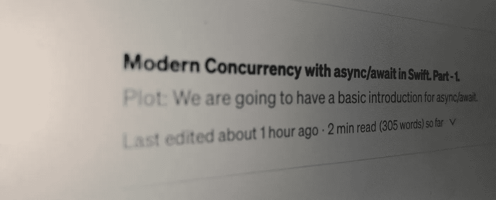

# Swift 中 async/await 的现代并发性。第一部分。

> 原文：<https://medium.com/globant/modern-concurrency-with-async-await-in-swift-part-1-2e4ee3272cc8?source=collection_archive---------0----------------------->



情节:我们将有一个异步/等待的基本介绍。

早些时候，我们从网上下载图像时需要完成，还需要注意必须在主线程中返回&在任何情况下都需要写完成。如果我们忘记了，调用函数将不会知道结果。

比如下面的代码片段

为了解决这些问题，swift 在 swift 5.5 中引入了 async/await 关键字

如何定义异步函数？

```
**func** getImage() **async** -> UIImage {
    **let** result= // your async network call here with await keyword.
    **return** image
}
```

对于 Ex


## 异步意味着它允许暂停一个任务，把它的执行交给系统，然后系统决定何时恢复这个任务。

## Await 意味着系统将知道从哪里暂停任务&执行其他重要的任务。

我们只需要在调用时将一个**异步**函数标记为**等待**。

一旦等待的调用完成，它将在**等待之后开始执行。**

在上面的例子中 **URLSession.shared.data** 方法是一个异步方法。其返回图像数据&响应。

执行将在 **URLSession.shared.data** 方法处暂停，因为它正在等待调用。当 **URLSession** 完成其任务时，系统将自动恢复功能执行，直到&同步返回图像。

关于**异步/等待**的深入知识，请观看 https://developer.apple.com/videos/play/wwdc2021/10132/
WWDC[视频](https://developer.apple.com/videos/play/wwdc2021/10132/)

这是第二部分(理解任务)。
[https://medium . com/@ Rahul . Patel _ 41877/modern-concurrency-with-async-await-in-swift-task-part-2-c 0 f1 Abe 6 E1 e 0](/@rahul.patel_41877/modern-concurrency-with-async-await-in-swift-task-part-2-c0f1abe6e1e0)