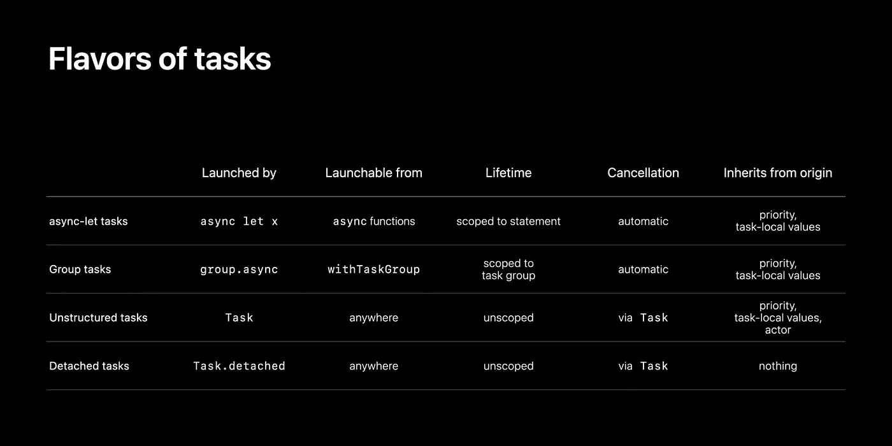

# Swift 中使用 async/await 的现代并发(任务)。第二部分。

> 原文：<https://medium.com/globant/modern-concurrency-with-async-await-in-swift-task-part-2-c0f1abe6e1e0?source=collection_archive---------0----------------------->

## 在这篇文章中，我们将学习任务

如果您还没有阅读第 1 部分，请先阅读。
[https://medium . com/@ Rahul . Patel _ 41877/modern-concurrency-with-async-await-in-swift-part-1-2e 4ee 3272 c8](/@rahul.patel_41877/modern-concurrency-with-async-await-in-swift-part-1-2e4ee3272cc8)

让我们来了解一下**任务**

```
- A task is a unit of asynchronous work.- A task provides new context to execute code concurrently- The Swift compiler checks for usage of tasks, to prevent concurrency bugs- Calling the async function does not mean creating a task.
```

# 任务类型

1.  任务(非结构化)
2.  异步 let 任务/异步 let 绑定(结构化)
3.  小组任务(结构化)
4.  分离的任务(非结构化)

## 工作

我们可以使用 Task 在任何地方调用异步函数。我们还指定了操作的优先级。

如果你想在操场上运行这个，别忘了添加下面的代码

```
**import** _Concurrency
**import** PlaygroundSupportPlaygroundPage.current.needsIndefiniteExecution = **true**
```

## 异步 let 任务/异步 let 绑定

这将允许开发人员创建一个异步变量，其值将从异步函数中分配。
使用这个变量时，我们必须写 await，因为这些变量是从异步函数中计算出来的

## 小组任务

任务组用于具有动态宽度的并发，在调用多个异步任务时必须使用它。我们可以通过一个名为 **withTaskGroup** 的函数来实现这一点。在实现多个异步调用的同时，我们还需要注意数据竞争，这有时会导致崩溃。
此处**异步序列**进入画面，因为组已确认异步序列协议循环通过。
这将帮助您迭代可用的元素。这就是为什么我们在 await 循环的**变量前写 Await 关键字**

## **分离任务**

分离的任务和正常的任务有点不同。在结构化任务中，操作使用类似子任务的结构化并发功能。子任务继承父任务的优先级和任务本地存储，取消父任务会自动取消其所有子任务。您需要用一个分离的任务手动处理这些考虑事项。



要深入了解**结构并发&任务**请观看 https://developer.apple.com/videos/play/wwdc2021/10134/
WWDC[视频](https://developer.apple.com/videos/play/wwdc2021/10134/)