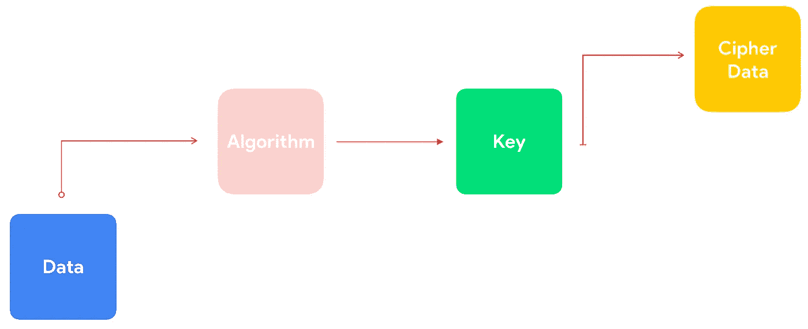
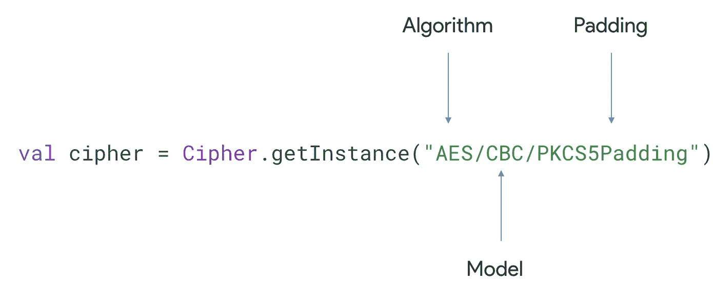
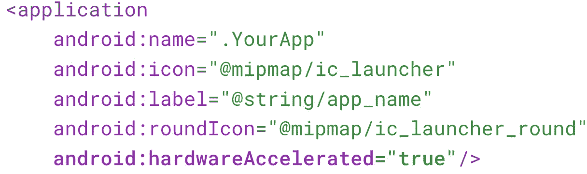

# Android 中的现代安全性(第 1 部分)

> 原文：<https://medium.com/google-developer-experts/modern-security-in-android-part-1-6282bcb71e6c?source=collection_archive---------0----------------------->

## 安全快速指南

这个帖子与我最近的一次演讲**“Android 开发者的现代安全”有关。**

以下是这个系列的博客列表:

*   **第 1 部分—加密第 1 卷**
*   [第 2 部分—加密第 2 卷](/knowing-android/modern-security-in-android-part-2-743cd7c0941a)
*   [第 3 部分—加密第 3 卷](/knowing-android/modern-security-in-android-part-3-bea8cc6f984f)
*   [第 4 部分—生物识别作为本地认证](/@dinorahto/modern-security-in-android-part-4-495655c7d4fe)
*   [第 5 部分—本机代码模块](/knowing-android/modern-security-in-android-part-5-a814a9ab7a1f)
*   [第 6 部分— SSL、TLS、安全数据层](https://ddinorahtovar.medium.com/modern-security-in-android-part-6-8b17b7a85cce)

首先，让我们谈谈为什么智能手机内部的安全性如此重要，在 90 年代，电视就像今天的手机一样，每个人都有一台电视，即使你是中产阶级，你也有一台电视，所以想象一下现在所有人都有一部 Android 手机，这个数字超过了 25 亿部活跃的手机。 为了我们工作的公司，我们需要小心，但最重要的是，我们应该小心管理用户给我们的数据。 在谷歌内部，Android 团队比以往任何时候都更加努力地管理一个更加安全的操作系统。
2018 年，Android 出现了 **0 个安全漏洞**，我们几乎有 **84%的设备进行了安全更新**，但我们仍然存在问题，因为并非所有的手机都获得了更新，因为我们依赖运营商进行更新，这是 Android 最大的问题之一，所以很大程度上，我们的工作是做好它，在一天结束时，我们有不懂技术的用户，这没关系，我们需要开始将我们的用户作为屏幕另一边的人来思考。

第一次听说加密时，我们都晕头转向，因为我们认为这真的很难处理，但实际上，事情完全不同，让我们看看这个方案:

The most simple schema ever of encryption

我们有我们想要加密的数据，这可能是我们的服务器令牌，对我们的用户重要的信息，或者其他一些我们想要保密的令牌。这些数据经过一个算法，这个算法创建一个密钥进行加密，我们最终得到我们的密码数据。

## 什么是密码、Mac、签名和消息摘要？

在这篇文章中，我们只讨论 Cipher，因为它是 Android 中最常见的方法之一，所有其他方法的工作原理几乎相同，考虑到所有这些方法都是解密和加密数据的算法。通常，在移动设备中，我们需要使用加密方案、模式和填充的组合来创建密码。例如:

**方案可以是** :
高级加密标准(AES)或 Rivest–sha mir–ad leman(RSA)
**模式可以是:**
对称或非对称，通常必须是 256 位密钥的 CBG 或 GCM
**填充方案:**
它是加密的一部分，可以帮助您保存比您的密钥大的数据，很大程度上，它们会根据您的数据放置不相关的信息。

在 Android 中有一个密码类，你可以创建自己的密码方案，不要创建自己的加密系统，这是不必要的，而且非常危险，所以请不要这样做，在这一系列故事的第二篇帖子中，我会告诉你如何做。

这里可以看到安卓和安卓版本[支持的所有算法](https://developer.android.com/guide/topics/security/cryptography#supported-algorithms)

## 所有的电话都有加密系统吗？

简而言之，答案是否定的，因为当我们谈论加密时，我们也在谈论硬件。

也许你已经在你的清单中看到了这个选项**硬件加速**被用于太多的事情，如果你用它来做花哨的动画是没问题的，实际上，你可以把它放在你的所有应用程序中，只在一个活动中，甚至在一个指定视图中，但是它对于加密也是完全必要的。在过去，特别是在 Android 6.0 之前，加密实现是基于`dm-crypt`设备映射器目标的，它通过 Linux 内核提供的接口使用 [crypto API](http://www.chronox.de/crypto-API/) 执行加密操作。但现在，情况发生了变化，我们的新手机可以进行磁盘加密，这可以加快速度，因为提供商添加了一个内核加密 API 驱动程序，可以利用 SoC 的加密硬件。这使得块加密可以从主 CPU 上卸载，并缩短了磁盘访问时间。

## 数据加密

未来已经改变，在 Android 7.0 及更高版本上支持基于文件的加密(FBE)。基于文件的加密允许不同的文件使用不同的密钥加密，这些密钥可以独立解锁，而不会在应用程序上泄露您的密钥。

谷歌正在开发一个新的库，将在 Android Jetpack 上发布:**androidx . security:security-crypto:1 . 0 . 0-alpha 02**

> **2020 年 5 月 23 日更新**:这个库现在已经到了发布候选阶段，但是还有一个新的 alpha 版本，其中有一些变化我们将在系列文章的下一部分讨论

您的应用程序的文件和数据将受到系统 Linux 风格的用户权限的保护，这可以防止来自其他应用程序或非根设备上的攻击者的访问。在良好的性能和强大的安全性的混合中特别小心，使用硬件支持的密钥库和用户存在来提供密钥访问，所以这将变得有趣。
我们将在本文的下一部分中更多地谈论这个库，但在我们结束之前，我们需要谈谈限制，这个库是在 Alpha 中，所以请考虑这一点，表格中剩下的第二件事是，由于对谷歌加密库的依赖 [Tink](https://github.com/google/tink) 我们将需要一个最小 SDK23 用于 Android 密钥库操作，但谷歌正在努力使它成为一个完全支持的库，所以对 Android 23 和更低版本的支持即将到来。

这就是这篇文章的全部内容，如果你需要帮助:

我很乐意帮忙，你可以在这里找到我:
中型:[https://medium.com/@dinorahto](/@dinorahto)
斯塔克韦尔弗洛:[https://stackoverflow.com/users/4613259/dinorah-tovar](https://stackoverflow.com/users/4613259/dinorah-tovar)

编码快乐！👩🏻‍💻