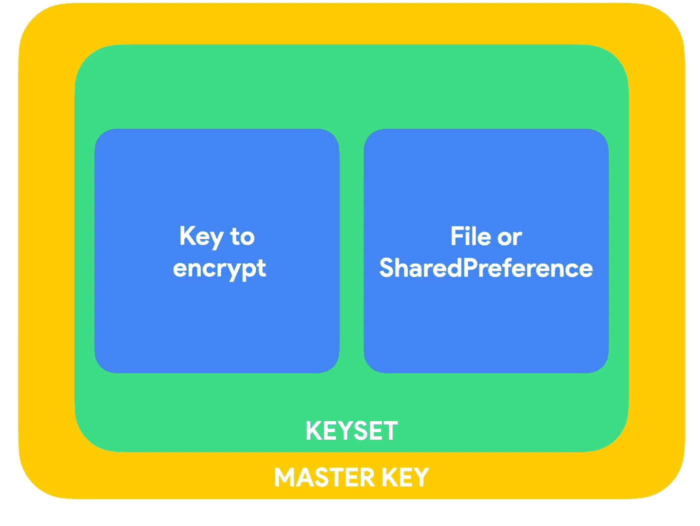

# Android 中的现代安全性(第二部分)

> 原文：<https://medium.com/google-developer-experts/modern-security-in-android-part-2-743cd7c0941a?source=collection_archive---------1----------------------->

安全快速指南

这篇文章与我最近一次关于**“Android 开发者的现代安全”**的演讲有关。

以下是这个系列的博客列表:

*   [第 1 部分—加密第 1 卷](/knowing-android/modern-security-in-android-part-1-6282bcb71e6c)
*   [**第二部分——加密第二卷**](/knowing-android/modern-security-in-android-part-2-743cd7c0941a)
*   [第 3 部分—加密第 3 卷](/knowing-android/modern-security-in-android-part-3-bea8cc6f984f)
*   [第 4 部分—生物识别作为本地认证](/@dinorahto/modern-security-in-android-part-4-495655c7d4fe)
*   [第 5 部分—本地代码模块](/knowing-android/modern-security-in-android-part-5-a814a9ab7a1f)
*   [第 6 部分— SSL、TLS、安全数据层](https://ddinorahtovar.medium.com/modern-security-in-android-part-6-8b17b7a85cce)

**Modern Security for Android Developers**

在本系列的最后一篇文章中，我们谈到了谷歌正在开发一个新的库，它将在 Android Jetpack 上发布:**androidx . security:security-crypto** 好了，时间已经过去了，最后， **security-crypto 现在处于发布候选阶段！**

**所以现在是:androidx . security:security-crypto:1 . 0 . 0-rc01**

你可能会问，如果我们已经有了 **android.security.keystore，**它让我们有机会创建两种类型的密钥，一个*非对称密钥对或对称密钥，*这个新的库使用 keystore 提供的构建器模式，但以不同的风格，为密钥的创建提供安全设置，考虑到我们需要具有良好性能的良好加密。

所以在 iOS 中，有一个叫做 KeyChain 的东西，它为用户存储密钥和值，在 Android 中，我们有 KeyStore，你需要知道的一件事是，你需要为此创建一个[提供者](https://developer.android.com/guide/topics/security/cryptography#provider-android-keystore)。Android Keystore 系统允许您将加密密钥存储在一个容器中，使其更难从设备中提取。一旦密钥存储在密钥库中，它们就可以用于加密操作，而密钥材料保持不可导出。此外，它还提供了限制何时以及如何使用密钥的功能，比如要求用户验证密钥的使用，或者限制密钥只能在特定的加密模式下使用。

## 它是如何工作的？

KeyStore 需要保护两件事情，密钥本身和与值相关的“密钥”。使用 KeyStore 意味着**你不会在你的 app** 中泄露任何信息，因为密钥材料永远不会进入应用程序流程。当您的应用程序想要执行一些加密操作时，密码将被提供给执行加密操作的系统进程。

## 什么是硬件支持系统？

使用密钥库，您可以将此过程绑定到安全硬件，这种情况很多，但几乎都是一个 [TEE(可信执行环境)](https://en.wikipedia.org/wiki/Trusted_execution_environment)，这是一个隔离的执行域，它提供安全功能，当对密钥启用此功能时，材料不会暴露在安全硬件之外。如果 Android 操作系统遭到破坏或攻击者可以读取设备的内部存储，攻击者可能能够使用 Android 设备上任何应用程序的 Android 密钥库密钥，但不能从设备中提取它们。

## Android 中的加密问题

不知何故，加密和解密过程的清晰度不够清晰，android 不同 SDK 版本支持的算法量和这些算法支持的字节数信息量太大。例如，Keychain API 的使用是关于系统范围的凭证。当应用程序请求使用任何凭据时，用户可以选择应用程序可以访问的凭据。但是密钥库提供程序允许单个应用程序存储只有应用程序本身可以访问的凭证。

密钥库是在 Android 的 API 1 中引入的，但 Android 密钥库提供程序是在 API 18 之前引入的，后来在 API 28 中，Google 为带有安全芯片的设备引入了 StrongBox，尽管 TEE 提到的解决方案足够好，但这种使用[安全元素(SE)](https://justaskthales.com/en/what-is-a-secure-element/) 的机制是最安全的，因为它基于为安全目的而设计的不同芯片(CPU、内存、存储)，这将增加操作时间，但可能是最安全的方法。

在下一个要点中，您可以看到如何创建一个自签名证书和一个密钥来开始使用它

Key Pair Generator

## 是什么让 androidx.security 与众不同？

这并不是说 KeyStore 和 Jetpack 安全性不同，它们是相互补充的，新的库使用 KeyStore 实现了一个两步操作系统，包括*密钥*和*主密钥*，另外，您可以使用它轻松地加密一个文件或一个共享的首选项。

Slides from “Modern Security for Android developers”

*   第一步是蓝色部分，表示我们要创建的用于加密数据的密钥，我们要加密的数据(可能是文件或共享的首选项[密钥-值映射])。该信息将被舍入到一个密钥集(绿色部分)，其中包含一个或多个用于加密数据的密钥。密钥集存储在共享首选项中
*   这个系统的第二步是黄色的，四舍五入每个密钥集，我们有一个主密钥加密所有的密钥集。这个主密钥是使用密钥库存储的

要开始使用 Jetpack security，您可以查看以下要点:

这将创建密钥集所需的主密钥，MasterKeys 是一个帮助器类，允许开发人员创建主密钥，然后为其获取别名，建议使用 AES256-GCM 算法来生成对称密钥，但是您可以定义自己的密钥生成参数规范，就像顶部的 KeyStore API 一样，包括超时、strongbox 和生物特征提示，这些将在本系列的后面讨论。

在下一部分，我们将讨论可以在 Jetpack 安全中使用的文件和共享首选项

这就是这篇文章的全部内容，如果你需要帮助:

我随时乐意帮忙，你可以在这里找到我:
中:[https://medium.com/@dinorahto](/@dinorahto)斯塔克韦尔弗洛:[https://stackoverflow.com/users/4613259/dinorah-tovar](https://stackoverflow.com/users/4613259/dinorah-tovar)

编码快乐！👩🏻‍💻