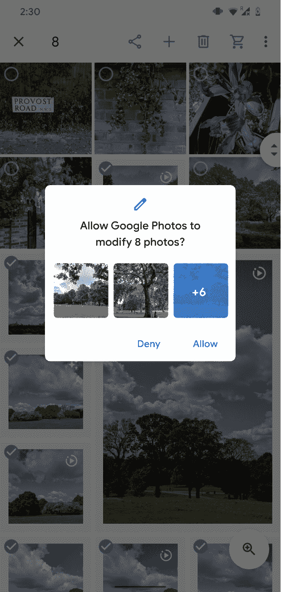

# Android 上的现代用户存储

> 原文：<https://medium.com/androiddevelopers/modern-user-storage-on-android-e9469e8624f9?source=collection_archive---------3----------------------->

Illustration by [Virginia Poltrack](/@VPoltrack).

为了保护用户数据并减少应用程序消耗的空间量，Android 10 对外部存储权限的[行为进行了更改。](https://developer.android.com/training/data-storage#scoped-storage) [Android 11 开发者预览版](https://android-developers.googleblog.com/2020/02/Android-11-developer-preview.html)延续了这一努力，同时增加了旨在帮助开发者适应变化的改进。

Google Play 上发布的大多数申请[存储许可](https://developer.android.com/reference/android/Manifest.permission#READ_EXTERNAL_STORAGE)的应用都是出于共同的原因，比如将文件保存在 SD 卡上或读取媒体文件。这些应用程序能够在卸载后将大量文件保存在磁盘上。他们还可以从其他应用程序中读取潜在的敏感文件。

在 Android 10 中，我们调整了存储权限的工作方式，为应用程序提供了所需的访问权限。这也通过鼓励应用程序将文件保存在指定的目录中来限制文件混乱，当一个应用程序被删除时，这些目录会被清除。

Android 10 的存储变化遵循了三个基本原则:

*   **更好的归属**:系统知道哪些文件属于哪些 app，让用户更容易管理自己的文件。当一个应用程序被卸载时，它创建的内容不应该保留，除非用户希望它保留
*   **保护应用程序数据**:当一个应用程序将[应用程序特定的](https://developer.android.com/training/data-storage/app-specific)文件写入外部存储器时，这些文件不应该对其他应用程序可见
*   **保护用户数据**:当用户下载文件时，例如敏感的电子邮件附件，这些文件对大多数应用程序来说应该是不可见的

面向 Android 10 的应用程序可以贡献给自己的外部应用程序目录，并组织媒体收藏(音频、视频、图像和下载)，而无需请求存储权限。“存储”权限仅允许应用程序读取由音频、视频和图像收藏中的其他应用程序共享的媒体文件。但是，它不提供对下载集合中非应用程序创建的文件的读取权限。在 Android 10 中，应用程序访问其他应用程序创建的非媒体文件的唯一方法是使用[存储访问框架](https://developer.android.com/guide/topics/providers/document-provider)提供的文档选择器。

在 Android 11 中，我们将通过引入以下更改来继续改善与作用域存储相关的开发人员体验。

# 媒体商店改进

Android 10 要求所有应用程序使用 MediaStore APIs 来访问照片、视频和音乐文件。这将继续是我们的建议。然而，我们知道许多应用程序严重依赖于使用文件路径的 API，包括第三方库，这些 API 无法轻松切换到使用文件描述符。所以在 Android 11 中，使用文件路径的 API 和库将再次[启用](https://developer.android.com/preview/privacy/storage#media-files-raw-paths)。您的应用程序可以使用 requestLegacyExternalStorage 清单属性来确保运行 Android 10 的用户的兼容性。

在幕后，使用文件路径的 I/O 请求被委托给 MediaStore API。当用于读取独立存储外部的文件时，这种重定向会对性能产生一些影响。此外，与 MediaStore APIs 相比，使用文件路径并不能提供任何功能优势，因此我们强烈建议直接使用 MediaStore。

在 Android 10 上，用户需要确认应用程序请求编辑或删除的每个文件。使用 Android 11，应用程序可以同时请求修改或删除几个媒体文件。系统图库应用程序永远不会显示这些对话框。我们希望这一改进能让用户体验更加流畅。

# 存储访问框架变化

在我们限制对广泛存储的访问后，一些应用程序开发人员试图使用存储访问框架来遍历整个文件系统。然而，SAF 并不是支持广泛访问共享存储的合适工具。因此我们[更新了它，将可见性](https://developer.android.com/preview/privacy/storage#file-directory-restrictions)限制在某些路径上。

在 Android 11 中，用户将无法授予对根下载目录、每个可靠 SD 卡卷的根目录或外部应用程序目录的目录访问权限。应用程序仍然可以使用存储访问框架 API 和文档选择器来要求用户从共享存储中选择单个文件。

# 文件管理器应用程序的特殊权限

对于需要广泛访问共享存储的应用程序，如文件管理器或备份应用程序，Android 11 将引入一个名为`**MANAGE_EXTERNAL_STORAGE**`的特殊权限。这将授予对所有共享存储的读写权限，包括非媒体文件。但是，内部和外部存储中特定于应用程序的目录的内容将无法访问。

我们希望继续允许一些应用程序广泛访问外部存储上的文件，前提是它们有真正需要的用例。在 Android 11 中，这些应用程序可以声明`**MANAGE_EXTERNAL_STORAGE**`，这将允许它们请求用户在设置中授予它们“所有文件访问权限”。以下是几个将被允许的应用程序示例:

*   文件管理器——主要用于让用户管理文件的应用程序
*   备份和恢复—需要批量访问文件的应用程序(例如，切换设备或备份到云)

但是，如果您的应用程序需要访问单个文件，如字处理器应用程序，您应该使用存储访问框架。你可以点击查看 Google Play 关于此许可的政策[。](https://support.google.com/googleplay/android-developer/answer/9956427)

在 Android 11 上，如果你的应用需要`**MANAGE_EXTERNAL_STORAGE**`或者使用依赖于文件路径的 API，你可以通过在你的 Android 清单中声明`requestLegacyExternalStorage=true`来支持旧版本的向后兼容性。

你可以在[开发者文档](https://developer.android.com/preview/privacy/storage)和我们的[Android Dev Summit 2019](https://youtu.be/UnJ3amzJM94)演讲中了解更多信息。

我们重视您的反馈！您可以通过[问题跟踪器](http://bit.ly/2vd4wF4)报告问题或功能请求。请继续关注即将发布的关于如何将作用域存储与 MediaStore 和存储访问框架 API 结合使用的文章。