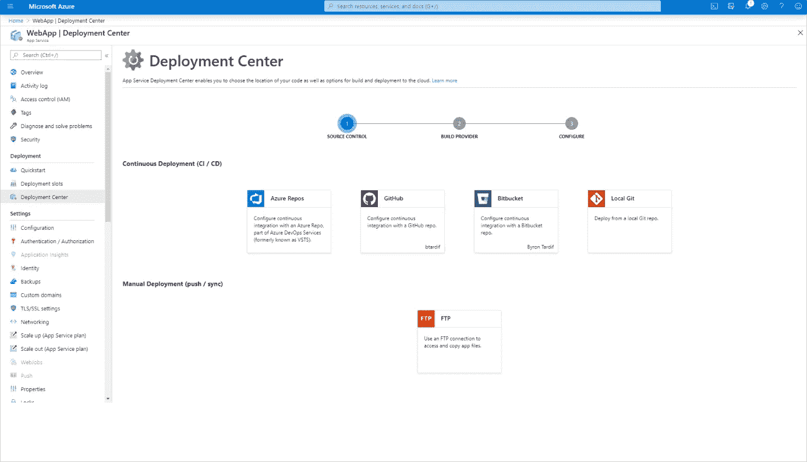
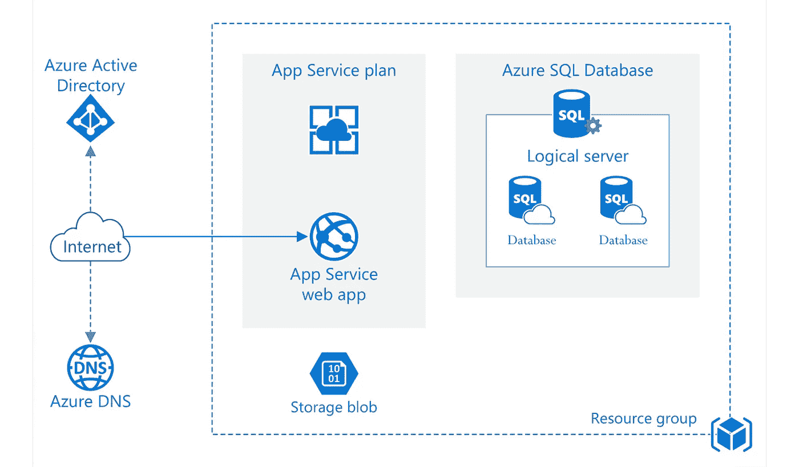
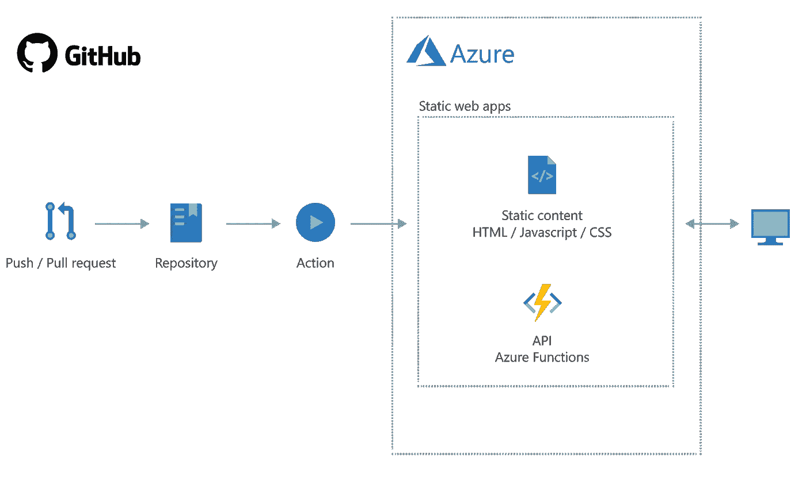
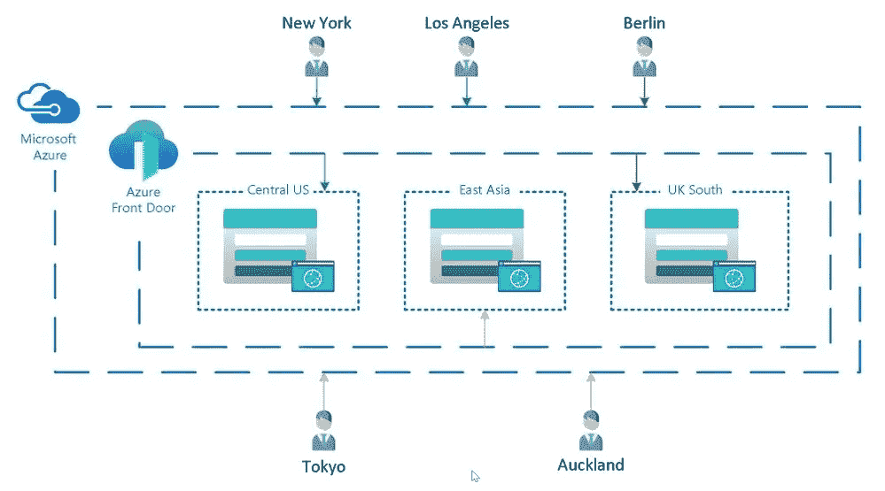
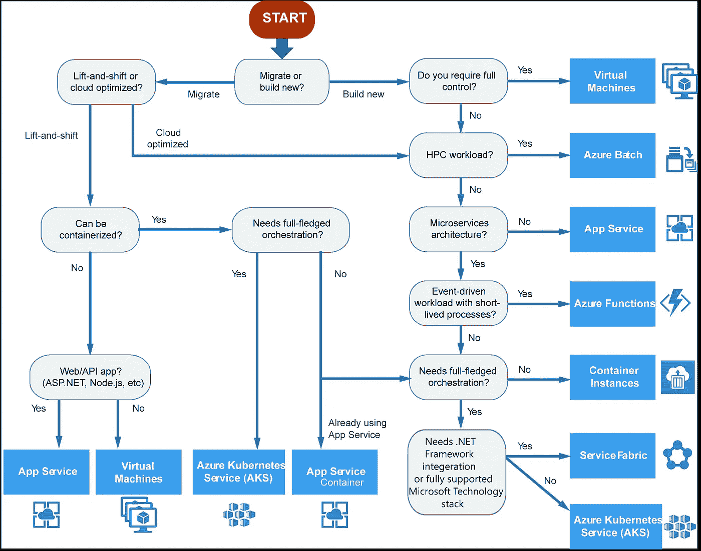

# 用 Azure 工具使你的应用现代化:用户体验

> 原文：<https://medium.com/version-1/modernising-your-applications-with-azure-tools-user-experience-36c04ce84fce?source=collection_archive---------3----------------------->

Joao Gonç alves，版本 1 的解决方案架构师

我最近与微软联合主办了一场网络研讨会，主题是用微软 Azure 工具实现应用程序现代化，如果你想了解一下，你可以在这里观看点播[。](https://www.version1.com/webinar-application-modernisation-developers/)

继我的网上研讨会之后，我将发布一个关于 [**应用现代化**](https://www.version1.com/it-service/digital-services/is-dgt-amo-modernise-with-azure/) 的博客系列，涵盖**用户体验、集成和分析。**正如你可以从这篇博文的标题中看出的，我将从用户体验和 Azure 工具开始，这些工具可以用来使遗留应用程序现代化，以满足你的用户——使他们在企业环境中执行任务和协作时的生活更加轻松。

Photo by [Christina Morillo](https://www.pexels.com/@divinetechygirl?utm_content=attributionCopyText&utm_medium=referral&utm_source=pexels) from [Pexels](https://www.pexels.com/photo/woman-in-black-coat-1181346/?utm_content=attributionCopyText&utm_medium=referral&utm_source=pexels)

根据 Gartner 的定义，应用程序现代化是指:

> *该项目旨在通过使用现代特性和功能更新现有老化应用程序来提供新的业务价值。*

**不是替代，但也不是技术更新。**这是在现有解决方案的特定领域有针对性地使用技术，以实现某种程度的现代化，但也能释放某种程度的**商业价值。**商业价值是这里的一个关键焦点，所采用的方法更倾向于一种有针对性的增量方法，这种方法**将持续经营**和业务活动的风险最小化，并且**主要由商业案例驱动。**

在版本 1 中，我们看到了前所未有的传统系统现代化进程 **(** [**点击此处查看我们的客户 NEL 的故事**](https://www.version1.com/customer-success/nel-nhs-azure-data-migration/) **)** 和[公共云采用](https://www.version1.com/it-service/enterprise-cloud/)在过去的 4 个月中，由于新冠肺炎疫情，我们充分利用了现代技术。

Photo by [Anete Lusina](https://www.pexels.com/@anete-lusina?utm_content=attributionCopyText&utm_medium=referral&utm_source=pexels) from [Pexels](https://www.pexels.com/photo/crop-faceless-man-using-laptop-on-stand-4792712/?utm_content=attributionCopyText&utm_medium=referral&utm_source=pexels)

保持业务运营和员工工作的必要性一直是应用程序现代化的巨大驱动力，这场危机**对许多组织来说是一个警钟，因为现代化速度不够快会带来危险，**暴露了等待转型时间过长的风险，以及需要变得更加敏捷并建立一条实现当前系统现代化的道路。

不幸的是，在当前的环境下，现代化和适应系统和流程的能力可能是让企业免于破产的决定性因素。

# **用户体验提升释放了什么商业价值？**

所以，有了这些关键区别，让我们回到用户体验和 Azure 工具，你可以利用它们来确保你的应用程序为你的业务提供应有的价值。

# **为什么用户体验如此重要？**

每个人都知道大 UX 对外部用户的好处，因为我们每天都在智能手机上访问网站，完成购买，整理家庭账单等等。我们知道，如果一个网站或应用程序表现不佳，或者有太多的步骤需要我们去做，我们就会变得沮丧和脱离。

Photo by [Anna Shvets](https://www.pexels.com/@shvetsa?utm_content=attributionCopyText&utm_medium=referral&utm_source=pexels) from [Pexels](https://www.pexels.com/photo/woman-in-beige-jacket-and-gray-knit-cap-holding-smartphone-3962218/?utm_content=attributionCopyText&utm_medium=referral&utm_source=pexels)

对于内部用户来说没什么区别。消费者 UX 的不断改进只会让企业应用程序的外观和感觉更加过时！

员工和利益相关者每天会与企业应用程序进行多次甚至数百次交互。为什么用户体验应该是他们的战略重点？因为快乐的用户(员工)=更好的生意！

Photo by [freestocks.org](https://www.pexels.com/@freestocks?utm_content=attributionCopyText&utm_medium=referral&utm_source=pexels) from [Pexels](https://www.pexels.com/photo/silver-iphone-6-987585/?utm_content=attributionCopyText&utm_medium=referral&utm_source=pexels)

研究表明:

> “内部系统的简单、直观的用户体验可以重新激励无所事事的员工。”

移动企业应用程序可以适应(并允许)员工远程工作。**千禧一代越来越希望他们的雇主投资于用户友好的技术**，更好的协作工具和用户体验差的传统应用程序会疏远和脱离这些员工**，导致更高的员工流动率。**

# **技术**

当我们谈论现代 web 应用程序和现代化 UX 时，它通常意味着 web 应用程序具有丰富的用户界面，更加直观和现代，更快，响应更快，适合移动。随着静态 **HTML/CSS** 架构越来越多地被采用，这种转变是显而易见的，静态**HTML/CSS**架构利用**RESTful**API 作为后端数据服务。

在大多数遗留应用程序中，现代化需要**重建**，这意味着与更现代的框架(如 **Angular、React、Vue 或 Blazor** )相比，重写在经典 ASP 等技术中构建的东西。

如果遗留应用程序是最近才构建的，并且框架仍然受到积极支持，那么通过容器化来规划**重新平台**将为应用程序提供一些云原生功能，这将提高弹性、性能、可用性等。与重建**相比，减少了现代化改造的时间。**

由于这篇文章的重点是在 Azure 中实现 UX 的现代化，我们将重点关注提供 web 应用程序托管功能的服务:

# **Azure 工具使应用程序现代化以获得更好的用户体验**

# **1。Azure 应用服务**

[App Service](https://azure.microsoft.com/en-us/services/app-service/) 是一个完全托管的平台，用于构建、部署和扩展 web 应用。它具有托管 web 应用程序、API 和移动后端的能力。

Credit: Microsoft Azure App Service Demo

App Services 非常灵活，支持用。网，。NET Core、Node.js、Java、Python、PHP、Ruby 以及容器。App Service 应用运行和扩展都很容易，并且可以在基于 Windows 和 Linux 的环境中托管。

对于持续部署**有一个内置的集成**，所以如果你在 **Azure DevOps** 或 **GitHub** 中存储了现有的应用程序，那么将这些服务连接到 Azure 就成了一个非常简单的过程。

Azure 应用服务的一些关键功能包括:

*   多种语言、框架和容器化。
*   **操作系统和语言框架的自动补丁和维护。**
*   **集成持续集成和部署 Azure DevOps、GitHub、BitBucket、Docker Hub 或 Azure Container Registry。**
*   **带部署插槽的测试和试运行环境。**
*   **安全性和合规性——使用 Azure Active Directory、谷歌、脸书、Twitter 或微软帐户对用户进行身份验证。**
*   **TLS 证书&自定义域**
*   **备份**
*   **监控**
*   **缩放**

对于大多数现代化场景，应用服务是最佳选择。应用程序服务以每月固定的价格运行，可以托管多个应用程序，这使得它们非常划算。

示例架构:

Source — [https://azure.microsoft.com/en-us/services/app-service](https://azure.microsoft.com/en-us/services/app-service)

# **2。Azure 静态 Web 应用**

[Azure Static Apps](https://azure.microsoft.com/en-us/services/app-service/static/) 是微软在 Build 2019 发布的新服务。

静态 web 应用程序服务在 Azure 中提供了一个专门为托管基于静态文件的 Web 应用程序而构建的服务。该服务能够使用 Azure Functions 代码将 RESTful APIs 部署到托管 Web 应用程序的同一个静态 Web App 服务。

对于静态 web 应用程序，静态资产与传统的 Web 服务器分离，而是由分布在世界各地的点提供服务。这种分布使得提供文件更快，因为文件在物理上更接近最终用户。

## Azure 静态 Web 应用的一些关键特性是:

*   HTML、CSS、JavaScript 和图像等静态内容的虚拟主机。
*   **Azure Functions 提供的集成 API 支持。**
*   **全球分布的静态内容，让内容更贴近用户。**
*   **免费 SSL 证书，可自动更新。**
*   **自定义域，为您的应用提供品牌定制。**
*   **调用 API 时使用反向代理的无缝安全模型，不需要 CORS 配置。**
*   **身份验证提供商与 Azure Active Directory、脸书、谷歌、GitHub 和 Twitter 的集成。**
*   **可定制的授权角色定义和分配。**

**备注:**

*   服务仍在预览中。
*   现在只有 GitHub 支持自动部署。

综上所述，如果现代化计划涉及使用 Angular、React、Vue 或 Blazor 等框架构建 UI，并且不需要 web 服务器来呈现内容，那么 Azure Static Apps 是一个非常合适的选择。

示例架构:

Source — [https://azure.microsoft.com/en-us/services/app-service/static](https://azure.microsoft.com/en-us/services/app-service/static)

# **3。Azure 存储静态网站**

和 Azure 静态 Web 应用一样，如果你有需要公开的静态内容，使用 Azure 存储账户是一个可行的替代方案。

使用 Azure Storage 静态内容可以直接从存储容器中提供(HTML、CSS、JavaScript 和图像文件)。

Azure Storage 静态网站托管是一个很好的选择，在这种情况下，您不需要 web 服务器来呈现内容以及考虑成本，因为只需要支付存储和运营成本。

将存储网站与 CDN 和 Azure Front Door 等其他服务结合使用，可以让您在多个地理位置托管网站，并提供故障转移功能。

Azure 存储静态网站的一些关键功能包括:

*   **低成本，按使用付费。**
*   **没有底层基础设施需要管理。**
*   **自动扩展和故障转移。**
*   **与 Azure CDN 轻松集成，在全球范围内提供更快的内容服务。**
*   **自定义域名。**

示例架构:

Source — [https://techcommunity.microsoft.com/t5/azure-developer-community-blog/azure-on-the-cheap-azure-storage-static-website-and-azure-front/ba-p/1297084](https://techcommunity.microsoft.com/t5/azure-developer-community-blog/azure-on-the-cheap-azure-storage-static-website-and-azure-front/ba-p/1297084)

# **集装箱服务怎么样？**

Azure for containers 上的两个主要服务是 Azure Container 实例和 Azure Kubernetes 服务。尽管它们是托管 web 应用程序的有效选择，但根据具体情况，这可能不是理想的选择。

Azure 容器实例提供了一种在 Azure 中运行容器的快速而简单的方法。ACI 非常适合独立的容器，包括简单的应用程序、任务自动化和不需要容器编排的构建作业。

Azure Kubernetes 服务是 Kubernetes 的 Azure 托管版本，这是一个开源的完全托管的容器编排服务，可用于部署、扩展和管理 Docker 容器和基于容器的应用程序。在组织计划采用或已经运行微服务架构的现代化场景中，使用 AKS 是一个完美的选择，尤其是现在支持 Linux 和 Windows 工作负载。

# **为什么这会给企业带来好处？**

使用 Azure 实现现代化给组织带来了一些显著的好处，例如:

# **降低总拥有成本**

*   将内部部署的应用程序迁移到 Azure 提供了减少相关基础设施支出的机会。
*   由于弹性提高，减少了停机时间。

# **敏捷性和可扩展性**

*   为云重新制作一个内部部署的应用程序可以让组织更快地抓住机会，而不会受到依赖旧代码和基础架构的阻碍。
*   允许利用诸如集装箱化和云中连续交付等技术。
*   可以更有效地实施更改，并且可以按需扩展应用程序。

# **安全性和性能**

*   Azure 具有许多内置的安全机制和服务，如对合规性和隐私的精细控制。
*   深入了解应用程序的运行情况，并提出可行的建议。

# **奖励:**

微软文档[有一个非常有用的决策树](https://docs.microsoft.com/en-us/azure/architecture/guide/technology-choices/compute-decision-tree)，可以在迁移或构建云原生应用时帮助寻找理想的服务。

[https://docs.microsoft.com/en-us/azure/architecture/guide/technology-choices/compute-decision-tree](https://docs.microsoft.com/en-us/azure/architecture/guide/technology-choices/compute-decision-tree)

关于用 Azure 更新现有应用程序的更多信息，请点击这里查看我的针对开发者的网络研讨会。

**关于若昂·贡萨尔维斯**

Joao Gonç alves 是一名解决方案架构师，负责第 1 版英国数字&云服务实践。版本 1 证明了它可以给我们客户的业务带来真正的改变。全球品牌相信我们能够提供推动客户成功的 IT 服务和解决方案。我们 1300 多人的团队与我们的技术合作伙伴密切合作，提供独立的建议，帮助我们的客户驾驭快速变化的 IT 世界。