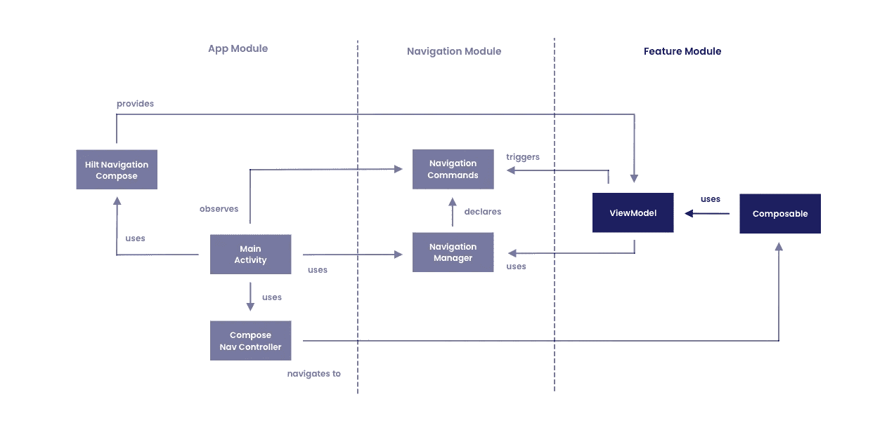

# 带有 Jetpack 组件模块化导航

> 原文：<https://medium.com/google-developer-experts/modular-navigation-with-jetpack-compose-fda9f6b2bef7?source=collection_archive---------0----------------------->


大量的移动应用程序将需要某种形式的导航，允许用户在应用程序的不同部分之间移动。当在 Android 应用中实现这些需求时，应用要么推出自己的解决方案，依赖传统的意图或片段管理器，要么在最近几年探索[导航组件](https://developer.android.com/guide/navigation/navigation-getting-started)的选项。在 Jetpack Compose 的 alpha 和 developer preview 版本中，我经常被问到，“导航怎么样？”，“有可能在可组合组件之间导航吗？”。通过 Jetpack Compose，自由使用 composables 的想法引入了无片段和(大部分)无活动的应用程序的想法，允许我们在显示 UI 时完全依赖 Composables。

多亏了导航组件中的[导航组件](https://developer.android.com/jetpack/compose/navigation)的支持，现在这完全成为可能。应用程序可以在其应用程序中启动单个活动，依靠组件来表示组成应用程序的 UI 组件。我已经在几个项目中使用了这个组件，并且非常喜欢这种感觉像是构建 Android 应用程序的新方式。然而，在最初从现有的指南和博客帖子中使用这个项目后，我开始发现一些事情，感觉它们会在项目中增加一些摩擦和痛苦:

*   **在可组合函数中需要一个 NavHostController 引用**——在很多情况下，我们需要让一个可组合函数导航到另一个可组合函数。我发现，在许多情况下，默认的方法是通过可组合的函数传递这个 NavHostController 引用。这意味着要执行导航，我们必须始终有一个对当前 NavHostController 的引用。这不太具有可伸缩性，并且使我们依赖这个引用来执行导航。
*   **难以测试导航逻辑** —当我们的组件直接使用这个导航主机控制器来触发导航时，就很难测试我们的导航逻辑。可组合函数目前是使用插装测试来测试的。让另一个类处理我们的导航逻辑(比如视图模型)允许我们在项目的单元测试中测试导航事件。
*   **为组合迁移增加摩擦** —许多使用组合的项目都是现有的项目，它们的规模各不相同。在这些情况下，很有可能项目不会被完全重写，而会以各种方式迁移到 Compose——新的特性可能会在 Compose 中编写，而现有的组件会被慢慢重写。在这些情况下，向这些组件提供这个 NavHostController 可能会很困难。例如，可能被重写为 Composables 的现有组件被隔离，使得很难将 NavHostController 用于这些功能。
*   **耦合到导航依赖关系**——需要 NavHostController 引用来执行导航意味着使用它的每个模块都需要一个对组合导航依赖关系的引用。同样，如果您计划使用 Hilt Navigation Compose 依赖项在不同的模块中提供视图模型，那么对于该依赖项来说也是如此。虽然这感觉像是一个预期的需求，但在解决上述问题时，对这些东西的集中依赖是一个很好的副作用。

虽然这些只是我一直在思考的一些事情，但可能是 Compose Navigation 让您思考如何将它融入您现有的应用程序，或者在您的新项目中进行组织。

受[几年前读的一篇关于模块化导航的文章](/google-developer-experts/using-navigation-architecture-component-in-a-large-banking-app-ac84936a42c2)的启发，我想分享一些我在模块化 Android 应用程序中添加组合导航时所做的探索。我们将学习:

*   如何在不依赖于 NavHostController 引用的情况下跨不同功能模块导航到组件
*   如何将这些模块从组合导航中分离出来，并通过视图模型在一个集中的位置处理导航
*   如何使用句柄导航组件向这些组件提供视图模型，而不使每个功能模块依赖于依赖关系
*   如何通过优化导航逻辑来简化我们的测试方法

在本文中，我们不会讨论构建导航组件的基础，所以如果您正在寻找构建导航的介绍，请使用下面的指南[。](https://developer.android.com/jetpack/compose/navigation)

[](https://compose.academy/)

# 模块化应用

为了探索以上几点，我们将使用我的[minimize](https://github.com/hitherejoe/minimise)项目作为参考，使用类似如下的应用程序结构:


这里，我们有几个模块组成了我们的应用程序。

*   **App 模块** —这是我们应用程序的基础模块。这包含了我们的组合导航图，它提供了对应用程序的特性模块中包含的不同组件的导航。
*   **导航模块** —该模块将协调我们项目的导航。这为依赖模块提供了一种触发导航的方法，以及一种观察这些导航事件的方法。
*   **功能模块** —包含可为指定功能组合的模块。注意:在示例代码中，我们将使用多个特性模块，为了保持图表简洁，这里只包含一个。

从这个图表中，我们可以开始看到这些不同模块之间的关系，以及它们如何一起工作来实现我们想要的导航目标。

*   App 模块使用[navshostcontroller](https://developer.android.com/reference/androidx/navigation/NavHostController)构建我们的导航图，提供了一种在我们的功能模块中组合和导航到可组合组件的方法。
*   导航模块定义了在我们的图表中可以导航到的可能目的地。这些是结构化的命令，根据需要从我们的功能模块中触发。
*   当通过导航管理器触发时，应用程序模块使用导航模块来观察这些导航命令。当任何事件发生时，[navshostcontroller](https://developer.android.com/reference/androidx/navigation/NavHostController)将用于在我们的组件间导航。
*   功能模块使用导航模块从它的视图模型中触发这些导航事件，依靠观察这些事件的任何东西来处理实际的导航。
*   使用 Hilt Navigation Compose 将视图模型提供给应用程序模块内的可组合功能，将视图模型的范围限定为对应的[navshostcontroller](https://developer.android.com/reference/androidx/navigation/NavHostController)内的当前 backstack 条目。

因此，我们可以看到这是如何实现的，我们将开始构建一些代码来表示上述要求。

# 可组合的目的地

在我们开始考虑导航到可组合组件之前，我们需要构建一些可组合组件。在我的[最小化](https://github.com/hitherejoe/minimise)项目中，我有两个特点:一个[认证](https://github.com/hitherejoe/minimise/tree/main/platform_android/authentication)屏幕和一个[仪表盘](https://github.com/hitherejoe/minimise/tree/main/platform_android/dashboard)屏幕。用户将开始身份验证，然后当他们在应用程序中成功通过身份验证时，将被带到仪表板。



我们将从定义一个新的名为[认证](https://github.com/hitherejoe/minimise/blob/main/platform_android/authentication/src/main/kotlin/co/joebirch/minimise/authentication/AuthenticationUI.kt)的可组合函数开始，这将引用一个保存屏幕状态的 AuthenticationState kotlin 类。我们不会深入研究这些组件的内部，因为它们的代码对本文来说并不重要，我们只是从较高的层面来看它们是由什么组成的。

```
@Composable
private fun Authentication(
    viewState: AuthenticationState
)
```

这个状态将来自一个用 **@HiltViewModel** 注释的[视图模型](https://github.com/hitherejoe/minimise/blob/main/platform_android/authentication/src/main/kotlin/co/joebirch/minimise/authentication/AuthenticationViewModel.kt)，这是使用 [Jetpack 句柄集成](https://developer.android.com/training/dependency-injection/hilt-jetpack#viewmodels)完成的。

```
@HiltViewModel
class AuthenticationViewModel @Inject constructor(
    private val savedStateHandle: SavedStateHandle,
    ...
) : ViewModel() { val state: LiveData<AuthenticationState> ...}
```

您可能已经注意到，我们之前的可组合函数被标记为 private。因此，无论什么访问我们的功能模块都可以组成身份验证 UI，我们将添加一个公共可访问的可组合函数。然后，我们将把这个视图模型作为参数添加到这个函数中，这允许我们分离如何提供这个视图模型，以及添加空间来改进我们如何处理我们的可组合组件的测试。

```
@Composable
fun Authentication(
    viewModel: AuthenticationViewModel
) {
    val state by viewModel.uiState.observeAsState()
    Authentication(state)
}
```

至此，我们已经为应用程序的[身份验证](https://github.com/hitherejoe/minimise/blob/main/platform_android/authentication/src/main/kotlin/co/joebirch/minimise/authentication/AuthenticationUI.kt)特性准备好了一个可组合的函数。为了能够在应用程序的两个部分之间导航，我们将继续为第二个功能创建另一个可组合函数，即应用程序的[仪表板](https://github.com/hitherejoe/minimise/tree/main/platform_android/dashboard/src/main/kotlin/co/joebirch/minimise/dashboard)。我们将做与上面相同的事情，我们将创建一个[可组合函数](https://github.com/hitherejoe/minimise/blob/main/platform_android/dashboard/src/main/kotlin/co/joebirch/minimise/dashboard/DashboardContentFactory.kt)，它将被用来组合我们的仪表板 UI，以及一个[视图模型](https://github.com/hitherejoe/minimise/blob/main/platform_android/dashboard/src/main/kotlin/co/joebirch/minimise/dashboard/DashboardViewModel.kt)，它将被用来编排它的状态。

```
@Composable
fun Dashboard(
    viewModel: DashboardViewModel
) {
    val state by viewModel.uiState.observeAsState()
    DashboardContent(state)
}

@HiltViewModel
class DashboardViewModel @Inject constructor(
    private val savedStateHandle: SavedStateHandle,
    ...
) : ViewModel()
```

有了这些，我们现在有了两个由可组合函数组成的特性，每个特性都有自己的视图模型。然而，这些目前在我们的应用程序中没有做任何事情——所以接下来让我们深入了解一下我们如何配置在应用程序的这两个部分之间移动。

# 设置导航路线

因为我们将有一个集中的导航模块来控制应用程序的导航，所以我们需要为应用程序中支持的导航创建某种形式的契约。我们将以 [NavigationCommand](https://github.com/hitherejoe/minimise/blob/main/platform_android/navigation/src/main/java/co/joebirch/minimise/navigation/NavigationCommand.kt) 的形式创建它，它允许我们定义可以被触发的不同导航事件，由持有导航控制器的类来观察。

如果您的项目中还没有合成导航，那么您需要添加以下依赖项。

```
androidx.navigation:navigation-compose:1.0.0-alpha07
```


我们将从定义一个接口 [NavigationCommand](https://github.com/hitherejoe/minimise/blob/main/platform_android/navigation/src/main/java/co/joebirch/minimise/navigation/NavigationCommand.kt) 开始。这将定义导航事件的需求——目前我只需要它来支持一个目的地和将要提供的任何参数。如果这个类需要与其他需求相匹配，那么它还有发展的空间。

```
interface NavigationCommand {

    val arguments: List<NamedNavArgument>

    val destination: String
}
```

有了这个契约，我们现在可以定义一些导航命令，用于在应用程序的特定功能之间导航——我们将为我们的身份验证和仪表板功能这样做。这里，我们将为上面实现我们的 [NavigationCommand](https://github.com/hitherejoe/minimise/blob/main/platform_android/navigation/src/main/java/co/joebirch/minimise/navigation/NavigationCommand.kt) 接口的每个函数定义一个新函数。现在，我们将简单地对导航目的地进行硬编码，以满足我们命令的**目的地**属性。这个目的地将由我们的导航控制器在计算要导航到哪个可组合组件时使用。

```
object NavigationDirections {

    val authentication  = object : NavigationCommand {

        override val arguments = emptyList<NamedNavArgument>()

        override val destination = "authentication"

    }

    val dashboard = object : NavigationCommand {

        override val arguments = emptyList<NamedNavArgument>()

        override val destination = "dashboard"
    }
}
```

当执行导航时，这些目的地目前不使用导航参数，但我想提供这样做的灵活性，因为我的应用程序的其他部分将需要它。当需要时，我们仍然可以将用于组合导航的参数集中在我们的导航模块中。使用仪表板目标的函数来提供所需的参数，然后可以使用这些参数来构建参数列表。这使我们的导航契约方法保持不变，同时仍然给我们模块化导航的灵活性。

```
object DashboardNavigation {

  private val KEY_USER_ID = "userId"
  val route = "dashboard/{$KEY_USER_ID}"
  val arguments = listOf(
    navArgument(KEY_USER_ID) { type = NavType.StringType }
  )

  fun dashboard(
    userId: String? = null
  ) = object : NavigationCommand {

    override val arguments = arguments

    override val destination = "dashboard/$userId"
  }
}
```

有了上述内容，您就可以使用 route 和对象的参数来配置导航，然后通过使用 dashboard()函数触发事件来执行实际的导航。使用导航参数现在超出了我的需求范围，但是希望上面给出了一个大概的例子，可以在这里做些什么！

# 设置导航图


现在我们已经定义了导航命令，我们可以继续为我们的应用程序配置导航图了——这用于定义目的地和它们指向的组件。我们将从使用 rememberNavController 可组合函数定义一个新的 [NavHostController](https://developer.android.com/reference/androidx/navigation/NavHostController) 引用开始——这将用于处理我们图表的导航。

```
val navController = rememberNavController()
```

有了这些，我们现在可以继续定义我们的[nav host](https://developer.android.com/reference/androidx/navigation/NavHost)——这将用于包含组成导航图的组件，导航图将使用其**生成器**参数提供。现在，我们将提供我们之前定义的[navshostcontroller](https://developer.android.com/reference/androidx/navigation/NavHostController)引用，以及我们的图形应该开始的目的地——为此，我们将使用身份验证屏幕，从我们之前定义的 NavigationDirections 引用中访问其目的地字符串。

```
NavHost(
    navController,
    startDestination = NavigationDirections.Authentication.destination
) {

}
```

定义了这个 **startDestination** 之后，这意味着我们的 NavHost 将使用它来配置导航图的初始状态——从与认证目的地字符串匹配的可组合组件开始我们的用户。

# 设置导航目的地


虽然我们已经为我们的导航图定义了这个初始目的地，但是我们还没有定义组成我们的图的任何可组合的目的地——所以事情不会像它们现在这样工作！因此，我们将继续使用 NavGraphBuilder.composable 函数添加一个新的目的地。我们首先使用 NavigationDirections 定义中定义的字符串为可组合目标提供路线，这意味着无论何时导航到这条路线，这个可组合目标的主体都将在我们的 UI 中组合。在这里，我们提供了先前定义的可为该主体组合的身份验证。

```
composable(NavigationDirections.Authentication.destination) {
    Authentication()
}
```

然后，我们将对我们的仪表板目的地进行同样的操作——使用我们之前为主体定义的仪表板组合件，定义触发导航到该组合件的路线。

```
composable(NavigationDirections.Dashboard.destination) {
    Dashboard()
}
```

有了上述内容，我们现在在导航图中定义了两个可组合目的地，认证可组合目的地被用作我们的图中的起始目的地。

# 向组件提供视图模型


如果我们跳回到我们之前为身份验证和仪表板定义的组件，我们将会看到上面的声明无法编译——这是因为我们缺少那些组件函数所需的 viewmodel 参数。为了提供这些，我们将利用我们的 NavController 参考以及 hiltNavGraphViewModel 扩展函数。要访问它，您需要向您的应用程序添加以下依赖项。

```
androidx.hilt:hilt-navigation-compose:1.0.0-alpha01
```

使用这个扩展函数将为我们提供一个 viewmodel 引用，该引用的范围是我们的 NavController 所提供的路由。

```
Authentication(
    navController.hiltNavGraphViewModel(route = NavigationDirections.Authentication.destination)
)
```

虽然这在可组合本身中是可能的，但是将它作为一个参数传入允许我们将组合导航+句柄导航组合依赖关系保持在我们的功能模块之外。当涉及到可组合测试和提供模拟引用时，能够通过可组合函数提供 ViewModel 本身会很有帮助。

如果我们可以保证导航图总是存在(并且在提供 viewmodel 时不需要提供我们自己的路线),那么我们可以使用 hiltNavGraphViewModel()函数，它不是 NavController 上的扩展函数。该功能不要求提供**路线**，因为这将从当前 backstack 条目中推断。

```
Authentication(
    hiltNavGraphViewModel()
)
```

为我们的身份验证可组合组件做好准备后，我们将继续为我们的仪表板可组合组件做同样的事情，以确保它有一个提供给它使用的视图模型。

```
composable(NavigationDirections.Dashboard.destination) {
    Dashboard(
        hiltNavGraphViewModel()
    )
}
```

# 处理导航事件


有了我们的视图模型，我们就快要能够触发导航事件来处理导航图了。这一部分的关键是一个集中的位置来触发和观察事件，在这种情况下，这将是一个名为 [NavigationManager](https://github.com/hitherejoe/minimise/blob/main/platform_android/navigation/src/main/java/co/joebirch/minimise/navigation/NavigationManager.kt) 的单例类。这门课需要定义两件事:

*   用于输出先前定义的 NavigationCommand 事件的组件，允许外部类观察这些事件
*   可用于触发这些 NavigationCommand 事件的函数，允许上述组件的观察者处理它们

考虑到这一点，我们有一个 NavigationManager 类，看起来像这样:

```
class NavigationManager {

    var commands = MutableStateFlow(Default)

    fun navigate(
        directions: NavigationCommand
    ) {
        commands.value = directions
    }

}
```

这里，**命令**引用可以被外部类用来观察触发的导航命令，而**导航**函数可以用来根据提供的导航命令触发导航。

需要注意的是，这个类必须是单例实例。这样，我们可以确保与 NavigationManager 通信的每个类都引用同一个实例。在我的应用程序中，我有一个在 Hilt singleton 组件中定义的类。

```
@Module
@InstallIn(SingletonComponent::class)
class AppModule {

    @Singleton
    @Provides
    fun providesNavigationManager() = NavigationManager()
}
```

有了这些，我们就可以观察到导航图要处理这些导航事件。我们之前定义了 NavHost 引用，该引用用于定义导航图，为此我们还提供了 NavHostController 引用。这个 NavHostController 还可以用来触发不同目的地之间的导航——每当我们观察到 NavigationCommand 事件发生时，我们都可以这样做。这里我们要做的是注入一个对 NavigationManager 的引用，然后使用包含的**命令**来观察导航事件。因为这些命令使用 StateFlow，所以我们可以利用 Compose Runtime collectAsState()扩展函数来收集以 Compose state 形式出现的状态流事件。然后，我们可以将该状态的值用于要导航到的方向，使用我们的 NavHostController 触发它。

```
@Inject
lateinit var navigationManager: NavigationManager

navigationManager.commands.collectAsState().value.also { command ->
    if (command.destination.isNotEmpty()) navController.navigate(command.destination)
}
```

注意:StateFlow 目前需要(据我所知)为初始化提供一个值。这就是为什么我们在这里有这张空白支票——希望这能在未来被整理！

# 触发导航事件

现在我们已经观察到导航命令，我们将触发它们。这将从我们的视图模型中完成，从我们的可组合组件中移除导航的责任。


这里我们要做的是将 NavigationManager 添加到我们的 viewmodel 中，通过构造函数提供它。请记住，这个引用是一个单例，所以这将是我们的导航图所在的相同的实例。

```
@HiltViewModel
class AuthenticationViewModel @Inject constructor(
    private val savedStateHandle: SavedStateHandle,
    private val authenticate: Authenticate,
    private val sharedPrefs: Preferences,
    private val navigationManager: NavigationManager
)
```

有了这些，我们现在可以直接从视图模型中触发导航事件。也许我们的 Composable 想要手动调用我们的 viewmodel 来触发一些导航，或者我们想要基于某个操作的结果来触发导航。无论如何，我们可以通过触发导航函数并传入我们想要用于导航命令的 NavigationDirections 来实现。

```
navigationManager.navigate(NavigationDirections.Dashboard)
```

有了 viewmodel 中的这个导航逻辑，我们可以通过验证调用了所需的函数来轻松测试导航管理器的任何模拟实例。

```
verify(mockNavigationManager).navigate(NavigationDirections.Dashboard)
```

# 包扎

有了上述内容，我们就能够为模块化应用程序实现 Jetpack Compose 导航。这些变化使我们能够集中我们的导航逻辑，在这样做的同时，我们可以看到一系列现有的优势:

*   我们不再需要将 NavHostController 传递给我们的组件，引用用于执行导航。将这一点保留在我们的组件之外，消除了我们的功能模块依赖于组合导航依赖的需要，同时也简化了我们的构造函数，以便进行测试。
*   我们已经将视图模型支持添加到我们的可组合组件中，通过我们的导航控制器提供，并且同样不需要将与导航相关的依赖项添加到我们的每个功能模块中——相反，通过可组合函数提供视图模型。这不仅给了我们这里提到的优势，而且再次简化了我们的可组合组件的测试——允许我们在测试时轻松地提供 ViewModel 及其嵌套类的模拟实例。
*   我们已经集中了我们的导航逻辑，并为可以触发的事物创建了一个契约。除了上面提到的好处之外，这有助于让我们的应用导航更容易理解和调试。当了解导航或应用程序支持什么，以及这些东西在哪里被触发时，任何人进入我们的应用程序都可以减少摩擦。
*   除了以上几点，我们已经能够以一种有助于减少摩擦的方式使用导航，同时采用 Compose。当在现有的应用程序中采用 Compose 时，开发人员很可能会向应用程序添加可组合的部分——可能是一个可组合的部分来代替一个视图，或者是整个屏幕来表示一个组合的 UI。不管采用哪种方法，它都有助于保持事情的简单和责任的最小化——这正是模块化导航方法所要实现的。

这些只是在 Jetpack Compose 中考虑这种导航方法时想到的一些优点。你能想到其他的吗？或者即使如此，有什么缺点吗？让我们知道吧！

Compose 中的导航仍处于早期阶段，因此事情仍有可能发生变化。我目前在我的[最小化](https://github.com/hitherejoe/minimise)项目中使用这种方法，但随着我继续学习更多关于 Compose 和为我的项目构建事物的最佳方式，这种情况肯定会改变。根据您项目的需要，它也可能适合您。与此同时，我对这种方法很满意，如果导航需要额外的功能，它肯定还有发展的空间。