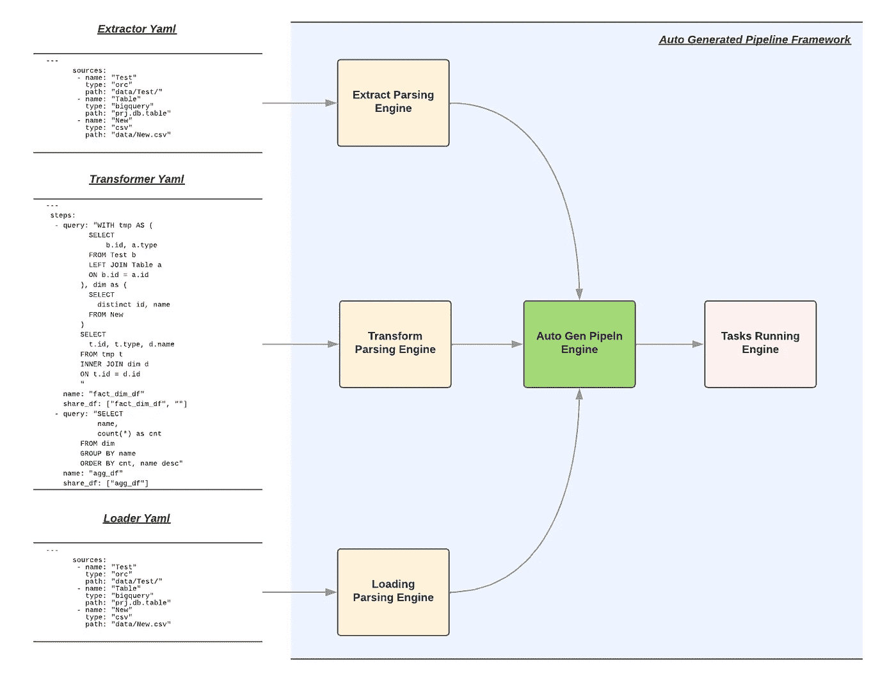
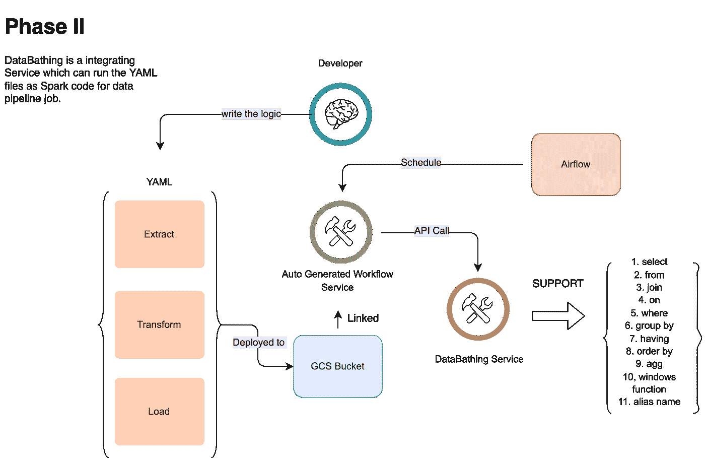
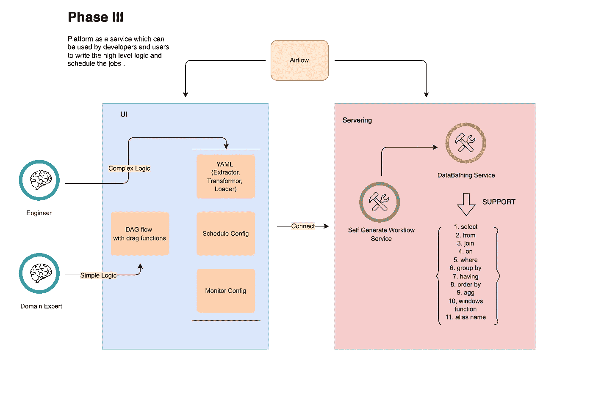

# 使用自动生成的流水线和数据清洗的模块化

> 原文：<https://medium.com/walmartglobaltech/modularization-using-auto-generated-pipeline-with-databathing-8f78b94dad08?source=collection_archive---------5----------------------->

数据管道微服务设计小指南(三)

Photo credit: Pixabay

在第一部分， [**模块化使用 Python 和 Docker 进行数据管道**](/walmartglobaltech/modularization-using-python-and-docker-for-data-pipeline-1193bba7c207) ，和第二部分**，** [**模块化使用图形风格的无服务器管道框架**](/walmartglobaltech/modularization-using-graph-style-serverless-pipeline-framework-fd41498c7769) 中，我们有更多关于使用 Docker 或无服务器设计来采用数据管道的想法。然而，我们仍然需要编写 Python 代码来实现那些设计中所需的逻辑。

然后我脑海中有一个声音说，我们能有一个 ***自动驾驶*** 类型的框架来支持 ETL 工作吗？我们能从 Apache Spark 的强大功能和以 SQL 为中心的工具的简单性中获益吗？创建并使用[数据打包](/walmartglobaltech/databathing-a-framework-for-transferring-the-query-to-spark-code-484957a7e049)后，我们就有了我们的 ***自动驾驶*** 版本流水线框架现在 ***。***

***让我们一起来认识下生成器自动生成的管道框架吧！！！***

# 议程

*   数据管道的 ***自动驾驶*** 是什么？
*   自动生成的管道框架
*   英雄:数据交换！！！
*   小演示
*   当前支持的功能
*   下一个路线图
*   贡献
*   摘要

# 什么是数据管道自动驾驶？

首先让我们看看汽车目前的自动驾驶仪是什么。根据我的理解有两个关键点。第一个是它可以帮助司机转向，加速和刹车，司机不需要采取额外的行动。二是安全建议仍需监管。简而言之，汽车可以处理大多数工作，只需要司机很少的投入。

> Autopilot 能让你的车在车道内自动转向、加速和刹车。当前的自动驾驶功能需要主动的驾驶员监督，并且不能使车辆自主。

我想用一些从汽车自动驾驶到 ***自动数据管道*** 的概念。

# **自动生成的管道框架**

****

**Figure 1\. *Auto-Generated Pipeline Framework***

**我们的框架是 ***中的一个*** 。基于提取器、转换器和加载器的 Yaml 文件，该框架可以解析文件，自动生成数据管道，并自行触发管道。在图 1 中，我们可以在框架中找到三个不同的区域或特性。我将在下面逐一讨论:**

## **解析引擎**

**解析部分有三种不同的引擎。这些解析引擎可以将这些 Yaml 输入视为逻辑，并将逻辑转换为数据帧计算流，这些数据帧计算流将被发送到下一个引擎——Auto Gen Pipeln 引擎。对于三种不同的 YAML 输入，我们有一些标准化的规则，并将在演示会议中进行更多解释。**

## **汽车发电机管道发动机**

**当 Auto Gen Pipeln 引擎获得数据框架计算流程时，它将根据流程和逻辑的顺序自动生成数据管道。任务运行引擎将拾取并运行整个 Spark 作业，无需用户输入任何代码。**

## **运行引擎的任务**

**在获得 Spark 作业序列后，这个正在运行的引擎将触发所有任务。它也没有任何工程输入。**

**基于这三种类型的引擎，我们可以发现，对于我们的 ***自动数据流水线*** ，用户可以专注于逻辑本身(YAML)而不是编码和调试。**

****

**Figure 2— *Auto-Generated Pipeline Framework with DataBathing***

**图 2 是展示自动生成的工作流服务、数据打包服务和气流之间的关系和数据流的高级图表。因为我们正在像可重用组件一样构建所有这些服务，所以很容易插入和退出我们当前的流程。**

# **英雄:数据交换！！！**

**我们可以找一个工具库(**DataBathing*:***[***Blog***](/walmartglobaltech/databathing-a-framework-for-transferring-the-query-to-spark-code-484957a7e049)***，***[***Pypi***](https://pypi.org/project/databathing/)***，以及******Github***)。主要思想是将 SQL 查询解析成 Spark 代码。有兴趣的话可以看看博客和 Github。否则，我们可以把它当作一个黑盒，我们框架的一部分。**

# **小演示**

**在这个演示中，我将介绍一个例子，这个例子已经在图 1 中讨论过了。这个 ETL 过程读取四个 orc，转换并加载所需的结果。**

## **0.先决条件**

**请安装我们演示所需的 DataBathing 和所有软件包。**

## **1.采掘性企业**

**在下面的 YAML 中，我们在 sources 下面有三个不同的键:name、type 和 path。**

*   **名称:这是将要加载的数据帧名称。**
*   **类型:来源，可以是 orc、excel、MySQL 等。**
*   **路径或查询:源的位置或我们需要从数据库中获取的查询。**

## **2.变形金刚(电影名)**

**我们可以通过两种不同的方式将它用于我们的逻辑设计:多个查询或带有语句的“*”。我们将在下面逐一讨论。此外，我们可以将它们结合起来。***

*   **steps:这是一个字典列表，提供了逻辑计算的步骤。**
*   **查询:我们有一个查询，需要在每个步骤中传递给逻辑设计。**
*   **名称:这是查询结果的数据框架的最终名称。**
*   **share_df:这是全局共享的数据帧列表，可以被其他组件使用。**

*****多个查询*****

**在下面的 git 中，第一步，我们计算一些事务数据，并将结果保存为 fact_dim_df。在第二步中，通过使用 fact_dim_df，我们生成聚合结果。**

*****同语句*****

**逻辑链接的另一种方法是使用*“with statement”*。我们可以找到下面的例子。在*“with statement”*中，我们可以定义数据谱系。对于那些中间件结果，如步骤 1、步骤 2 等。，我们将它们保存在管道中以备将来使用；您可以检查 share_df 变量。**

## **3.装载机**

**在最后一个 YAML 中，我们在目标下有四个不同的键，它们与提取器非常相似:名称、类型、模式和路径。**

*   **名称:我们在前面的步骤中处理的数据帧的名称。**
*   **类型:我们需要保存的文件类型。**
*   **模式:所需的保存模式。**
*   **路径:所需的文件路径。**

## ****4 .运行****

**我们有一个入口点，即 workflowRunner，采用三个 YAML 文件来触发自动数据管道。**

# **当前支持的功能**

**所有功能将被分为三个领域:提取器、转换或加载器。利用这个带有数据绑定的框架实现了转换特性。对于 Exactors 和 Loaders，我们需要在下一步中对连接特性进行更多的扩展。**

## ****提取者:****

*   **大查询功能**
*   **谷歌云存储功能**

## **转换:**

*   **自动检测到的功能**
*   **解析 YAML 特征—提取器、转换和加载器。**
*   **管道 DAG 功能**

## **装载机:**

*   **大查询功能**
*   **谷歌云存储功能**

# **下一个路线图**

**我们需要做的一切就是将我们的逻辑输入三个 Yaml 文件。在这种情况下，我们可以创建一个用户界面，它将链接到服务的框架。在图 3 中，我们可以看到这个 PAA 的高级设计。**

****

**Figure 3: Platform as a Service**

**除了平台即服务计划之外，大部分即将推出的功能将侧重于与不同来源和目标的链接。我将其中一些写在下面:**

## **提取器和加载器:**

*   **MySql 功能**
*   **Azure SQL 功能**
*   **MFT 特色**
*   **CSV/EXCEL**

# **贡献**

**如果您需要更多自动生成的功能，您可以通过提出可以显示错误的问题，或创建具有新功能和描述问题的测试的 PR 来帮助改善这一点。如果你也提交了一个补丁，那么我也会感谢你。**

**你可以在下面的 GitHub 主页上找到我们自动生成的管道框架:**

** [## GitHub-Jason-JZ-Zhu/自动生成管道框架

### 请安装数据隔离 pip 安装数据隔离片配置文件。片状 CMD 报告上传 CMD 主报告…

github.com](https://github.com/jason-jz-zhu/auto-generated-pipeline-framework/tree/main) 

# 摘要

通过使用这个 ***Next Generator 自动生成的流水线框架*** ，你可以专注于领域逻辑本身，而不是花更多的时间在编码和调试上。**