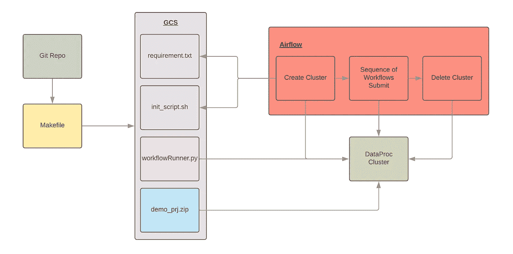
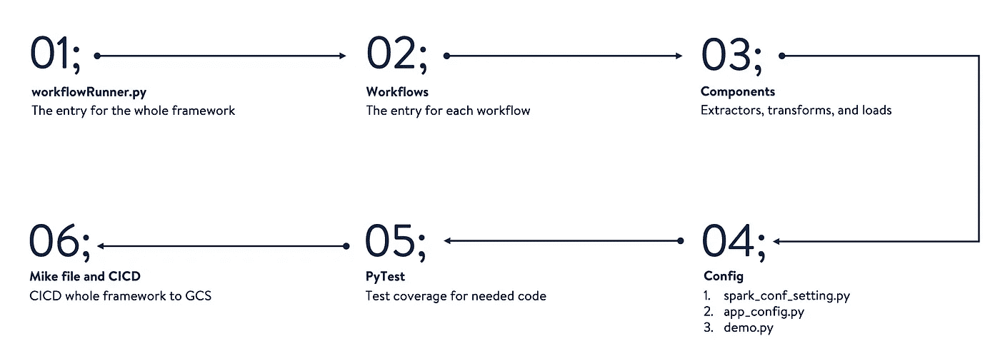
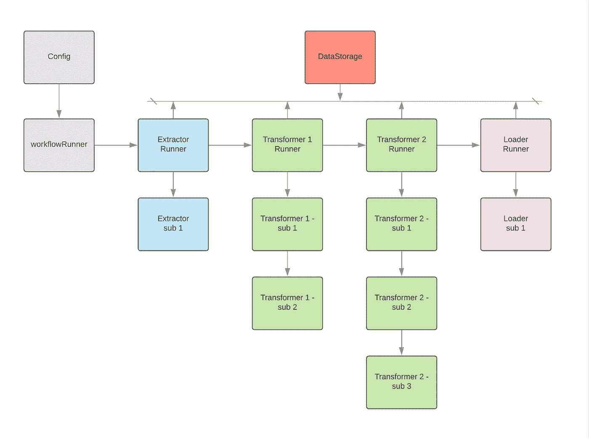
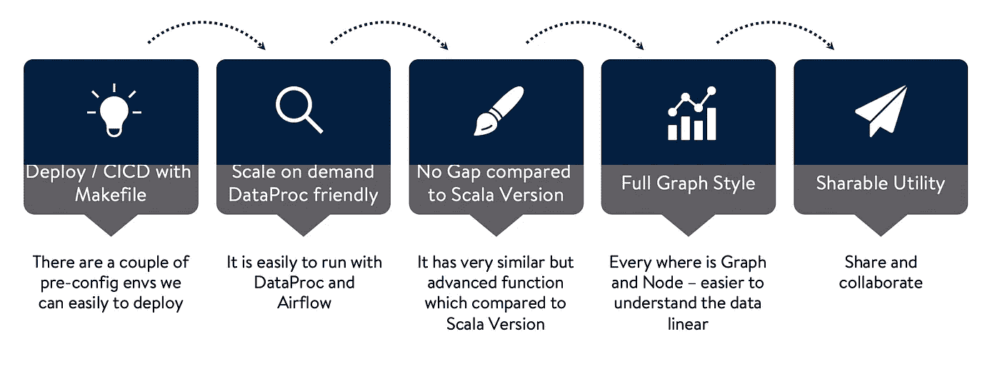

# 使用图形式无服务器流水线框架的模块化

> 原文：<https://medium.com/walmartglobaltech/modularization-using-graph-style-serverless-pipeline-framework-fd41498c7769?source=collection_archive---------1----------------------->

数据管道微服务设计小指南:第二部分

Photo credit: Pixabay

在第一部分 [**模块化使用 Python 和 Docker 进行数据管道**](/walmartglobaltech/modularization-using-python-and-docker-for-data-pipeline-1193bba7c207) 中，我提出了一个如何使用 Docker 来采用数据管道的框架。如果你还没看过，请点击上面的链接。

如今，理解使用无服务器来降低成本并提高整个管道框架的规模是很重要的。那么，我们如何在我们的 Python 数据管道框架中采用无服务器集群或 Dataproc 呢？

在这篇博客中，我将为 Python 展示一个新的**图形风格的无服务器管道框架**。它可以用于数据工程和机器学习工程。

# 议程

*   挑战
*   无服务器
*   图形风格的无服务器管道框架
*   例子
*   摘要

# 挑战

*   采用像 DataProc 这样的无服务器流程
*   降低编程效果——只需要关注逻辑
*   让管道对数据谱系更加清晰？
*   让代码更具可读性？

# 无服务器

> 无服务器是一种云原生开发模型，允许开发人员构建和运行应用程序，而无需管理服务器。

# 图形风格无服务器管道框架

Figure 1\. Infrastructure

为了采用无服务器流程，我们需要为 Python 版本设计一个新的框架。让我们深入研究图 1 中的每个组件。

*   ***Makefile / Looper*** :我们用 Makefile 和 Looper 做来自 GitHub 的 CICD 进程。
*   ***requirement . txt/init _ script . sh***:这两个文件被 airflow create cluster 操作符用来初始化 Dataproc 集群。
*   ***workflow runner . py/demo _ prj . zip***:这两个文件是气流提交操作员用来初始化工作流的。

Figure 2\. Framework Process

对于批处理流水线，这种方法可以满足无服务器的大部分要求。

在图 2 中，概述了要遵循的每个步骤。在示例部分，我们将深入探讨其中的大部分。

这个框架的另一个优点是图形风格的管道。对于大部分框架来说，它有一个 DAG 风格，但只是应用在第一层(上层)。例如，在图 3 中，大多数框架将提取器运行器、变压器 1 运行器、变压器 2 运行器和加载器运行器视为整个 DAG 中的节点。然而，对于更深的层次，他们只是把代码一行行或许多功能放在一起，使组件工作。在我们的新设计中，我们将水平和垂直级别都视为节点，如图 3 所示。我们将在示例部分看到更多的示例。

Figure 3\. Framework Process — Graph Style

在图 4 中，我们可以发现使用这种新设计的好处。

Figure 4\. Benefits

# 例子

在这个例子中，我将浏览图 2 中已经讨论过的代码部分。这个 ETL 过程是读取 CSV、删除重复数据和生成聚合。

**1。框架入口**

workflowRunner.py 是我们框架的入口点。它定义了每一个工作流，并初始化了整个框架可以共享的 spark。

**2。工作流** 这是一个工作流，主要的函数是 run()，所有其他的函数通过*装饰器连接在一起。在这种方法中，通过代码本身很容易理解数据谱系。*

**3。组件/提取器、变压器、加载器** 提取器、变压器和加载器等所有其他组件的逻辑与工作流程相同。我们使用 df_storage 来存储所有需要在组件之间共享的变量。

**4。CICD**

我们用 Makefile 压缩所有需要的代码，用 looper 做 CICD。gcp_pip_install.sh 用于安装集群下所有需要的包。

# 摘要

这是无服务器数据管道微服务设计的又一个好方案。