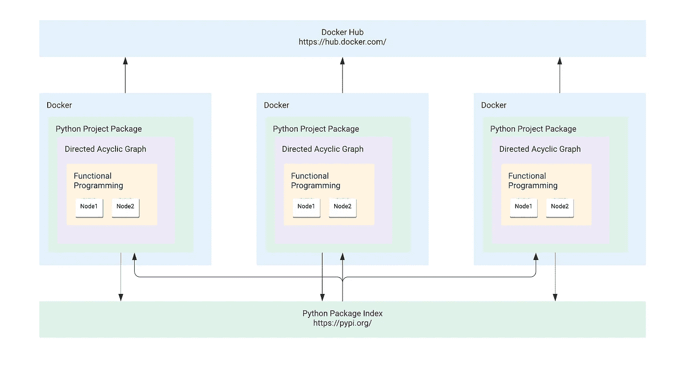

# 使用 Python 和 Docker 实现数据管道的模块化

> 原文：<https://medium.com/walmartglobaltech/modularization-using-python-and-docker-for-data-pipeline-1193bba7c207?source=collection_archive---------0----------------------->

## 数据管道微服务设计小指南

[朱](https://medium.com/u/630a6397128e?source=post_page-----1193bba7c207--------------------------------)撰写

Photo credit: Pixabay

在数据工程领域，ETL 和数据管道是关键点。特别是在像沃尔玛这样的大公司，我们有大量的管道需要开发、测试、部署和支持。我将展示我面临的一些挑战，并在下面提出一个解决方案。

# 挑战

*   我们如何将整体管道分成几个小的微服务管道？
*   我们如何在团队和组织中重用我们的代码或微服务？
*   如何才能分别优化管道？
*   我们如何更有效地测试我们的管道？
*   我们如何能够无痛地部署我们的管道？

# 解决办法

基于解决方案的架构，我使用了函数式编程、有向无环图、python 项目包、docker 和 crontab 来处理所有的批处理和流数据处理。

*   我们有几个使用函数式编程的节点函数。
*   我们使用 DAG 作为容器来链接节点。
*   Python 项目包是我们的项目库，可以作为可重用模型发布到 Python 包索引中。
*   Docker 是我们处理每个特殊数据管道的外部容器，它可以发布到 Docker Hub 进行部署或可重用容器。

下面就让我们一个一个来看看吧:

## 1.函数式编程

> **函数式编程**(常缩写为 FP)是通过组合**纯函数**，避免**共享状态、** **可变数据、****副作用**来构建软件的过程。(参考文献 1)

*   对于函数式编程，因为我们不使用共享状态，只有输入参数和输出返回，所以更容易做 ***单元测试*** 。
*   将一个整体程序分割成几个小函数*变得更加容易。*

## *2.有向无环图*

> *一个 **DAG** 显示关于变量之间关系的假设(在图的上下文中通常称为节点)。我们所做的假设采用从一个节点到另一个节点的线(或边)的形式。这些边是*指向*的，这意味着它们有一个指示其效果的箭头。(参考文献 2)*

*   *我们将拥有基于 DAG 的 ***清晰的数据谱系*** 。*
*   *将一个单片数据管线分割成几个 ***小数据管线*** 变得更容易。*

## *3.Python 项目包*

*我们可以编码、测试、打包和发布我们的可重用模块。*

*   *更容易将 ***可复用模块*** 分享给整个社区。*
*   *我们的模块中有 ***一个入口点*** 。*

## *4.码头工人*

> *Docker 是一组平台即服务产品，使用操作系统级虚拟化来交付称为容器的软件包中的软件。容器是相互隔离的，捆绑了它们自己的软件、库和配置文件；他们可以通过明确定义的渠道相互交流。(参考文献 3)*

*   *我们可以在一个 ***分离环境*** 中优化每一条数据流水线。*
*   *更容易 ***部署*** ，无痛监控各个 ***数据流水线*** 。*

## *5.雅克龙*

> *Docker 友好的现代 Cron 替代品*

*   *在 docker 中安排批处理更容易。*

# *例子*

*在这个例子中，我将展示一个从读取 csv、清理数据到生成指标的 ETL 过程。*

## *1.函数式编程*

*在我们的 utils.py 文件中，一切都是函数和可重用的代码。例如，对于 get_data 函数，它有 path 参数并返回一个 dataframe 数据。对于 duplicate_data 函数，它具有原始数据帧参数，并返回一个干净的数据帧数据。*

*gitutils.py*

*在下面的测试示例中，我们测试了原始数据帧和干净数据帧，安装 pytest 后，我们可以很容易地得到测试结果(通过或失败)。*

*test_utils.py*

## *2.有向无环图*

*下面的管道类是 DAG 的容器。*

*DAG_pipeline.py*

*在初始化 Pipeline 类之后，我们可以使用 decoration 将我们的任务链相互连接起来。例如，函数 get_raw_data 是第一个任务，clean_data 将在 get_raw_data 任务完成后触发。*

*DAG_node.py*

## *3.Python 项目包*

*我们将整个项目的入口点设置为 demo/workflow 文件夹下的 demo_workflow。*

*setup.py*

## *4.码头工人*

*Dockerfile 文件中有 5 个步骤*

*   *获取官方 python 图片:python:3.7-slim*
*   *安装 gcc 和 cron*
*   *根据 requirements.txt 安装所有 python 包*
*   *设置目录并安装演示包*
*   *将 crontab.yaml 文件复制到 docker 中需要的位置*
*   *运行 yacron 命令进行批处理，或者只运行流/一次性的演示*

*Dockerfile*

## *5.雅克龙*

*这个 crontab yaml 文件包含 [cron 调度表达式](https://crontab.guru/) (0 * * * *)，它将在 docker 中每小时运行一次脚本。*

*crontab.yaml*

# *如何运行示例？*

# *结论*

*对于批处理和流数据管道区域的微服务设计，这是一个很好的解决方案。*

# *密码*

*我们可以在这里找到所有可用的代码:[https://github . com/Jason-JZ-Zhu/modulation _ Python _ Docker _ Demo](https://github.com/jason-jz-zhu/Modularization_Python_Docker_Demo)*

# *参考*

1.  *[https://medium . com/JavaScript-scene/master-the-JavaScript-interview-what-is-functional-programming-7f 218 c 68 B3 a 0 #](/javascript-scene/master-the-javascript-interview-what-is-functional-programming-7f218c68b3a0)*
2.  *[https://cran.r-project.org/web/packages/ggdag/vignettes/intro-to-dags.html](https://cran.r-project.org/web/packages/ggdag/vignettes/intro-to-dags.html)*
3.  *[https://en.wikipedia.org/wiki/Docker(软件)](https://en.wikipedia.org/wiki/Docker_(software))*
4.  *[https://github.com/gjcarneiro/yacron](https://github.com/gjcarneiro/yacron)*
5.  *[https://www.toptal.com/developers/gitignore](https://www.toptal.com/developers/gitignore)*
6.  *[https://choosealicense.com/](https://choosealicense.com/)*