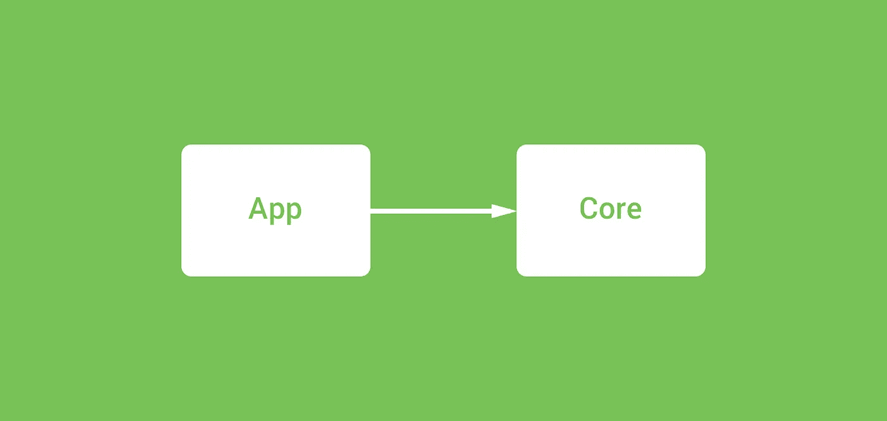
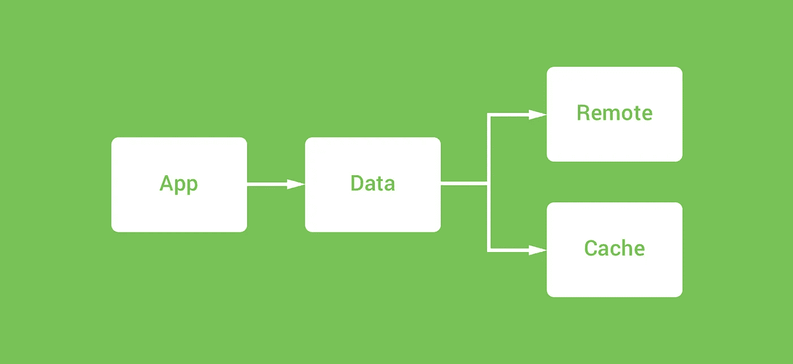
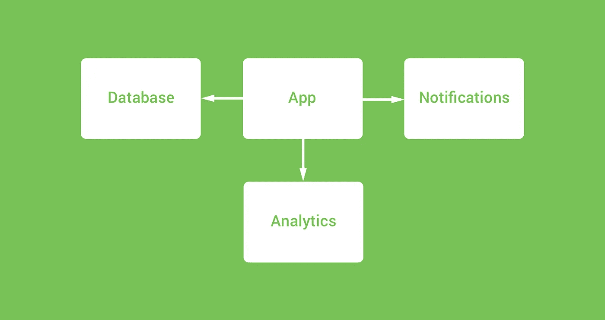
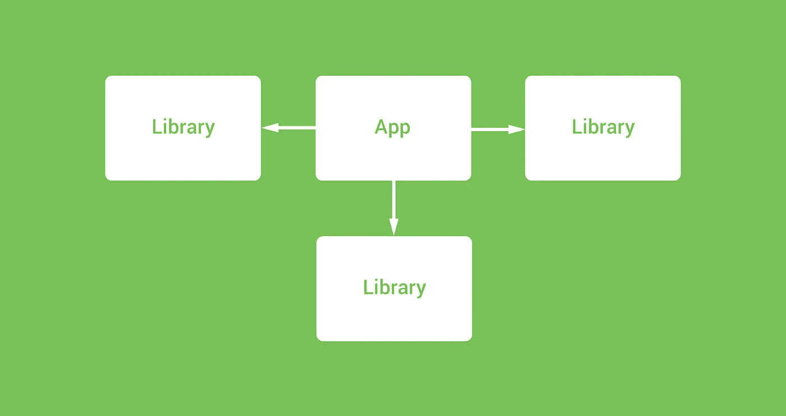
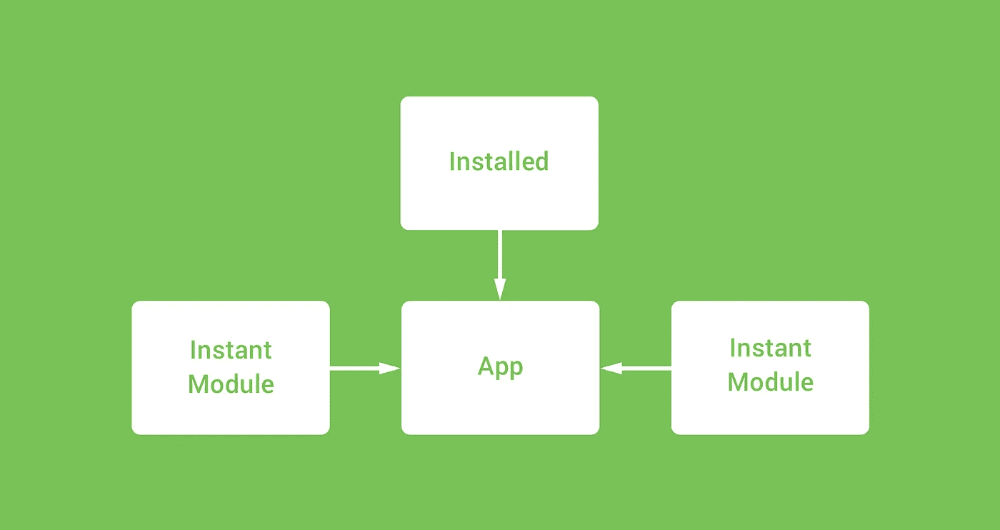
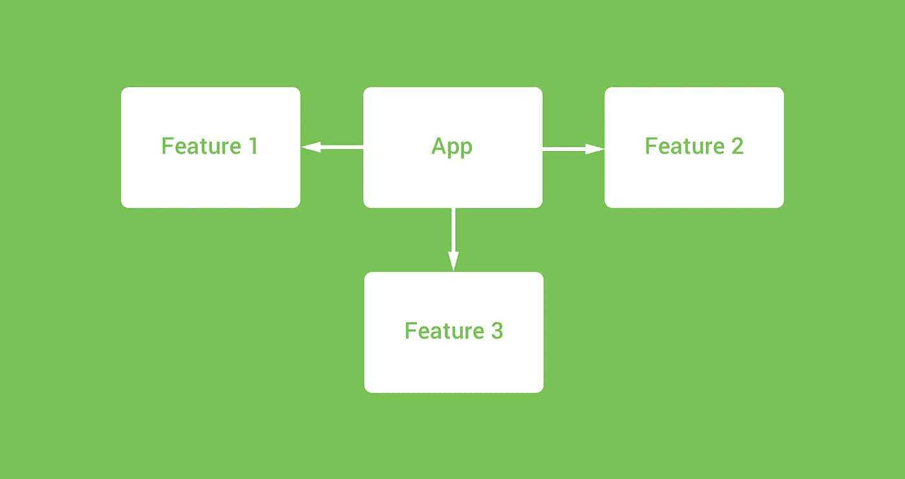

# 模块化 Android 应用

> 原文：<https://medium.com/google-developer-experts/modularizing-android-applications-9e2d18f244a0?source=collection_archive---------0----------------------->


我们都经历过。单模块 android 应用程序——在我们 Android 开发生涯的某个阶段，我们可能已经或正在开发一个由单个模块组成的项目。现在，这一点都没有错，而且在很多情况下，单个模块最有可能完成这项工作。

但在我们的应用程序可能增长的情况下，或者我们可能希望利用谷歌的新分发功能(即时应用程序、应用程序捆绑包)，或者甚至只是创建一个清晰的关注点分离，以使我们的项目更容易工作——模块化我们的应用程序可以帮助我们实现所有这些事情。因为 Google 的一些新工具是针对模块化的应用程序，谁知道将来会有什么样的应用程序以这种方式构建。

最近，我一直在玩即时应用程序和新的应用程序包，这意味着现在有更多的方法来模块化我们的项目——对这些多了解一点可以帮助我们知道配置项目的正确方法。也许你想模块化你的应用程序，或者你想更清楚地了解我们可以为我们的项目创建的不同模块之间的差异——在这篇文章中，我们将快速浏览一下我们可以创建的不同类型的模块，以及这些模块可以为我们的 android 应用程序做些什么。

# 应用模块

我们将从这里开始，因为它可能是您在职业发展过程中已经遇到或使用过的模块。如果没有，那么这是最重要的开始！这基本上是应用程序的主要模块，通常位于 **app** 模块下，使用模块 build.gradle 文件中的应用程序插件来表示:

```
apply plugin: 'com.android.application'
```

现在，如果你正在构建一个单一模块的应用程序，那么这将是你在整个项目中使用的唯一模块类型的插件。在单模块项目中，这个基础模块将包含您的所有应用程序职责，包括用户界面、网络、缓存、数据操作，只要您指定，它就会存在。


如果您正在构建一个多模块应用程序，那么应用程序模块将仍然是已安装的模块，但是这个**应用程序**模块的操作方式将根据您正在构建的内容而有所不同:

*   如果你的多模块项目只是将你的应用程序的数据职责抽象到**数据**模块中，那么**应用程序**模块的操作方式将与你在单应用程序模块中使用它的方式相同，只是关注点的分离更加清晰。
*   如果您的多模块项目支持动态特性模块，那么这个应用程序模块的行为将与单模块应用程序非常相似。唯一的区别是，模块需要为应用程序实例支持的动态特性定义模块引用。
*   如果您的多模块项目是针对即时应用程序的，那么这个**应用程序**模块将简单地用于定义即时应用程序的功能模块依赖关系。这是因为在构建即时应用程序时，该应用程序模块不包含任何应用程序代码，因为它的职责只是使用声明的功能模块。

# 核心模块

本质上，您可以使用这些模块来分隔项目的相关区域，以便它们与项目的主模块分离。这些模块并没有一个新的术语，但我们称之为**核心**模块。

例如，假设你有一个同时支持 Android wear 和 Android 手机的项目，你可能有一个用于 Wear UI 层的模块，手机 UI 层后跟一个**核心**模块。这个核心模块将包含两个 UI 模块使用的所有共享业务逻辑、数据操作、缓存等。在这种情况下，您正在促进代码重用，因为所有这些方面都可以在两个 UI 模块之间共享。



重用并不是你创建这种模块的唯一原因。分离核心逻辑也有助于创建清晰的关注点分离，使您的代码在整个团队中更容易理解、测试和维护——在某些情况下，您还可以受益于构建时间的改进。

例如，您可能有一个大型应用程序，它有一个复杂的数据层，既与远程数据源通信，又与缓存数据源通信。在这种情况下，将这些逻辑部分分离到它们自己的特定责任模块中，可以让您实现这些事情。这可能导致我们拥有一个数据模块(处理数据和数据源的获取)、远程模块(处理远程数据源通信)和缓存模块(处理本地数据持久性)，以及一个表示模块来处理应用程序中面向用户的部分。



对于这些核心模块应该包含哪些内容，并没有严格的指导原则。我的建议是，不要为了把东西移入模块而把它移出，但是如果你觉得这对你的团队有好处(就像上面提到的那些)，那么把责任移入模块可以帮助你实现模块化的一些好处。

包含 android 框架引用的核心模块将需要使用库插件:

```
apply plugin: 'com.android.library'
```

而另一方面，不引用 android 框架的核心模块可以简单地是纯 kotlin / java 模块:

```
apply plugin: 'kotlin'
```

# 抽象模块

核心模块可能经常被用来移动共享逻辑块或独立职责，但有时我们可能想从我们的应用程序中抽象出一些第三方职责。这通常是一个好主意，这样我们的应用程序就不会紧密耦合到某个特定的实现——在这种情况下，我们只需通过应用程序和抽象模块之间的接口进行通信，这样我们就可以在需要时轻松地将实现切换到另一个实现。因此，如果某个库被弃用，某个服务关闭，或者出于任何原因，您需要更改实现，那么您可以在尽量不中断代码的情况下这样做。



在这些情况下，你的抽象模块要么使用 android 库插件，要么就是我们之前看到的纯 kotlin / java 模块(取决于库的依赖性)。

# 功能模块

除了这种将后端相关任务分割成核心模块的方法，你还可以对应用程序中面向用户的功能进行同样的操作——我们称这些**功能**模块。这些功能模块将包含我们的应用程序的特定功能，这些功能可以帮助我们再次分离不同的职责，以获得与我们之前看到的相同的好处。现在，定义它们的方式将取决于您正在构建的多项目应用程序的类型，所以让我们来看看不同的场景:

## 标准应用

在不使用即时应用或动态交付的“标准”应用中，您可能仍然希望将单个功能拆分成模块，以获得模块化的一些好处，同时也为您的应用沿着即时/动态方向移动做好准备。在这些情况下，您只需将一个特性打包到一个 android 库模块中，并将其作为一个依赖项添加到您的应用程序模块中。

```
apply plugin: 'com.android.library'
```



如果您不支持即时应用程序，或者还没有准备好(或需要)支持动态交付，那么通过库模块来实现仍然可以帮助您分离代码库，并实现模块化的其他好处。在这些情况下，你可以简单地使用库插件将模块声明为库模块，并将它们作为一个依赖项添加到你的应用程序模块中。

## 即时支持应用程序

另一方面，如果您的应用程序支持即时播放，那么您将需要为您想要的功能模块使用功能插件:

```
apply plugin: ‘com.android.feature’
```



每个功能模块都需要有一个对你的**基础**模块的引用(在这个图中，是**应用**模块)——在这种情况下，功能模块将只包含实现该功能所需的代码，你的应用核心所需的任何代码都将从基础模块引用中获得。

## 动态支持应用

这些模块可用于将应用的特定功能和资源分离到它们自己的模块中，然后作为新的应用捆绑包格式的一部分，允许我们动态地向用户提供单独的功能。这意味着我们可以减少应用程序的初始安装规模，而不是允许用户在运行时按需下载特定的功能。



就像即时应用程序集中的功能模块一样，这些动态功能模块将包含纯功能实现，同时仍然引用应用程序的基本模块。这个模块中唯一的区别是其中包含的清单文件有一些关于这个模块分发的附加信息。

我们可以使用下面提供的插件将一个模块定义为动态特征模块:

```
apply plugin: 'com.android.dynamic-feature'
```

**注意:**未来的应用捆绑包将提供对即时应用的支持。

# 即时应用模块

最后但同样重要的是，如果你现在想要支持即时应用，那么你的应用需要提供一个**即时**模块。


这个模块的内容大部分时间都是空的——这是因为**即时模块**的职责是在请求时简单地构建即时应用。因此，它的唯一目的是使用被作为依赖项引用的功能模块。定义即时模块时，您需要使用模块 build.gradle 文件中的即时应用插件:

```
apply plugin: ‘com.android.instantapp’
```

本文的目的是简要概述 android 项目可用的不同模块，并为如何在应用中实现模块化埋下伏笔。如果您对模块化有任何疑问，请联系我们🙂

[](https://twitter.com/hitherejoe) [## 乔·伯奇(@hitherejoe) |推特

### 乔伯奇的最新推文(@hitherejoe)。Android 主管和高级工程师。@缓冲。谷歌开发专家…

twitter.com](https://twitter.com/hitherejoe) [](http://eepurl.com/dIKgiT)

> 感谢[唐恩·费尔克](https://medium.com/u/e75f3da9f41a?source=post_page-----9e2d18f244a0--------------------------------) & [安妮丝·戴维斯](https://medium.com/u/9f96e9614042?source=post_page-----9e2d18f244a0--------------------------------)对这篇文章的校对🙌🏻