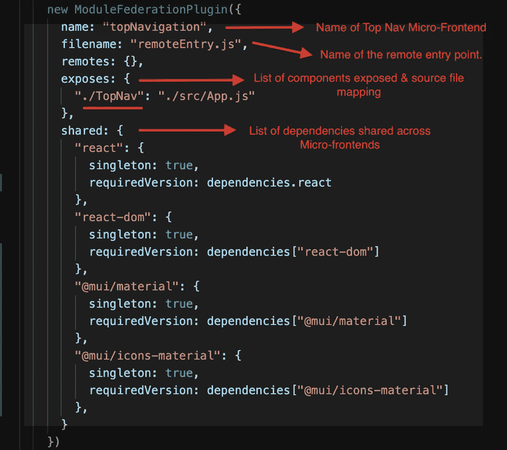

# 使用 Webpack 5 的模块联合。微前端之旅。

> 原文：<https://medium.com/walmartglobaltech/module-federation-using-webpack-5-the-micro-frontend-journey-719688c5d73b?source=collection_archive---------1----------------------->

# 背景:

在大规模的企业中，通常许多团队在一个单一的、大型的、复杂的应用程序上工作，这个应用程序有几个活动的部分。如果这是一个单片前端应用程序，那么进一步扩展将变得极其困难。

微前端的想法是将大的整体应用程序分解成更小的块，以便于维护、加速和快速扩展应用程序。

因此，最好的配置是让不同的团队在他们各自的代码库中处理整个应用程序的不同部分，独立地处理独立版本的功能，并以某种方式(让我们看看下面的选项)合并在一起，形成一个完整的最终用户应用程序。

# 不同的方法:

为了摆脱前端应用中的单片架构，人们尝试了不同的方法。

使用节点包在应用程序之间共享代码是最常见的方式，并且已经存在了一段时间。一个很大的缺点是要跟上每个已发布包的最新版本的变化。这相当于增加了更新变更、不兼容解决方案、测试和部署的时间。随着越来越多的包被添加，它也增加了应用程序的大小。

从构建时解析转移到运行时的另一种方法是让每个微前端将 JavaScript 运行时包部署到 CDN 上进行使用。宿主应用程序将在运行时使用它们并缝合。这需要框架编写和处理定制逻辑。这给框架带来了很大的依赖性，当框架推送更新时，应用程序中可能需要重构。

# Webpack 5 和模块联合:

为了克服所有这些问题，创建了使用模块联合的微前端。

模块联合使得在许多前端应用程序之间共享组件和信息变得容易，并且还支持构建 SPA 和创建完全联合的站点。

它不是一个框架。它是添加到 Webpack 的 JavaScript 架构和插件。因此不依赖于特定的框架，并在开发中提供完全的灵活性。它也发生在运行时，所以在构建过程中没有开销。

它有许多优点，例如:

1.  团队独立开发，并在运行时从其他应用程序动态导入代码。最终结果感觉像一个温泉。
2.  独立的测试和部署/发布策略。
3.  由于共享组件和依赖项仅在需要时加载，因此每个微应用程序的捆绑包大小更小且得到优化。
4.  每个 micro app 都可以选择自己的技术栈，不受特定框架的束缚。

在模块联合应用中，主要有两个实体:

1.  **主机或容器** = >托管联合远程模块的当前运行的应用程序。
2.  对外部联邦模块的引用。
3.  **Expose = >** 从应用程序中导出的模块被“公开”以供使用。
4.  **共享** = >不同遥控器共享的模块。

总体工作是让远程微前端暴露 JavaScript 模块。它可以是组件、原始值、复数值。基本上，任何要共享的 JavaScript 模块都要在 webpack.config.js 文件中公开。这些模块由容器应用程序消费，并且组件被呈现以构成作为整体的应用程序。

代码在运行时下载，如果缺少任何依赖项，则宿主应用程序下载该依赖项。如果微前端之间共享了依赖关系，则使用相同的依赖关系。这导致了更少的重复和更小的代码量。

对最终用户来说，呈现的是单个应用程序。这是一种无缝体验，将带来性能、速度等优势。并且没有单片应用程序的缺陷。

# 逐步创建模块联邦应用程序:

在这里，我们将构建一个类似于标准电子商务平台的应用程序，它包含一个左侧导航部分、顶部导航部分和一个中间容器，中间容器显示一个项目的所有细节等。

**左导航微前端应用**:[https://github.com/priyavarun/wp5-mf-left-nav](https://github.com/priyavarun/wp5-mf-left-nav)

**顶级导航微前端应用**:[https://github.com/priyavarun/wp5-mf-top-nav](https://github.com/priyavarun/wp5-mf-top-nav)

**项目详情微前端应用**:[https://github.com/priyavarun/wp5-mf-item-details](https://github.com/priyavarun/wp5-mf-item-details)

**贝壳集装箱**:[https://github.com/priyavarun/wp5-mf-shell](https://github.com/priyavarun/wp5-mf-shell)

Architecture/Interaction diagram between all the microapps.

它们都是使用 Webpack 5 的 React 应用程序。(我已经创建了一个定制的和最小的应用程序，而不是用 create-react-app 引导)

总的来说，这些应用程序与我们熟悉的现有 React 应用程序非常相似。主要的变化是在 Webpack 配置中，包括了模块联合插件和传递给它的配置。

**左导航微前端:**

**顶部导航微前端:**

**物品明细微前端:**

**外壳容器:**

要运行完整的应用程序，请使用上面提供的每个回购的链接进行下载。

在终端中安装依赖运行“yarn install”命令。这将安装所有的依赖项，如 React、Webpack 5 以及 package.json 中提供的更多内容。

要启动应用程序，请在终端中运行“纱线启动”命令。这将在 webpack 配置“devServer”中指定的端口启动，并在特定端口的浏览器上运行应用程序。

这将在各个端口(如 3001、3002、3003)上启动左侧导航、顶部导航、项目详细信息应用程序。微前端由运行在 3004 上的外壳容器应用程序使用。

以下是在独立模式下运行每个微前端的输出。这使得各个团队能够单独开发、测试和部署应用程序，并且只有拼接将由外壳或主机容器应用程序来完成。

左侧导航部分来自部署在 [http://localhost:3001](http://localhost:3001) 的应用程序

Left Navigation Standalone Micro-Frontend on port 3001

**顶部导航部分**来自部署在 [http://localhost:3002](http://localhost:3002) 上的应用程序

Top Navigation Standalone Micro-Frontend on port 3002

**项目详细信息**部分来自部署在 [http://localhost:3003](http://localhost:3003) 上的应用程序

Item Details Standalone Micro-Frontend on port 3003

一旦我们启动并运行了各个微前端，现在就要在容器外壳应用程序中将它们缝合在一起。

瞧啊。在端口 3004 上运行的应用程序是一个完整的应用程序，它由用户看到的多个微前端组成，并在运行时无缝呈现，就像 SPA 一样。

Complete Federated Application composing of Left Nav(MFE), Top Nav(MFE) & Item Details(MFE)

总的来说，模块联合提供了一种简单明了的方式，只需要很少的配置就可以跨不同的微前端使用组件，并且在 Webpack 中提供了真正强大的功能。

这为团队提供了完全的灵活性，可以独立开发和部署，对于最终用户来说，这是一个具有增强性能的无缝单页应用程序。

在接下来的文章中，将会添加更多关于 Webpack 内部工作、插件/加载器、性能改进、分析等的信息。

请保持联系！:)