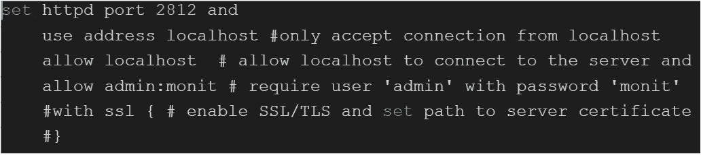
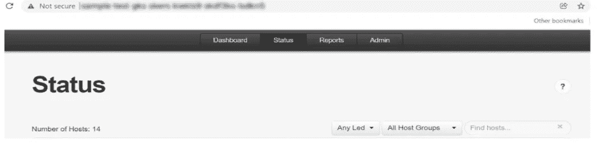
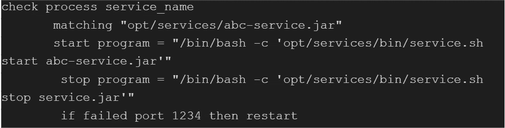
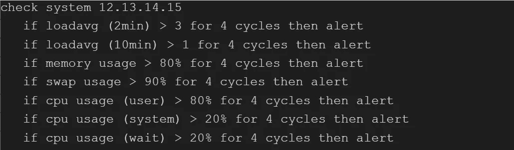
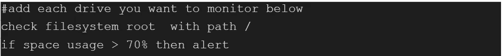
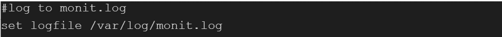

# Linux/Unix 上 Monit 的安装和配置

> 原文：<https://medium.com/globant/monit-installation-and-configuration-on-linux-unix-8013dd22fe45?source=collection_archive---------1----------------------->

# 介绍

Monit tool 是一个免费的开源工具，用于管理和监控 UNIX 系统。它进行自动维护和修复，并可以在出现错误的情况下执行有意义的操作，例如，如果某个进程没有运行，则启动该进程；如果没有响应，则重新启动该进程；如果该进程占用大量资源，则停止该进程。Monit 有一个用户友好的网络界面，您可以直接查看系统状态并设置流程。我们可以使用 Monit 来监视文件、目录和文件系统的变化。通过使用 Monit，我们将能够监控远程主机的 TCP/IP 端口、服务器协议和 ping。Monit 有自己的日志文件来验证服务。它有关于恢复状态的任何关键问题的警报。

本文涵盖了以下几点

1.  Monit 主收集器上的 Monit 安装
2.  在客户端上安装监控代理
3.  Monit 的配置
4.  监控服务
5.  参考

# **1。Monit 主收集器上的 Monit 安装**

按照以下步骤在主收集器上下载 monit:

打开终端/控制台，在 Linux 上安装 monit 并下载 zip 包

> 【https://mmonit.com/dist/mmonit-3.7.7-linux-x64.tar.gz】
> 
> **拉开焦油**
> 
> ****#冈兹普 mmonit-3.7.7-linux-x64.tar.gz****
> 
> ****# tar-xvf mmonit-3.7.7-linux-x64.tar****
> 
> **使用以下命令启动 Monit:**
> 
> ****# CD mmunit-3 . 7 . 6-Linux-x64/bin****
> 
> ****#。/mmunit 开始****

# ****2。客户端服务器上的 Monit 安装****

****先决条件****

**默认情况下，Monit 工具在系统库不可用，您需要添加并启用第三方 [epel 库](https://www.tecmint.com/how-to-enable-epel-repository-for-rhel-centos-6-5/)，以便在您的 RHEL/CentOS 系统下安装 Monit 包。一旦添加了 epel 存储库，就可以通过运行下面的 yum 命令来安装这个包。对于 Ubuntu/Debian/Linux Mint，用户可以使用所示的 apt-get 命令轻松安装。**

**在 RedHat/CenOS/Fedora/上**

> ****# yum 安装监视器****
> 
> **在 Ubuntu/Debian/Linux 上**
> 
> ****$ sudo apt-get 安装监视器****

# ****3。显示器的配置****

**Monit 有一个使用 web 服务器在端口 2812 上运行的 web 接口。打开从主服务器(Monit)到所有客户端服务器的端口 2812，反之亦然。monit 的主配置文件位于(RedHat/CentOS/Fedora)下的/etc/monit.conf 和(Ubuntu/Debian/Linux Mint)下的/etc/monit/monitrc 文件中。然后，取消 monit.conf 或 monitrc 文件下的以下部分的注释，并添加您的服务器的 IP 地址或域名，允许任何人连接和更改 Monit 用户和密码，或者您可以使用默认的。**

****

**现在，使用以下命令启动 Monit 服务以获取新的配置设置:**

> ****# /etc/init.d/monit 开始****

**现在，您可以使用“http://localhost:2812”连接到 Monit web 接口，如下图所示。您可以使用在(RedHat/CentOS/Fedora)下的/etc/monit.conf 和(Ubuntu/Debian/Linux Mint)的/etc/monit/monitrc 文件中设置的用户名和密码。**

****

# ****4。监控服务****

**现在我们需要在 web 界面设置完成后添加我们想要监控的程序。这些程序应该添加到(RedHat/CentOs/Fedora)下的/etc/monit.conf 和(Ubuntu/Debian/Linux Mint)的/etc/monit/monitrc 文件中。**

**示例:**

**微服务**

****

**CPU 内存监控**

****

**磁盘空间**

****

**记录**

****

**继续之前，请检查 monit 语法是否有错误。**

**检查 monit 语法的命令是**

> ****# monit -t****
> 
> ****$ sudo monit -t****

**如果您得到消息“**控制文件语法正常**”，那么我们就可以开始了。**

**要启动 monit 服务，可以使用以下命令。**

> ****# /etc/init.d/monit 重启****
> 
> ****$ sudo /etc/init.d/monit 重启****

**重新启动 monit 后，点击 URL“http://localhost:2812”，您将能够看到您添加到(RedHat/CentOs/Fedora)下的/etc/monit.conf 和(Ubuntu/Debian/Linux Mint)的/etc/monit/monitrc 文件中的所有程序的状态。**

# ****5。参考文献****

**[https://mmonit.com/monit/documentation/monit.html](https://mmonit.com/monit/documentation/monit.html)**

**[https://mmonit.com/documentation/](https://mmonit.com/documentation/)**

**感谢您阅读我的文章。希望对你在 Linux/Unix 上设置 Monit 有所帮助。**