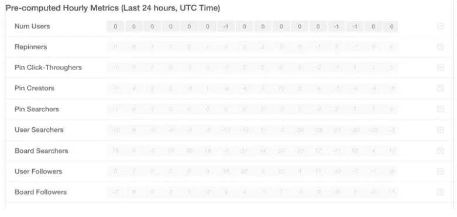

# 实时监控 A/B 实验

> 原文：<https://medium.com/pinterest-engineering/monitoring-a-b-experiments-in-real-time-5cd3ee611c1?source=collection_archive---------1----------------------->

Bryant Xiao | Pinterest 工程师，数据

作为一家数据驱动型公司，我们非常依赖 A/B 实验来对新产品和新功能做出决策。我们运行这些实验的效率会强烈影响我们迭代的速度。通过为实验人员提供实时指标，我们增加了成功进行实验的机会，并加快了进度。

我们有[日常工作流程](https://engineering.pinterest.com/blog/scalable-ab-experiments-pinterest)来为每个实验计算数百个指标。虽然这些每日指标提供了关于行为的重要见解，但它们通常要到第二天才可用。如果触发不正确，导致 Pinners 实际上没有被记录呢？如果有一个 bug 导致指标大幅下降怎么办？不平衡的群体怎么办？在实时仪表盘之前，没有办法知道，直到第二天。此外，任何后续的更改/修正都需要一天才能看到效果，这会减慢我们的速度。

实时实验仪表板解决了这些问题。在这里，我们将分享我们如何构建实时实验指标管道，以及我们如何使用它来正确设置实验，捕捉错误并尽早避免灾难性的变化，包括:

1.  使用 MemSQL 设置实时数据管道
2.  构建每小时和按需指标计算框架
3.  实时实验指标的用例

## 数据管道

下面是实时实验指标的高级架构。

## 流线型火车

[Streamliner](http://blog.memsql.com/spark-streamliner/) 是一个集成的 MemSQL 和 Apache Spark 解决方案，用于从 Kafka 等实时数据源传输数据。我们使用它从 Kafka 获取数据，并保存到 MemSQL 中(Kafka->Spark Streaming->MemSQL)。等待时间足够我们进行接近实时的分析。

## MemSQL

MemSQL 是一个高吞吐量、高可伸缩性、高兼容性的分布式关系数据库。它的高性能查询功能允许我们进行近乎实时的特别分析。我们使用 MemSQL 作为我们的实时数据库来存储所有数据，并采用 24 小时保留策略。存储在 MemSQL 中的数据用于计算计划的和按需的指标。然后，结果将用于填充仪表板。

## 仪表盘

MemSQL 提供了几种使用流行的 MySQL 兼容客户端和库连接到 MemSQL 后端的方法。我们使用 MemSQL 提供的 [Python 库](https://github.com/memsql/memsql-python)连接到数据库，并运行调度的作业或按需查询。

实时实验指标仪表板由两部分组成:

1.  过去 24 小时内预先计算的每小时指标
2.  过去一小时内的实时指标

## 预先计算的指标

考虑到更细粒度的实验指标(不到一个小时)可能会有噪声，并且按需计算效率不高，我们决定每小时执行一次 cron 作业来预先计算过去一个小时的这些指标。当我们转到实时控制面板时，这些预先计算的指标会立即加载。每个单元格是一个小时的度量。

## 实时指标

我们还可以在最后一小时内按需计算指标，这使我们能够在实验启动后立即查看见解。

## 应用程序

**验证触发**
触发问题仍然较为常见，包括:

*   我们可能忘记激活实验或调用错误的 API，因此没有 Pinners 被记录；
*   或者我们可能错误地激活实验，以至于一组中的 Pinners 永远不会被触发；
*   或者看到治疗的 Pinners 被错误地触发到控制组

避免这些触发问题是成功进行实验的关键。

为了防止出错，最好在打开所有组之前验证触发是否正常工作(例如，将组大小从 0%扩大到 1%)。我们以前常常跟踪 Kafka 主题来寻找触发记录，这对大多数开发人员来说是痛苦的。通过实时实验仪表板，验证可以免费完成。一旦我们触发了所有组，我们就可以计算按需指标，它会向我们显示在指定的时间间隔内每个组中触发了多少 Pinners。

**确认小组规模变更**

由于我们的[新实验平台](https://engineering.pinterest.com/blog/building-pinterest%E2%80%99s-ab-testing-platform)允许组大小的变化几乎立即生效，所以也可以实时确认组的变化。更改组大小后，我们可以在一小时后检查预先计算的每小时指标。例如，如果我们从 1%增加到 5 %,新加入的每小时 Pinners 应该是前一小时的大约 5 倍。如果我们不想等待，我们也可以按需计算指标并进行粗略的估计。

**检查组平衡**

不平衡组是实验中的另一个常见问题，所以我们越早发现不平衡越好。同样，实时实验仪表板会有所帮助。在增加组大小几个小时后，我们可以查看预先计算的每小时指标，这将显示在过去几个小时内有多少不同的用户被触发到每个组中。

**监控核心指标**

实时实验仪表板的另一个用例是快速检测灾难性的变化。在扩大组规模或进行任何更改后，我们可以看到核心指标的表现。如果指标显著下降，我们应该立即检查实验，看看是否有任何错误。我们可能还想关闭实验进行调查，并防止进一步的损害。

## 摘要

实时实验指标对于快速了解实验非常有帮助。这个系统已经投入生产六个多月了，已经在很多情况下帮助了我们。如果您对实验框架和分析平台感兴趣，[请加入我们的](https://careers.pinterest.com/careers/engineering/san-francisco)数据工程团队！

*鸣谢:Pinterest 的多个团队为构建实时实验仪表板提供了有见地的反馈和建议。主要撰稿人包括 Bryant Xiao、、Justin Mejorada-Pier、Shuo Xiang、、John Elliott 以及数据工程团队的其他成员。*