# 使用 Datadog 进行监控和报警

> 原文：<https://medium.com/globant/monitoring-and-alerting-using-datadog-7459dd9186ae?source=collection_archive---------0----------------------->

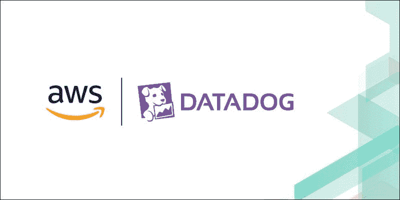

# **简介**

Datadog 是一种监控和分析工具，由信息技术(IT)和 DevOps 团队使用，用于确定基础架构和云服务的性能指标和事件监控。该工具可以监控服务器、数据库和工具等资源。

*   在本文档中，我们将讨论如何利用 Datadog 来监控 AWS 云上的基础设施。我们将监控 AWS 资源，如 EC2 实例和 RDS 数据库。
*   我们将创建 Datadog 控制面板，它有助于直观地跟踪、分析和显示关键性能指标，我们还将了解如何监控基础架构的运行状况。
*   我们还将尝试使用 Datadog 中的监视器建立一个警报机制。这将有助于我们在指标达到阈值或出现问题时得到通知，这样我们就可以采取补救措施。

# **背景**

对于我们的用例，我们关注 AWS 云中的基础设施。虽然我们有原生的 AWS CloudWatch 服务来监控基础设施，但使用 CloudWatch 有一些限制。

例如，没有可以列出多个服务和资源的专用仪表板选项，这在企业级环境中非常有用。

考虑到这些限制，让我们继续创建 Datadog 控制面板和监视器，同时进行基础架构监视和警报。

# **配置 Datadog**

## **先决条件**

作为先决条件的一部分，我们需要在 AWS 中有一些基础设施。为了保持用例简单，我们将监控一个 2 层应用程序，它由一个 EC2 实例和一个 Postgres Aurora DB 组成。

我们可以将 Datadog 监控配置分为 6 个步骤。

# **第一步:在 Datadog 上创建您的帐户**

我们需要注册并创建一个数据狗帐户。

网址:[https://app.datadoghq.com/signup](https://app.datadoghq.com/signup)。在企业级，我们可以使用 SSO 登录。

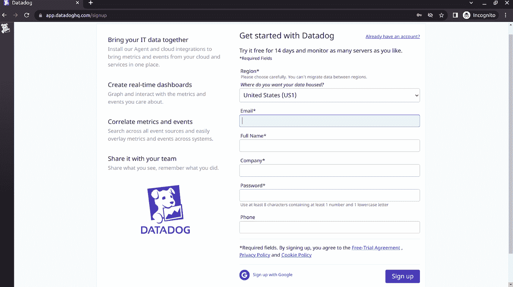

*图 1。注册数据狗*

# **第二步:选择您的筹码**

登录后，我们需要选择一个堆栈。它只不过是我们可以使用 Datadog 集成的服务和软件的列表。因为我们正在监视 AWS 上的资源，所以我们可以单击 AWS 标题。

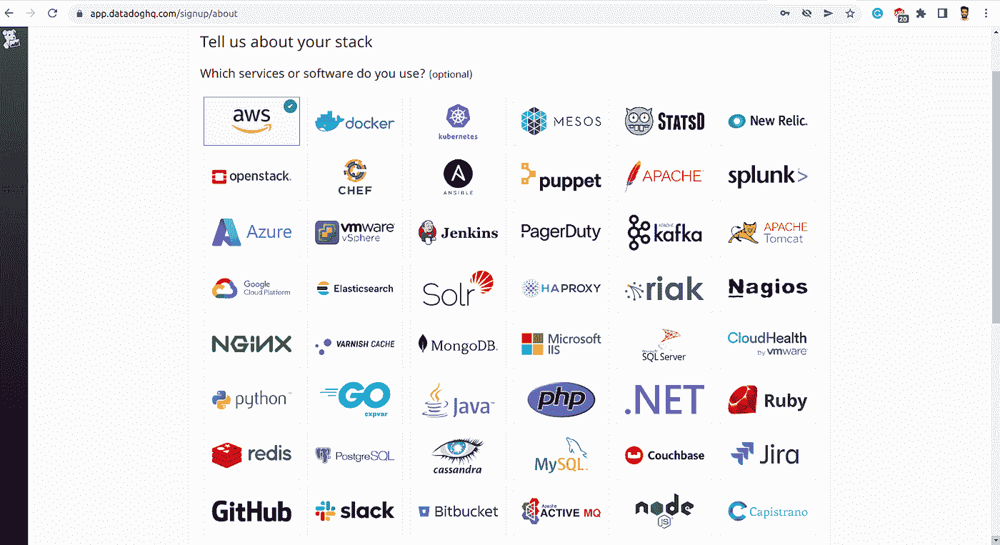

*图二。选择正确的堆栈*

# **第三步:安装数据狗代理**

代理是安装在主机上的轻量级软件。它使用集成将指标和事件从您的主机报告给 Datadog。代理可以安装在各种平台上。在我们的例子中，由于我们的应用程序托管在 EC2 实例上&该实例是一台 Amazon Linux 机器，我们可以使用下面的命令安装 Datadog 代理。DD_API_KEY 参数对于每个帐户都是唯一的，可以在我们的 Datadog 帐户主页的 Agents 选项卡下找到。

*DD _ AGENT _ MAJOR _ VERSION = 7 DD _ API _ KEY = 6 bea 67 e 2875 EB 3d 7 b 7 ad 4905 # # # # # # # # DD _ SITE = " datadoghq . com " bash-c " $(curl-L https://S3 . Amazon AWS . com/DD-AGENT/scripts/install _ script . sh)"*

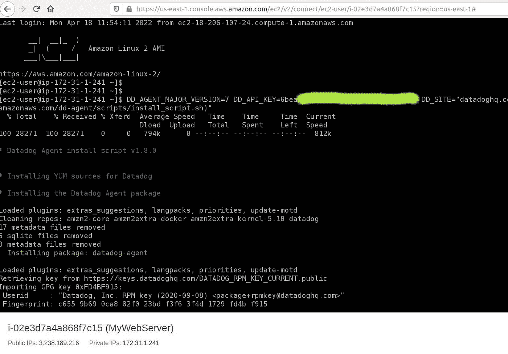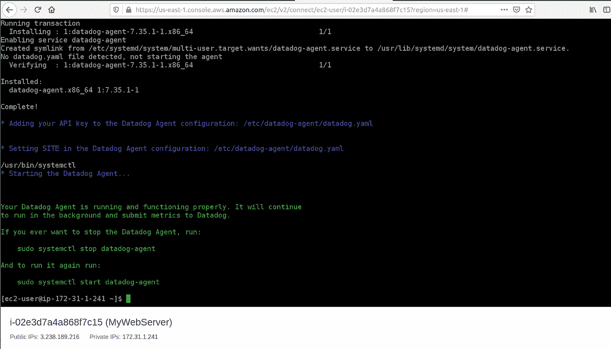

*图 3。安装数据狗代理。*

# *步骤 4:建立 AWS 和 Datadog 之间的连接*

我们将使用 Datadog 推荐的角色委派方法之一。

## **在 AWS 上**

*   在 AWS IAM 控制台中创建新角色。
*   选择*另一个 AWS 账户*作为角色类型。
*   对于帐户 ID，输入 464622532012 (Datadog 的帐户 ID)。这意味着您授予 Datadog 对 AWS 数据的只读访问权限。
*   选择*要求外部 ID* 并输入在 AWS 集成图块中生成的 ID。
*   点击下一步:*权限*。
*   点击*创建策略*，在新窗口中打开。
*   选择 JSON 选项卡。要利用 Datadog 提供的每个 AWS 集成，请使用下面的策略片段。该策略目前拥有与 EC2 & RDS 相关的指标的读取权限。随着其他组件的添加，以下权限可能会发生变化。

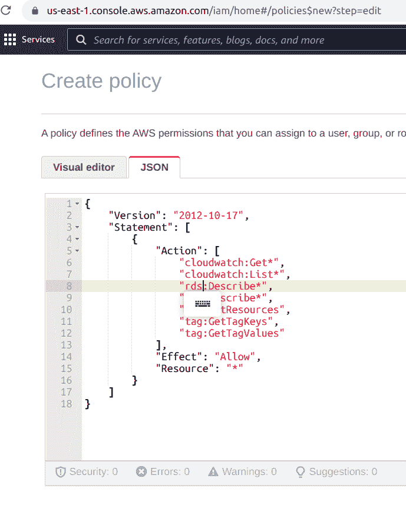

*图 4。发送 Cloudwatch 日志的 IAM 策略*

*   将策略命名为 DatadogAWSIntegrationPolicy，也可以根据自己的选择命名，并提供适当的描述。
*   单击创建策略，然后关闭此窗口。
*   返回“创建角色”窗口，刷新策略列表并选择您刚刚创建的策略。
*   给角色一个名称，如 DatadogAWSIntegrationRole，以及一个恰当的描述。

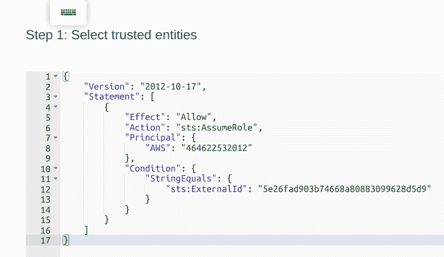

*图 5。IAM 角色创建可信实体策略*

*   单击创建角色。

## **上 Datadog**

*   返回到 Datadog AWS 集成图块。
*   选择“角色委派”选项卡，然后选择“手动”。
*   输入不带破折号的 AWS 帐户 ID，例如 123456789012。您的帐户 ID 可以在安装 AWS 集成期间创建的角色的 ARN 中找到。
*   输入所创建角色的名称。注意:您在 integration tile 中输入的角色名称是区分大小写的，并且必须与在 AWS 端创建的角色名称完全匹配。
*   如果 Datadog 无权执行 *sts: AssumeRole* 错误，请确保您的 AWS 信任策略的 *sts:ExternalId* :与 Datadog AWS integration tile 中生成的 AWS 外部 Id 相匹配。
*   在对话框左侧选择要收集度量的 AWS 服务。
*   或者，向所有主机和指标添加标记。
*   单击安装集成。

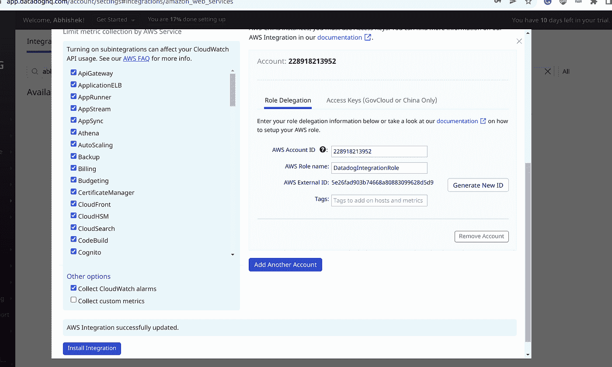

*图 6。数据狗侧的集成*

集成现在已经完成，感谢 Datadog 代理，我们将能够看到 Cloudwatch 日志被发送到 Datadog。

# **第五步:创建仪表板**

我们可以利用 Datadog 提供的一些定制模板，这在我们从头开始时很有帮助。几乎每个服务都有模板。小部件监控流行的指标，并可以根据用例进行编辑。

我们甚至可以将小部件克隆到新的仪表板上，并更新那里的主机。

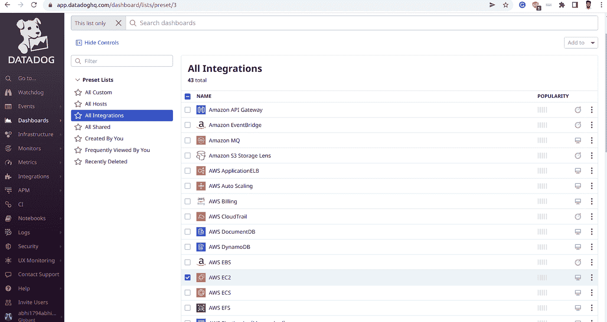

*图七。数据狗侧的集成*

对于我们的用例，我们将利用 EC2 和 RDS 模板，并为我们的主机修改这些模板。

要监控特定的指标，我们可以参考 Datadog 文档，其中列出了指标及其解决的目的。

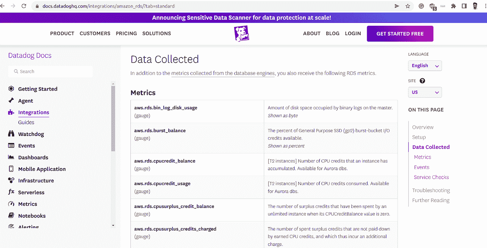

*图 8。RDS 指标的数据狗文档*

我们可以创建一个空的仪表板，并开始从可用选项中添加不同种类的小部件。

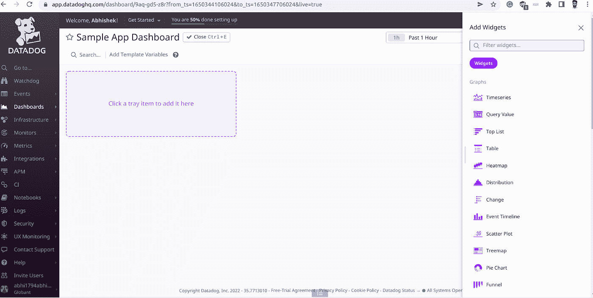

*图九。创建空仪表板*

例如，如果我们想要监视数据库实例的 CPU 利用率，那么我们可以参考查询文档并选择所需的数据库实例。我们也可以根据标签和其他参数对实例进行分组。

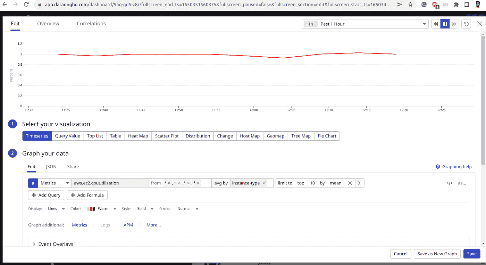

*图 10。编辑小工具*

我们可以在仪表板顶部添加模板变量部分，根据标签和其他参数过滤实例。

我们可以参考文档，继续添加其他所需的指标并更新仪表板。此外，预先存在的模板使事情变得简单，因为我们可以开始将它们添加到我们的主仪表板。完成后，我们将准备好 Datadog 仪表板。我们可以选择一个时间框架并在监控指标之间切换，还可以生成一个共享的 URL 来在整个团队中共享仪表板。

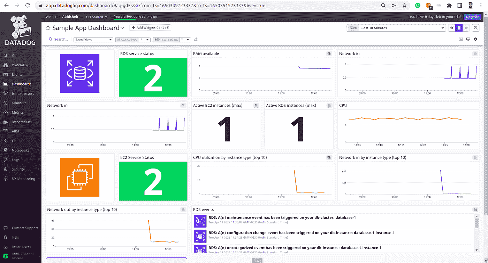

*图 11。创建了仪表板*

# **步骤 6:创建用于报警的监视器**

我们已经创建了一半的仪表板，下一步是在指标达到阈值或出现问题时得到通知。我们可以在 Datadog 中为这样的场景设置监视器。

在管理监视器下，单击创建监视器。我们需要定义指标并设置警报条件。

例如，如果 EC2 实例的 CPU 利用率低于 10%，我们需要得到通知，原因可能是应用程序已经停止工作。因此，我们必须传递度量和阈值。我们甚至可以在收到阈值时触发警报。通知会发送到我们提供的电子邮件地址。它可以是一个团队 DL(分发列表)，甚至是一个松散的组。我们甚至可以在 slack 组内共享小部件。

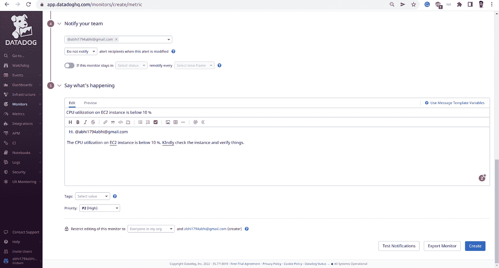

*图 12。创建监视器*

类似地，我们可以针对不同的用例使用多个监视器，并且可以从 Manage Monitors 部分检查每个监视器的运行状况。我们还可以创建一个单独的控制面板来管理所有监视器，检查它们的运行状况，验证处于警报状态的监视器，以及各种其他事情。但这是一个单独的讨论，或者可能是本页的一篇子文章:)

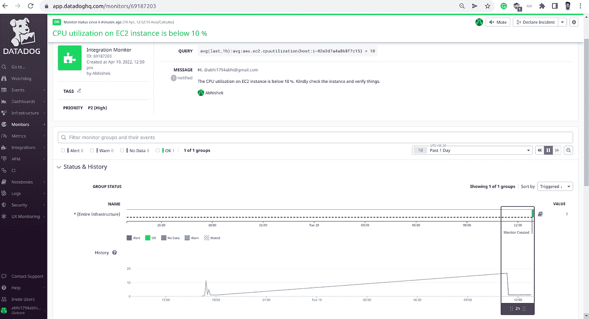

*图十三。监控 CPU 利用率以及状态*

# **利弊**

Datadog 作为一个云监控平台非常有用，它提供了一个统一的解决方案来无缝结合可观察性的三大支柱，并实现我们整个应用堆栈的完全可见性。除此之外，最重要的是平稳、无摩擦的集成流程，有 400 多个内置集成和为其构建的预定义仪表板模板。Datadog 中有多种产品来支持我们应用程序每一层的不同用例，并为组织内的不同团队提供单一平台

关于缺点，所有这些特性都是有代价的。Datadog 的价格大约是每个用户每月 15 美元，企业版是 23 美元。Datadog 有一个公开的定价政策，有公布的价格和普遍较低的价格。它的每月定价选项包括每主机、每百万事件和每 GB 分析日志文件。

总而言之，这完全取决于你试图实现的用例。

# **结论**

基础设施监控是现代应用程序的必备属性，以获得对整个体系的全面了解。可观察性的三个支柱，即监控、警报和补救，通常需要相互关联才能获得最大的好处。因此，选择一个具有统一视图的监控平台，整合所有三个可观察性支柱，可以方便地处理不可预见的情况。

# **参考文献**

有关数据狗服务解释的更多详细信息，可以参考数据狗文档。以下链接是创建本文档的一部分。

*   [https://docs . data dog HQ . com/integrations/Amazon _ web _ services/？tab =角色委派](https://docs.datadoghq.com/integrations/amazon_web_services/?tab=roledelegation)
*   [https://docs.datadoghq.com/integrations/amazon_ec2/](https://docs.datadoghq.com/integrations/amazon_ec2/)
*   [https://docs.datadoghq.com/integrations/amazon_rds/?tab =标准](https://docs.datadoghq.com/integrations/amazon_rds/?tab=standard)
*   [https://docs.datadoghq.com/monitors/](https://docs.datadoghq.com/monitors/)