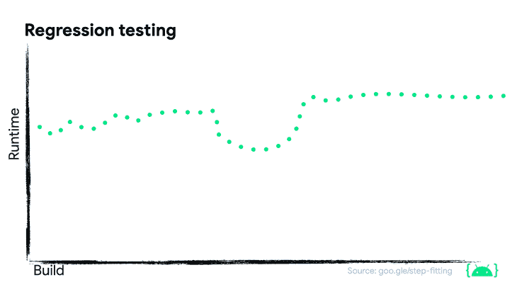

# 监控应用性能

> 原文：<https://medium.com/androiddevelopers/monitoring-app-performance-ebf9af4ebe36?source=collection_archive---------0----------------------->


Illustration by Claudia Sanchez

在这篇关于监控性能的 MAD 技能文章中，我将指导您了解最佳实践，并提供关于可用于监控应用程序性能的工具的指导。

> 监控绩效可以验证绩效是否朝着正确的方向发展。

应用性能既可以在应用发布前*在实验室环境中监控*，也可以在用户安装了*并积极使用应用*时在现场监控。

这篇文章的内容也可以在 YouTube 上找到

# 实验室监控

这里收集的性能数据是非常宝贵的，因为你可以了解一个应用在击中用户之前是如何执行*的。这有助于您限制可能的业务影响和对用户的总体影响。实验室收集的数据可用作**通过/不通过**信号。如果性能指标在两个版本之间恶化，您可以使用这些作为理由来推迟一个版本或者阻止发布一个特性。*

## 连续累计

由于持续集成(CI)，您还可以有更快的周转时间。有各种 CI 服务器和服务可用，我不会在这里进行比较。

通过使用 CI 管道，您可以在每次提交到达发布分支时启动基准测试套件，或者甚至在它合并到您的主分支之前。通过这种方式，您可以比较不同版本之间的性能，并在指标超过您决定的阈值时发出红色警报。

确保在真实设备上运行基准测试。您可以使用在物理设备上提供测试的提供商，如 [Firebase 测试实验室](https://firebase.google.com/products/test-lab)，而不是维护您自己的本地设备池进行测试。

Firebase Test Lab 保持设备连接和最新，因此您不必投资本地测试设备设置。您可以使用脚本接口在每次构建时运行基准测试，并持续查看结果。

## 阶梯拟合

无论您是选择在本地设备上运行基准测试还是通过云提供商运行基准测试，发现回归有时都很棘手。为了自动化报告，您必须为您认为重要的每个指标设置阈值，然后将其与之前运行的基准进行比较。**你会看到性能波动**。有些构建可能完成得更快，有些可能完成得更慢。要发现基准测试运行时间的增加是否是代码的回归，需要比较两个以上的版本。

在我们的公共 AndroidX 持续集成管道中，我们过去曾面临过这个问题，并提出了一个可行的解决方案。

我们不是将一个构建与之前的进行比较，而是累积一定数量的构建，并在代码库发生变化之前和之后进行比较。

虽然这可能需要少量的构建来发现回归，但是这种方法非常可靠，伸缩性也很好，即使涉及到数百个库和工程师。



在 Chris Craik 关于用基准测试对抗回归的文章中，他准确地描述了 step fitting 如何在我们的代码库中工作，以及如何将它集成到您的持续集成管道中。

简短的版本是:

*   编写宏基准测试
*   在真实设备上运行它们
*   收集和存储输出指标
*   运行步长拟合算法

你可以在这篇文章中读到关于阶梯拟合的所有细节

[](/androiddevelopers/fighting-regressions-with-benchmarks-in-ci-6ea9a14b5c71) [## 用 CI 中的基准来对抗衰退

### 了解如何使用 Jetpack Benchmark 来捕捉 Android 应用程序中的性能衰退，以免其继续发展…

medium.com](/androiddevelopers/fighting-regressions-with-benchmarks-in-ci-6ea9a14b5c71) 

# 现场监测

一旦用户开始使用应用，您就可以通过生产中的现场监控来监控应用的性能。

## Android 生命体征

监控生产指标最简单的方法是查看 Android 生命指标提供的数据。Android Vitals 提供了您已安装用户群的匿名和聚合数据，以及同行基准，因此您可以将您的应用与其他应用进行比较。要使用 Android Vitals，你不需要对你的应用程序代码做任何修改。只需将它上传到谷歌 Play 商店，剩下的我们会处理。

Android Vitals 为您提供以下指标

*   应用启动时间
*   慢速和冻结帧
*   无响应的活动
*   猛撞
*   更多

你可以比较你的应用在不同设备类别中的表现，如 Android 操作系统版本、可用内存、CPU 速度等。

> 定期检查 Android Vitals 提供的数据，看看哪些地方可以改进，这很有价值。

## Firebase 性能监控

如果你想了解更多的细节， [Firebase 性能监控](https://firebase.google.com/docs/perf-mon)已经为你报道。

通过将 gradle 插件添加到您的应用程序中，您可以看到有关冷启动时间、缓慢和抖动帧的大致来源以及网络请求持续时间的信息。所有这些数据都被报告到 [Firebase 控制台](https://console.firebase.google.com/?hl=de)中。

```
plugins {
  id(...)
  id("com.google.firebase.firebase-perf") version "$version"
}
```

使用 Firebase 性能监控，您甚至可以获得更具体的数据。首先添加库依赖项。

```
dependencies {
  implementation("com.google.firebase:firebase-perf")
}
```

然后，您可以为您的应用程序中的任何代码添加您自己的**跟踪点。这里我们跟踪数据何时被加载。**

```
Firebase.performance.newTrace(LOAD_DATA).trace {
  loadRemote()
  loadFromCache()
}
```

通过使用 Kotlin 扩展跟踪函数，可以包装加载数据的调用点。这是跨越多个方法调用的快速方法。

或者，您可以在方法上使用`AddTrace`注释。这为您提供了一种方法，可以在每次调用一个方法时跟踪它，然后将其报告给 Firebase 控制台。

```
@AddTrace(name = "loadRemote", enabled = true)
private fun loadRemote() { ... }
```

> 我们正在不断扩展与性能相关的 Jetpack 库套件。

## JankStats

我们已经发布了 [JankStats 库](https://developer.android.com/topic/performance/jankstats),它能够收集 janky 帧以及元数据，例如用户如何到达必须丢弃帧的状态。将依赖项添加到应用程序的构建文件后，通过调用`createAndTrack`将`JankStats`安装到活动窗口中。

```
override fun onCreate(savedInstanceState: Bundle?) {
  super.onCreate(savedInstanceState)
    JankStats.createAndTrack(window) { frameData ->
    if (frameData.isJank) {
      logAndAddToReportingQueue()
    }
  }
}
```

当一个帧被库启发式算法认为是恶作剧时，您可以记录它并将其添加到您的报告队列中。

JankStats 在一个`PerformanceMetricsState`对象中为你保留状态。

```
PerformanceMetricsState.getHolderForHierarchy(localView)
```

在这里，您可以添加和删除键值对中的状态。

```
metricsHolder.state?.putState(
  "Interests:TabState",
  "${tabState.currentIndex}"
)
metricsHolder.state?.removeState(“Interests:TabState”)
```

这使您能够添加元数据，如导航目的地，这使您更容易再现用户最初是如何到达 janky 帧的。

要查看 JankStats 的更多实际用法，**请查看 Android 中的**[**Now**](https://github.com/android/nowinandroid)**示例**，其中我们在关键区域添加了 jank 跟踪代码，例如滚动作者列表或 for you 页面。

# 这是所有的乡亲

我们关于性能的第二个 MAD 技能系列到此结束。我们已经向您展示了[重要的性能指标](/androiddevelopers/important-performance-metrics-c7dacf018eb3)以及如何[检查](/androiddevelopers/inspecting-performance-95b76477a3d7)、[改进](/androiddevelopers/improving-performance-with-baseline-profiles-fdd0db0d8cc6)以及围绕应用启动和流畅运行体验监控应用和库性能。

> 如果你还没有，去为你的应用程序创建一个[基线配置文件](/androiddevelopers/improving-performance-with-baseline-profiles-fdd0db0d8cc6)。这是让你的应用运行更快更流畅的快捷方式。

我们知道，在谈论性能时，还有更多的内容需要讨论。虽然我们没有时间涵盖本系列中的所有内容，但我们会继续向开发人员指南和示例中添加更多内容。

此外，确保在视频评论或 Twitter 上提出你的问题，使用 [#MADPerfQA](https://twitter.com/search?q=%23MADPerfQA) 在 9 月 1 日的问答环节中直接从致力于 Android 性能的工程师那里获得答案。

查看我们之前关于性能调试的 MAD 技能系列，了解如何检查代码中发生的事情。

Performance Debugging

去看看我们改进的开发者文档，我们已经用 MAD 指南更新了它。

要获得更详细的代码，请查看 GitHub 上的[示例](http://github.com/android/performance-samples)。并参加[宏观基准测试代码实验室](https://goo.gle/baseline-profiles-codelab)或[基准配置文件代码实验室](https://goo.gle/baseline-profiles-codelab)的实践指导。