# 使用 GRAFANA 监控 AZURE 虚拟机

> 原文：<https://medium.com/globant/monitoring-azure-vms-using-grafana-6b6636582bdd?source=collection_archive---------0----------------------->

# 介绍

Grafana 是一个可视化工具，使用 Azure Monitor、Elasticsearch、CloudWatch 等数据源。用于图形显示数据。本文将集中讨论使用 Azure Monitor 插件来监控 Azure 虚拟机，以及 Grafana 提供的各种功能来主动监控 Azure 虚拟机。

作为先决条件，虚拟机应该连接到 Azure Log analytics 工作区，其中所有指标数据都在 Perf 表下捕获

本文的第一部分将描述一个典型的安装，使用基本配置和 Azure Monitor 作为数据源。

> 1-安装
> 2-配置
> 3-数据源

第二部分将包括关键仪表板以及如何共享它们。

> 4-仪表板
> 5-仪表板共享

最后但同样重要的是，我们将描述这个用例中这个工具的优点和局限性。

> Grafana 的优点
> 7-局限性

# 第一节

## 1.装置

Grafana 提供了两个版本的工具:

1.  OSS(开源) :功能上与企业版相同，但是如果你想要企业版的特性，你需要下载企业版
2.  企业:推荐下载。功能上与开源版本相同，但是包括您可以选择使用许可证解锁的功能。

本文展示了在 Linux VM (Ubuntu 18.04)上安装最新的 Grafana 企业版。要在 Windows、Mac 和其他版本的 Linux 上安装，请参考 Grafana 的官方文档:

【https://grafana.com/docs/grafana/latest/installation/ 

步骤:

```
1\. sudo apt-get install -y apt-transport-https2\. sudo apt-get install -y software-properties-common wget3\. wget -q -O —  [https://packages.grafana.com/gpg.key](https://packages.grafana.com/gpg.key) | sudo apt-key add –4\. echo “deb [https://packages.grafana.com/enterprise/deb](https://packages.grafana.com/enterprise/deb) stable main” | sudo tee -a /etc/apt/sources.list.d/grafana.list5\. sudo apt-get update6\. sudo apt-get install grafana-enterprise7\. sudo service grafana-server start8\. sudo service grafana-server status9\. sudo update-rc.d grafana-server defaults
```

## 2.配置

安装完成后，在默认端口 3000 上打开 Grafana 工具

**http://YOUR-IP:3000**

默认用户名和密码是 admin，需要在首次登录时更改。

**注意**:用安装 Grafana 的虚拟机的公共 IP 地址替换 YOUR-IP


Grafana 使用 Azure Monitor 作为数据源，从 Azure Monitor、Azure log analytics、Application Insights 等 Azure 服务中实时获取数据。为此，我们需要创建一个服务主体，并将以下权限分配给 SPN:

1.订阅级别的读者权限(如果存在多个订阅，则需要多个订阅的读者权限)。这是通过 Azure Monitor 读取订阅中的所有资源所必需的。

2.订阅从 Azure log analytics 读取数据的日志分析读取器权限。

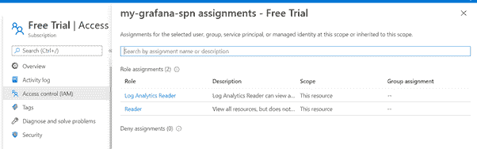

3.日志分析 API 权限。(活动目录-> API 权限->添加权限)

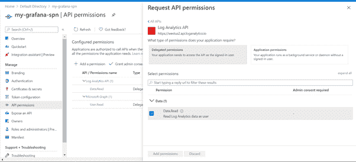

创建了具有所需权限的 SPN 后，使用以下步骤配置 Azure Monitor 数据源:

## 3.数据源

1.在浏览器上打开 Grafana 实例，然后转到数据源

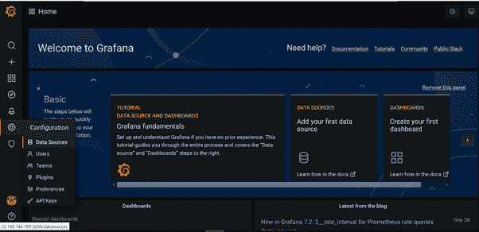

2.点击添加数据源并搜索 Azure Monitor

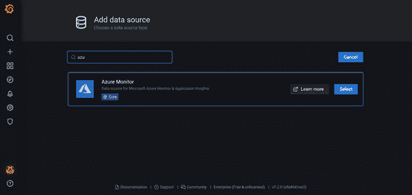

3.在数据源中填写 SPN 的详细信息。

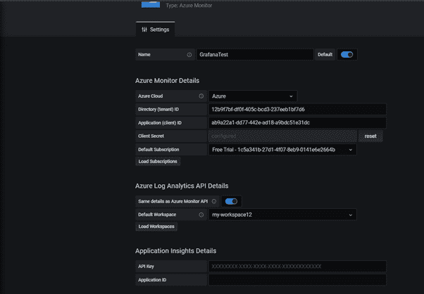

一旦数据源配置成功，我们就可以开始创建仪表板了。

# 第二节

## 4.仪表板

在本节中，我已经使用上一节中配置的数据源创建了一个仪表板。它使用 log analytics 查询从 perf 表中获取数据，并显示在 Grafana 中。为了列出资源组和这些资源组中的虚拟机，我们使用了一个称为**变量**的特性，我们可以在日志分析查询中使用它。

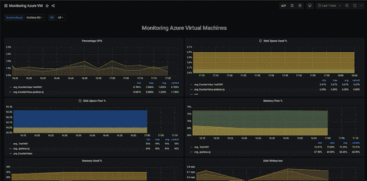

**变量:**创建变量请使用以下截图:

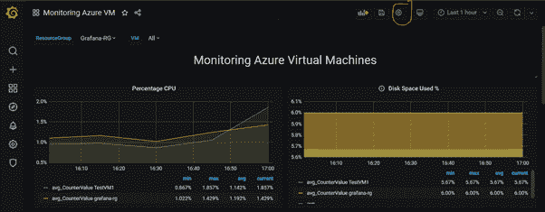

1.创建一个变量 **ResourceGroup** 来列出订阅中的所有 rg:

**查询:**资源组()

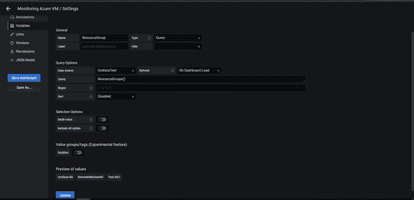

2.创建变量 VM 以列出 RG 中的 VM:

**查询**:ResourceNames($ resource group，Microsoft。计算/虚拟机器)

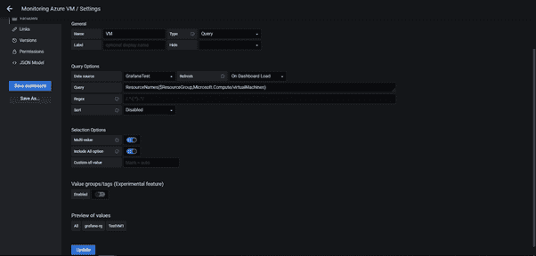

**注意:**如果您有多个订阅，您也可以使用 type 作为 **Datasource** 为订阅创建一个变量，然后在 ResourceGroup 和 VM 变量中使用该变量。

这里我只有一个数据源(GrafanaTest ),显示在下面的截图中，所以我没有创建订阅变量。

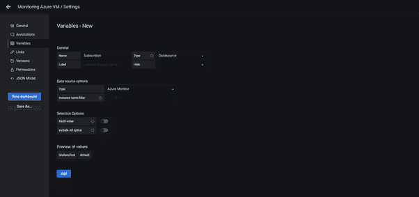

**指标:**现在，一旦变量准备就绪，我们就可以在日志分析查询中使用它们进行各种指标监控。

以下是我用来监控 Azure 虚拟机的一些指标:

*   **CPU 百分比(平均值)**:显示过去 5 分钟的平均 CPU 百分比。

变量**虚拟机**用于日志分析，以显示所选 RG 中所有虚拟机的数据。

**查询:**

```
Perf|where ObjectName ==”Processor” and CounterName ==”% Processor Time”|extend vm=iif(Computer has “.”,substring(Computer,0,indexof(Computer, ‘.’)),Computer)|where (tolower(strcat(“””,$**VM**,”””)) has tolower(vm)) and (Computer has vm)|where $__timeFilter(TimeGenerated)|summarize avg(CounterValue) by vm,bin(TimeGenerated,5m)| sort by vm asc , TimeGenerated asc| order by TimeGenerated asc
```

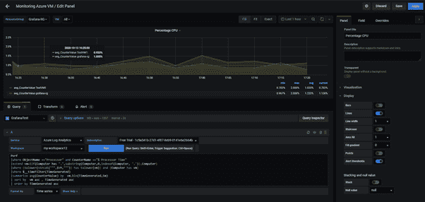

X 轴和 Y 轴的比例可以从轴面板更改，如下图所示:

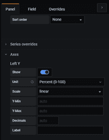

*   **已用磁盘空间(%):** 显示虚拟机上过去 5 分钟的平均已用磁盘空间百分比

**查询:**

```
Perf| where ObjectName == “LogicalDisk” or ObjectName == “Logical Disk”| where CounterName == “% Used Space”|where InstanceName != “_Total”|extend vm=iif(Computer has “.”,substring(Computer,0,indexof(Computer, ‘.’)),Computer)|where (tolower(strcat(“””,$VM,”””)) has tolower(vm)) and (Computer has vm)| where $__timeFilter(TimeGenerated)| summarize avg(CounterValue) by vm,bin(TimeGenerated,5m)| sort by vm asc,TimeGenerated asc| order by TimeGenerated asc
```

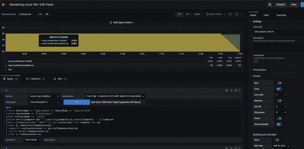

*   **可用磁盘空间(%):** 显示虚拟机上最近 15 分钟的平均可用磁盘空间百分比

**查询:**

```
Perf| where ObjectName == “LogicalDisk” or ObjectName == “Logical Disk”| where CounterName == “% Used Space”|where InstanceName != “_Total”|extend vm=iif(Computer has “.”,substring(Computer,0,indexof(Computer, ‘.’)),Computer)|where (tolower(strcat(“””,$VM,”””)) has tolower(vm)) and (Computer has vm)| where $__timeFilter(TimeGenerated)| summarize avg(100-CounterValue) by vm,bin(TimeGenerated,15m)| sort by vm asc,TimeGenerated asc| order by TimeGenerated asc
```

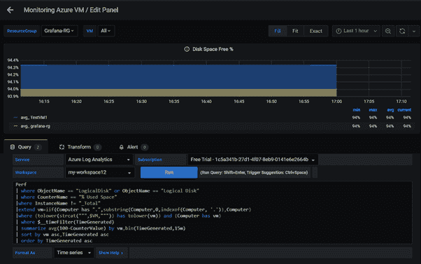

*   **可用内存(%):** 显示虚拟机上的可用内存(RAM)百分比，为过去 15 分钟的平均值。

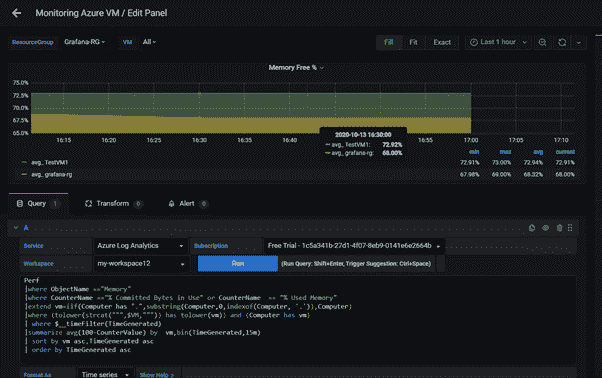

**查询:**

```
Perf|where ObjectName ==”Memory”|where CounterName ==”% Committed Bytes in Use” or CounterName == “% Used Memory”|extend vm=iif(Computer has “.”,substring(Computer,0,indexof(Computer, ‘.’)),Computer)|where (tolower(strcat(“””,$VM,”””)) has tolower(vm)) and (Computer has vm)| where $__timeFilter(TimeGenerated)|summarize avg(100-CounterValue) by vm,bin(TimeGenerated,15m)| sort by vm asc,TimeGenerated asc| order by TimeGenerated asc
```

*   **已用内存(%):** 显示过去 15 分钟虚拟机上已用内存(RAM)的百分比平均值。

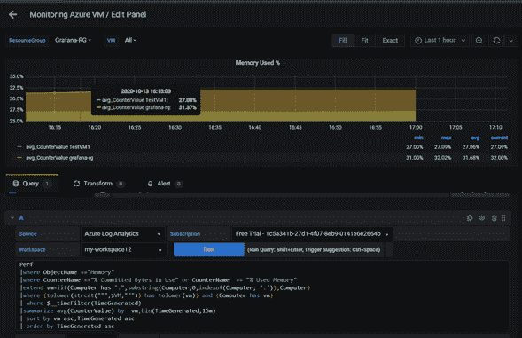

**查询:**

```
Perf|where ObjectName ==”Memory”|where CounterName ==”% Committed Bytes in Use” or CounterName == “% Used Memory”|extend vm=iif(Computer has “.”,substring(Computer,0,indexof(Computer, ‘.’)),Computer)|where (tolower(strcat(“””,$VM,”””)) has tolower(vm)) and (Computer has vm)| where $__timeFilter(TimeGenerated)|summarize avg(CounterValue) by vm,bin(TimeGenerated,15m)| sort by vm asc,TimeGenerated asc| order by TimeGenerated asc
```

*   **每秒磁盘写入数:**显示过去 15 分钟内每秒的平均磁盘写入操作数。

**查询:**

```
Perf| where ObjectName == “LogicalDisk” or ObjectName == “Logical Disk”|where CounterName == “Disk Writes/sec”|extend vm=iif(Computer has “.”,substring(Computer,0,indexof(Computer, ‘.’)),Computer)|where (tolower(strcat(“””,$VM,”””)) has tolower(vm)) and (Computer has vm)| where $__timeFilter(TimeGenerated)| summarize avg(CounterValue) by vm,bin(TimeGenerated,15m)| sort by vm asc,TimeGenerated asc| order by TimeGenerated asc
```

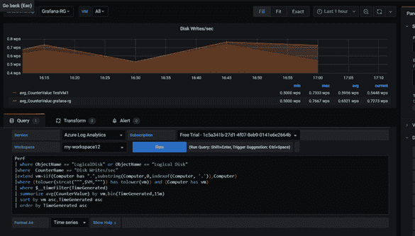

*   **每秒磁盘读取数:**显示过去 15 分钟内每秒的平均磁盘读取操作数。

**查询:**

```
Perf| where ObjectName == “LogicalDisk” or ObjectName == “Logical Disk”|where CounterName == “Disk Reads/sec”|extend vm=iif(Computer has “.”,substring(Computer,0,indexof(Computer, ‘.’)),Computer)|where (tolower(strcat(“””,$VM,”””)) has tolower(vm)) and (Computer has vm)| where $__timeFilter(TimeGenerated)| summarize avg(CounterValue) by vm,bin(TimeGenerated,15m)| sort by vm asc,TimeGenerated asc| order by TimeGenerated asc
```

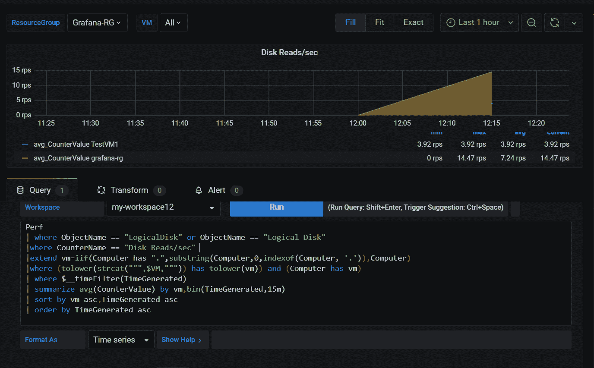

*   **逻辑磁盘 IOPS:** 显示过去 15 分钟内平均每秒执行的输入/输出磁盘操作的原始数量。

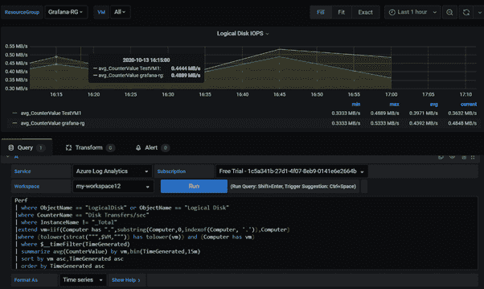

**查询**:

```
Perf| where ObjectName == “LogicalDisk” or ObjectName == “Logical Disk”|where CounterName == “Disk Transfers/sec”| where InstanceName != “_Total”|extend vm=iif(Computer has “.”,substring(Computer,0,indexof(Computer, ‘.’)),Computer)|where (tolower(strcat(“””,$VM,”””)) has tolower(vm)) and (Computer has vm)| where $__timeFilter(TimeGenerated)| summarize avg(CounterValue) by vm,bin(TimeGenerated,15m)| sort by vm asc,TimeGenerated asc| order by TimeGenerated asc
```

*   **网络输入:**显示过去 15 分钟内虚拟机在所有网络接口上接收的平均字节数(传入流量)。

**查询:**

```
Perf| where ObjectName == “Network Adapter”|where CounterName == “Bytes Received/sec”|extend vm=iif(Computer has “.”,substring(Computer,0,indexof(Computer, ‘.’)),Computer)|where (tolower(strcat(“””,$VM,”””)) has tolower(vm)) and (Computer has vm)| where $__timeFilter(TimeGenerated)|extend vm_new= strcat(vm, “.Bytes Received/sec”)| summarize avg(CounterValue) by vm_new,bin(TimeGenerated,15m)| sort by vm_new asc,TimeGenerated asc| order by TimeGenerated asc
```

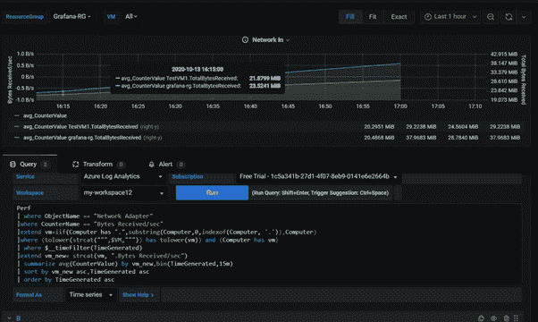

*   **网络输出:**显示过去 15 分钟内虚拟机在所有网络接口上输出的平均字节数(传出流量)。

**查询:**

```
Perf| where ObjectName == “Network Adapter”|where CounterName == “Bytes Sent/sec”|extend vm=iif(Computer has “.”,substring(Computer,0,indexof(Computer, ‘.’)),Computer)|where (tolower(strcat(“””,$VM,”””)) has tolower(vm)) and (Computer has vm)| where $__timeFilter(TimeGenerated)|extend vm_new= strcat(vm, “.Bytes Sent/sec”)| summarize avg(CounterValue) by vm_new,bin(TimeGenerated,15m)| sort by vm_new asc,TimeGenerated asc| order by TimeGenerated asc
```

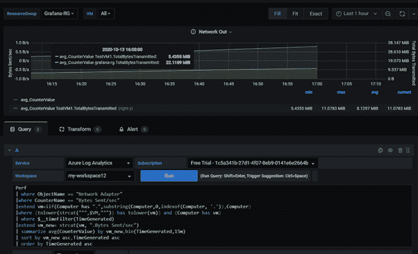

## 5.仪表板共享

Grafana 提供了三种共享仪表板的方式:

**链接:**您可以为仪表板生成一个链接，并将其共享给有权访问 Grafana 的用户。

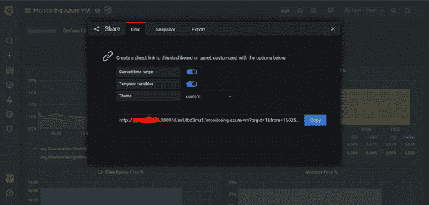

**快照:**您可以生成一个本地快照来生成一个不需要用户访问 Grafana 的链接。在此链接中，用户将无法更改变量值，但可以看到共享时的数据

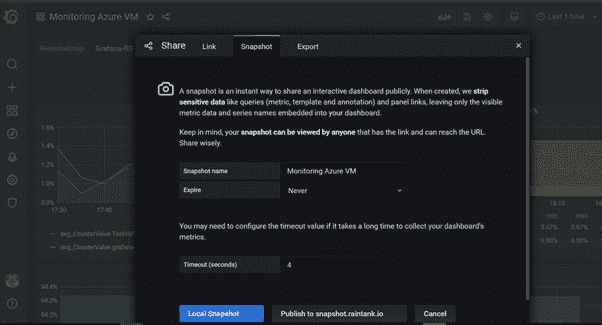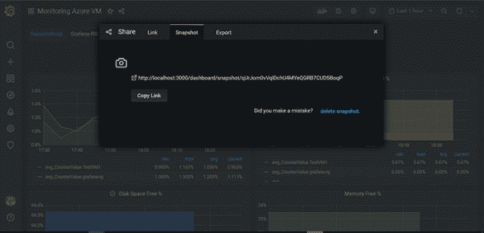

快照仪表板:

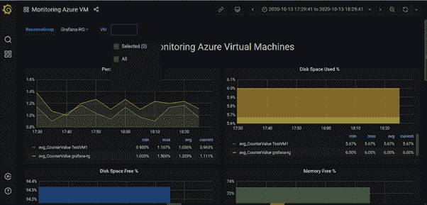

**导出:**仪表板可以保存到 json 文件中并与其他人共享。Grafana 提供了一个使用 json 文件导入 dashboard 的选项。这样，Grafana 仪表板也可以作为 json 文件保存在源代码控制存储库中。

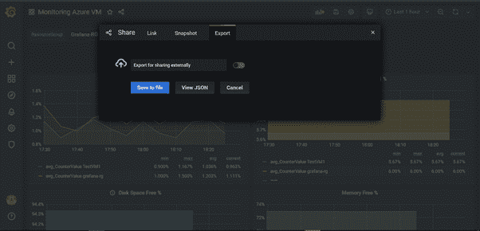

然后，可以使用下面截图中显示的步骤将保存的 json 格式的仪表板导入 grafana:

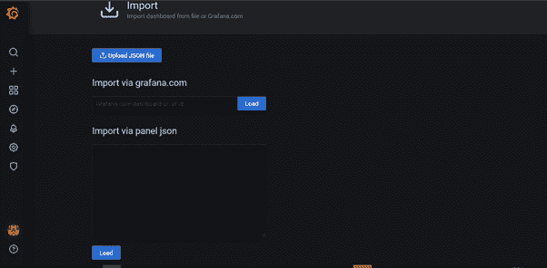

# 第三节

## 6.Grafana 的优势

1.与 Azure 本机监控相比，Grafana 提供了一个选项，可以借助变量在单个仪表板上绘制多个虚拟机指标。

2.Grafana 支持多种云，如 AWS、Azure、GCP 等。因此，可以在一个控制面板上监控来自不同云的资源。

3.Grafana 提供了更好的指标可视化。它有各种类型的面板，如图表、条形图、表格、文本等。

4.提供仪表板链接等功能，可用于链接各种仪表板，以实现更深入和增强的监控。

5.共享仪表板很容易。

6.Grafana 支持报警。

7.Grafana 不存储任何数据，它使用 Rest API 调用获取实时数据。

## 7.限制

1.不支持时序存储。Grafana 只是一个可视化解决方案。时间序列存储不是其核心功能的一部分，而 Prometheus 等工具通过沿时间序列使用键值标记来存储时间序列，以更好地组织数据并提供强大的查询功能。

2.不支持数据收集。时间序列存储和时间序列收集都不是其核心功能的一部分。

3.警报管理不是很成熟，也不是其核心功能的一部分。

# 结论

Grafana 提供了大量插件，用于集成多个云提供商和其他工具，如 Elasticsearch、Graphite、Prometheus 等。Grafana 也提供报告功能，但需要企业许可证。Grafana 不存储任何数据，这是一个限制，但从安全角度来看也是好的，因为它使用 REST API 调用获取实时数据。因此，如果您正在寻找一个集中式工具来监控多云环境中的资源，或者与其他工具集成以提高可视化，Grafana 是一个不错的选择。