# 使用普罗米修斯、灭霸和格拉夫纳监测多个 OKE 集群-第 1 部分

> 原文：<https://medium.com/oracledevs/monitoring-multiple-oke-clusters-with-prometheus-thanos-and-grafana-part-1-df11df7013f1?source=collection_archive---------0----------------------->

在前一篇文章中，我们在不同的 OCI 地区为 Verrazzano 部署了[多个 OKE 集群](https://verrazzano.io/docs/setup/install/multicluster/)。现在，我们要监视他们。

[监控 1 个集群相对简单](/oracledevs/deploying-and-monitoring-a-redis-cluster-to-oracle-container-engine-oke-5f210b91b800):

1.  安装[普罗米修斯](https://prometheus.io/)和 [Grafana](https://grafana.com/)
2.  让普罗米修斯监控您的应用程序或工作负载，或者通过抓取指标，或者将指标推给它
3.  在 Grafana，使用普罗米修斯作为数据源来创建控制面板，帮助您了解应用程序或工作负载的运行情况
4.  使用警报管理器在出现问题时得到通知

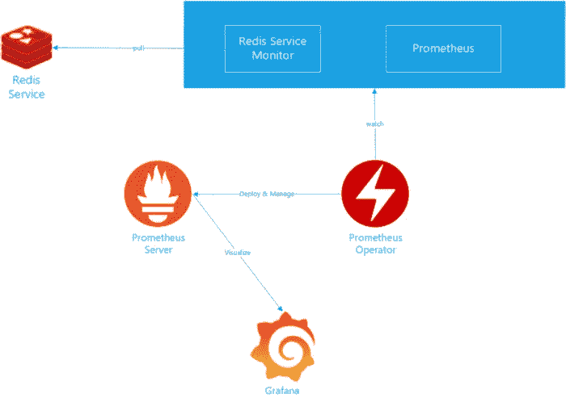

Monitoring Redis with Prometheus and Grafana

普罗米修斯的一个问题是它作为[单例](https://en.wikipedia.org/wiki/Singleton_pattern)运行。这意味着普罗米修斯无法在集群中运行，您也无法获得高可用性。如果普罗米修斯实例所在的主机崩溃，那将是非常不幸的，因为没有其他的普罗米修斯实例来完成这个任务。

使上述第一个问题更复杂的第二个问题是，普罗米修斯还将度量标准本地存储在磁盘上。如果普罗米修斯实例崩溃，您将丢失一些指标。如果磁盘在此过程中损坏，那么您将丢失所有内容，除非您已经进行了备份。

在设计出更好的解决方案之前，人们一直在处理这个问题，其中一种方法是至少运行第二个实例，并让它擦除相同的端点，并确保普罗米修斯实例在不同的主机上运行。虽然这给了您高可用性的幻觉，但它实际上是不可扩展的，因为这给普罗米修斯设置了一个上限。这也不是很有效，因为您基本上是两次擦除相同的数据。那么，如何让普罗米修斯以高可用性运行呢？

第三个问题是普罗米修斯[只在有限的时间内保存数据](https://prometheus.io/docs/prometheus/latest/storage/)。[这段 CNCF 视频](https://www.youtube.com/watch?v=m0JgWlTc60Q)很好地解释了这些问题。那么，我们如何为我们的指标提供长期存储呢？

第四个问题是如何监控多个集群？我们可以在每个集群中运行一个 Prometheus 实例，并以一种[联合模式](https://prometheus.io/docs/prometheus/latest/federation/)部署它们。在我们的 4 节点集群中，这意味着新加坡的**管理**集群将抓取部署在悉尼、孟买和东京地区的 Prometheus 服务器中的指定时间序列:

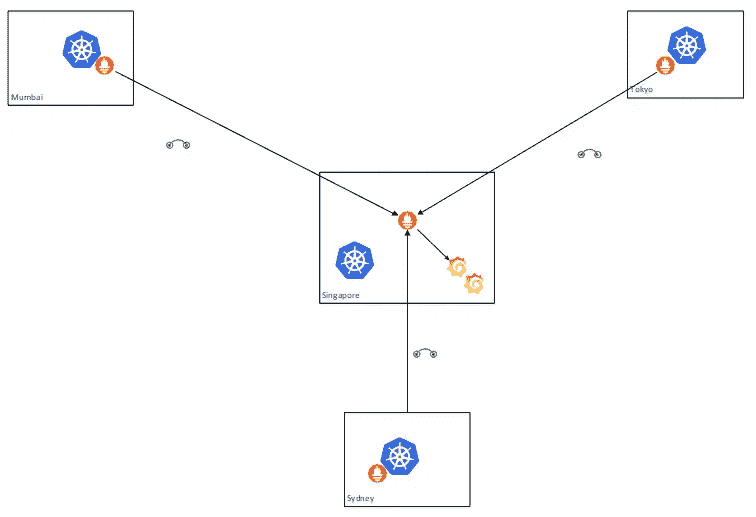

Federated Prometheus

然而，我们仍将运行普罗米修斯的单个实例(同样是单例问题)。我们总是可以添加另一个 Prometheus 实例，它也将抓取相同的时间序列:

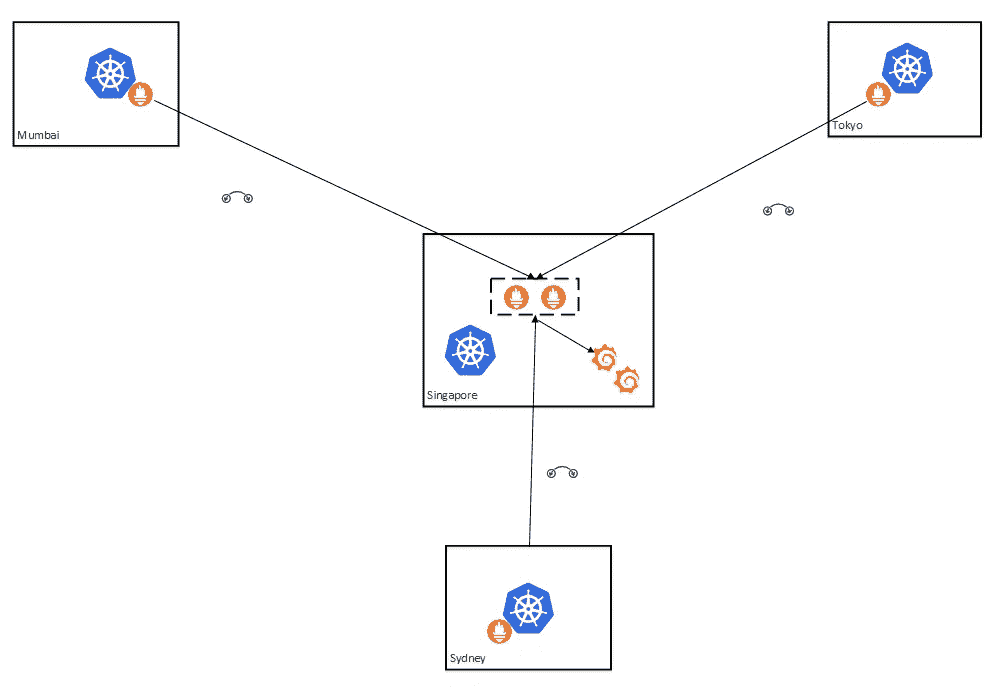

2 instances of Prometheus federating other Prometheus servers

同样，这也不是非常有效，而且成本也可能相当高。我们仍然没有解决长期储存的问题。

进入灭霸。


[灭霸](https://thanos.io/)项目旨在为普罗米修斯提供高可用性和长期存储。

在这篇文章中，我们将看看如何使用普罗米修斯，灭霸和 Grafana 来监控 1 OKE 集群。在后续文章中，我们将研究如何添加多个集群。

## 体系结构

下图描绘了灭霸的建筑:

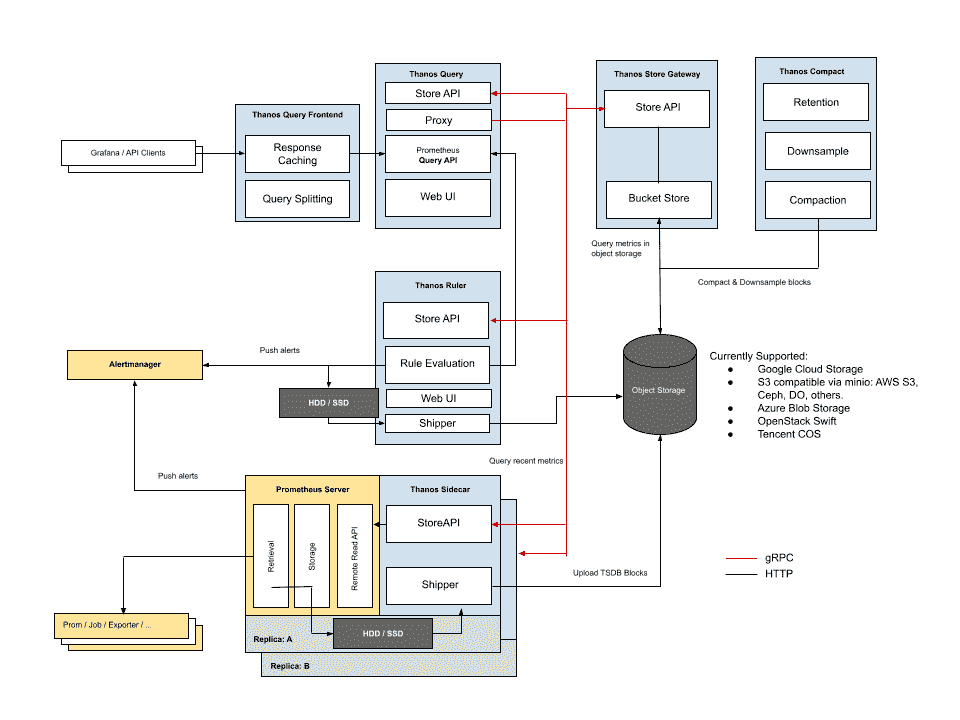

Thanos Architecture (source: thanos.io)

正如你所看到的，它有许多组件，如果你感兴趣，这里有一个关于它们的作用的很好的解释。

出于我们设置的目的，我将为您部分消化这一点:

*   灭霸边车作为边车集装箱被部署到每个地区的普罗米修斯舱。sidecar 读取 Prometheus 数据进行查询，然后将 TSDB 块上传到对象存储。因此，工作节点需要能够调用对象存储，这意味着需要通过服务网关进行路由。因为这是 OKE worker 节点的一个要求，所以我们不需要做任何事情就可以让 sidecar 将 TSDB 块上传到 OCI 对象存储。
*   灭霸商店网关查询存储在对象存储器中的度量，并提供一个 API 来允许检索它们。默认情况下，它监听端口 10901。当我们监视多个集群时，我们需要通过修改相关的 NSG 来确保该端口是开放的。现在，由于我们希望这是一个可靠的接口，我们希望将此网关创建为一个负载平衡器服务，它将创建一个 OCI 负载平衡器。此外，我们还希望它成为专用负载平衡器，并放置在专用负载平衡器子网中。因此，我们需要修改内部负载平衡器 NSG。

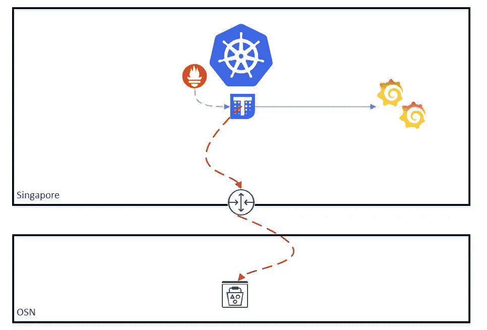

Thanos in a single cluster

还要注意:

1.  还有一个问题是灭霸每两个小时推一次 TSDB 积木
2.  使用[接收组件](https://thanos.io/tip/thanos/quick-tutorial.md/#components)的上述架构有所变化。

但是这些将在以后的文章中讨论。不过现在，我们最感兴趣的是解决高可用性和长期数据存储问题。

## 创建和使用对象存储

在进行部署之前，我们需要在 OCI 对象存储中创建一个存储桶来存储 TSDB 块。在撰写本文时，灭霸和 OCI 对象存储之间还没有本机集成。我们确实在 GitHub 上公开了一个 [PR，灭霸项目将 OCI 对象存储作为数据存储之一。在那快乐的一天到来之前，我们将改用 OCI 的 S3 界面。就像钥匙匠说的:](https://github.com/thanos-io/thanos/pull/4661)


“Always another way”

现在，为了使用 S3 接口，我们需要为用户创建一个客户密钥，该密钥将用于灭霸集成。登录 OCI 控制台，点击用户图标并导航至**客户密钥**。点击**生成密钥**。

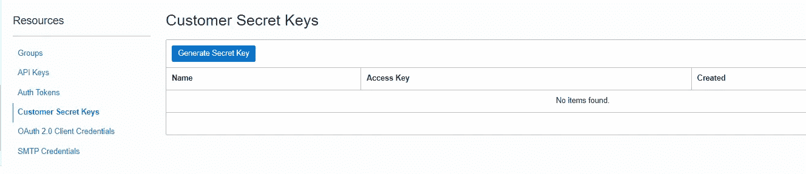

然后，确保您复制了密钥:

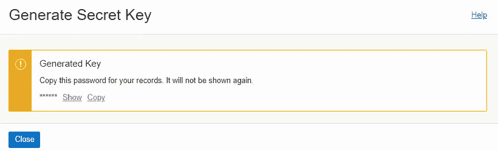

Generating a secret key

接下来，确保你在**管理**区域，在我们的例子中，是新加坡。导航到**存储** > **对象存储**并创建一个存储桶:

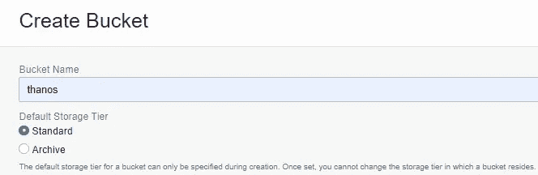

Create a bucket named ‘thanos’

我形象地称之为 **thanos** 。

## 配置灭霸对象存储

我们需要做的下一件事是配置 S3 端点。S3 兼容性 API 可在此处找到:

 [## Oracle 云基础设施 API 参考和端点

### 编辑描述

docs.oracle.com](https://docs.oracle.com/en-us/iaas/api/#/en/s3objectstorage/20160918/) 

它具有以下格式:

```
<object_storage_namespace>.compat.objectstorage.region.oraclecloud.com
```

接下来，为新加坡创建一个 objectstore 文件，例如 thanos-sin-storage.yaml:

替换端点、访问密钥和密钥的值。 **access_key** 可以在您的**用户资料** > **客户密钥**页面和您之前生成并保存的 **secret_key** 中找到。然后，创建一个名为 **monitoring** 的名称空间，并将这个配置存储在 Kubernetes secret 中:

```
kubectl create ns monitoringkubectl -n monitoring create secret generic thanos-objstore-config --from-file=thanos-sin-storage.yaml=thanos-sin-storage.yaml
```

## 在集群上部署普罗米修斯

我们现在将普罗米修斯和边车部署到集群。

我们将使用比特纳米的优秀人员提供的库贝-普罗米修斯舵图。添加 bitnami helm repo 并运行 helm update:

```
helm repo add bitnami https://charts.bitnami.com/bitnami
helm repo update
```

为 kube-prometheus 生成默认清单:

```
helm show values bitnami/kube-prometheus > prometheusvalues.yaml
```

需要添加/更改以下舵图表属性(斜体:表示舵清单中属性的路径；粗体:表示需要从 OCI 获取并在清单中替换的值):

```
*prometheus.thanos.create*: true
*prometheus.thanos.objectStorageConfig.secretName*: thanos-objstore-config
*prometheus.thanos.objectStorageConfig.secretKey*: thanos-sin-storage.yaml
*prometheus.thanos.service.type*: LoadBalancer*prometheus.thanos.service.annotations*:   oci.oraclecloud.com/oci-network-security-groups: "**nsg_id**"
  service.beta.kubernetes.io/oci-load-balancer-shape: "flexible"
  service.beta.kubernetes.io/oci-load-balancer-shape-flex-min: "50"
  service.beta.kubernetes.io/oci-load-balancer-shape-flex-max: "100"
  service.beta.kubernetes.io/oci-load-balancer-subnet1: "**subnet_id**"
  service.beta.kubernetes.io/oci-load-balancer-internal: "true"
  service.beta.kubernetes.io/oci-load-balancer-security-list-management-mode: "All"*prometheus.externalLabels*:
  cluster: "sin"
```

**更新**:由于 Terraform 模块中的一个(刚刚发现的)缺失规则，我已经将管理模式改为“全部”。这意味着 2 条规则将被添加到默认安全性列表中。

安装普罗米修斯:

```
helm install prometheus bitnami/kube-prometheus \
--namespace monitoring \
-f prometheusvalues.yaml
```

验证普罗米修斯部署:

1.  Prometheus 应该创建一个专用的 OCI 负载平衡器
2.  负载平衡器应该在端口 10901 上有一个 TCP 侦听器
3.  负载平衡器还应该部署在内部负载平衡器子网中，并分配给 int-lb NSG

此时，有两种方法可以更新与内部负载平衡器关联的 NSG，以接受 10901 上的传入 TCP，以便以后使用:

1.  更新 terraform.tfvars 并更新**internal _ lb _ allowed _ ports**参数以允许端口 10901。在此之后，您需要再次运行 terraform apply。
2.  或者使用 OCI 控制台将其直接添加到 NSG。**更新**:因为我已经把管理模式改成了“全部”，你暂时不需要这么做。

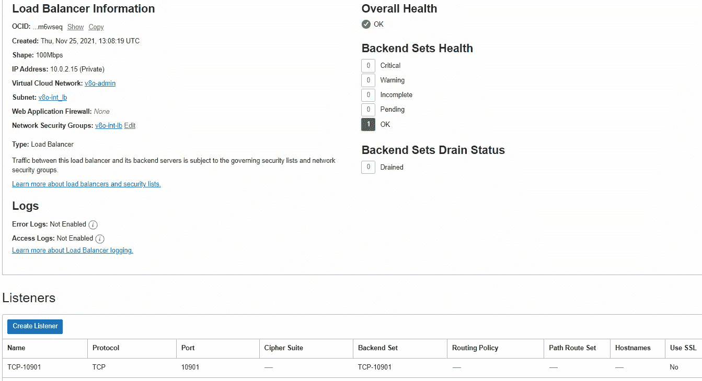

4.如果您想在安全方面做些支撑，您可以考虑:

a.使用[证书管理器](https://cert-manager.io/)添加 SSL 证书

b.使用新的 WAF 集成功能。这将要求您将负载平衡器设置为灵活的。

5.创建一个到操作员主机的 SSH 隧道，以便可以测试 Prometheus 的表达式浏览器:

```
ssh -L 9090:localhost:9090 -J opc@bastion_public_ip opc@operator_private_ipkubectl port-forward --namespace monitoring svc/prometheus-kube-prometheus-prometheus 9090:9090
```

6.访问 Prometheus 的表达式浏览器: [http://localhost:9090/](http://localhost:9090/) 并运行查询:

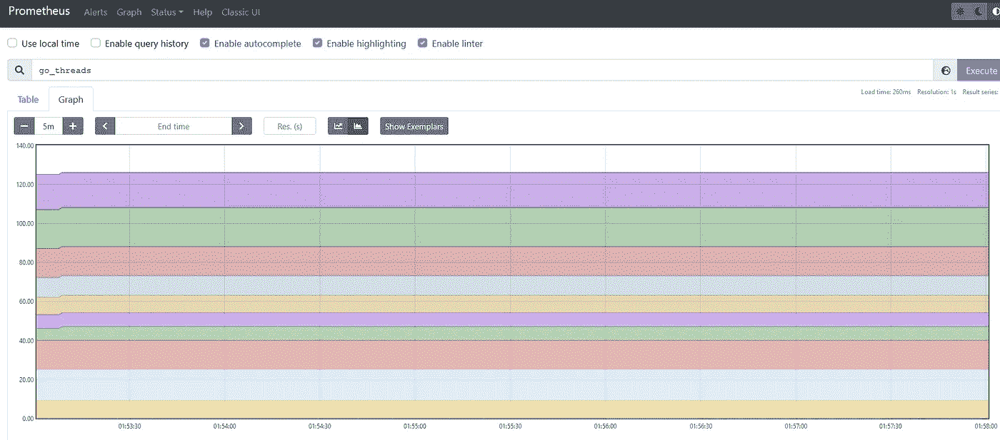

Prometheus expression browser

普罗米修斯已经部署完毕。

## 在集群上部署灭霸

是时候部署灭霸了，我们将使用[塔诺斯头盔图](https://artifacthub.io/packages/helm/bitnami/thanos/)。为萨诺斯头盔图生成默认清单:

```
helm show values bitnami/thanos > thanosvalues.yaml
```

需要添加/更改以下舵图表属性(斜体:表示舵清单中属性的路径；粗体:表示需要从 OCI 获取并在清单中替换的值):

```
*objstoreConfig*: |-
  type: S3
  config:
    bucket: "**thanos**"
    endpoint: "**<namespace>**.compat.objectstorage.**<region>**.oraclecloud.com"
    region: "**<region>**"
    access_key: "**<my_access_key>**"
    insecure: false
    signature_version2: false
    secret_key: "**<my_secret_key>**"
    put_user_metadata: {}
    http_config:
      idle_conn_timeout: 1m30s
      response_header_timeout: 2m
      insecure_skip_verify: false
      tls_handshake_timeout: 10s
      expect_continue_timeout: 1s
      max_idle_conns: 100
      max_idle_conns_per_host: 100
      max_conns_per_host: 0
    trace:
      enable: false
    list_objects_version: ""
    part_size: 67108864
    sse_config:
      type: ""
      kms_key_id: ""
      kms_encryption_context: {}
      encryption_key: ""*query.enabled*: true
*query.stores*: 
  # Private IP address of internal load balancer
  - **123.123.123.123**:10901*queryFrontend.enabled*: true
*bucketweb.enabled*: true
*compactor.enabled*: true
*storegateway.enabled*: true
*ruler.enabled*: true
```

部署灭霸:

```
helm install thanos bitnami/thanos \
--namespace monitoring \
-f thanosvalues.yaml
```

验证:

1.所有吊舱都工作正常:

```
kubectl -n monitoring get pods
```

2.灭霸查询工作正常:

```
export SERVICE_PORT=$(kubectl get --namespace monitoring -o jsonpath="{.spec.ports[0].port}" services thanos-query)kubectl port-forward --namespace monitoring svc/thanos-query ${SERVICE_PORT}:${SERVICE_PORT}
```

通过在 [http://localhost:9090](http://localhost:9090) 的浏览器中访问它

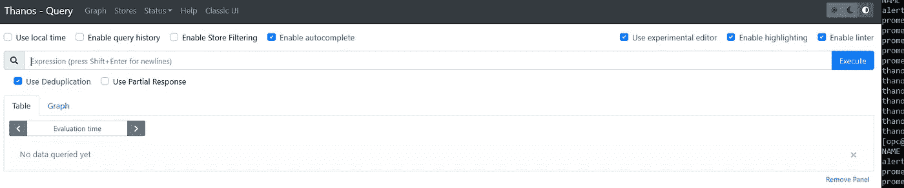

Accessing Thanos Query

3.新加坡店注册:[http://localhost:9090/stores](http://localhost:9090/stores)

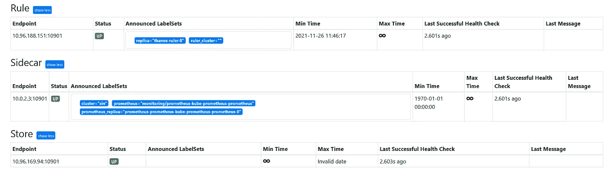

Singapore Store is replicated

在上面的截图中，我们还可以看到外部标签“ **cluster=sin** ”，表明我们在新加坡的 Verrazzano 管理集群。

## 部署 Grafana

最后一步是使用格拉夫纳与灭霸。1 灭霸开发者做的许多聪明的设计决定中，有一个是保持普罗米修斯兼容的界面。这意味着只需最少的努力和更改，我们就可以使用在 Grafana 中创建的现有仪表板。

我们先来添加 helm repo:

```
helm repo add grafana https://grafana.github.io/helm-charts
helm repo update
```

然后安装 Grafana:

```
helm install --namespace monitoring grafana grafana/grafana
```

我们需要获得 Grafana 管理员用户的密码:

```
kubectl get secret --namespace monitoring grafana -o jsonpath="{.data.admin-password}" | base64 --decode ; echo
```

由于 Grafana 默认安装为 ClusterIP，我们可以使用 SSH 进行一些端口转发:

```
ssh -L 3000:localhost:3000 -L 9090:localhost:9090 -J opc@bastion_public_ip opc@operator_private_ip
```

和 kubectl:

```
kubectl port-forward --namespace monitoring svc/grafana 3000:80
```

在浏览器中访问 Grafana[http://localhost:3000/](http://localhost:3000/)。使用用户名“admin”和上面获取的密码登录。

## 连接格拉法纳和灭霸

为了使用灭霸和它从各种普罗米修斯中提取的指标，我们首先需要添加灭霸作为数据源。回想一下，灭霸提供了与普罗米修斯相同的接口。因此，我们可以使用 Prometheus 插件来添加一个灭霸数据源:

1.  找到左侧的配置图标，并从展开菜单中选择数据源。
2.  点击添加数据源，选择**普罗米修斯**。

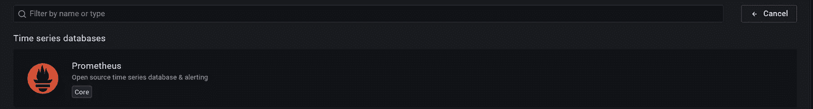

Selecting Prometheus

3.在网址中输入[http://thanos-query . monitoring . SVC . cluster . local:9090](http://thanos-query.monitoring.svc.cluster.local:9090)

4.然后，点击**保存&测试。**测试应该返回数据源正在工作。

## 向 Grafana 添加 Kubernetes 仪表板

为了创建 Grafana 仪表板，我们将导入 [Kubenetes 集群监控仪表板](https://grafana.com/grafana/dashboards/315)。如果你喜欢，还有一个[更详细的](https://grafana.com/grafana/dashboards/10856)。这是一件了不起的作品，我对它唯一的不满是它创造了图表墙。监视一个 Kubernetes 集群已经够难的了，监视一组地理上分散的集群就更难了，更不用说在遇到危机需要排除故障的时候了。所以，我们想要更简单一点(无论如何这是主观的)。

1.  点击左侧的 **+** 图标，从展开的菜单中选择**导入**。
2.  输入仪表板 ID: 315
3.  点击**载入**。
4.  确保选择您创建的 Prometheus 数据源，然后点击**导入**。

您现在应该能够看到您的 Kubernetes 仪表盘:

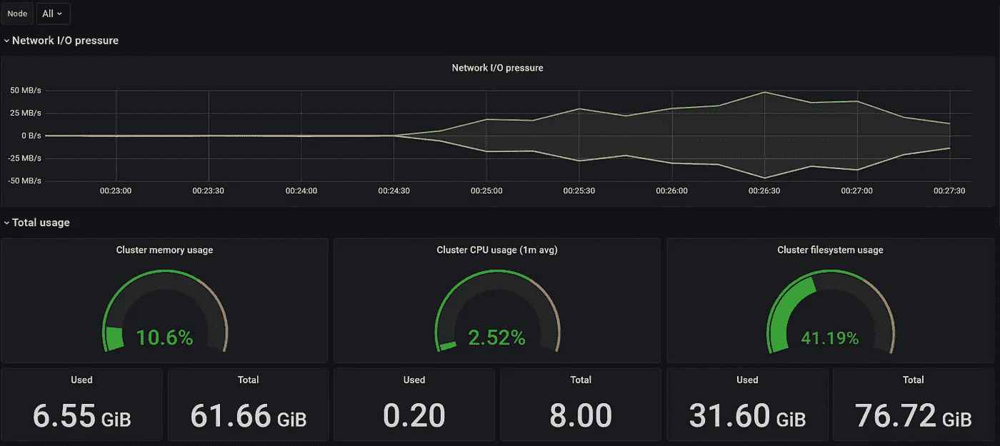

Kubernetes Dashboard of 1 OKE cluster

此时，我们知道从普罗米修斯到灭霸的度量是可行的，我们可以使用灭霸作为数据源。但是，这仅适用于 1 个群集，也适用于我们部署了灭霸的群集。

在[第 2 部分](/oracledevs/monitoring-multiple-oke-clusters-with-prometheus-thanos-and-grafana-part-2-77d2f0303ea0)中，我们将添加更多集群并修改仪表板，以便我们可以挑选单个集群并分析它们的指标。

更新:由于 terraform 模块中缺少规则，安全列表管理模式更改为“全部”。