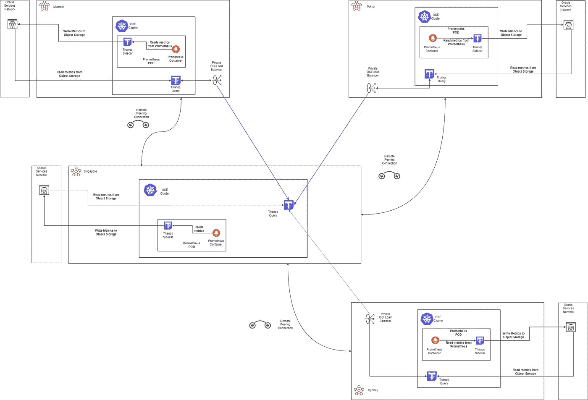
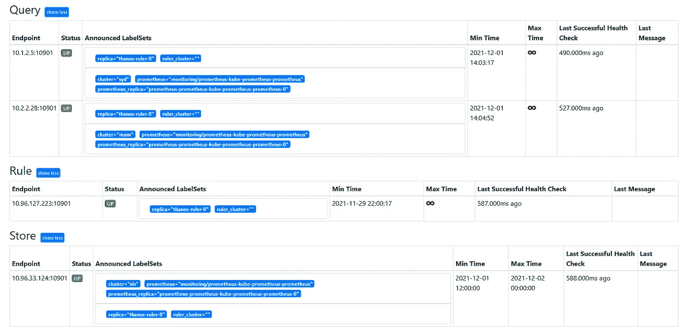
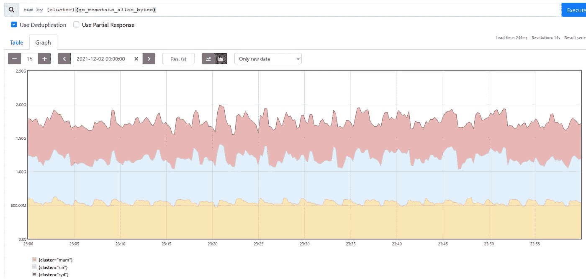
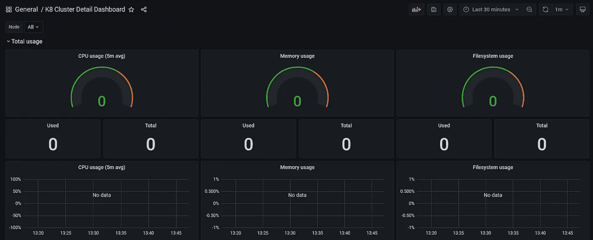
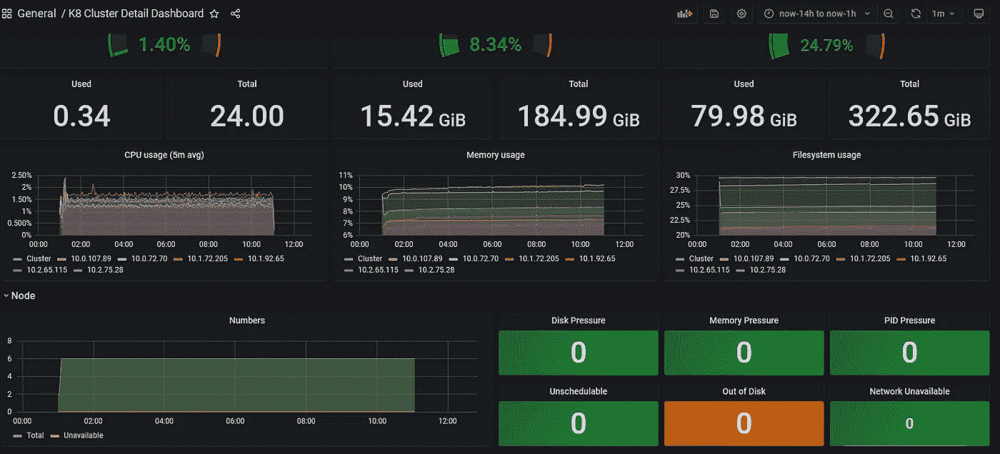
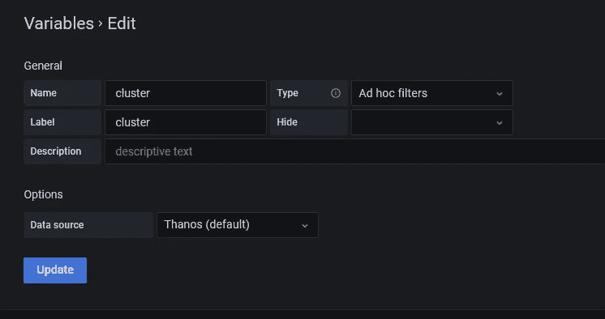
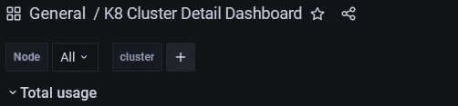
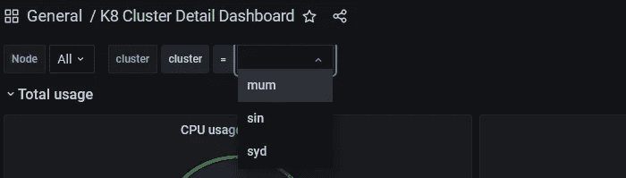
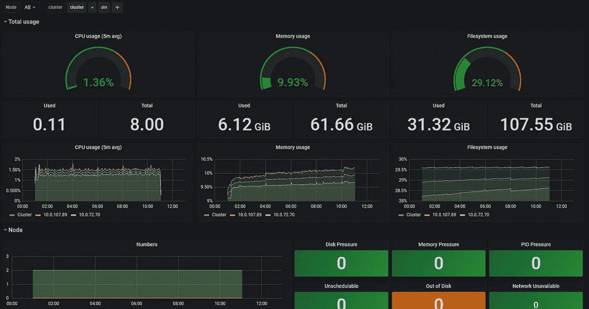

# 用普罗米修斯、灭霸和格拉夫纳监测多个 OKE 星团——第二部分

> 原文：<https://medium.com/oracledevs/monitoring-multiple-oke-clusters-with-prometheus-thanos-and-grafana-part-2-77d2f0303ea0?source=collection_archive---------0----------------------->

在[第 1 部分](/oracledevs/monitoring-multiple-oke-clusters-with-prometheus-thanos-and-grafana-part-1-df11df7013f1)中，我们了解了我们希望使用[灭霸](https://thanos.io/)的一些原因，这是一种为 Prometheus 提供长期存储能力的高可用性解决方案。我们还在我们的**管理** [Verrazzano](https://verrazzano.io/) 集群中部署了灭霸的所有组件。但是，我们只获得了 1 个集群的指标。在本文中，我们将研究如何监控多个集群。

回想一下:

*   [我们已经部署了 4 个 OKE 集群，分别位于新加坡、悉尼、孟买和东京 OCI 地区](/oracledevs/deploying-a-multi-cluster-verrazzano-using-oke-part-1-d6327d45ba03)
*   [在多集群设置中，Verrazzano 有管理和被管理集群的概念](https://verrazzano.io/docs/concepts/verrazzanomulticluster/)。**管理**集群类似于 Kubernetes 中的控制平面或 WebLogic 中的管理服务器，而受管集群类似于 Kubernetes 中的工作节点或 WebLogic 中的受管服务器
*   [我们将新加坡集群设为管理集群，将其他地区设为被管理集群](/oracledevs/deploying-a-multi-cluster-verrazzano-using-oke-part-2-93d2438f7eef)
*   我们还在新加坡集群中安装了灭霸。

实际上，这使得新加坡集群成为我们的指挥中心:

我们现在也想监视其他集群。为此，我们将在每个地区安装带灭霸边车的普罗米修斯。



Multi-cluster, multi-region Thanos deployment

首先，在每个区域创建一个名为 **thanos** 的 bucket。

在操作员主机上，制作 thanos-sin-storage.yaml 的 3 个副本，并按区域对它们进行相应的重命名，例如 thanos-syd-storage.yaml、thanos-mum-storage.yaml、thanos-tok-storage.yaml。编辑每个文件并更改它们各自的对象存储结束点和区域。对象存储端点具有以下格式:

```
<object_storage_namespace>.compat.objectstorage.region.oraclecloud.com
```

回想一下，我们还安装了 [kubectx](https://github.com/ahmetb/kubectx) ，为了我们的多集群目的，我们将 1 个集群等同于 1 个上下文。对于每个受管理的集群，重复以下操作:

```
## # change name of context everytime
kubectx sydneykubectl create ns monitoring## change file name everytime
kubectl -n monitoring create secret generic thanos-objstore-config --from-file=thanos-syd-storage.yaml=thanos-syd-storage.yaml
```

## 用边车部署普罗米修斯

接下来，我们将在每个地区部署带边车的普罗米修斯。和前面一样，为每个集群创建一个 prometheusvalues.yaml 文件的副本，例如 prometheusvalues-sydney.yaml 等。编辑每个文件并更改以下内容:

```
*prometheus.thanos.objectStorageConfig.secretKey*: **thanos-sin-storage.yaml**
*prometheus.thanos.service.type*: ClusterIP
*prometheus.thanos.service.annotations*: {}
*prometheus.externalLabels*:
  cluster: "**syd**"
```

你现在可以在每个地区部署普罗米修斯。记住每次都要更改上下文和文件:

```
kubectx sydneyhelm install prometheus bitnami/kube-prometheus \
--namespace monitoring \
-f prometheusvalues-sydney.yaml
```

验证普罗米修斯吊舱在每个区域是否正常运行:

```
kubectl -n monitoring get pods
```

接下来，在所有“**”管理的“**”地区部署灭霸。首先，复制我们在第 1 部分中创建的 thanosvalues.yaml [，然后确保更新以下参数:](/oracledevs/monitoring-multiple-oke-clusters-with-prometheus-thanos-and-grafana-part-1-df11df7013f1)

```
objstoreConfig
  ## update the endpoint, and regionquery.service.type: LoadBalancer
query.service.annotations:
  oci.oraclecloud.com/oci-network-security-groups: "**nsg_id**"
  service.beta.kubernetes.io/oci-load-balancer-shape: "flexible"
  service.beta.kubernetes.io/oci-load-balancer-shape-flex-min: "50"
  service.beta.kubernetes.io/oci-load-balancer-shape-flex-max: "100"
  service.beta.kubernetes.io/oci-load-balancer-subnet1: "**subnet_id**"
  service.beta.kubernetes.io/oci-load-balancer-internal: "true"   service.beta.kubernetes.io/oci-load-balancer-security-list-management-mode: "All"
```

您可以从 OCI 控制台获取 nsg_id 和子网 _id 值。确保您了解每个地区的价值观。在各地区部署灭霸:

```
kubectx sydneyhelm install thanos bitnami/thanos \
--namespace monitoring \
-f thanos-syd.yaml
```

验证每个地区的所有灭霸吊舱运行正常:

```
kubectl -n monitoring get pods
```

## 更新管理区域中的普罗米修斯和灭霸

有了上述架构，我们不再需要将**管理**区域中的侧车作为负载平衡器服务公开。相反，将 query.service.type 设置为 **ClusterIP** 并注释/删除注释。我们也可以更新商店列表(请注意，我现在只有两个托管区域，因为我在测试其他东西时弄乱了东京集群):

```
stores:
- 10.1.2.5:10901
- 10.2.2.28:10901
```

将上下文更改为管理并运行 helm update:

```
kubectx adminhelm upgrade thanos bitnami/thanos -f thanosvalues.yaml
```

如果您访问灭霸查询，您现在可以看到 2 个查询，1 个商店和没有侧车:



让我们使用灭霸来查找每个集群分配的和仍在使用的内存量。我们运行一个查询，然后使用我们在每个集群中设置的外部标签:



让我们看看格拉夫纳。这一次，我们将使用群集详细信息仪表板(id: 10856)。像以前一样导入它，使用灭霸数据源并访问仪表板。它将显示为空。



原因是仪表板显示了过去 30 分钟的指标，而数据尚未存储到对象存储中。更改时间范围，您可能需要等待至少 2 小时，直到第一个数据写入 OCI 对象存储:



## 向 Grafana 仪表板添加区域过滤器

我们现在还希望能够检查一个特定的集群:

1.  单击仪表板设置，然后单击左侧菜单上的**变量**。
2.  点击**新建**新建一个变量
3.  命名为**集群**
4.  将类型设置为**特定过滤器**
5.  并点击**更新**，之后是保存**仪表盘**



您现在将在仪表板的顶部看到一个过滤器:



点击 **+** 图标，选择**集群**，然后选择您要检查的集群:



这里的值将是您在每个集群的 externalLabel 参数中设置的值。选择 1 个集群后，您应该会看到各个面板中的值发生变化:



Updated Grafana values after selecting a cluster

## 摘要

现在，我们可以跨多个区域、虚拟社区甚至同时监控 OCI 各种资源的性能。这次演习还帮助我更好地了解了灭霸，我开始意识到这只是将灭霸部署为 Prometheus 的长期高可用性解决方案时的众多变化之一。每种变化都有其优点和缺点，可能会有法规影响(如果您需要遵守这些法规),需要在基础设施、架构和财务方面进行权衡。在以后的文章中，我们希望能看到这些。

我要感谢我的同事肖恩·利维和韦努戈帕尔·纳伊克，感谢他们深思熟虑的建议和想法。

相关文献:

*   [https://artifacthub.io/packages/helm/bitnami/thanos/8.1.2](https://artifacthub.io/packages/helm/bitnami/thanos/8.1.2)
*   [https://www . infra cloud . io/blogs/thanos-ha-scalable-Prometheus/](https://www.infracloud.io/blogs/thanos-ha-scalable-prometheus/)
*   【https://particule.io/en/blog/thanos-monitoring/ 
*   [https://better programming . pub/set-up-thanos-with-multi-tenancy-to-power-up-your-Prometheus-70123 e6ea 555](https://betterprogramming.pub/set-up-thanos-with-multi-tenancy-to-power-up-your-prometheus-70123e6ea555)