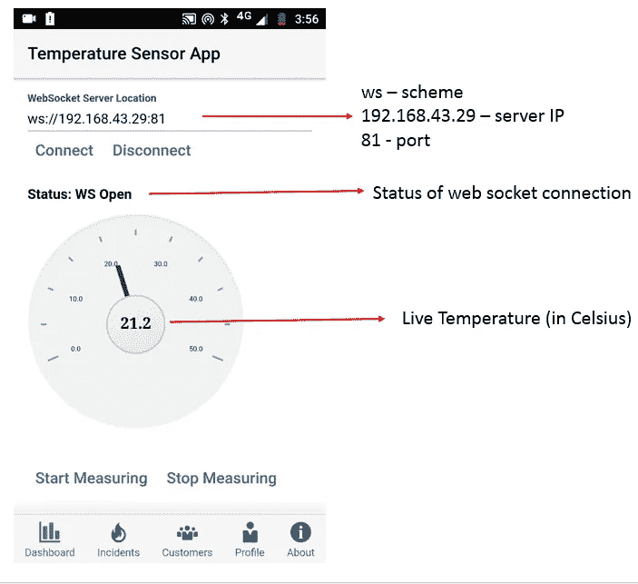
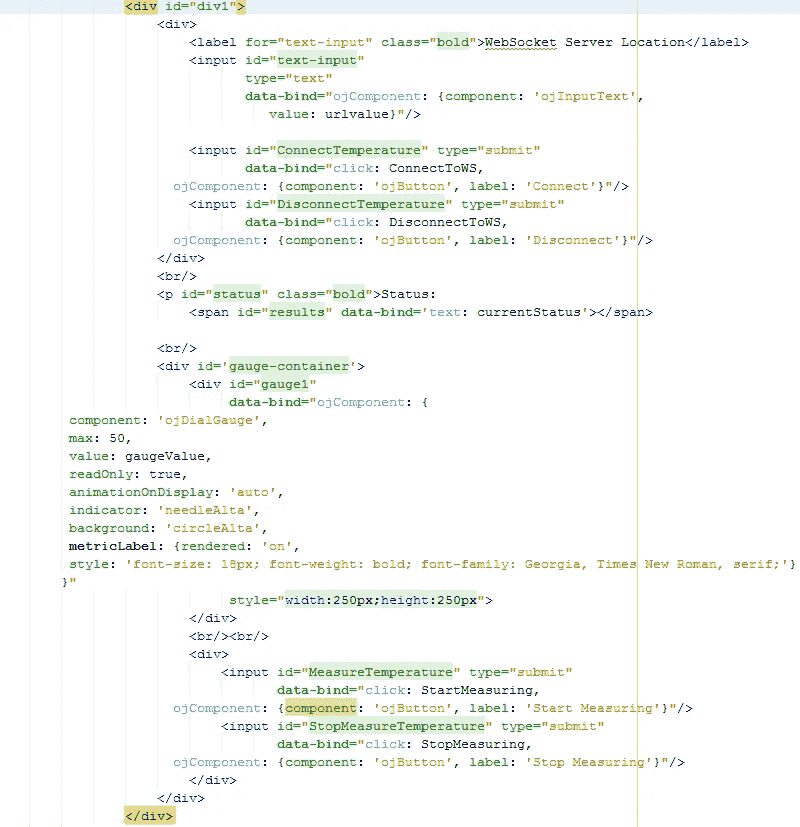
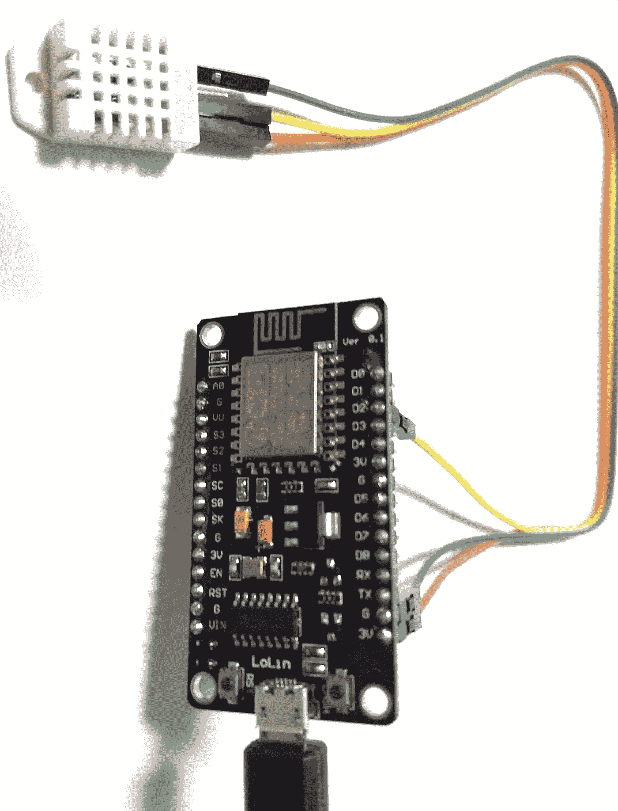

# 通过 WebSocket 监控 Oracle JET Mobile 应用程序中的传感器数据(第 2 部分，共 2 部分)

> 原文：<https://medium.com/oracledevs/monitoring-sensor-data-in-an-oracle-jet-mobile-app-over-websocket-part-2-of-2-d070c867956a?source=collection_archive---------0----------------------->

在这个博客系列的[第一部分，我们开发并测试了运行在 NodeMCU 上的 WebSocket 服务器，并发送温度传感器数据。现在我们将使用 WebSocket Javascript APIs 开发一个](/oracledevs/monitoring-sensor-data-in-jet-mobile-app-over-websockets-part-1-2-f7fa81d9774b) [Oracle JET](https://www.oraclejet.org) 移动温度传感器应用程序。

这是我们将在本博客中介绍的应用程序的屏幕截图:



JET Hybrid Mobile app monitoring live room temperature

**开发客户端 Oracle JET 混合应用**

我们将从头开始实施，以在 oracle jet 混合应用程序中实施接收传感器值。

**使用 Yeoman**
[的项目设置用于](https://github.com/oracle/generator-oraclejet) [Oracle JET](http://www.oracle.com/webfolder/technetwork/jet/index.html) 的 Yeoman generator 可让您快速设置项目，用作 Android 和 iOS 的 Web 应用程序或移动混合应用程序。使用以下命令为 Android 生成混合应用程序:

```
yo oraclejet:hybrid tempsensor — template=navbar — platforms=android
```

基于 *navbar* 模板的原生混合应用程序代码将放在“tempsensor”文件夹中。更多脚手架选项，请参考[此处](https://docs.oracle.com/middleware/jet320/jet/developer/GUID-C75CD8DC-5084-4831-BE1A-FFEE4EA8600C.htm#GUID-02F219FA-3060-4949-9755-5363F2BC9D9D)

**实施步骤**

一旦上面的命令成功，这意味着你的应用程序准备好了。转到您的新应用程序目录应用程序，并更新以下内容:

*注意:为了便于实施，我们将更新仪表板视图和视图模型*

在 *dashboard.js* 文件中添加附加模块:

```
define([‘ojs/ojcore’, ‘knockout’, ‘jquery’, ‘ojs/ojgauge’, ‘ojs/ojbutton’, ‘ojs/ojinputtext’],
```

为 *gaugeValue* 、 *urlvalue* 和 *currentstatus* 添加可观察变量:

```
self.gaugeValue = ko.observable(30);
self.urlvalue = ko.observable(“ws://192.168.43.29:81”);
self.currentStatus = ko.observable(“CLOSED”);
```

**添加 websocket 客户端实现:**

WebSocket 是用于在客户端和服务器之间建立连续连接流的协议。WebSocket 减少了延迟，提高了实时通信的效率，因为它只需要发出一个请求就可以打开一个连接，并在客户端和服务器之间的后续调用中重用同一个连接。

**创建 WebSocket 对象并注册事件**

创建一个 webSocket 对象，使用 WebSocket 协议进行通信，并注册各种事件。

```
function getWSUri() {
  return self.urlvalue();
}function connectSocket() {
  if (‘WebSocket’ in window) {
     websocket = new WebSocket(getWSUri());
     websocket.onmessage = onMessage;
     websocket.onerror = onError;
     websocket.onclose = onClose;
     websocket.onopen = onOpen;
     console.log(‘socket opened !’);
     self.currentStatus(‘WS Opened!’);
  } else {
     console.log(‘websocket not supported…!’);
     self.currentStatus(‘WS not supported’);
  }
}self.ConnectToWS = function (data, event) {
  connectSocket();
  return true;
};
```

**打开连接**

一旦成功建立连接，套接字就被打开:

```
function onOpen() {
  console.log(“in onOpen method”);
  self.currentStatus(‘WS Open’);
};
```

**向服务器发送数据**

打开连接后，开始使用 *send()* 方法向服务器传输数据

```
self.StartMeasuring = function (data, event) {
  self.handle = setInterval(function (){websocket.send(“temp”);}, 2000);
  return true;
};
```

**从服务器接收消息**

WebSocket 是一个事件驱动的 API 当收到消息时，一个“消息”事件被传递给 *onmessage* 功能

```
function onMessage(evt) {
  self.gaugeValue(evt.data);
  console.log(self.gaugeValue());
}
```

**关闭连接**

当您完成 WebSocket 连接后，调用 *close()* 方法

```
// on close event
function onClose(evt) {
  console.log(‘websocket closed :’ + evt.code + “:” + evt.reason);
  self.currentStatus(‘WS closed, status:’ + evt.code);
}self.DisconnectToWS = function (data, event) {
  websocket.close();
  return true;
};
```

**接收错误**

```
// on error event
function onError(evt) {
  console.log(‘error :’ + evt);
  self.currentStatus(‘error :’ + evt);
}
```

添加停止从服务器接收数据的功能

```
self.StopMeasuring = function (data, event) {
clearInterval(self.handle);
 self.handle = 0;
 return true;
 };
```

最后，更新*dashboard.html*代码渲染 UI:



**在 Android 设备上构建并运行应用程序**
在您的命令提示符下，请将目录更改为项目文件夹

使用以下命令构建应用程序:
***grunt build—platform = Android***

一旦构建成功，则使用以下命令运行应用程序:
***grunt serve—platform = Android—disable livereload = true***

**演示输出:**

请注意，节点 MCU 和移动设备应该在同一个网络后面，这样它们应该能够相互连接

**WebSocket 服务器**

请在您的 NodeMCU 硬件上运行上一篇博客中显示的 web-socket 服务器:



**串行监视器**

打开串行监视器查看分配给 WebSocket 服务器的 IP 地址。


**JET 混合动力移动温度传感器应用**

以 ws://IP_ADDRESS_ASSIGNED:PORT 格式连接到 WebSocket 服务器地址，并开始监控温度数据！下面是该应用程序的一个小视频演示:

Temperature Sensor App (WebSocket client)

> 本文表达的观点是我个人的观点，不一定代表甲骨文的观点。