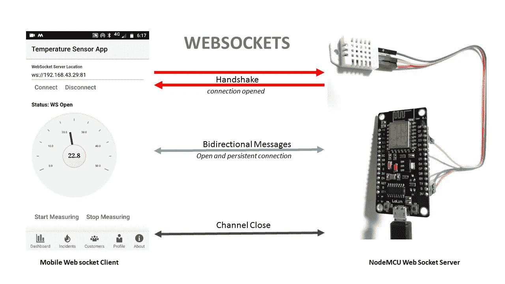
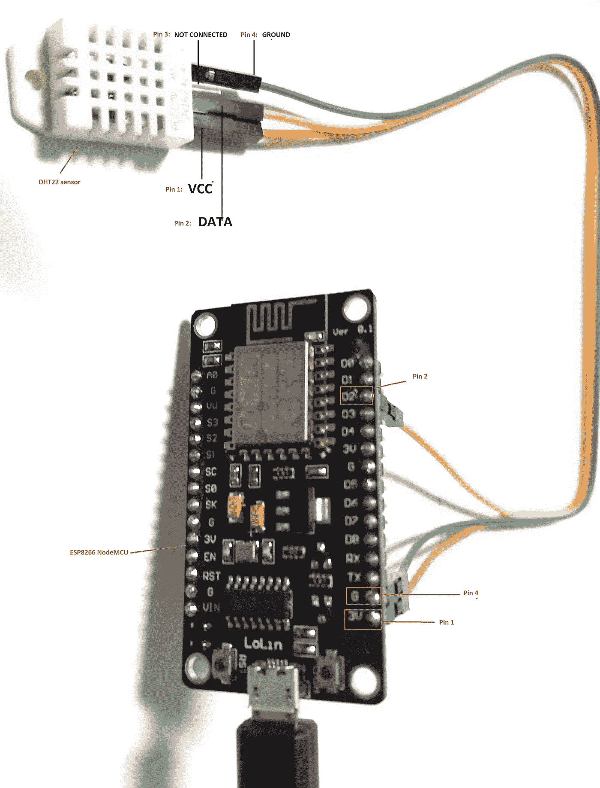
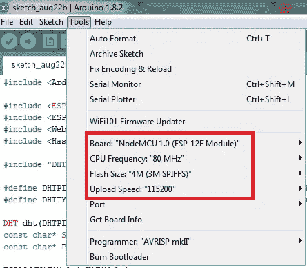
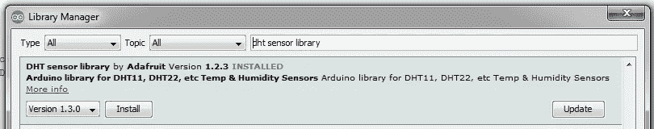
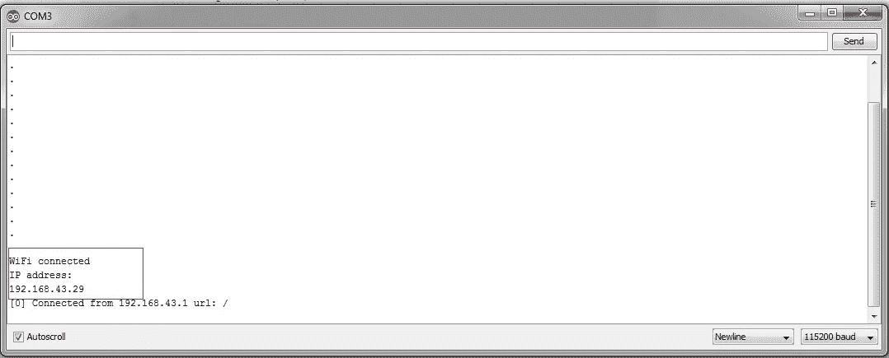
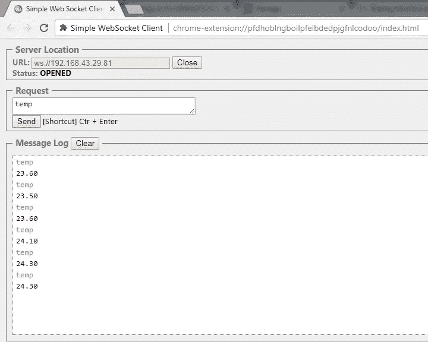

# 通过 WebSocket 监控 Oracle JET Mobile 应用程序中的传感器数据(第 1 部分)

> 原文：<https://medium.com/oracledevs/monitoring-sensor-data-in-jet-mobile-app-over-websockets-part-1-2-f7fa81d9774b?source=collection_archive---------0----------------------->

我正在制作如何将 DHT22 传感器数据显示到我的 JET mobile 应用程序的原型，希望分享我的发现。

在第 1 部分中，我们将展示 WebSocket 服务器向客户机发送传感器值。在最后一部分，即第 2 部分，我们将从头开始开发一个展示传感器数据的 JET 移动应用程序。

**DHT22** 是一种低成本传感器，由湿度和温度传感器组成。数据可以通过 GPIO 引脚读取，所以我用 **ESP8266 NodeMCU** 连接。

然后，在 NodeMCU 芯片上运行 **WebSocket 服务器**来发送 DHT22 传感器数据，最后开发了 Oracle JET Mobile 应用程序，该应用程序使用 **WebSocket 客户端** Javascript API 来监控温度数据。

下图直观地展示了 Oracle JET Mobile 应用程序如何通过 WebSocket 与 NodeMCU 进行交互。



JET Mobile App communicating to ESP8266 NodeMCU

这里的移动应用程序充当 websocket 客户端，与 NodeMCU 建立握手，其中安装了 websocket 服务器。一旦建立连接，客户端请求温度值，改变后的温度值显示在千分表— ojgauge， [*oracle jet 组件*](http://www.oracle.com/webfolder/technetwork/jet/jetCookbook.html?component=dialGauge&demo=dialGaugeComponent) 中。用户可以选择停止测量并断开连接。

**硬件设置入门— ESP8266 NodeMCU 和 DHT22 传感器**

在本节中，我们将把 DHT22 连接到 ESP8266 NodeMCU

1.  三根跳线
2.  DHT22
3.  ESP8266 节点 MCU
4.  微型 USB 电缆

**接线**

然后，我们用 NodeMCU 连接 DHT22，如下所示:



**设置和安装**

我使用 Arduino IDE 对 NodeMCU 编程，这是用 DHT22 启动和运行的最简单的方法。

**在 NodeMCU 上传 WebSocket 服务器的软件安装步骤:**

1.  打开首选项窗口，在“附加 Board Manager URLs”中键入以下地址:[http://arduino . esp8266 . com/stable/package _ esp8266 com _ index . JSON](http://arduino.esp8266.com/stable/package_esp8266com_index.json)
2.  进入工具菜单，根据您使用的型号配置您的主板。
    板卡:NodeMCU
    CPU 频率:80 MHz
    上传速度:115200



1.  将 NodeMCU 连接到计算机并配置端口。使用工具-端口选择设备连接的端口。
2.  安装附加库，草图->包含库->管理库为 DHT22 传感器和 WebSocket 服务器添加库



**代码**

一旦你的机器设置好了，设备配置好了，下一步就是把服务器代码上传到 NodeMCU，下面是代码

I)代码建立串行连接，向计算机发送调试信息

ii)根据给定的 SSID 和密码连接到 WIFI 路由器

iii)连接 Wifi 后，启动 WebSocket 连接并连接到分配的 IP

iV)一旦建立了通道，在来自客户端的每个请求下，服务器发送回从 DHT22 传感器读取的温度值

```
#include <Arduino.h>#include <ESP8266WiFi.h>
#include <ESP8266WiFiMulti.h>
#include <WebSocketsServer.h>
#include <Hash.h>#include "DHT.h"#define DHTPIN D2     // what digital pin the DHT22 is conected to
#define DHTTYPE DHT22   // there are multiple kinds of DHT sensorsDHT dht(DHTPIN, DHTTYPE);
const char* SSID     = **"YOUR_WIFI_SSID"**;
const char* PASSWORD = **"YOUR_WIFI_PASSWORD";**ESP8266WiFiMulti WiFiMulti;WebSocketsServer webSocket = WebSocketsServer(81);void webSocketEvent(uint8_t num, WStype_t type, uint8_t * payload, size_t length) {
    String t = String(dht.readTemperature());    

    switch(type) {
        case WStype_DISCONNECTED:
            break;
        case WStype_CONNECTED:
            {
                IPAddress ip = webSocket.remoteIP(num);
                Serial.printf("[%u] Connected from %d.%d.%d.%d url: %s\n", num, ip[0], ip[1], ip[2], ip[3], payload);
            }
            break;
        case WStype_TEXT:

              t = String(dht.readTemperature());
              webSocket.sendTXT(num, t);

            break;
        case WStype_ERROR:
            break;default:
            break;
    }}void **setup**() {
    Serial.begin(115200);for(uint8_t t = 4; t > 0; t--) {
        delay(1000);
    }WiFiMulti.addAP(SSID, PASSWORD);while(WiFiMulti.run() != WL_CONNECTED) {
        delay(100);
        Serial.println(".");
    }
  Serial.println("");
  Serial.println("WiFi connected");  
  Serial.println("IP address: ");
  Serial.println(WiFi.localIP());webSocket.begin();
    webSocket.onEvent(webSocketEvent);
}void **loop**() {

    webSocket.loop();
}
```

**上传并测试**

一旦代码编译成功，我们就上传代码并开始测试。转到工具-串行监视器，我们可以在这里查看日志



请注意分配给 WebSocketserver 的 IP 地址。我们现在可以用任何简单的 WebSocket 客户端测试这个服务器，比如 [websocket 客户端 chrome 扩展](https://chrome.google.com/webstore/detail/simple-websocket-client/pfdhoblngboilpfeibdedpjgfnlcodoo)

输入 WebSocket IP 地址和端口(81)并发送一个请求包，如果一切设置正确，您将开始获得摄氏温度格式的室温！



因此，通过这一步，我们的 WebSocket 服务器就可以发送温度数据了。在下一篇博客中，我们将开发一个 JET 移动温度传感器应用程序。

> 本文表达的观点是我个人的观点，不一定代表甲骨文的观点。