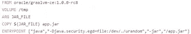
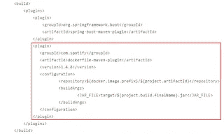
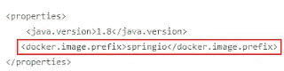
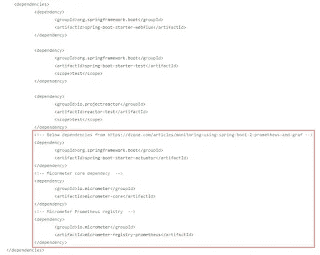
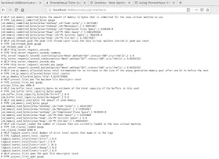
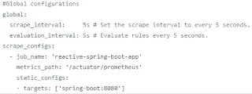
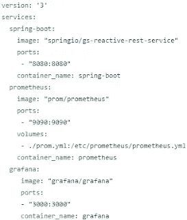
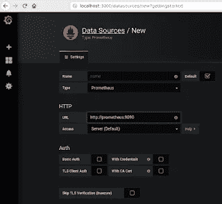
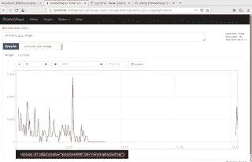
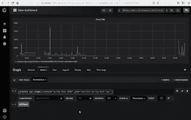

# 使用 Prometheus 和 Grafana 监控 Spring Boot 应用

> 原文：<https://medium.com/oracledevs/monitoring-spring-boot-applications-with-prometheus-and-grafana-b33dae198ee2?source=collection_archive---------3----------------------->

为了比较反应式 Spring Boot 服务的不同 JDK 的性能，我做了一个设置，其中 Spring Boot 应用程序被包装在 Docker 容器中。这使得为运行相同 Spring Boot 应用程序的不同 JDK 创建不同的容器变得容易。Spring Boot 应用程序向普罗米修斯公开了度量标准。Grafana 可以读取这些指标，并允许从中做出很好的可视化效果。这篇博文描述了这个设置。下一篇文章将会展示结果。你可以在这里下载代码[(在完整的文件夹里)。为了说明这有多简单，我总共花了不到 1.5 个小时就完成了设置和运行，并撰写了这篇博文。我对普罗米修斯和格拉夫纳没有太多的先验知识，除了卢卡斯·杰利马在艾米斯的一次研讨会。](https://github.com/MaartenSmeets/gs-reactive-rest-service.git)


## 将 Spring Boot 包装在码头集装箱中

用 Docker 容器包装 Spring Boot 应用程序很容易。例如这里的。您需要执行以下操作:

如下创建一个 docker 文件(更改 FROM 条目以获得不同的 JDK)



向 pom.xml 文件添加插件。



并定义所使用的属性:



现在你可以做 mvn 清理包 dockerfile:build，它会为你创建 Docker 镜像 spring io/GS-reactive-rest-service:latest。您可以使用以下命令来运行:

```
docker run -p 8080:8080 -t springio/gs-reactive-rest-service:latest
```

## 从 Spring Boot 获得普罗米修斯度量

为了使字符串引导应用程序中的普罗米修斯度量可用，需要添加一些依赖关系(见[这里](https://dzone.com/articles/monitoring-using-spring-boot-2-prometheus-and-graf))。



现在，您可以运行 Docker 容器并转到如下 URL:[http://localhost:8080/actuator/Prometheus](http://localhost:8080/actuator/prometheus)，您将会看到如下内容:



## 提供普罗米修斯配置

我提供了一个小的配置文件，让 Prometheus 查看来自 Spring Boot 的指标 URL(参见[这里](https://github.com/MaartenSmeets/gs-reactive-rest-service/blob/master/complete/prom.yml)):



把 Spring Boot、普罗米修斯和格拉夫纳放在一起，正如你在上面的截图中看到的，我使用了主机名 spring-boot。我可以这样做是因为 docker compose 配置 container_name。如下图所示:



Grafana 和 Prometheus 是这些产品的官方 Docker 图像。我已经将前面提到的配置文件添加到 prometheus 实例中(Prometheus 下的 volumes 条目)。现在我可以进行 docker-compose up，它将启动 Spring Boot(可从 localhost:8080 获得)、带有配置文件的 Prometheus(可从 localhost:9090 获得)和 Grafana(可从 localhost:3000 获得)。它们将被放在同一个 Docker 网络中，可以通过主机名“prometheus”、“grafana”和“spring-boot”相互访问

## 配置 Grafana

在 Grafana 中，很容易将 Prometheus 添加为数据源。



完成此操作后，您可以添加仪表板。一个简单的方法是在 Prometheus 中创建一个简单的查询，并将其复制到 Grafana 中以创建一个图表。可能有更好的方法来这样做，但我还没有深入到 Grafana，以了解更多关于它的能力。



最后，使用 Prometheus 和 Grafana 监控 Spring Boot 应用程序既简单又强大。使用 docker-compose 文件，也很容易将一个程序集放在一起，以启动/链接不同的容器。如果你想重新开始，这很容易。

要亲自尝试一下，请执行以下操作(我已经使用了下面的 VM(需要 vagger 和 VirtualBox 来构建)，并且预装了 docker 和 docker-compose maven:[这里是](https://github.com/MaartenSmeets/provisioning/tree/master/ubuntudev)

```
git clone [https://github.com/MaartenSmeets/gs-reactive-rest-service](https://github.com/MaartenSmeets/gs-reactive-rest-service)
cd gs-reactive-rest-service/complete
mvn clean package
mvn dockerfile:build
docker-compose up
```

然后，您可以访问之前指定的 URL 来访问 Spring Boot 应用程序 Prometheus 和 Grafana。

*原载于 2018 年 11 月 10 日*[*【javaoraclesoa.blogspot.com*](http://javaoraclesoa.blogspot.com/2018/11/monitoring-spring-boot-applications.html)*。*