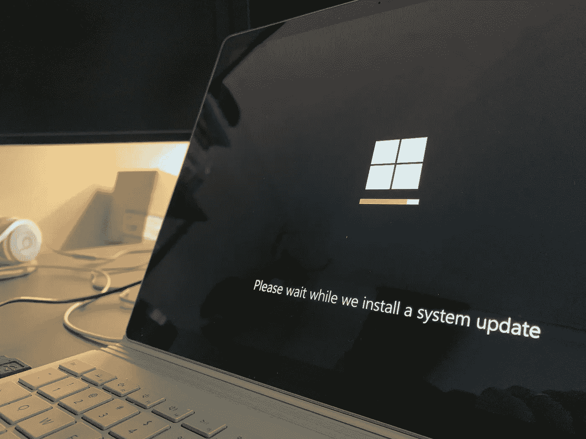

# 每月 Microsoft 许可证更新—2022 年 2 月

> 原文：<https://medium.com/version-1/monthly-microsoft-license-update-february-2022-9d1506b32092?source=collection_archive---------6----------------------->

Photo by [Clint Patterson](https://unsplash.com/@cbpsc1) on [Unsplash](https://unsplash.com/?utm_source=medium&utm_medium=referral)

欢迎使用版本 1 Microsoft 许可证咨询小组每月 Microsoft 许可证更新的第一部分。

众所周知，微软每月都会发布产品条款的许可变更，其中一些变更会产生实质性影响，而另一些则不会产生任何影响。

作为微软的许可专家，我的同事们， [Niamh NI Shuilleabhain](https://www.linkedin.com/in/niamh-n%C3%AD-sh%C3%BAilleabh%C3%A1in-64123533/) 、[威廉·尼尔森](https://williamjdnelson.medium.com)和 [Richard Ojo](https://www.linkedin.com/in/richard-olumide-o-53676a43/) 和我将花时间考虑和研究这些变化，强调任何即将出现的微软许可趋势或问题。

在本次会议中，我们讨论了[二月更新](https://www.microsoft.com/licensing/terms/product/changes)的四个主要变化，包括以下内容:

- **音频服务** 音频服务是微软语音产品的总括产品类别，包括团队电话系统和音频会议。目前作为附加订阅提供(在 Microsoft 365 E5 和 Office 365 E5 套件之外)，在音频服务可以部署到用户之前的先决条件或基本订阅要求已经扩展到包括 Office 365 A1 —专为教育部门，尤其是学生设计的入门级订阅套件。

现在，这将音频服务的可用性扩展到企业、公司、非营利组织、政府和教育机构的所有用户，因此，这不是一个特性或功能的变化，而是一个程序性更新，使学术机构能够选择向其学生提供音频服务。

- **微软 365** 微软将政府 SKU 的隐私管理风险和主题权利请求添加到 EA/EAS 和 MCA 计划的可用性表中。他们还更新了许可证先决条件表，将 Microsoft 365 G3 和 G5 以及 Office 365 G1、G3 和 G5 添加为隐私管理的合格先决条件。这些附加内容可以在可用性表中的[这里的](https://eur02.safelinks.protection.outlook.com/?url=https%3A%2F%2Fwww.microsoft.com%2Flicensing%2Fterms%2Fproductoffering%2FMicrosoft365%2FEAEAS&data=04%7C01%7CKarl.ODoherty%40version1.com%7C27351fa347804802f7c108d9f6dbe31c%7C3e0088dc06294ae6aa8c813e7a296f50%7C0%7C0%7C637812246540236096%7CUnknown%7CTWFpbGZsb3d8eyJWIjoiMC4wLjAwMDAiLCJQIjoiV2luMzIiLCJBTiI6Ik1haWwiLCJXVCI6Mn0%3D%7C3000&sdata=vW%2F9abrmmRosnDwREyxMpt6PIaetTpH5q6hrse%2BEiVY%3D&reserved=0)中找到，也可以在许可先决条件表中找到。

什么是隐私管理？隐私管理是微软为其 M365 客户提供的服务，旨在帮助“… *保护个人数据，构建一个隐私弹性工作场所。”*可以通过两个模块访问隐私管理功能。隐私管理-风险模块和隐私管理-主体权利请求。合格的 M365 和 O365 客户可以购买这两款产品。

-**Azure** 2 月，命名约定从托管例外更改为 Azure 客户解决方案。微软允许客户在 Azure 中创建和维护解决方案，并允许第三方访问这些“Azure 客户解决方案”。扩展这类功能的组织应该熟悉术语表，了解术语“客户解决方案”的定义

-**Microsoft Cloud for Retail Add-on** 微软表示已经向 Microsoft Cloud for Retail Add-On 添加了条款。这是微软专门为零售行业推出的相对较新的 Dynamics 365 产品，仅适用于大型零售组织(企业协议计划)客户。其许可先决条件是客户必须拥有 Dynamics 365 客户洞察(这本身需要先决条件许可)，并且是一个容量附加模块，而不是按用户许可。

面向零售的云于 2021 年 1 月在 Private Preview 中推出，考虑到过去两年的事件如何影响零售业从砖块到点击的转变，专注于零售行业特定的解决方案并不令人惊讶。亚马逊被公认为是云零售行业解决方案的第一大提供商，微软第二，谷歌第三。微软的零售云旨在整合整个零售生态系统(合作伙伴、供应商和客户)的不同数据源，例如，推动对客户行为趋势的更好理解和响应。

为了方便您，我们录制了一段 10 分钟的视频，更详细地讨论了这些变化。

同时，如果您有任何与此或任何其他微软许可事宜相关的问题，请访问我们的[网站](https://www.version1.com/it-service/software-asset-management/)或[联系我们](https://www.version1.com/contact/)。

**关于作者:**
Karl 是 Version 1 的首席许可顾问，为全球组织提供微软许可专业知识，并确保客户从他们的微软资产中获得最佳价值。