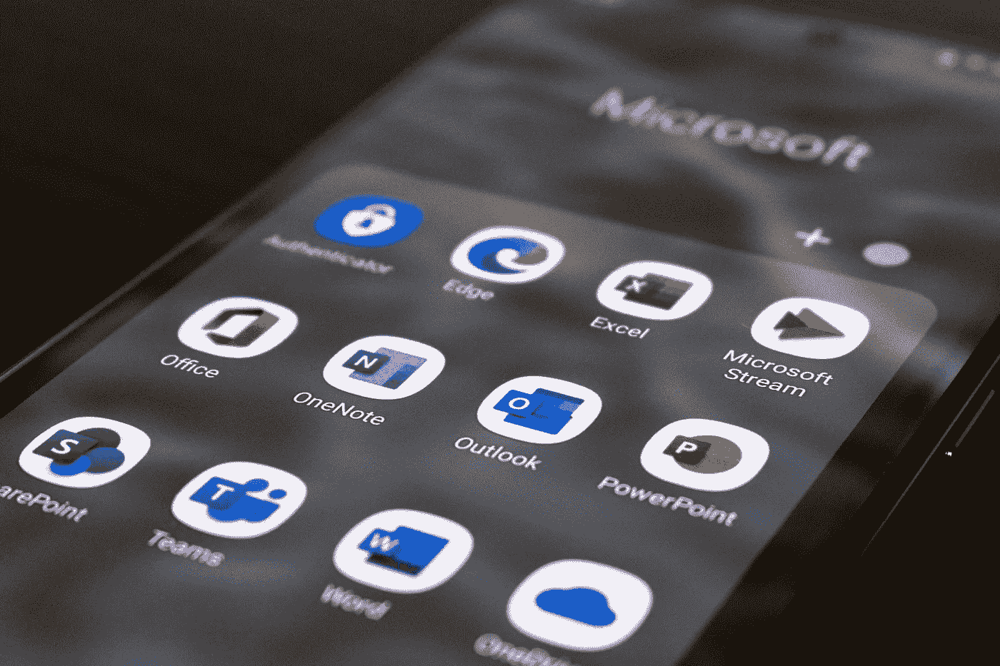

# 每月 Microsoft 许可证更新 2022 年 7 月

> 原文：<https://medium.com/version-1/monthly-microsoft-license-update-july2022-a80f5bff5559?source=collection_archive---------7----------------------->

Photo by [ThisIsEngineering](https://unsplash.com/@thisisengineering) on [Unsplash](https://unsplash.com/)

欢迎参加 2022 年 7 月的 Microsoft 许可证更新，该更新来自版本 1 Microsoft 许可证咨询团队。每个月，微软都会对他们的[产品条款](https://www.microsoft.com/licensing/terms/product/changes/all)进行许可变更——其中一些变更会产生实质性的影响，而另一些则不会产生任何影响。

为了您的方便，我们上传了一段录音，更详细地讨论了这些变化。

作为微软的许可专家，我的同事[妮娅姆·妮·舒拉·海恩](https://www.linkedin.com/in/niamh-n%C3%AD-sh%C3%BAilleabh%C3%A1in-64123533/)、[理查德·奥乔](https://www.linkedin.com/in/richard-olumide-o-53676a43/)、[威廉·尼尔森](https://www.linkedin.com/in/wjdnelson/)和我将花时间考虑和研究这些变化，强调任何即将出现的微软许可趋势或问题。在本次会议中，我们将讨论七月份产品条款更新的主要变化，包括以下内容:

## 【Microsoft 客户协议的计划协议补充条款:

更新条款的实用性需要微软来定义和澄清，因为条款的最新更新有点混乱。

具有自动续订功能的在线服务将在订阅期限到期后的第二天自动续订，这是众所周知的，也是有意义的，除非客户选择不续订自动续订，这也是众所周知的。

但是，术语更改现在包括声明:“在订阅到期前至少 30 天，通过更新 Microsoft 管理中心中的自动续订设置或联系他们的经销商。”

这实际上是在订阅的合同续订日期前 30 天引入了自动续订锁定。

因此，如果客户在续订日期前至少 30 天没有取消选择“不自动续订”，则客户将自动承诺续订相同的期限。

协议条款也进行了更新，增加了一个“冷却”期，可以在订购后 168 小时内取消新的订购。

## **商业卫士:**

微软将 Defender for Business 添加到微软 365 的报价表中。这是微软的 Endpoint Defender，它为员工少于 300 人的组织提供威胁情报功能。如果你在名字中看到 Business，这意味着它是为员工少于 300 人的小型组织服务的。根据他们的网站，每个用户的费用是 2.50€，只能通过 Microsoft 客户协议(或 CSP via Partner，费用取决于合作伙伴)获得。

## **音频服务:**

商业声音没了；不会了。它已经退役，与上面类似，标题为“商业”,目标是员工少于 300 人的组织。该服务已被适用于所有组织(EA/MCA 等)的“团队电话标准”和“带通话计划的团队电话标准”所取代

## **视窗更新:**

Windows Autopatch 可自动更新 Windows 10/11、Microsoft Edge 和 Microsoft 365 软件。这项服务于 7 月 11 日正式推出，正如您所料，产品条款现在包括了数据处理和专业服务定义方面的指导。

## **微软 365 SharePoint Syntex:**

SharePoint Syntex 是与 AI Builder & Power Automate 集成的每用户许可证，它允许您直接从 SharePoint 文档库中创建和使用 AI Builder 文档处理模型。

产品条款的变化是您通过每个 SharePoint Syntex 许可证获得的点数；它已经从最少 300 个 SharePoint Syntex 许可证的 100 万 AI Builder 信用(如果你只有 300 个许可证，你可以获得价值 1 万的 AI Builder 信用)变成每个 SharePoint Syntex 许可证的 3.5 千。为任意数量的授权厂商创造更加公平的竞争环境。

## **动态 365:**

本月两次更新。首先是增加了学术许可的最低购买量，类似于商业客户，任何基本许可都是 20 个许可，即客户服务、销售和现场服务。

第二，是否将 Dynamics 365 Business Central(也有“业务”一词)添加到了双重权限表中，即您是否拥有 Dynamics 365 Business Central Essentials、Premium、Team Members & Device 的许可证您有权在内部和云中使用它们。

## **GitHub 学习实验室:**

从 2022 年 9 月 1 日起，微软已经移除并将不再为组织提供 GitHub 学习实验室。作为一种选择，个人应该检查 GitHub 技能，在那里可以找到各种各样的 GitHub 学习资源。同样值得注意的是包含了 Github 文档的链接，该文档概述了 GitHub 企业软件和在线服务如何用于预览、演示、预发布版本、培训或评估目的。

## **微软 Azure:**

为 Azure Orbital 添加了特定于服务的条款。更新了认知服务和应用人工智能服务服务特定术语，特别是“受限访问服务”术语，以适应向管理特定“受限访问”人工智能服务的访问和使用的新流程的过渡。

*   未经运营商授权，客户不得使用 Azure Orbital 服务从卫星空间站接收信号或向卫星空间站发送信号。通过订阅 Azure Orbital 服务，您向微软声明，您的预期操作将仅在卫星空间站运营商同意的情况下进行。
*   对于更新的认知服务和应用人工智能服务服务特定条款，增加了关于合规性验证、重新验证和微软确定资格的能力的条款。(在停止客户访问之前，微软将提前 12 个月发出通知。)

## **面向非营利附加服务的微软云:**

更新了资格许可，包括学术计划。即 Office 365 A5/E5 和 Office 365 A3/E3 以及微软 365 A3/E3 和微软 365 A5/E5。

## **SharePoint 服务器:**

更新了 SharePoint Server 使用权，将订阅许可证作为运行/访问 SharePoint Server Subscription Edition 软件的先决条件。

*   正如我们从以前的更新(2021 年 11 月)中了解到的那样，SharePoint Server 订阅版许可证包括仅运行 SharePoint Server 2019 软件的永久权利。
*   实际上，在客户可以访问或运行 SharePoint Server Subscription Edition 之前，Microsoft 已经将 SharePoint Server Subscription Edition 标准 cal 作为基本访问许可证的一部分。

## **总结**

作为 Microsoft 许可证专家，我们可以帮助您揭开这些和任何其他产品变更的神秘面纱，并阐明这对您的许可证地位可能意味着什么。如果您有任何与此或任何其他微软许可事宜相关的问题，请访问我们的[网站](https://www.version1.com/it-service/software-asset-management/)或[联系我们](https://www.version1.com/contact/)。

Photo by Ed Hardie on Unsplash

**关于作者:** Karl 是[版本 1](https://www.version1.com/it-service/software-asset-management/) 的首席许可顾问，为全球组织提供微软许可专业知识，并确保客户从他们的微软资产中获得最佳价值。