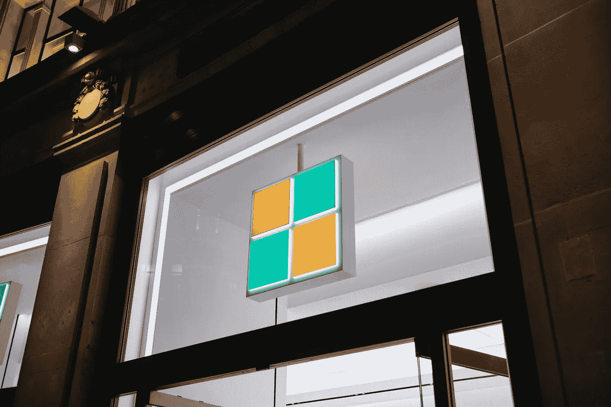

# 每月 Microsoft 许可证更新 2022 年 4 月

> 原文：<https://medium.com/version-1/monthly-microsoft-license-update-march-2022-48989513e9ff?source=collection_archive---------8----------------------->

Photo by [Aktar Hossain](https://unsplash.com/@aktarhossain) on [Unsplash](https://unsplash.com/)

欢迎参加版本 1 Microsoft 许可证咨询小组的每月 Microsoft 许可证更新的四月份部分。每个月，微软都会对他们的[产品条款](https://www.microsoft.com/licensing/terms/welcome/welcomepage)进行许可变更——其中一些变更会产生实质性的影响，而另一些则不会产生任何影响。

作为微软的许可专家，我的同事[妮娅姆·妮·舒拉·海恩](https://www.linkedin.com/in/niamh-n%C3%AD-sh%C3%BAilleabh%C3%A1in-64123533/)、[理查德·奥乔](/@richard.ojo)、[威廉·尼尔森](https://williamjdnelson.medium.com/)和我将花时间考虑和研究这些变化，强调任何即将出现的微软许可趋势或问题。在本次会议中，我们讨论了四月份产品条款更新的主要[变化](https://www.microsoft.com/licensing/terms/product/changes/all)，包括以下内容:

面向医疗保健的微软云—通过使用行业相关的合规性、安全性和互操作性标准来增强微软云，帮助医疗保健组织加速转型。这样做的目的是让患者能够与他们的护理团队直接互动，同时也让护理提供者能够连接来自多个来源的数据并管理工作人员，所有这些都是通过减少管理负担和自动化任务的工具实现的。这一变化将微软医疗保健云添加到 EA/EAS 和 EES 计划中。

## **远程帮助**

微软已经扩展了来自微软 365 E5 或 EM&S E5 的“远程帮助”的可用先决条件表，以包括:微软 365 F1、F3 和 E3、EM+S E3 和 Intune。远程帮助是 Microsoft Endpoint Manager (MEM)产品中的众多“高级”附加功能之一，该产品被定位为面向组织的“单一云解决方案”。远程帮助是唯一一种正式提供的“新”功能，因此预计即将正式提供的功能也将随之推出，前提条件表将在未来几个月内相应公布。

“远程帮助”本质上是 int une(Microsoft Endpoint Manager)中一个“安全”和“实时”的 Windows 设备(云和内部托管和非托管)帮助台功能，它允许用户基于 Windows 10 和 11 中的快速帮助工具获得远程帮助，但有几项改进，最显著的是增强了身份安全和身份验证措施。要求双方需要在同一个租户中使用 Azure AD 帐户登录，以及“助手”可以运行提升的命令来帮助远程用户的功能。远程帮助也适用于 Windows 365 和 Azure 虚拟桌面，同时计划在“未来版本”中支持 Android 设备。根据满足的先决条件，附加许可证为每个用户每月€3.50 / 3.00。

## **动态 365**

Dynamics 365 Services 本月忙于计划可用性和条款的更改。Dynamics 365 客户和数字消息传递是 EA 计划可用性的一个新条目，并按用户许可，实际上是其语音机器人和消息传递功能。添加了 Dynamics 365 第三方资金条款，规定对于使用第三方进行资金转账的 Dynamics 客户(例如，向供应商、合作伙伴、客户)，第三方负责转账。Dynamics 365 嵌入式版本的条款已更新，以表明这仅影响 MCA(或 CSP ),团队成员许可证功能已于本月移除；这是微软在 2018 年强制更改团队成员使用权的条款，例如自定义实体，但允许客户在订阅到期前使用以前的使用权。此时应该没有客户仍然能够行使先前的权利，因此微软已经删除了该条款。

## **隐私和安全条款**

通过这一更改，微软将 Azure Health Data Services 添加到了核心在线服务表的 Microsoft Azure 核心服务部分。通过将 Azure Health 数据服务纳入数据保护附录的 Microsoft Azure 核心服务部分，这实质上加强了微软在数据保护方面的立场。

## **微软预订**

Microsoft 预订增加了 Office 365 A3 和 A5 的学生使用权益(学术)。上个月，音频服务附加功能进一步扩展到学生，本月，微软预订了 Office 365 A3 和 A5 的学生使用权益。这可以被视为一种手段，通过使微软预订会议与微软团队虚拟化，将预订功能带给学术机构内的更多用户，从而加强微软团队作为协作和沟通的令人信服的首选工具的情况。作为在线会议预订的每个约会都创建了一个会议链接，每个人几乎可以从任何地方加入。团队内部还提供了一个应用程序，可以帮助创建日历、分配员工、安排新的约会以及在不离开团队的情况下开会。

## **窗户**

Windows 11 Pro(每台设备)许可可通过 CSP 获得。

CSP 通常被视为“按用户”的订阅许可活动，订阅被分配给一个用户。虽然按用户订阅构成了 CSP 提供的大部分产品，但也有越来越多的产品可以按设备获得许可，例如，针对设备的 Intune 和针对设备应用的 Dynamics 365 精选。Windows 11 Pro 现已通过 CSP motion 以按设备订阅的方式提供，前提条件是具备基本的合格桌面操作系统(即 Windows 8.1、10 等)。

为了您的方便，我们录制了一个 10 分钟的视频，更详细地讨论了这些变化。

同时，如果您有任何与此或任何其他微软许可事宜相关的问题，请访问我们的[网站](https://www.version1.com/it-service/software-asset-management/)或[联系我们](https://www.version1.com/contact/)。

**关于作者:** Karl 是[版本 1](https://www.version1.com/it-service/software-asset-management/) 的首席许可顾问，为全球组织提供微软许可专业知识，并确保客户从他们的微软资产中获得最佳价值。