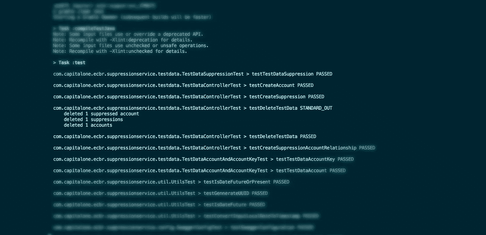

# 不仅仅是工程师和开发人员—开发运维入门

> 原文：<https://medium.com/capital-one-tech/more-than-engineers-coders-and-developers-e4d39514c434?source=collection_archive---------6----------------------->

高级软件工程师 Briana Crabb Augenreich

如果你是一名软件工程师，你的世界从编码开始，到编码结束，那你就是在限制自己。我们中有许多人认为，我们唯一的焦点应该是贡献代码行来创建项目或添加新功能。当然，这是这个角色的基础，但除此之外的机会是无穷的。为了让您的代码产生最大的影响，您必须是团队中全面发展的成员，尤其是当您在大型团队中工作时。有很多方法可以拓宽你的专业知识。我的最爱？DevOps。

作为一名开发人员，您可能会质疑理解整个 DevOps 运动的原因，即软件开发和 IT 运营的协作和沟通，同时自动化软件交付和基础设施变更的过程。为什么要费心去关注如何配置您的基础设施、部署和测试您的代码，或者了解您的网络需求呢？我们设立了完整的角色来处理这些任务。作为工程师，我们只需要编码，对吗？不对。我们不仅仅是我们写的代码，我们需要比我们知道的语言更多的理解。DevOps 是我们开发人员*需要*探索的东西，以成为更好的工程师，为我们的客户提供最好的解决方案。

> “我们不仅仅是我们编写的代码，我们需要比我们所知道的语言更多的理解。”

目前，我所在的交付团队正在为 Capital One 生态系统开发新的应用程序。我不仅为我们的代码库做出了贡献，还提供了应用的基础设施，在考虑我的架构、网络和弹性要求的同时，自动完成了我的构建和部署。这使我能够确保我不仅快速准确地按照客户的要求进行构建，还能在需要的地方进行故障排除或设计转换。通过不依赖他人的专业知识来理解基础知识，我的团队更加敏捷，能够更好地按时交付。

**什么是 DevOps？** DevOps 是全面周到的工程，或者我的团队喜欢称之为“工程卓越”这意味着我们正在快速、可靠、高效地交付解决方案。我们通过自动化检查和测试来确保代码质量。

Ensuring code quality with automated checks and tests.

我们还通过在几分钟内提供弹性和可伸缩的基础设施来实现这一点，包括测试、自动化、基础设施和质量编码。也许最重要的是，我们通过与团队成员合作来解决问题，以实现复杂功能的快速交付。

简单吧？当你开始将 DevOps 付诸实践时，我会说是。这是用我们所拥有的工具，以我们所能做到的最好的方式，尽可能快地交付最好的产品的手段。在 Capital One，我们的团队在整个公司范围内雇佣 DevOps。典型案例:[技术人员 SVP·吉尔·豪斯分享了他的最佳实践，让领导者将 DevOps 融入他们的团队](/capitalonetech/this-is-why-we-push-for-devops-18b267e2e4cf)。

作为软件工程师，我们有机会引领 DevOps 集成。这里有三个给开发人员的建议，让他们采取行动，开始自动化开发，做出超越代码的贡献:

**使用现代源代码管理。** 如果你的代码漂浮在你的桌面上或者在旧的源代码控制系统中被破坏，确保*你的所有*代码(即应用和基础设施)都在现代的源代码控制管理系统中，如 Github 和 Bitbucket。

自动化你的应用程序的所有质量检查。当您在源代码控制中获得代码时，您可能已经跳过了自动构建和部署您的应用程序。如果您以后依赖手工检查来测试您的应用程序，您将不可避免地面临回退代码合并的障碍，并且可能会在产品中与质量检查中发现的错误作斗争。开发像 JUnit、PyTest 和 GoTest 这样的单元测试——不要忘记嘲讽。运行静态分析，如 SonarQube，以确保代码质量和 CLM，或 Fortify 来验证安全性。确保将这些检查配置为一旦您将代码签入到您在步骤 1 中设置的 SCM 中，就自动运行*(查看 webhooks 和/或 Jenkins 之类的管理服务器的配置)。更好的是，您可以在*合并到您的主代码库之前检查 SCM *,以防止难闻的代码或需要重构的代码进入管道。*

**自动化代码构建。最终，一旦您的代码通过了所有必要的自动化检查，并准备好部署到服务器上，您将需要创建一个可部署的工件，如 tar、war、jar 甚至 zip 文件。这些文件可以使用各种构建管理器来创建，如 Gradle、Maven 或 NPM，以下载 decencies、编译代码并提供所需的所有可执行文件和配置文件。一旦代码已经与一个编排工具(如 Jenkins)合并，就允许这个步骤自动运行。**

一旦你解决了这些问题，一定要联系你的网络/团队，探索了解如何构建基础设施的选项。或者你甚至可以尝试在云提供商上运行一个教程。如果已经为您配置了基础架构构建和自动化部署，请尝试了解它们是如何工作的，以便您可以在问题出现时帮助解决问题。

所有这些建议都是我 DevOps 之旅的起点，让我成为一名成功的工程师。我希望它们还能帮助您成为一名全面发展的工程师，不仅戴着开发人员的帽子，还戴着架构师、测试人员、自动化人员和部署人员的帽子，并以光速推动您的客户走向伟大的解决方案。

这些是作者的观点。除非本帖中另有说明，否则 Capital One 不属于所提及的任何公司，也不被其认可。使用或展示的所有商标和其他知识产权都是其各自所有者的所有权。本文为 2018 首都一。